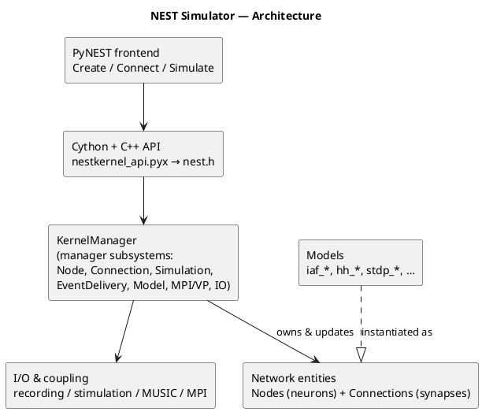

# Architecture Overview {#devdoc_architecture}

This page gives a high-level description of the NEST simulator architecture.

NEST is a layered simulator for spiking neural networks. A thin Python frontend (PyNEST) sits on a Cython binding
that calls a C++ simulation kernel; the kernel is organized around a single `KernelManager` singleton that owns around 14
specialized *manager* subsystems (nodes, connections, events, simulation, MPI, threads, I/O, models, RNGs, etc.).

The actual neuron and synapse models live in `models/` as plug-in classes derived from a common `Node`/`Connection`
hierarchy, and the kernel is built for hybrid MPI + OpenMP parallelism, where work is partitioned across MPI
processes and OpenMP threads ("virtual processes"), with spikes exchanged between them as `Event` objects.

**How the pieces fit:**

- **Frontend** — `pynest/nest/` exposes `Create`, `Connect`, `Simulate`, etc. via `hl_api_*` modules → `ll_api.py`
  → the Cython layer (`nestkernel_api.pyx`/`.pxd`) → the C++ API in `nestkernel/nest.h`.
- **Kernel core** — `KernelManager` (`kernel()`) initializes its managers in a fixed dependency order (Logging → MPI
  → VP → Module → Random → Simulation → ModelRange → Connection → SP → EventDelivery → IO → Model → MUSIC → Node) and finalizes them in reverse.
- **Network entities** — neurons are `Node` subclasses (`Node → StructuralPlasticityNode → ArchivingNode →` concrete
  models like `iaf_psc_alpha`, `hh_psc_alpha`); synapses are `Connection` subclasses (e.g. `stdp_synapse`, `static_synapse`); both are instantiated from registered model prototypes.
- **Runtime** — `SimulationManager` drives the update loop; `EventDeliveryManager` + `ConnectionManager` route spikes;
  `IOManager` handles recording/stimulation backends (ASCII, memory, screen, SIONlib, MPI); `MUSICManager` enables live coupling to other simulators.

## PlantUML diagram

## Further Reading

- \ref devdoc_design_decisions "Design Decisions"
- \ref devdoc_coding_conventions "Coding Conventions"
