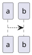

# Developer Documentation Workflow {#devdoc_workflow}

## Update NEST source code (C++)

For developer documentation of the C++ code, we use [Doxygen](http://doxygen.org/) comments
extensively throughout NEST. If you add or modify the code, please ensure you document your
changes with the correct Doxygen syntax (see \ref devdoc_coding_conventions "Coding conventions").

### Update PyNEST code

For information on updating PyNEST, see [our Read the Docs contribution guide](https://nest-simulator.readthedocs.io/en/stable/contribute/index.html).

## Contribute to developer documentation

### Add or modify pages in the developer space

The `doc/developer_space/`  contains several topics for developers, including NEST architecture,
design decisions, coding conventions and workflows. These topics are written
in markdown so Doxygen can easily build them along with the C++ code. We welcome all developers
to contribute and improve these documents. The same rules for contributing other docs and code apply to these pages.

We have additional documentation that is more user-oriented on Read the Docs. Please ensure the changes you make
to code are reflected in the appropriate documentation sections for either developer or users/contributors.

All contribution guides can be found [here](https://nest-simulator.readthedocs.io/en/stable/contribute/index.html).

#### Format of markdown files

Each file should begin with a level-1 heading followed by a Doxygen page label:

```markdown
# Page Title {#devdoc_my_page}
```

Images go in `doc/developer_space/static/img/` and can be embedded with:

```markdown

```


For diagrams, you can use PlantUML:

````

````

#### Add new page to tree nav

If you want your new page nested under the the main page in the HTML tree nav,
 add  the following line to `index.md`:

`\subpage devdoc_my_page "Link text"`.


#### Cross-references and Linking to C++ Symbols

For cross-references from other pages (not intended as children), use `\ref devdoc_my_page "Link text"`.

From any markdown page you can link directly to C++ documentation:

| Target | Syntax | Example |
|--------|--------|---------|
| Namespaced class | `ns::ClassName` | `nest::Node` |
| Method | `ns::ClassName::method()` | `nest::SimulationManager::has_been_simulated()` |
| File page | `path/to/file.h` | `nestkernel/node.h` |

The path for file links must match what is listed in the Doxygen `INPUT`
setting relative to the source root (e.g. `nestkernel/kernel_manager.h`).
Always qualify class and method names with their namespace; unqualified names
are not resolved from markdown pages. Method links require trailing `()`.

Additional documentation for developers and contributors can be found on
[Read the Docs](https://nest-simulator.readthedocs.io/en/stable/contribute/index.html),
including reviewer guidelines, git workflows etc.

### Modify the output of Doxygen

If you want to change the output for Doxygen, you can modify the `doc/fulldoc.conf.in` file. This contains all the settings
for Doxygen, including which INPUT files are rendered, the diagrams that get built etc.

For the visual style and display rendered on GitHub Pages,
you can modify the `doc/developer_space/static/css/doxygen-awesome.css` file.

## Documentation deployment

### GitHub Pages

The C++ developer documentation is deployed to GitHub Pages:

- https://nest.github.io/nest-simulator/index.html

Note that these docs are re-built when a pull-request is merged into branch **main**, if
any of the following files were modified:

- any C++ file (`*.cpp`, `*.h`),
- the Doxygen config file (`doc/fulldoc.conf.in`),
- the Doxygen CSS file (`doc/developer_space/static/css/doxygen-awesome.css`), or
- any file under `doc/developer_space/` (including these markdown pages),


This means the docs can change at any time, as developers actively work on **main**.

### View the docs built on your pull request

The documentation workflow does **not** run automatically on pull requests. To preview
the docs built from your branch, trigger the workflow manually from **your fork's** Actions tab:

1. In your fork on GitHub, go to **Actions → Build and Deploy C++ Documentation**.
2. Click **Run workflow**, select your feature branch from the dropdown, and click the
   green **Run workflow** button.
3. Wait for the run to complete, then open the workflow **Summary** page.
4. In the **Artifacts** section at the bottom, download the archive named `docs-<run_id>`.
5. Extract the ZIP file and open `index.html` in your web browser.

> **Note:** This runs entirely within your fork and does **not** affect the upstream
> GitHub Pages deployment. Deployment to GitHub Pages only happens automatically when
> a PR is merged into **main** on the upstream repository.

> **Note:** The workflow file must exist on your fork's **default branch** for the Actions tab
> to show it. If you forked the repository, it will already be present.

## Local build

1. Install Doxygen and Graphviz.

   Linux:
   ```bash
   sudo apt install doxygen graphviz
   ```

   macOS ([Homebrew](https://brew.sh/)):
   ```bash
   brew install doxygen graphviz
   ```

2. Navigate to or create a `build` directory (see the NEST installation guide for details).

3. Add `-Dwith-devdoc=ON` to your CMake command:

   ```bash
   cmake -Dwith-devdoc=ON <path/to/source>
   ```

4. **Optional — render PlantUML diagrams.**

   Without this step, `\startuml`...`\enduml` blocks (e.g. the subsystem diagram in
   `architecture.md`) will be silently skipped and left blank in the output.

   a. Install a Java runtime (needed to run PlantUML):

      ```bash
      sudo apt install default-jre-headless   # Linux
      brew install openjdk                     # macOS
      ```

   b. Download the PlantUML jar, using the same version as CI:

      ```bash
      PLANTUML_URL=$(grep 'PLANTUML_JAR_URL:' .github/workflows/cpp_docs.yml | awk '{print $2}')
      wget "$PLANTUML_URL" -O plantuml.jar
      ```

   c. After the `cmake` step, set `PLANTUML_JAR_PATH` in the generated config:

      ```bash
      sed -i "s|^PLANTUML_JAR_PATH.*|PLANTUML_JAR_PATH      = $(pwd)/plantuml.jar|" build/doc/fulldoc.conf
      ```

5. Generate HTML:

   ```bash
   make docs
   ```

6. Open the docs in a browser:

   The output is written to `<build>/doc/doxygen/html/`. From the build directory:
   ```bash
   xdg-open doc/doxygen/html/index.html   # Linux
   open doc/doxygen/html/index.html        # macOS
   ```
