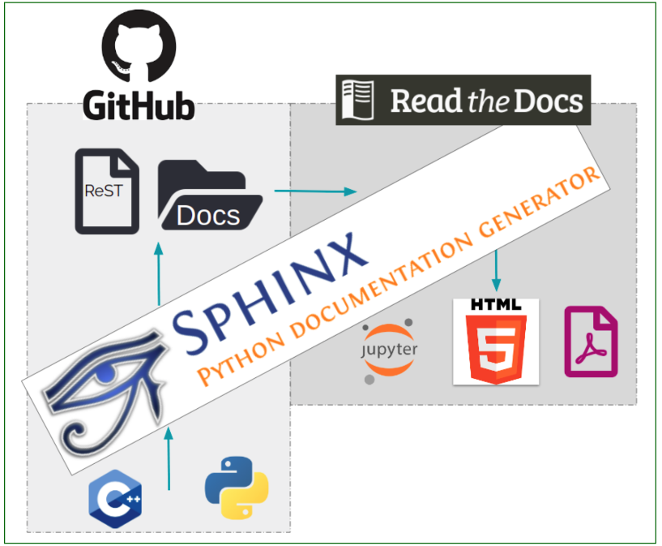

User documentation workflow
###########################

What you need to know
+++++++++++++++++++++

We use `Sphinx <https://www.sphinx-doc.org/en/master/>`_ to generate documentation and `Read the Docs <https://readthedocs.org/>`_ to publish it. Sphinx uses reStructuredText. To learn more about the syntax, check out this `quick reference <https://thomas-cokelaer.info/tutorials/sphinx/rest_syntax.html>`_.

The NEST simulator documentation lives alongside its code. It is contained in the ``doc`` directory within the `NEST source code repository <https://github.com/nest/nest-simulator>`_ on GitHub.

We work with `GitHub <https://www.github.com>`_ as the web-based hosting service for Git. Git allows us to keep our versions under control, with each release of NEST having its own documentation.

.. note::
   This workflow shows you how to create **user documentation** for NEST. For **developer documentation**, please refer to our :doc:`Developer documentation workflow <developer_documentation_workflow>`.

Changing the documentation
++++++++++++++++++++++++++

If you notice any errors or weaknesses in the documentation, please submit an `issue <https://github.com/nest/nest-simulator/issues>`_ in our GitHub repository.

You can also make changes directly to your forked copy of the `NEST source code repository <https://github.com/nest/nest-simulator>`_ and create a `pull request <https://github.com/nest/nest-simulator/pulls>`_. Just follow the workflow below!

Setting up your environment
+++++++++++++++++++++++++++

To keep things simple, we have created a conda environment for you. Installing it will enable you to smoothly generate documentation for NEST.

If you are using Linux and want to install a full development environment:

1. Install conda (we recommend `miniconda <https://docs.conda.io/en/latest/miniconda.html#>`_).

2. Switch to the ``doc`` folder in the source directory:

.. code-block:: bash

    cd </path/to/nest_source>/doc

3. Create and activate the environment:

.. code-block:: bash

   conda update -n base -c defaults conda
   conda env create --file nest_doc_conda_env.yml
   conda activate nest-doc

4. If you want to deactivate or delete the build environment:

.. code-block:: bash

   conda deactivate
   conda remove --name nest-doc --all

Generating documentation with Sphinx
++++++++++++++++++++++++++++++++++++

Now that you activated your environment, you can generate HTML files using Sphinx.

Rendering HTML
~~~~~~~~~~~~~~

Using Sphinx, you can build documentation locally and preview it offline:

1. Go to the ``doc`` folder in the source directory:

.. code-block:: bash

    cd </path/to/nest_source>/doc

2. Generate HTML files:

.. code-block:: bash

   make html

3. Preview files. They are then located in ``./_build/html``:

.. code-block:: bash

   cd ./_build/html
   browser filename.html

Editing and creating pages
~~~~~~~~~~~~~~~~~~~~~~~~~~

To edit existing `reStructuredText <https://thomas-cokelaer.info/tutorials/sphinx/rest_syntax.html>`_ files or to create new ones, follow the steps below:

1. You can edit and/or add ``.rst`` files in the ``doc`` directory using your editor of choice.

2. If you create a new page, open ``contents.rst`` in the ``doc`` directory and add the file name under ``.. toctree::``. This will ensure it appears on the NEST simulator documentation's table of contents.

3. If you rename or move a file, please make sure you update all the corresponding cross-references.

4. Save your changes.

5. Re-render documentation as described above.

Previewing on Read the Docs (optional)
++++++++++++++++++++++++++++++++++++++

Proceed as follows to preview your version of the documentation on Read the Docs.

1. Check that unwanted directories are listed in ``.gitignore``:

.. code-block:: bash

   _build
   _static
   _templates

2. Add, commit and push your changes to GitHub.

3. Go to `Read the Docs <https://readthedocs.org/>`_. Sign up for an account if you don't have one.

4. `Import <https://readthedocs.org/dashboard/import/>`_ the project.

5. Enter the details of your project in the ``repo`` field and hit ``Create``.

6. `Build your documentation <https://docs.readthedocs.io/en/stable/intro/import-guide.html#building-your-documentation>`_.

This allows you to preview your work on your Read the Docs account. In order to see the changes on the official NEST simulator documentation, please submit a pull request (see below).

Creating pull request
+++++++++++++++++++++

When you feel your documentation work is finished, you can create a `pull request <https://nest.github.io/nest-simulator/development_workflow#create-a-pull-request>`_ to the ``master`` branch of the NEST Source Code Repository. Your pull request will be reviewed by our NEST Documentation Team!
