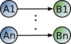
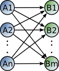
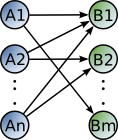

.. _connection_mgnt:

Connection Management
=====================

From NEST 2.4 onwards the old connection routines (i.e.
`(Random)ConvergentConnect`, `(Random)DivergentConnect` and plain
`Connect`) are replaced by one unified `Connect` function. In
`SLI <an-introduction-to-sli.md>`__ ,the old syntax of the function
still works, while in `PyNEST <introduction-to-pynest.md>`__, the
`Connect()` function has been renamed to `OneToOneConnect()`.
However, simple cases, which are just creating one-to-one connections
between two lists of nodes are still working with the new command
without the need to change the code. Note that the spatial connection is
not effected by theses changes. The translation between the old and the
new connect routines is described in `Old Connection
Routines <connection-management.md#old-connection-routines>`__.

The connectivity pattern is defined inside the `Connect()` function
under the key 'rule'. The patterns available are described in
`Connection Rules <connection-management.md#connection-rules>`__. In
addition the synapse model can be specified within the connect function
and all synaptic parameters can be randomly distributed.

The `Connect()` function can be called in either of the following
manners:

::

    Connect(pre, post)
    Connect(pre, post, conn_spec)
    Connect(pre, post, conn_spec, syn_spec)

``pre`` and ``post`` are lists of Global Ids defining the nodes of
origin and termination.

``conn_spec`` can either be a string containing the name of the
connectivity rule (default: ``all_to_all``) or a dictionary specifying
the rule and the rule-specific parameters (e.g. ``indegree``), which must
be given.

In addition switches allowing self-connections (``allow_autapses``, default:
True) and multiple connections between pairs of neurons (``allow_multapses``,
default: True) can be contained in the dictionary. The validity of the
switches is confined by the Connect-call. Thus connecting the same set
of neurons multiple times with the switch 'allow_multapses' set to False, one
particular connection might be established multiple times. The same
applies to nodes being specified multiple times in the source or target
vector. Here 'allow_multapses' set to False will result in one potential
connection between each occurring node pair.

``syn_spec`` defines the synapse type and its properties. It can be
given as a string defining the synapse model (default:
'static_synapse') or as a dictionary. By using the key-word variant
(``Connect(pre, post, syn_spec=syn_spec_dict)``), the conn_spec can be
omitted in the call to connect and 'all_to_all' is assumed as the
default. The exact usage of the synapse dictionary is described in
:ref:`synapse-spec`.

.. _conn_rules:

Connection Rules
----------------

Connection rules are specified using the ``conn_spec`` parameter, which
can be a string naming a connection rule or a dictionary containing a
rule specification. Only connection rules requiring no parameters can be
given as strings, for all other rules, a dictionary specifying the rule
and its parameters, such as in- or out-degrees, is required.

one-to-one
~~~~~~~~~~~~

The ith node in ``pre`` is connected to the ith node in ``post``. The
node lists pre and post have to be of the same length.

Example:

One-to-one connections

::

    n = 10
    A = Create("iaf_psc_alpha", n)
    B = Create("spike_recorder", n)
    Connect(A, B, 'one_to_one')

This rule can also take two Global IDs A and B instead of integer lists.
A shortcut is provided if only two nodes are connected with the
parameters weight and delay such that weight and delay can be given as
third and fourth argument to the `Connect()` function.

Example:

::

    weight = 1.5
    delay = 0.5
    Connect(A[0], B[0], weight, delay)

all-to-all
~~~~~~~~~~

Each node in ``pre`` is connected to every node in ``post``. Since
``all_to_all`` is the default, 'rule' doesn't need to specified.

Example:

::

    n, m = 10, 12
    A = Create("iaf_psc_alpha", n)
    B = Create("iaf_psc_alpha", m)
    Connect(A, B)

fixed-indegree
~~~~~~~~~~~~~~

.. image:: ../_static/img/Fixed_indegree.png
     :width: 200px
     :align: center

The nodes in ``pre`` are randomly connected with the nodes in ``post``
such that each node in ``post`` has a fixed ``indegree``.

Example:

::

    n, m, N = 10, 12, 2
    A = Create("iaf_psc_alpha", n)
    B = Create("iaf_psc_alpha", m)
    conn_dict = {'rule': 'fixed_indegree', 'indegree': N}
    Connect(A, B, conn_dict)

fixed-outdegree
~~~~~~~~~~~~~~~~

The nodes in ``pre`` are randomly connected with the nodes in ``post``
such that each node in ``pre`` has a fixed ``outdegree``.

Example:

::

    n, m, N = 10, 12, 2
    A = Create("iaf_psc_alpha", n)
    B = Create("iaf_psc_alpha", m)
    conn_dict = {'rule': 'fixed_outdegree', 'outdegree': N}
    Connect(A, B, conn_dict)

fixed-total-number
~~~~~~~~~~~~~~~~~~

The nodes in ``pre`` are randomly connected with the nodes in ``post``
such that the total number of connections equals ``N``.

Example:

::

    n, m, N = 10, 12, 30
    A = Create("iaf_psc_alpha", n)
    B = Create("iaf_psc_alpha", m)
    conn_dict = {'rule': 'fixed_total_number', 'N': N}
    Connect(A, B, conn_dict)

pairwise-bernoulli
~~~~~~~~~~~~~~~~~~~

For each possible pair of nodes from ``pre`` and ``post``, a connection
is created with probability ``p``.

Example:

::

    n, m, p = 10, 12, 0.2
    A = Create("iaf_psc_alpha", n)
    B = Create("iaf_psc_alpha", m)
    conn_dict = {'rule': 'pairwise_bernoulli', 'p': p}
    Connect(A, B, conn_dict)

.. _synapse_spec:

Synapse Specification
-------------------------

The synapse properties can be given as a string or a dictionary. The
string can be the name of a pre-defined synapse which can be found in
the synapsedict (see  :ref:`synapse-types`) or a manually defined
synapse via `CopyModel()`.

Example:

::

    n = 10
    A = Create("iaf_psc_alpha", n)
    B = Create("iaf_psc_alpha", n)
    CopyModel("static_synapse","excitatory",{"weight":2.5, "delay":0.5})
    Connect(A, B, syn_spec="excitatory")

Specifying the synapse properties in a dictionary allows for distributed
synaptic parameter. In addition to the key ``model`` the dictionary can
contain specifications for ``weight``, ``delay``, ``receptor_type`` and
parameters specific to the chosen synapse model. The specification of
all parameters is optional. Unspecified parameters will use the default
values determined by the current synapse model. All parameters can be
scalars, arrays or distributions (specified as dictionaries). One
synapse dictionary can contain an arbitrary combination of parameter
types, as long as they agree with the connection routine (``rule``).

**Scalar** parameters must be given as floats except for the
'receptor_type' which has to be initialized as an integer. For more
information on the receptor type see :ref:`receptor-types`.

Example:

::

    n = 10
    neuron_dict = {'tau_syn': [0.3, 1.5]}
    A = Create("iaf_psc_exp_multisynapse", n, neuron_dict)
    B = Create("iaf_psc_exp_multisynapse", n, neuron_dict)
    syn_dict ={"model": "static_synapse", "weight":2.5, "delay":0.5, 'receptor_type': 1}
    Connect(A, B, syn_spec=syn_dict)

**Array** parameters can be used in conjunction with the rules
``one_to_one``, ``all_to_all``, ``fixed_indegree`` and
``fixed_outdegree``. The arrays can be specified as numpy arrays or
lists. As for the scalar parameters, all parameters but the receptor
types must be specified as arrays of floats. For ``one_to_one`` the
array must have the same length as the population vector.

Example:

::

    A = Create("iaf_psc_alpha", 2)
    B = Create("spike_recorder", 2)
    conn_dict = {'rule': 'one_to_one'}
    syn_dict = {'weight': [1.2, -3.5]}
    Connect(A, B, conn_dict, syn_dict)

When connecting using ``all_to_all``, the array must be of dimension
len(post) x len(pre).

Example:

::

    A = Create("iaf_psc_alpha", 3)
    B = Create("iaf_psc_alpha", 2)
    syn_dict = {'weight': [[1.2, -3.5, 2.5],[0.4, -0.2, 0.7]]}
    Connect(A, B, syn_spec=syn_dict)

For ``fixed_indegree`` the array has to be a two-dimensional NumPy array
with shape (len(post), indegree), where indegree is the number of
incoming connections per target neuron, therefore the rows describe the
target and the columns the connections converging to the target neuron,
regardless of the identity of the source neurons.

Example:

::

    A = Create("iaf_psc_alpha", 5)
    B = Create("iaf_psc_alpha", 3)
    conn_dict = {'rule': 'fixed_indegree', 'indegree': 2}
    syn_dict = {'weight': [[1.2, -3.5],[0.4, -0.2],[0.6, 2.2]]}
    Connect(A, B, conn_spec=conn_dict, syn_spec=syn_dict)

For ``fixed_outdegree`` the array has to be a two-dimensional NumPy array
with shape (len(pre), outdegree), where outdegree is the number of
outgoing connections per source neuron, therefore the rows describe the
source and the columns the connections starting from the source neuron
regardless of the identity of the target neuron.

Example:

::

    A = Create("iaf_psc_alpha", 2)
    B = Create("iaf_psc_alpha", 5)
    conn_dict = {'rule': 'fixed_outdegree', 'outdegree': 3}
    syn_dict = {'weight': [[1.2, -3.5, 0.4], [-0.2, 0.6, 2.2]]}
    Connect(A, B, conn_spec=conn_dict, syn_spec=syn_dict)

.. _dist_params:

Distributed parameters
~~~~~~~~~~~~~~~~~~~~~~~

**Distributed** parameters are initialized with yet another dictionary
specifying the 'distribution' and the distribution-specific parameters,
whose specification is optional.

Available distributions are given in the ``rdevdict``, the most common ones
are:

Distributions Keys::

 - 'normal', 'mu', 'sigma'
 - 'normal_clipped', 'mu', 'sigma', 'low ', 'high'
 - 'normal_clipped_to_boundary', 'mu', 'sigma', 'low ', 'high'
 - 'lognormal', 'mu',  'sigma'
 - 'lognormal_clipped', 'mu', 'sigma', 'low', 'high'
 - 'lognormal_clipped_to_boundary', 'mu', 'sigma', 'low', 'high'
 - 'uniform', 'low', 'high'
 - 'uniform_int', 'low', 'high'
 - 'binomial', 'n', 'p'
 - 'binomial_clipped', 'n', 'p', 'low', 'high'
 - 'binomial_clipped_to_boundary', 'n', 'p', 'low', 'high'
 - 'gsl_binomial', 'n', 'p'
 - 'exponential', 'lambda'
 - 'exponential_clipped', 'lambda', 'low', 'high'
 - 'exponential_clipped_to_boundary', 'lambda', 'low', 'high'
 - 'gamma', 'order', 'scale'
 - 'gamma_clipped', 'order', 'scale', 'low', 'high'
 - 'gamma_clipped_to_boundary', 'order', 'scale', 'low', 'high'
 - 'poisson', 'lambda'
 - 'poisson_clipped', 'lambda', 'low', 'high'
 - 'poisson_clipped_to_boundary', 'lambda', 'low', 'high'

Example

::

    n = 10
    A = Create("iaf_psc_alpha", n)
    B = Create("iaf_psc_alpha", n)
    syn_dict = {'model': 'stdp_synapse',
                'weight': 2.5,
                'delay': {'distribution': 'uniform', 'low': 0.8, 'high': 2.5},
                'alpha': {'distribution': 'normal_clipped', 'low': 0.5, 'mu': 5.0, 'sigma': 1.0}
               }
    Connect(A, B, syn_spec=syn_dict)

In this example, the ``all_to_all`` connection rule is applied by
default, using the `stdp_synapse` model. All synapses are created with
weight 2.5, a delay uniformly distributed in [0.8, 2.5], while the alpha
parameters is drawn from a normal distribution with mean 5.0 and std.dev
1.0; values below 0.5 are excluded by re-drawing any values below 0.5.
Thus, the actual distribution is a slightly distorted Gaussian.

If the synapse is supposed to have a unique name and distributed
parameters it needs to be defined in two steps:

::

    n = 10
    A = Create("iaf_psc_alpha", n)
    B = Create("iaf_psc_alpha", n)
    CopyModel('stdp_synapse','excitatory',{'weight':2.5})
    syn_dict = {'model': 'excitatory',
                'weight': 2.5,
                'delay': {'distribution': 'uniform', 'low': 0.8, 'high': 2.5},
                'alpha': {'distribution': 'normal_clipped', 'low': 0.5, 'mu': 5.0, 'sigma': 1.0}
               }
    Connect(A, B, syn_spec=syn_dict)

For further information on the distributions see :doc:`Random numbers in
NEST <random_numbers>`.

Spatially-structured networks
-----------------------------

If nodes are created with spatial distributions, it is possible to create connections with
attributes based on node positions. See :doc:`Spatially-structured networks <spatial/index>`
for more information.

.. _receptor-types:

Receptor Types
--------------

Each connection in NEST targets a specific receptor type on the
postsynaptic node. Receptor types are identified by integer numbers,
the default receptor type is 0. The meaning of the receptor type depends
on the model and is documented in the model documentation. To connect to
a non-standard receptor type, the parameter ``receptor_type`` of the
additional argument ``params`` is used in the call to the ``Connect``
command. To illustrate the concept of receptor types, we give an example
using standard integrate-and-fire neurons as presynaptic nodes and a
multi-compartment integrate-and-fire neuron (``iaf_cond_alpha_mc``) as
postsynaptic node.

.. image:: ../_static/img/Receptor_types.png
     :width: 200px
     :align: center

::

    A1, A2, A3, A4 = Create("iaf_psc_alpha", 4)
    B = Create("iaf_cond_alpha_mc")
    receptors = GetDefaults("iaf_cond_alpha_mc")["receptor_types"]
    print receptors

    {'soma_exc': 1,
     'soma_inh': 2,
     'soma_curr': 7,
     'proximal_exc': 3
     'proximal_inh': 4,
     'proximal_curr': 8,
     'distal_exc': 5,
     'distal_inh': 6,
     'distal_curr': 9,}

    Connect([A1], B, syn_spec={"receptor_type": receptors["distal_inh"]})
    Connect([A2], B, syn_spec={"receptor_type": receptors["proximal_inh"]})
    Connect([A3], B, syn_spec={"receptor_type": receptors["proximal_exc"]})
    Connect([A4], B, syn_spec={"receptor_type": receptors["soma_inh"]})

The code block above connects a standard integrate-and-fire neuron to a
somatic excitatory receptor of a multi-compartment integrate-and-fire
neuron model. The result is illustrated in the figure.

.. _synapse-types:

Synapse Types
-------------

NEST supports multiple synapse types that are specified during
connection setup. The default synapse type in NEST is
``static_synapse``. Its weight does not change over time. To allow
learning and plasticity, it is possible to use other synapse types that
implement long-term or short-term plasticity. A list of available types
is accessible via the command ``Models("synapses")``. The output of this
command (as of revision 11199) is shown below:

::

    ['cont_delay_synapse',
     'ht_synapse',
     'quantal_stp_synapse',
     'static_synapse',
     'static_synapse_hom_wd',
     'stdp_dopamine_synapse',
     'stdp_facetshw_synapse_hom',
     'stdp_pl_synapse_hom',
     'stdp_synapse',
     'stdp_synapse_hom',
     'tsodyks2_synapse',
     'tsodyks_synapse']

All synapses store their parameters on a per-connection basis. An
exception to this scheme are the homogeneous synapse types (identified
by the suffix ``_hom``), which only store weight and delay once for all
synapses of a type. This means that these are the same for all
connections. They can be used to save memory.

The default values of a synapse type can be inspected using the command
`GetDefaults()`, which takes the name of the synapse as an argument,
and modified with `SetDefaults()`, which takes the name of the synapse
type and a parameter dictionary as arguments.

::

    print GetDefaults("static_synapse")

    {'delay': 1.0,
    'max_delay': -inf,
    'min_delay': inf,
    'num_connections': 0,
    'num_connectors': 0,
    'receptor_type': 0,
    'synapsemodel': 'static_synapse',
    'weight': 1.0}

    SetDefaults("static_synapse", {"weight": 2.5})

For the creation of custom synapse types from already existing synapse
types, the command `CopyModel` is used. It has an optional argument
``params`` to directly customize it during the copy operation. Otherwise
the defaults of the copied model are taken.

::

    CopyModel("static_synapse", "inhibitory", {"weight": -2.5})
    Connect(A, B, syn_spec="inhibitory")

**Note**: Not all nodes can be connected via all available synapse
types. The events a synapse type is able to transmit is documented in
the ``Transmits`` section of the model documentation.

Inspecting Connections
----------------------

``GetConnections(source=None, target=None, synapse_model=None)``: Return
an array of identifiers for connections that match the given parameters.
source and target need to be lists of node IDs, model is a string
representing a synapse model. If GetConnections is called without
parameters, all connections in the network are returned. If a list of
source neurons is given, only connections from these pre-synaptic
neurons are returned. If a list of target neurons is given, only
connections to these postsynaptic neurons are returned. If a synapse
model is given, only connections with this synapse type are returned.
Any combination of source, target and model parameters is permitted.
Each connection id is a 5-tuple or, if available, a NumPy array with the
following five entries: source-node_id, target-node_id, target-thread,
synapse-id, port.

The result of `GetConnections` can be given as an argument to the
`GetStatus` function, which will then return a list with the
parameters of the connections:

::

    n1 = Create("iaf_psc_alpha")
    n2 = Create("iaf_psc_alpha")
    Connect(n1, n2)
    conn = GetConnections(n1)
    print GetStatus(conn)

    [{'synapse_type': 'static_synapse',
      'target': 2,
      'weight': 1.0,
      'delay': 1.0,
      'source': 1,
      'receptor': 0}]

Modifying existing Connections
------------------------------

To modify the connections of an existing connection, one also has to
obtain handles to the connections with `GetConnections()` first. These
can then be given as arguments to the `SetStatus()` functions:

::

    n1 = Create("iaf_psc_alpha")
    n2 = Create("iaf_psc_alpha")
    Connect(n1, n2)
    conn = GetConnections(n1)
    SetStatus(conn, {"weight": 2.0})
    print GetStatus(conn)

    [{'synapse_type': 'static_synapse',
      'target': 2,
      'weight': 2.0,
      'delay': 1.0,
      'source': 1,
      'receptor': 0}]
