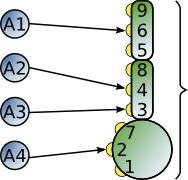

.. _connection_mgnt:

Connection Management
=====================

In NEST, connections are created with the `Connect()` function. You can
create connections with different types of connectivity patterns, which
are defined inside the function under the ``conn_spec`` argument and the
key 'rule'. The patterns available are described in the
:ref:`Connection Rules <conn_rules>` section. In addition, the synapse model can
be specified within the `Connect()` function, and all synaptic parameters can
be randomly distributed. More information about synapse models and their
parameters can be found in the :ref:`Synapse Specification <synapse_spec>` section.

The `Connect()` function can be called in any of the following ways:

::

    Connect(pre, post)
    Connect(pre, post, conn_spec)
    Connect(pre, post, conn_spec, syn_spec)

``pre`` and ``post`` are `NodeCollections` of node IDs defining the nodes of
origin and termination.

``conn_spec`` can either be a string containing the name of the
connectivity rule (default: ``all_to_all``) or a dictionary specifying
the rule and the rule-specific parameters (e.g. ``indegree``), which must
be given.

In addition, switches allowing self-connections (``allow_autapses``, default:
True) and multiple connections between pairs of neurons (``allow_multapses``,
default: True) can be contained in the dictionary. The validity of the
switches is confined by the Connect-call. Thus, by connecting the same set
of neurons multiple times with the switch 'allow_multapses' set to False, one
particular connection might still be established multiple times.

``syn_spec`` defines the synapse type and its properties. It can be
given as a string defining the synapse model (default:
'static_synapse'), as an object defining :ref:`collocated synapses <collocated_synapses>`,
or as a dictionary. By using the keyword variant
(``Connect(pre, post, syn_spec=syn_spec_dict)``), ``conn_spec`` can be
omitted in the call to connect and 'all_to_all' is assumed as the
default. The exact usage of the synapse dictionary is described in
:ref:`synapse_spec`.

After a connection is established it might be beneficial to look up the number of
connections in the system. This can easily be done with ``GetKernelStatus``:

::

    print(nest.GetKernelStatus('num_connections'))

Have a look at the :ref:`inspecting_connections` section further down to
get more tips on how to examine the connections.

.. _conn_rules:

Connection Rules
----------------

Connection rules are specified using the ``conn_spec`` parameter, which
can be a string naming a connection rule or a dictionary containing a
rule specification. Only connection rules requiring no parameters can be
given as strings, for all other rules, a dictionary specifying the rule
and its parameters, such as in- or out-degrees, is required.

one-to-one
~~~~~~~~~~

The ith node in ``pre`` is connected to the ith node in ``post``. The
NodeCollections of ``pre`` and ``post`` have to be of the same length.

::

    n = 10
    A = nest.Create('iaf_psc_alpha', n)
    B = nest.Create('spike_recorder', n)
    nest.Connect(A, B, 'one_to_one')

all-to-all
~~~~~~~~~~

Each node in ``pre`` is connected to every node in ``post``. Since
``all_to_all`` is the default, 'rule' doesn't need to specified.

::

    n, m = 10, 12
    A = nest.Create('iaf_psc_alpha', n)
    B = nest.Create('iaf_psc_alpha', m)
    nest.Connect(A, B)

fixed-indegree
~~~~~~~~~~~~~~

.. image:: ../_static/img/Fixed_indegree.png
     :width: 200px
     :align: center

The nodes in ``pre`` are randomly connected with the nodes in ``post``
such that each node in ``post`` has a fixed ``indegree``.

::

    n, m, N = 10, 12, 2
    A = nest.Create('iaf_psc_alpha', n)
    B = nest.Create('iaf_psc_alpha', m)
    conn_dict = {'rule': 'fixed_indegree', 'indegree': N}
    nest.Connect(A, B, conn_dict)

fixed-outdegree
~~~~~~~~~~~~~~~

The nodes in ``pre`` are randomly connected with the nodes in ``post``
such that each node in ``pre`` has a fixed ``outdegree``.

::

    n, m, N = 10, 12, 2
    A = nest.Create('iaf_psc_alpha', n)
    B = nest.Create('iaf_psc_alpha', m)
    conn_dict = {'rule': 'fixed_outdegree', 'outdegree': N}
    nest.Connect(A, B, conn_dict)

fixed-total-number
~~~~~~~~~~~~~~~~~~

The nodes in ``pre`` are randomly connected with the nodes in ``post``
such that the total number of connections equals ``N``.

::

    n, m, N = 10, 12, 30
    A = nest.Create('iaf_psc_alpha', n)
    B = nest.Create('iaf_psc_alpha', m)
    conn_dict = {'rule': 'fixed_total_number', 'N': N}
    nest.Connect(A, B, conn_dict)

pairwise-bernoulli
~~~~~~~~~~~~~~~~~~

For each possible pair of nodes from ``pre`` and ``post``, a connection
is created with probability ``p``.

::

    n, m, p = 10, 12, 0.2
    A = nest.Create('iaf_psc_alpha', n)
    B = nest.Create('iaf_psc_alpha', m)
    conn_dict = {'rule': 'pairwise_bernoulli', 'p': p}
    nest.Connect(A, B, conn_dict)

symmetric-pairwise-bernoulli
~~~~~~~~~~~~~~~~~~~~~~~~~~~~

For each possible pair of nodes from ``pre`` and ``post``, a connection
is created with probability ``p`` from ``pre`` to ``post``, as well as
a connection from ``post`` to ``pre`` (two connections in total). To
use the 'symmetric_pairwise_bernoulli' rule, ``allow_autapses`` must
be False, and ``make_symmetric`` must be True.

::

    n, m, p = 10, 12, 0.2 
    A = nest.Create('iaf_psc_alpha', n) 
    B = nest.Create('iaf_psc_alpha', m) 
    conn_dict = {'rule': 'symmetric_pairwise_bernoulli', 'p': p, 'allow_autapses': False, 'make_symmetric': True} 
    nest.Connect(A, B, conn_dict)

.. _synapse_spec:

Synapse Specification
---------------------

The synapse properties can be given as a string, a ``CollocatedSynapse``
object, or a dictionary. The string can be the name of a pre-defined
synapse which can be found in the synapsedict (see  :ref:`synapse-types`)
or a manually defined synapse via `CopyModel()`.

::

    n = 10
    A = nest.Create('iaf_psc_alpha', n)
    B = nest.Create('iaf_psc_alpha', n)
    nest.CopyModel('static_synapse','excitatory',{'weight': 2.5, 'delay': 0.5})
    nest.Connect(A, B, syn_spec='excitatory')

Specifying the synapse properties in a dictionary allows for distributed
synaptic parameters. In addition to the key ``synapse_model``, the dictionary can
contain specifications for ``weight``, ``delay``, ``receptor_type`` and
parameters specific to the chosen synapse model. The specification of
all parameters is optional. Unspecified parameters will use the default
values determined by the current synapse model. All parameters can be
scalars, arrays or distributions (specified as a ``nest.Parameter``). One
synapse dictionary can contain an arbitrary combination of parameter
types, as long as they agree with the connection routine (``rule``).

Scalar
~~~~~~

Scalar parameters must be given as floats except for the
'receptor_type' which has to be initialized as an integer. For more
information on the receptor type see :ref:`receptor-types`. When a synapse
parameter is given as a scalar, the value will be applied to all connections. 

::

    n = 10
    neuron_dict = {'tau_syn': [0.3, 1.5]}
    A = nest.Create('iaf_psc_exp_multisynapse', n, neuron_dict)
    B = nest.Create('iaf_psc_exp_multisynapse', n, neuron_dict)
    syn_dict ={'synapse_model': 'static_synapse', 'weight': 2.5, 'delay': 0.5, 'receptor_type': 1}
    nest.Connect(A, B, syn_spec=syn_dict)

Array
~~~~~

Array parameters can be used in conjunction with the rules
``one_to_one``, ``all_to_all``, ``fixed_indegree``, ``fixed_outdegree``
and ``fixed_total_number``. The arrays can be specified as numpy arrays or
lists. As with the scalar parameters, all parameters but the receptor
types must be specified as arrays of floats. For ``one_to_one`` the
array must have the same length as the NodeCollections.

::

    A = nest.Create('iaf_psc_alpha', 2)
    B = nest.Create('spike_recorder', 2)
    conn_dict = {'rule': 'one_to_one'}
    syn_dict = {'weight': [1.2, -3.5]}
    nest.Connect(A, B, conn_dict, syn_dict)

When connecting using ``all_to_all``, the array must be of dimension
`len(post) x len(pre)`.

::

    A = nest.Create('iaf_psc_alpha', 3)
    B = nest.Create('iaf_psc_alpha', 2)
    syn_dict = {'weight': [[1.2, -3.5, 2.5],[0.4, -0.2, 0.7]]}
    nest.Connect(A, B, syn_spec=syn_dict)

For ``fixed_indegree`` the array has to be a two-dimensional NumPy array
or list with shape `(len(post), indegree)`, where indegree is the number of
incoming connections per target neuron. Therefore, the rows describe the
target and the columns the connections converging to the target neuron,
regardless of the identity of the source neurons.

::

    A = nest.Create('iaf_psc_alpha', 5)
    B = nest.Create('iaf_psc_alpha', 3)
    conn_dict = {'rule': 'fixed_indegree', 'indegree': 2}
    syn_dict = {'weight': [[1.2, -3.5],[0.4, -0.2],[0.6, 2.2]]}
    nest.Connect(A, B, conn_spec=conn_dict, syn_spec=syn_dict)

For ``fixed_outdegree`` the array has to be a two-dimensional NumPy array
or list with shape `(len(pre), outdegree)`, where outdegree is the number of
outgoing connections per source neuron. Therefore, the rows describe the
source and the columns the connections starting from the source neuron
regardless of the identity of the target neuron.

::

    A = nest.Create('iaf_psc_alpha', 2)
    B = nest.Create('iaf_psc_alpha', 5)
    conn_dict = {'rule': 'fixed_outdegree', 'outdegree': 3}
    syn_dict = {'weight': [[1.2, -3.5, 0.4], [-0.2, 0.6, 2.2]]}
    nest.Connect(A, B, conn_spec=conn_dict, syn_spec=syn_dict)

For ``fixed_total_number``, the array has to be same the length as the
number of connections ``N``.

::

    A = nest.Create('iaf_psc_alpha', 3)
    B = nest.Create('iaf_psc_alpha', 4)
    conn_dict = {'rule': 'fixed_total_number', 'N': 4}
    syn_dict = {'weight': [1.2, -3.5, 0.4, -0.2]}
    nest.Connect(A, B, conn_dict, syn_dict)

.. _dist_params:

Distributed parameters
~~~~~~~~~~~~~~~~~~~~~~

Distributed parameters are given as ``nest.Parameter`` objects that represent
values drawn from random distributions. These distributions can either be based on
spatial node parameters, on default values, or on constant distribution values
you provide. It is possible to combine the parameters to create distributions
tailor made for your needs.

The following parameters and functionalities are provided:

- Random parameters
- Spatial parameters
- Spatially distributed parameters
- Mathematical functions
- Clipping, redrawing, and conditional parameters

For more information, check out the documentation on the different
:doc:`PyNEST APIs <../ref_material/pynest_apis>` or this section on :ref:`parametrization <param_ex>`.

::

    n = 10
    A = nest.Create('iaf_psc_alpha', n)
    B = nest.Create('iaf_psc_alpha', n)
    syn_dict = {'synapse_model': 'stdp_synapse',
                'weight': 2.5,
                'delay': nest.random.uniform(min=0.8, max=2.5),
                'alpha': nest.math.redraw(nest.random.normal(mean=5.0, std=1.0), min=0.5, max=10000.)
               }
    nest.Connect(A, B, syn_spec=syn_dict)

In this example, the ``all_to_all`` connection rule is applied by
default, using the `stdp_synapse` model. All synapses are created with
weight 2.5, a delay uniformly distributed in [0.8, 2.5], while the alpha
parameters are drawn from a normal distribution with mean 5.0 and standard
deviation 1.0; values below 0.5 are excluded by re-drawing any values
below 0.5. We have set the ``max`` value of ``nest.math.redraw`` to be a
large number, so it is in principle never reached. Thus, the actual distribution
is a slightly distorted Gaussian.

If the synapse is supposed to have a unique name and distributed
parameters, it needs to be defined in two steps:

::

    n = 10
    A = nest.Create('iaf_psc_alpha', n)
    B = nest.Create('iaf_psc_alpha', n)
    nest.CopyModel('stdp_synapse','excitatory',{'weight':2.5})
    syn_dict = {'synapse_model': 'excitatory',
                'weight': 2.5,
                'delay': nest.random.uniform(min=0.8, max=2.5),
                'alpha': nest.math.redraw(nest.random.normal(mean=5.0, std=1.0), min=0.5, max=10000.)
               }
    nest.Connect(A, B, syn_spec=syn_dict)

For further information on the distributions see :doc:`Random numbers in
NEST <random_numbers>`.

.. _collocated_synapses:

Collocated Synapses
~~~~~~~~~~~~~~~~~~~

It is also possible to create several connections with different synapses simultaneously. The different synapse dictionaries will
then be applied to each source-target pair. To create these collocated synapses, ``CollocatedSynapses()`` must be used
as the syn_spec argument of ``Connect``, instead of the usual syn_spec dictionary argument. ``CollocatedSynapses()``
takes synapse dictionaries as arguments.

  ::

    nodes = nest.Create('iaf_psc_alpha', 3)
    syn_spec = nest.CollocatedSynapses({'weight': 4., 'delay': 1.5},
                                       {'synapse_model': 'stdp_synapse'},
                                       {'synapse_model': 'stdp_synapse', 'alpha': 3.})
    nest.Connect(nodes, nodes, conn_spec='one_to_one', syn_spec=syn_spec)

    conns = nest.GetConnections()
    print(conns.alpha)

This will create 9 connections: 3 using `static_synapse` with a `weight` of `4.0` and `delay` of `1.5`, and 6 using
the `stdp_synapse`. Of the 6 using `stdp_synapse`, 3 will have the default alpha value, and 3 will have an alpha of
`3.0`.

  >>> print(nest.GetKernelStatus('num_connections'))
  9

If you want to connect with different :ref:`receptor types <receptor-types>`, you can do the following:

  ::

    src = nest.Create('iaf_psc_exp_multisynapse', 7)
    trgt = nest.Create('iaf_psc_exp_multisynapse', 7, {'tau_syn': [0.1 + i for i in range(7)]})

    syn_spec = nest.CollocatedSynapses({'weight': 5.0, 'receptor_type': 2},
                                       {'weight': 1.5, 'receptor_type': 7})

    nest.Connect(src, trgt, 'one_to_one', syn_spec=syn_spec)

    conns = nest.GetConnections()
    print(conns.get())

You can see how many synapse parameters you have by calling `len()` on your `CollocatedSynapses` object:

  >>> len(syn_spec)
  2

Spatially-structured networks
-----------------------------

If nodes are created with spatial distributions, it is possible to create connections with
attributes based on node positions. See :doc:`Spatially-structured networks <spatial/index>`
for more information.

.. _receptor-types:

Receptor Types
--------------

Each connection in NEST targets a specific receptor type on the
post-synaptic node. Receptor types are identified by integer numbers,
the default receptor type is 0. The meaning of the receptor type depends
on the model and is documented in the model documentation. To connect to
a non-standard receptor type, the parameter ``receptor_type`` of the
``syn_spec`` argument is used in the call to the ``Connect``
command. To illustrate the concept of receptor types, we give an example
using standard integrate-and-fire neurons as presynaptic nodes and a
multi-compartment integrate-and-fire neuron (``iaf_cond_alpha_mc``) as
post-synaptic node. As seen in the image and code snippet below, we
connect the integrate-and-fire neurons to different receptors of the
multi-compartment integrate-and-fire neuron model.

::

    A1 = nest.Create('iaf_psc_alpha')
    A2 = nest.Create('iaf_psc_alpha')
    A3 = nest.Create('iaf_psc_alpha')
    A4 = nest.Create('iaf_psc_alpha')
    B = nest.Create('iaf_cond_alpha_mc')

    receptors = nest.GetDefaults('iaf_cond_alpha_mc')['receptor_types']
    print(receptors)
        {'soma_exc': 1,
         'soma_inh': 2,
         'soma_curr': 7,
         'proximal_exc': 3
         'proximal_inh': 4,
         'proximal_curr': 8,
         'distal_exc': 5,
         'distal_inh': 6,
         'distal_curr': 9,}

    nest.Connect(A1, B, syn_spec={'receptor_type': receptors['distal_inh']})
    nest.Connect(A2, B, syn_spec={'receptor_type': receptors['proximal_inh']})
    nest.Connect(A3, B, syn_spec={'receptor_type': receptors['proximal_exc']})
    nest.Connect(A4, B, syn_spec={'receptor_type': receptors['soma_inh']})

.. _synapse-types:

Synapse Types
-------------

NEST supports multiple synapse types that can be specified during
connection setup. The default synapse type in NEST is the
``static_synapse``. Its weight does not change over time. To allow
learning and plasticity, it is possible to use other synapse types that
implement long-term or short-term plasticity. A list of available types
is accessible via the command ``nest.Models('synapses')``. The output of this
command (as of commit `b08590a <https://github.com/nest/nest-simulator/tree/b08590af6d721ab66f8a72dcde053cff00d56512>`_)
is shown below:

::

    ['bernoulli_synapse',
     'bernoulli_synapse_hpc',
     'bernoulli_synapse_lbl',
     'clopath_synapse',
     'clopath_synapse_hpc',
     'clopath_synapse_lbl',
     'cont_delay_synapse',
     'cont_delay_synapse_hpc',
     'cont_delay_synapse_lbl',
     'diffusion_connection',
     'diffusion_connection_lbl',
     'gap_junction',
     'gap_junction_lbl',
     'ht_synapse',
     'ht_synapse_hpc',
     'ht_synapse_lbl',
     'jonke_synapse',
     'jonke_synapse_hpc',
     'jonke_synapse_lbl',
     'quantal_stp_synapse',
     'quantal_stp_synapse_hpc',
     'quantal_stp_synapse_lbl',
     'rate_connection_delayed',
     'rate_connection_delayed_lbl',
     'rate_connection_instantaneous',
     'rate_connection_instantaneous_lbl',
     'static_synapse',
     'static_synapse_hom_w',
     'static_synapse_hom_w_hpc',
     'static_synapse_hom_w_lbl',
     'static_synapse_hpc',
     'static_synapse_lbl',
     'stdp_dopamine_synapse',
     'stdp_dopamine_synapse_hpc',
     'stdp_dopamine_synapse_lbl',
     'stdp_facetshw_synapse_hom',
     'stdp_facetshw_synapse_hom_hpc',
     'stdp_facetshw_synapse_hom_lbl',
     'stdp_nn_pre-centered_synapse',
     'stdp_nn_pre-centered_synapse_hpc',
     'stdp_nn_pre-centered_synapse_lbl',
     'stdp_nn_restr_synapse',
     'stdp_nn_restr_synapse_hpc',
     'stdp_nn_restr_synapse_lbl',
     'stdp_nn_symm_synapse',
     'stdp_nn_symm_synapse_hpc',
     'stdp_nn_symm_synapse_lbl',
     'stdp_pl_synapse_hom',
     'stdp_pl_synapse_hom_hpc',
     'stdp_pl_synapse_hom_lbl',
     'stdp_synapse',
     'stdp_synapse_hom',
     'stdp_synapse_hom_hpc',
     'stdp_synapse_hom_lbl',
     'stdp_synapse_hpc',
     'stdp_synapse_lbl',
     'stdp_triplet_synapse',
     'stdp_triplet_synapse_hpc',
     'stdp_triplet_synapse_lbl',
     'tsodyks2_synapse',
     'tsodyks2_synapse_hpc',
     'tsodyks2_synapse_lbl',
     'tsodyks_synapse',
     'tsodyks_synapse_hom',
     'tsodyks_synapse_hom_hpc',
     'tsodyks_synapse_hom_lbl',
     'tsodyks_synapse_hpc',
     'tsodyks_synapse_lbl',
     'urbanczik_synapse',
     'urbanczik_synapse_hpc',
     'urbanczik_synapse_lbl',
     'vogels_sprekeler_synapse',
     'vogels_sprekeler_synapse_hpc',
     'vogels_sprekeler_synapse_lbl']

All synapses store their parameters on a per-connection basis. An
exception to this scheme are the homogeneous synapse types (identified
by the suffix ``_hom``), which only store weight and delay once for all
synapses of a type. This means that these are the same for all
connections. They can be used to save memory.

The default values of a synapse type can be inspected using the command
``nest.GetDefaults()``, which takes the name of the synapse as an argument,
and modified with ``nest.SetDefaults()``, which takes the name of the synapse
type and a parameter dictionary as arguments.

::

    print(nest.GetDefaults('static_synapse'))

        {'delay': 1.0,
         'has_delay': True,
         'num_connections': 0,
         'receptor_type': 0,
         'requires_symmetric': False,
         'sizeof': 32,
         'synapse_model':
         'static_synapse',
         'weight': 1.0,
         'weight_recorder': ()}

    nest.SetDefaults('static_synapse', {'weight': 2.5})

For the creation of custom synapse types from already existing synapse
types, the command ``nest.CopyModel`` is used. It has an optional argument
``params`` to directly customize it during the copy operation. Otherwise
the defaults of the copied model are taken.

::

    nest.CopyModel('static_synapse', 'inhibitory', {'weight': -2.5})
    nest.Connect(A, B, syn_spec='inhibitory')

.. note::
   Not all nodes can be connected via all available synapse
   types. The events a synapse type is able to transmit is documented in
   the ``Transmits`` section of the model documentation.

.. _inspecting_connections:

Inspecting Connections
----------------------

``nest.GetConnections(source=None, target=None, synapse_model=None,synapse_label=None)``
returns a ``SynapseCollection`` object of identifiers for connections
that match the given parameters. ``source`` and ``target`` need to be
NodeCollections of node IDs, ``synapse_model`` is a string representing
a synapse model. You can also give a ``synapse_label`` if you have 
specified this when connecting. If `GetConnections` is called without
parameters, all connections in the network are returned. If a NodeCollection of
source neurons is given, only connections from these pre-synaptic
neurons are returned. If a NodeCollection of target neurons is given, only
connections to these post-synaptic neurons are returned. If a synapse
model is given, only connections with this synapse type are returned.
Any combination of source, target and model parameters is permitted.

Each connection in the SynapseCollection is represented by the
following five entries: source node-id, target node-id, target-thread,
synapse-id, and port.

The result of ``nest.GetConnections`` can be given as an argument to the
``nest.GetStatus`` function, or, better yet, by using the ``get()`` function
on the SynapseCollection. This will return a dictionary with the
parameters of the connections:

::

    n1 = nest.Create('iaf_psc_alpha', 2)
    n2 = nest.Create('iaf_psc_alpha')
    nest.Connect(n1, n2)
    conn = nest.GetConnections(n1)
    print(conn.get())

        {'delay': [1.0, 1.0],
         'port': [0, 1],
         'receptor': [0, 0],
         'sizeof': [32, 32],
         'source': [1, 2],
         'synapse_id': [18, 18],
         'synapse_model': ['static_synapse', 'static_synapse'],
         'target': [3, 3],
         'target_thread': [0, 0],
         'weight': [1.0, 1.0]}

The ``get()`` function also takes a string or list of strings as argument. You
can thus retrieve specific parameters if you do not want to inspect the entire
synapse dictionary:

  >>>  conn.get('weight')
       [1.0, 1.0]

  >>>  conn.get(['source', 'target'])
       {'source': [1, 2], 'target': [3, 3]}

Another way of retrieving specific parameters is by getting it directly from
the SynapseCollection:

    >>>  conn.delay
         [1.0, 1.0]

For :doc:`spatially distributed networks <spatial/index>`, you can access the distance between
the source-target pairs by calling `distance` on your SynapseCollection.

>>>  spatial_conn.distance
     (0.47140452079103173,
      0.33333333333333337,
      0.4714045207910317,
      0.33333333333333337,
      3.925231146709438e-17,
      0.33333333333333326,
      0.4714045207910317,
      0.33333333333333326,
      0.47140452079103157)

You can further examine the SynapseCollection by checking the length of the object.
Or, by printing it, which will return a table of source and target node IDs:

  >>>  len(conn)
       2
  >>>  print(conn)
       *--------*-------*
       | source | 1, 2, |
       *--------*-------*
       | target | 3, 3, |
       *--------*-------*

A SynapseCollection can be indexed or sliced, if you only want to inspect a
subset of the collection:

  >>>  print(conn[0:2:2])
       *--------*----*
       | source | 1, |
       *--------*----*
       | target | 3, |
       *--------*----*

By iterating the SynapseCollection, a single connection SynapseCollection is returned:

  >>> for c in conn:
  >>>     print(c.source)                                                                                                                                 
      1
      2

Modifying existing Connections
------------------------------

To modify the connections of an existing connection, one has to first
obtain handles to the connections by calling `GetConnections()`. These
can then be given as arguments to the ``nest.SetStatus()`` function, or
by using the ``set()`` function on the SynapseCollection:

::

    n1 = nest.Create('iaf_psc_alpha')
    n2 = nest.Create('iaf_psc_alpha')
    nest.Connect(n1, n2)
    
    conn = nest.GetConnections(n1)
    conn.set(weight=2.0)

    print(conn.get())

        {'delay': 1.0,
         'port': 0,
         'receptor': 0,
         'sizeof': 32,
         'source': 1,
         'synapse_id': 18,
         'synapse_model':
         'static_synapse',
         'target': 2,
         'target_thread': 0,
         'weight': 2.0}

Updating a single parameter is done by calling ``set(parameter_name=parameter_value)``.
You can use a single value, a list, or a ``nest.Parameter`` as value. If a single
value is given, the value is set on all connections, while if you use a list to set
the parameter, the list needs to be the same length as the SynapseCollection.

  >>>  conn.set(weight=[4.0, 4.5, 5.0, 5.5])

Just as you can retrieve several parameters at once with the ``get()`` function
above, you can also set several parameters at once, with
``set(parameter_dictionary)``. You can again use a single value, a list, or a
``nest.Parameter`` as value. 

  >>>  conn.set({'weight': [1.5, 2.0, 2.5, 3.0], 'delay': 2.0})

You can also directly set parameters of your SynapseCollection:

  >>>  conn.weight = 5.
  >>>  conn.weight
       [5.0, 5.0, 5.0, 5.0]
  >>>  conn.delay = [5.1, 5.2, 5.3, 5.4]
  >>>  conn.delay
       [5.1, 5.2, 5.3, 5.4]

Note that some parameters, like `source` and `target`, cannot be set.  The documentation of a specific
model will point out which parameters can be set and which are read-only.
