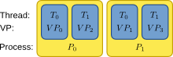
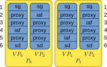

Guide to parallel computing
===========================

.. contents::
   :local:

What is parallelization?
------------------------

Parallelization can improve the efficiency of running large-scale simulations by
taking advantage of multicore/multiprocessor machines, computer clusters or
supercomputers. Here we explain how  parallelization is set up in NEST and how you
can take advantage of it for your simulations.

NEST employs two methods for parallelization:

* :ref:`Thread-parallel simulation <multiple_threads>`
     * uses OpenMP
     * takes advantage of multicore and multiprocessor computers without
       the need for additional libraries
* :ref:`Distributed simulation (or distributed computing) <distributed_computing>`
     * uses the Message Passing Interface (MPI)
     * supports simulations over multiple computers

Both methods can be combined within a simulation.

See `Plesser et al. (2007) <http://dx.doi.org/10.1007/978-3-540-74466-5_71>`__
for more information on NEST parallelization and be sure to check the
documentation on :ref:`Random numbers in NEST <random_numbers>`

Virtual processes
-----------------

We use the concept of local and remote threads, called *virtual processes*.
A virtual process (VP) is a thread residing in one of NEST's MPI processes.
For both thread and distributed parallelization, VPs simplify handling of
neuron  and synapses distributions.
Virtual processes are distributed round-robin (i.e. each VP is allocated equal
time slices, without any given a priority) onto the MPI processes and
counted continuously over all processes.

 Basic scheme showing how threads (T) and virtual
 processes (VP) reside in MPI processes (P) in NEST

Node distributions
------------------

The distribution of nodes depends on the type of node.

In the figure below, a node distribution for a small network consisting of ``spike_generator``,
four ``iaf_psc_alpha`` neurons, and a ``spike_recorder``
in a scenario with two processes with two threads each.

 sg=spike_generator, iaf=iaf_psc_alpha, sr=spike_recorder. Numbers to
 the left and right indicate node IDs.
 The *proxy* object in the figure is a conceptual way of keeping the id of the
 real node free on remote processes).

.. note::

 The status dictionary of each node (i.e. neuron or device) contains
 three entries that are related to parallel computing:

 *  *local* (boolean): indicating if the node exists on the local process or not
 *  *thread* (integer): id of the local thread the node is assigned to
 *  *vp* (integer): id of the virtual process the node is assigned to

Neuron distribution
~~~~~~~~~~~~~~~~~~~

Neurons are assigned to one of the virtual processes in a round-robin fashion.
On all other virtual processes, no object is created. Proxies ensure the id
of the real node on a given VP is kept free.

The virtual process :math:`id_{vp}` on which a neuron with node ID :math:`node_id_{node}` is
allocated is given by :math:`id_{vp} = node_id_{node} %N_{vp}`, where :math:`N_{vp}` is the total
number of virtual processes in the simulation.

Device Distribution
~~~~~~~~~~~~~~~~~~~

Devices are replicated once on each thread in order to balance the load and
minimize their interaction. Devices thus do not have proxies on remote virtual
processes.

For recording devices configured to record to a file (property
`record_to` set to `ascii`), the distribution results in multiple
data files, each containing the data from one thread. The files names
are composed according to the following scheme

.. code-block:: bash

    [model|label]-node_id-vp.[dat|gdf]

The first part is the name of the `model` (e.g. ``voltmeter`` or
``spike_recorder``) or, if set, the `label` of the recording device. Next is
the node ID of the recording device, followed by the id of the VP
assigned to the recorder. Spike files have the file extension ``gdf`` and
analog recordings from the ``multimeter`` have ``dat`` as file extension.

The ``label`` and ``file_extension`` of a recording device can be set like any
other parameter of a node using ``SetStatus``.

Spike exchange and synapse update
---------------------------------

Spike exchange in NEST takes different routes depending on the type of
the sending and receiving node. There are two distinct cases.

Spikes between neurons
~~~~~~~~~~~~~~~~~~~~~~

* Spikes between neurons are always exchanged through the **global spike
  exchange mechanism**.

* Neuron update and spike generation in the `source neuron` and spike delivery
  to the `target neuron` may be handled by **different virtual processes**.

* But the virtual process assigned to the `target_neuron` always handles the corresponding spike delivery
  (see property ``vp`` in the status dictionary).

Spikes between neurons and devices
~~~~~~~~~~~~~~~~~~~~~~~~~~~~~~~~~~

* Spike exchange to or from neurons over connections that either originate
  or terminate at a device (e.g., ``spike_generator -> neuron`` or
  ``neuron -> spike_recorder``) bypasses the global spike exchange mechanism.

* Spikes are delivered locally within the virtual process from or to a
  replica of the device. In this case, both the pre- and postsynaptic nodes are
  handled by the virtual process to which the neuron is assigned.

Synaptic plasticity models
~~~~~~~~~~~~~~~~~~~~~~~~~~

For synapse models supporting plasticity, synapse dynamics in the
``Connection`` object are always handled by the virtual process of the
`target node`.

.. _multiple_threads:

Using multiple threads
----------------------

Thread-parallel simulation is compiled into NEST by default and should work on
all MacOS and Linux machines without additional requirements.

In order to keep results comparable and reproducible across different machines,
the **default mode** is set to a **single thread**  and
**multi-threading** has to be turned on explicitly.

To use multiple threads for the simulation, the desired number of
threads has to be set **before** any nodes or connections are created. The
command for this is

.. code-block:: bash

    nest.SetKernelStatus({"local_num_threads": T})

Usually, a good choice for `T` is the number of processor cores available
on your machine.

.. note::

 In some situations, `oversubscribing` (i.e., to specify a ``local_num_threads`` that is higher than available cores on your machine)
 can yield 20-30% improvement in simulation speed. Finding the optimal thread number for a
 specific situation might require a bit of experimenting.

Multiprocessing
---------------

**Using Python's ``multiprocessing`` module with NEST may lead to unpredictable results!**

NEST internally parallelizes network construction [1]_ and maintains internal data structures in this process. For
example, running several ``Connect()`` calls simultaneously can interfere with the internal parallelization and will
likely lead to unpredictable/wrong results.

.. _distributed_computing:

Using distributed computing
---------------------------

.. _configure-for-parallel-computing:

Build requirements
~~~~~~~~~~~~~~~~~~

To compile NEST for distributed computing, you will need a library
implementation of MPI (e.g. `OpenMPI <https://www.open-mpi.org>`__ or
`MPICH <https://www.mpich.org/>`__) on your system. If you are on a
cluster or supercomputer, you most likely already have this. In case
you are using a pre-packaged MPI library, please make sure that you
also have the MPI development packages installed.

When using the :ref:`standard installation instructions <standard>`, it
is usually sufficient to add ``-Dwith-mpi=ON`` when calling `cmake`.
However, more detailed information on this and related flags (e.g. for
enabling the :ref:`recording backend for recording to binary files
<recording_backend_sionlib>`) can be found in the :ref:`compilation
options for distributed computing <compile-with-mpi>`.

Please also see the :doc:`generic installation instructions
<../installation/index>`, where you can find an overview of all options for
installing NEST.

Run distributed simulations
~~~~~~~~~~~~~~~~~~~~~~~~~~~

Distributed simulations **cannot be run interactively**, which means that
the simulation has to be provided as a script. However, the script can be the same
as a script for any simulation. No changes are necessary for distibuted simulation scripts:
inter-process communication and node distribution is managed transparently inside of NEST.

To distribute a simulation onto 128 processes of a computer cluster, the
command should look like this

.. code-block:: bash

    mpirun -np 128 python3 simulation.py

Please refer to the MPI library documentation for details on the usage
of ``mpirun``.

MPI related commands
~~~~~~~~~~~~~~~~~~~~

Although we generally advise strongly against writing process-aware code
in simulation scripts (e.g. creating a neuron or device only on one
process and such), in special cases it may be necessary to obtain
information about the MPI application. One example would opening the
right stimulus file for a specific rank. Therefore, some MPI specific
commands are available:

.. glossary::

 ``NumProcesses``
     The number of MPI processes in the simulation

 ``ProcessorName``
     The name of the machine. The result might differ on each process.

 ``Rank``
     The rank of the MPI process. The result differs on each process.

 ``SyncProcesses``
      Synchronize all MPI processes.

Reproducibility
---------------

To achieve the same simulation results even when using different
parallelization strategies, the number of virtual processes has to be
kept constant. A simulation with a specific number of virtual processes
will always yield the same results, no matter how they are distributed
over threads and processes, given that the seeds for the random number
generators of the different virtual processes are the same (see :doc:`Random
numbers in NEST <random_numbers>`).

In order to achieve a constant number of virtual processes, NEST
provides the property *total_num_virtual_procs* to adapt the number
of local threads (property *local_num_threads*, explained above) to
the number of available processes.

The following listing contains a complete simulation script
(*simulation.py*) with four neurons connected in a chain. The first
neuron receives random input from a ``poisson_generator`` and the spikes
of all four neurons are recorded to files.

.. code-block:: python

    from nest import *
    SetKernelStatus({"total_num_virtual_procs": 4})
    pg = Create("poisson_generator", params={"rate": 50000.0})
    n = Create("iaf_psc_alpha", 4)
    sr = Create("spike_recorder", params={"record_to": "ascii"})
    Connect(pg, [n[0]], syn_spec={'weight': 1000.0, 'delay': 1.0})
    Connect([n[0]], [n[1]], syn_spec={'weight': 1000.0, 'delay': 1.0})
    Connect([n[1]], [n[2]], syn_spec={'weight': 1000.0, 'delay': 1.0})
    Connect([n[2]], [n[3]], syn_spec={'weight': 1000.0, 'delay': 1.0})
    Connect(n, sr)
    Simulate(100.0)

The script is run three times using different numbers of MPI processes,
but 4 virtual processes in every run:

.. code-block:: bash

    mkdir 4vp_1p; cd 4vp_1p
    mpirun -np 1 python3 ../simulation.py
    cd ..; mkdir 4vp_2p; cd 4vp_2p
    mpirun -np 2 python3 ../simulation.py
    cd ..; mkdir 4vp_4p; cd 4vp_4p
    mpirun -np 4 python3 ../simulation.py
    cd ..
    diff 4vp_1p 4vp_2p
    diff 4vp_1p 4vp_4p

Each variant of the experiment produces four data files, one for each
virtual process (*spike_recorder-6-0.gdf*, *spike_recorder-6-1.gdf*,
*spike_recorder-6-2.gdf*, and *spike_recorder-6-3.gdf*). Using diff on
the three data directories shows that they all contain the same spikes,
which means that the simulation results are indeed the same
independently of the details of parallelization.

References
----------

.. [1] Ippen T, Eppler JM, Plesser HE and Diesmann M (2017). Constructing neuronal network models in massively
       parallel environments. Front. Neuroinform. 11:30. DOI: 10.3389/fninf.2017.00030
