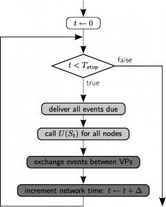
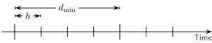

Running simulations
===================

Introduction
------------

To drive the simulation, neurons and devices (*nodes*) are updated in a
time-driven fashion by calling a member function on each of them in a
regular interval. The spacing of the grid is called the *simulation
resolution* (default 0.1ms) and can be set using ``SetKernelStatus``:

::

    SetKernelStatus({"resolution": 0.1})

Even though a neuron model can use smaller time steps internally, the
membrane potential will only be visible to a ``multimeter`` on the
outside at time points that are multiples of the simulation resolution.

In contrast to the update of nodes, an event-driven approach is used for
the synapses, meaning that they are only updated when an event is
transmitted through them (`Morrison et al.
2005 <http://dx.doi.org/10.1162/0899766054026648>`_). To speed up the
simulation and allow the efficient use of computer clusters, NEST uses a
:doc:`hybrid parallelization strategy <parallel_computing>`. The
following figure shows the basic loop that is run upon a call to
``Simulate``:

   Simulation Loop

The simulation loop. Light gray boxes denote thread parallel parts, dark
gray boxes denote MPI parallel parts. U(St) is the update operator that
propagates the internal state of a neuron or device.

Simulation resolution and update interval
-----------------------------------------

Each connection in NEST has its own specific *delay* that defines the
time it takes until an event reaches the target node. We define the
minimum delay *dmin* as the smallest transmission delay and *dmax* as
the largest delay in the network. From this definition follows that no
node can influence another node during at least a time of *dmin*, i.e.
the elements are effectively decoupled for this interval.

   Definitions of minimum delay (*dmin*) and simulation resolution (*h*).

Two major optimizations in NEST are built on this decoupling:

1. Every neuron is updated in steps of the simulation resolution, but
   always for *dmin* time in one go, as to keep neurons in cache as long
   as possible.

2. MPI processes only communicate in intervals of *dmin* as to minimize
   communication costs.

These optimizations mean that the sizes of spike buffers in nodes and
the buffers for inter-process communication depend on *dmin+dmax* as
histories that long back have to be kept. NEST will figure out the
correct value of *dmin* and *dmax* based on the actual delays used
during connection setup. Their actual values can be retrieved using
``GetKernelStatus``:

::

    GetKernelStatus("min_delay")   # (A corresponding entry exists for max_delay)

Setting *dmin* and *dmax* manually
~~~~~~~~~~~~~~~~~~~~~~~~~~~~~~~~~~

In linear simulation scripts that build a network, simulate it, carry
out some post-processing and exit, the user does not have to worry about
the delay extrema *dmin* and *dmax* as they are set automatically to the
correct values. However, NEST also allows subsequent calls
to\ ``Simulate``, which only work correctly if the content of the spike
buffers is preserved over the simulations.

As mentioned above, the size of that buffer depends on *dmin+dmax* and
the easiest way to assert its integrity is to not change its size after
initialization. Thus, we freeze the delay extrema after the first call
to ``Simulate``. To still allow adding new connections inbetween calls
to ``Simulate``, the required boundaries of delays can be set manually
using ``SetKernelStatus``:

::

    SetKernelStatus({"min_delay": 0.5, "max_delay": 2.5})

These settings should be used with care, though: setting the delay
extrema too wide without need leads to decreased performance due to more
update calls and communication cycles (small *dmin*), or increased
memory consumption of NEST (large *dmax*).

Spike generation and precision
------------------------------

A neuron fires a spike when the membrane potential is above threshold at
the end of an update interval (i.e., a multiple of the simulation
resolution). For most models, the membrane potential is then reset to
some fixed value and clamped to that value during the refractory time.
This means that the last membrane potential value at the last time step
before the spike can vary, while the potential right after the step will
usually be the reset potential (some models may deviate from this). This
also means that the membrane potential recording will never show values
above the threshold. The time of the spike is always the time at *the
end of the interval* during which the threshold was crossed.

NEST also has a some models that determine the precise time of the
threshold crossing during the interval. Please see the documentation on
:doc:`precise spike time neurons <simulations_with_precise_spike_times>`
for details about neuron update in continuous time and the
:doc:`documentation on connection management <connection_management>`
for how to set the delay when creating synapses.

.. _stepped_simulations:

Splitting a simulation into multiple intervals
----------------------------------------------

In some cases, it may be useful to run a simulation in shorter intervals
to extract information while the simulation is running. The simplest way
of doing this is to simply loop over ``Simulate()`` calls:

::

    for _ in range(20):
        nest.Simulate(10)
        # extract and analyse data
        
would run a simulation in 20 rounds of 10 ms. With this solution, NEST takes
a number of preparatory and cleanup steps for each ``Simulate()`` call. 
This makes the solution robust and entirely reliable, but comes with a 
performance cost.
 
A more efficient solution doing exactly the same thing is

::

    nest.Prepare()
    for _ in range(20):
        nest.Run(10)
        # extract and analyse data
    nest.Cleanup()
     
For convenience, the ``RunManager()`` context manager can handle preparation
and cleanup for you:

::

    with nest.RunManager():
        for _ in range(20):
            nest.Run(10)
            # extract and analyse data

.. note::
   - If you do not use ``RunManager()``, you must call ``Prepare()``, 
     ``Run()`` and ``Cleanup()`` in that order.
   - You can call ``Run()`` any number of times inside a ``RunManager()`` 
     context or between ``Prepare()`` and ``Cleanup()`` calls.
   - Calling ``SetStatus()`` inside a ``RunManager()`` context or
     between ``Prepare()`` and ``Cleanup()`` will **lead to unpredictable
     results**.
   - After calling ``Cleanup()``, you need to call ``Prepare()`` again before
     calling ``Run()``.

Repeated simulations
--------------------

The only reliable way to perform two simulations of a network from exactly
the same starting point is to restart NEST or to call `ResetKernel()` and
then to build the network anew. If your simulations are rather large and
you are working on a computer with a job queueing system, it may be most
efficient to submit individual jobs or a job array to smiulate network 
instances in parallel; don't forget to use different 
:doc:`random seeds <random_numbers>`! 

The following example performs simulations of a single neuron driven by
a Poisson spike train using different seeds and output files for each run:

::

    for n in range(10):
        nest.ResetKernel()
        nest.SetKernelStatus({'grng_seed': 100*n + 1,
                              'rng_seeds': [100*n + 2]})
        pg = nest.Create('poisson_generator', params={'rate': 1000000.0})
        nrn= nest.Create('iaf_psc_alpha')
        sr = nest.Create('spike_recorder',
                            params={'label': 'spikes-run{:02d}'.format(n),
                                    'record_to': 'ascii'})
    
        nest.Connect(pg, nrn)
        nest.Connect(nrn, sr)
    
        nest.Simulate(100)

Monitoring elapsed time
-----------------------

The progress of the simulation can be monitored by setting:

::

    SetKernelStatus({"print_time": True})

If enabled, a line is printed to screen at every time step of the simulation to
track the percentage, the absolute elapsed model time and the real-time factor,
for example:

::

    [ 25% ] Model time: 250.0 ms, Real-time factor: 2.6711

The *real-time factor* is defined as the quotient of *wall-clock time* (which
is also known as real time) and the *model time* (which is the duration by
which the state of the model is advanced in time, or in short, the argument to
the ``Simulate()`` call):

.. math::

    q_\text{real} = \frac{T_\text{wall}}{T_\text{model}}

If the real-time factor is larger than `1` as in the example above, the
simulation runs slower than the wall-clock time.

In case a simulation script contains multiple ``Simulate()`` calls,
the percentage simulation time is reset to `0%` at the beginning of each call,
but the absolute model time and the real-time factor account for the total
elapsed times.

The real-time factor should not be confused with the concept of speedup.
*Speedup* refers to a ratio of wall-clock times, namely the wall-clock time
needed to solve a problem serially and the wall-clock time needed to solve the
same problem in parallel (e.g., by distributing the work across multiple
threads or processes):

.. math::

    q_\text{speedup} = \frac{T_\text{wall, serial}}{T_\text{wall, parallel}}

.. note::

    For large, distributed simulations, it is recommended to set
    ``{"print_time": False}`` to avoid the overhead of the print calls.
    In these cases, the real-time factor can be computed by measuring the
    wall-clock time manually and dividing by the set model time.

