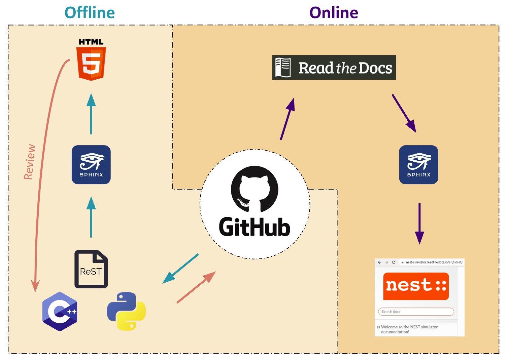

.. _userdoc_workflow:

User-level documentation workflow
#################################

What you need to know
+++++++++++++++++++++

We use `Sphinx <https://www.sphinx-doc.org/en/master/>`_ to generate
documentation and `Read the Docs <https://readthedocs.org/>`_ to
publish it. Sphinx uses reStructuredText as the base format for the
documentation. To learn more about the syntax, check out this `quick
reference
<https://thomas-cokelaer.info/tutorials/sphinx/rest_syntax.html>`_.

The NEST Simulator documentation lives alongside its code. It is
contained in the ``doc/htmldoc`` directory within the `NEST source
code repository <https://github.com/nest/nest-simulator>`_ on GitHub.

We work with `GitHub <https://www.github.com>`_ as a web-based hosting
service for Git. Git allows us to keep our versions under control,
with each release of NEST having its own documentation.

This workflow aims for the concept of **user-correctable documentation**.

.. note::
   This workflow shows you how to create **user-level documentation**
   for NEST. For the **developer documentation**, please refer to our
   :ref:`Developer documentation workflow
   <devdoc_workflow>`.

Changing the documentation
++++++++++++++++++++++++++

If you notice any errors or weaknesses in the documentation, please
submit an `Issue <https://github.com/nest/nest-simulator/issues>`_ in
our GitHub repository.

You can also make changes directly to your forked copy of the `NEST source
code repository <https://github.com/nest/nest-simulator>`_ and create a `pull
request <https://github.com/nest/nest-simulator/pulls>`_. Just follow the
workflow below!

Setting up your environment
+++++++++++++++++++++++++++

We recommend that you set up a full NEST developer environment using
Conda (for details on Conda, see :ref:`conda_tips`):

.. code-block:: bash

    cd <nest_source_dir>/
    conda env create -p conda/
    conda activate conda/

If you later on want to deactivate or delete the build environment:

.. code-block:: bash

   conda deactivate
   rm -rf conda/

If you want to install only a minimal set of packages for building the
documentation and avoid using Conda, you can use pip:

.. code-block:: bash

    pip3 install -r <nest_source_dir>/doc/requirements.txt

If you use pip, install ``pandoc`` from your platform's package manager (e.g. apt):

.. code-block:: bash

    sudo apt-get install pandoc

Generating documentation with Sphinx
++++++++++++++++++++++++++++++++++++

Now that you activated your environment, you can generate HTML files using
Sphinx.

Rendering HTML
~~~~~~~~~~~~~~

You can build and preview the documentation locally by running the following
commands.

1. Go to the :ref:`build directory <dev_install>` of NEST:

.. code-block:: bash

   cd nest-simulator-x.y.z-build

2. Add `-Dwith-userdoc=ON` to your regular CMake command:

.. code-block:: bash

   cmake -Dwith-userdoc=ON

3. Build the docs:

.. code-block:: bash

   make docs

4. Preview files. They are located in ``doc/htmldoc/_build/html``

.. code-block:: bash

   browser doc/htmldoc/_build/html/index.html

.. note::

   If you are planning to install NEST, ``make docs`` is included
   in ``make install`` as long as you toggle on the userdoc or devdoc

   After installation the files are located in
   ``<nest_install_dir>/share/doc/nest/html/index.html``

Editing and creating pages
~~~~~~~~~~~~~~~~~~~~~~~~~~

To edit existing `reStructuredText <https://thomas-cokelaer.info/tutorials/
sphinx/rest_syntax.html>`_ files or to create new ones, follow the steps below:

1. You can edit and/or add ``.rst`` files in the ``doc/htmldoc`` directory using your
   editor of choice.

2. If you create a new page, open ``index.rst`` in the ``doc/htmldoc`` directory
   and add the file name under ``.. toctree::``. This will ensure it appears on
   the NEST Simulator documentation's table of contents.

3. If you rename or move a file, please make sure you update all the
   corresponding cross-references.

4. Save your changes.

5. Re-render documentation as described above.

.. note::

   Please see our :ref:`documentation style guide <doc_styleguide>` for information on how to write good documentation in the NEST style.

Proceed as follows to preview your version of the documentation on Read the
Docs.

1. Check that unwanted directories are listed in ``.gitignore``:

.. code-block:: bash

   _build
   _static
   _templates

2. Add, commit and push your changes to GitHub.

3. Go to `Read the Docs <https://readthedocs.org/>`_. Sign up for an account
   if you don't have one.

4. `Import <https://readthedocs.org/dashboard/import/>`_ the project.

5. Enter the details of your project in the ``repo`` field and hit ``Create``.

6. `Build <https://docs.readthedocs.io/en/stable/intro/
   import-guide.html#building-your-documentation>`_ your documentation.

This allows you to preview your work on your Read the Docs account. In order
to see the changes on the official NEST Simulator documentation, please submit
a pull request.

Creating pull request
+++++++++++++++++++++

Once your documentation work is finished, you can create a
:ref:`pull request <git_workflow>` to the ``master``
branch of the NEST Source Code Repository. Your pull request will be reviewed
by the NEST Documentation Team!
