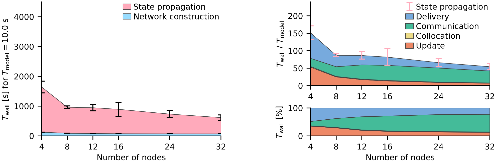

.. _benchmark:

Benchmarking NEST
=================

.. seealso::

   When compiling NEST to perform benchmarks, see :ref:`our cmake options <performance_cmake>` for improved performance and energy saving.

NEST performance
~~~~~~~~~~~~~~~~

We regulary test NEST performance at various network sizes.
For results of these experiments see our :doc:`NEST performance benchmarks <benchmarks:index>` page.

beNNch
~~~~~~

Computational efficiency is essential to simulate complex neuronal networks and study long-term effects such as learning.
The scaling performance of neuronal network simulators on high-performance computing systems can be assessed with benchmark simulations.
However, maintaining comparability of benchmark results across different systems, software environments, network models, and researchers from potentially different labs poses a challenge.

The software framework `beNNch <https://github.com/INM-6/beNNch>`_ tackles this challenge by implementing a unified, modular workflow for configuring, executing, and analyzing such benchmarks.
beNNch builds around the `JUBE Benchmarking Environment <https://www.fz-juelich.de/ias/jsc/EN/Expertise/Support/Software/JUBE/_node.html>`_, installs simulation software, provides an interface to benchmark models, automates data and metadata annotation, and accounts for storage and presentation of results.

For more details on the conceptual ideas behind beNNch, refer to Albers et al. (2022) [1]_.

    Example ``beNNch`` output (Figure 5C of [1]_)

    Strong-scaling performance of the `multi-area model <https://github.com/INM-6/multi-area-model>`_ simulated with NEST on JURECA-DC.
    The left graph shows the absolute wall-clock time measured with Python-level timers for both network construction and state propagation.
    Error bars indicate variability across three simulation repeats with different random seeds.
    The top right graph displays the real-time factor defined as wall-clock time normalized by the model time.
    :ref:`Built-in timers <built_in_timers>` resolve four different phases of the state propagation: update, collocation, communication, and delivery.
    Pink error bars show the same variability of state propagation as the left graph.
    The lower right graph shows the relative contribution of these phases to the state-propagation time.

.. seealso::

    * For further details, see the accompanying `beNNch GitHub Page <https://inm-6.github.io/beNNch>`_.

    * For a detailed step-by-step walk though see `Walk through guide <https://inm-6.github.io/beNNch/walk-through.html>`_.

    * Example PyNEST script: :doc:`../auto_examples/hpc_benchmark`

    * Guide to :ref:`built_in_timers` and :ref:`running simulations <run_simulations>`.

References
----------

.. [1] Albers J., et al (2022). A Modular Workflow for Performance Benchmarking of Neuronal Network Simulations.
       Frontiers in Neuroinformatics(16):837549. https://doi.org/10.3389/fninf.2022.837549
