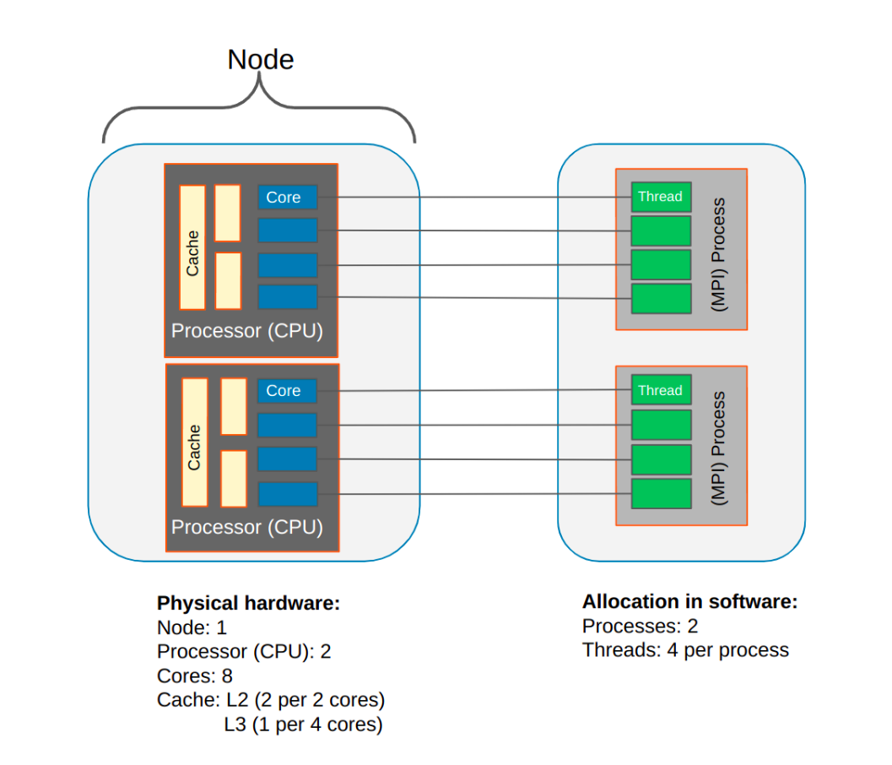

.. _overview_hardware:

Overview of various hardware and software components
====================================================

An unfortunate aspect of computing is that a single component may be called something different by different
organizations, manufacturers, and companies. We also have overlapping terms, such as nodes, that have one meaning
in computational neuroscience, and another in computer hardware.

To optimize NEST performance, it's important to understand the system you are using and its components.
Here we try to provide a brief description of the generic setup of hardware and corresponding software.
Note that these are not terms used specifically for NEST, but are common in HPC organizations.

.. note::

  This is just one configuration for hardware setup. A particular system may use other components, but for our needs
  nodes and cores are the most important terms to know.

.. seealso::

    * :ref:`slurm_script`
    * :ref:`threads`
    * :ref:`mpi_process`

.. grid:: 1 1 2 2

    .. grid-item-card:: Physical components (left side of image)

        This a representation of a typical hardware setup.

        * In a supercomputer or cluster, there are many nodes.

        * Each node contains processors (also called CPUs) and each one has its own cores and cache (L1, L2, L3)

        * Each node is basically its own computer and comprises other components not shown here.

        * The cores are where the computations are performed.

        * The cache is the local memory store for that processor.

    .. grid-item-card:: Software components (right side of image)

        This is how the data and instructions are allocated through software.

        * A set of data and instructions that belong together is referred to as a task or process. This can be your entire simulation
          script or a subset of it.

        * We typically use the standard Message Passing Interface (MPI) to instruct how processes work in parallel (See e.g.,
          `OpenMPI <https://www.open-mpi.org/>`_).

        * The smallest unit of executable program is known as a thread. The thread is a virtual component.

        * A single core can have one or two threads. Therefore the total number of possible threads is double the number of cores.
          *In NEST, we recommend only having one thread per core.*

To efficiently run your large and complex simulation, you need to configure the optimal number of :refs:`threads <threads>` and :ref:`processes <mpi_process>` for
your simulation and the given hardware of the HPC system you are using.

