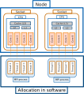

.. _overview_hardware:

Overview of various hardware and software components
====================================================

To optimize NEST performance, it's important to understand the system you are using and its components.
Here we try to provide a brief description of the generic setup of hardware and corresponding software.
Note that these are not terms used specifically for NEST, but are common in HPC organizations.

.. note::

  This is just one configuration for hardware setup. A particular system may use other components, and confusingly
  the terminology used for the physical and software components can change depending on the company and organization.

.. seealso::

    * :ref:`slurm_script`
    * :ref:`threads`
    * :ref:`mpi_process`

A supercomputer or cluster will have many nodes.

* A node can contain sockets where the individual CPUs (also called processors) are located.
  Each CPU contains cores, which execute computations and cache (L1, L2, L3), which is the local memory store.

Data and instructions are allocated through software.

* A set of data and instructions that belong together is referred to as a task or process. This can be your entire simulation
  script or a subset of it.
  To allow processes to run in parallel, we typically use the standard Message Passing Interface (MPI)
  to instruct how they work (See e.g., `OpenMPI <https://www.open-mpi.org/>`_).

* The smallest unit of executable program is known as a thread. We can control threads following standards like `OpenMP <https://www.openmp.org/>`_.

To efficiently run your large and complex simulation, you need to configure the optimal number of :ref:`threads <threads>` and :ref:`processes <mpi_process>` for
your simulation and the given hardware of the HPC system you are using.
