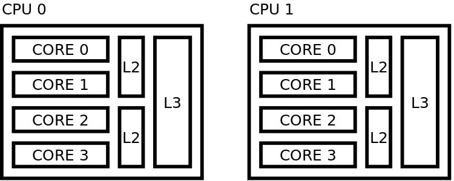

.. _threads:

Threading
=========

The smallest unit of executable program is known as a thread.

We can adjust the number of :ref:`MPI processes <mpi_process>` and threads, but the product of the two should ideally be the total number of cores.
For example, with 8 cores, we can have 2 processes and 4 threads per process or 1 process with 8 threads.
In NEST, we recommend only having one thread per core.

We can control the number and placement of threads with programs that implement standards such as `OpenMP <https://www.openmp.org/>`_.

For a detailed investigation, we recommend reading Kurth et al. 2022 [1]_.

.. seealso::

    * :ref:`overview_hardware`
    * :ref:`mpi_process`
    * :ref:`slurm_script`

.. _pinning_threads:

Pinning threads
---------------

Pinning threads allows you to control the distribution of threads across available cores on your system, and is particularly
useful in high performance computing (HPC) systems.

Allowing threads to move can be beneficial in some cases. But when threads move, the data that is to be processed needs to move too.
With NEST, each thread gets allocated a specific set of data objects to work with during simulation (due to the round robin distribution).
This means that when a thread moves, it cannot perform any computation until its specific data gets to the right place.
This is called *cache misses*. For this reason, pinning threads typically decreases run time.
See our overview :ref:`handling threads with virtual processes <sec_virt_proc>`.

There are different types of pinning schemes, and the optimal scheme will depend on your script.
Here we show two different example schemes.


Sequential pinning scheme
`````````````````````````



   Sequential placing

   In this scheme, the cores of 1 CPU are filled before going to next

   Setting to use for this case: ``export OMP_PROC_BIND = close``

Distant pinning scheme
``````````````````````


   Distant placing

   Maximizes distance between threads in hardware

   Setting to use for this case: ``export OMP_PROC_BIND = spread``


Table of OpenMP settings
````````````````````````

.. list-table:: OpenMP settings
   :header-rows: 1

   * - Setting
     - Description
   * - ``export OMP_NUM_THREADS=#CPUSPERTASK#``
     - variable telling OpenMP how many threads are used on a MPI process
   * - ``export OMP_PROC_BIND=true``
     - no movement of threads between OpenMP threads and OpenMP places
   * - ``export OMP_PROC_BIND=close/spread``
     - no movement of threads between OpenMP threads and OpenMP places and OpenMP places are 'close' in a hardware sense
   * - ``export OMP_PLACES=threads/cores``
     - each OpenMP place corresponds to a hardware thread/core
   * - ``export OMP_PLACES="{a : b : c}"``
     - OpenMP places are a, a+b, a+2c, ... a+nc=b (numbering usually relates to cores/hardware threads)
   * - ``export OMP_DISPLAY_ENV=true``
     - display OpenMP variables

.. note::

   Using ```python``` on HPC systems might lead to inconsistencies in multi-threading libraries resulting in a degredation of performance.
   For instance, depending on the installation ```numpy``` uses the multi-threading library provided by the MKL.
   To resolve this one needs to set ```export MKL_THREADING_LAYER=GNU``` in order to pass the OpenMP settings correctly.
    

.. seealso::

   For general details on pinning in HPC systems see `the HPC wiki article <https://hpc-wiki.info/hpc/Binding/Pinning>`_.


References
----------

.. [1] Kurth AC. Senk J. Terhorst D. Finnerty J. and Diesmann M (2022). Sub-realtime simulation of a neuronal network of natural density.
       Neuromorphic Computing and Engineering(2):021001. https://doi.org/10.1088/2634-4386/ac55fc


