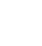
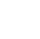

NEST Simulator documentation
============================

Welcome!
--------

.. grid::

  .. grid-item::

    NEST is used in computational neuroscience to model and study behavior of large networks of neurons.

    The models describe single :ref:`neuron` and :ref:`synapse` behavior and their connections.
    Different mechanisms of plasticity can be used to investigate artificial learning
    and help to shed light on the fundamental principles of how the brain works.

    NEST offers convenient and efficient commands to define and connect large networks,
    ranging from algorithmically determined connections to data-driven connectivity.
    Create connections between neurons using numerous synapse models from STDP to gap junctions.

  .. grid-item-card::

      .. carousel::
          :show_controls:
          :data-bs-ride: carousel

            .. figure:: static/img/pong_sim.gif

              PLAY PONG with NEST

            .. figure:: static/img/sudoku_solution.gif

              OR SUDOKU

            .. figure:: static/img/pynest/spatial_test3d.png

              Create 3D spatially structured networks

            .. figure:: static/img/pynest/structuralplasticity.png

              Showcase cool examples

----

Conceptual appraoch
-------------------

.. grid::
   :outline:

   .. grid-item::
      :columns: 8

      .. raw:: html
         :file: static/img/network-brain_1.1.svg

   .. grid-item::
      :columns: 4
      :child-align: center

      .. raw:: html

         

         
         

         

         
         

         

         
         

Learn and explore NEST
----------------------

.. grid:: 1 1 2 3

   .. grid-item::
      :margin: 0
      :padding: 0

      .. dropdown:: Get started
          :class-title: sd-d-flex-item sd-align-minor-center sd-bg-primary sd-text-white

          * :ref:`install`
          * :ref:`pynest_tutorial`

   .. grid-item::
      :margin: 0
      :padding: 0

      .. dropdown:: Explore example use cases
          :class-title: sd-d-flex-item sd-align-minor-center sd-bg-primary sd-text-white

          * :ref:`connection_management`

          * :ref:`handling_connections`

   .. grid-item::
      :margin: 0
      :padding: 0

      .. dropdown:: PyNEST API
          :class-title: sd-d-flex-item sd-align-minor-center sd-bg-primary sd-text-white

          * :ref:`pynest_api`

          * :ref:`stimulate_network`

.. grid:: 1 1 2 3

   .. grid-item::
      :margin: 0
      :padding: 0

      .. dropdown:: |neuron| All about neurons
          :class-title: sd-d-flex-row sd-align-minor-center sd-bg-success sd-text-white

          * :ref:`node_handles`

          * :ref:`param_ex`

          * :ref:`sim_precise_spike_times`

          * :ref:`exact_integration`

   .. grid-item::
      :margin: 0
      :padding: 0

      .. dropdown:: |synapse|  All about synapses and connections
          :class-title: sd-d-flex-row sd-align-minor-center sd-bg-success sd-text-white

          * :ref:`connection_management`

          * :ref:`handling_connections`

          * :ref:`sim_gap_junctions`

          * :ref:`weight_normalization`

   .. grid-item::
      :margin: 0
      :padding: 0

      .. dropdown:: |device| All about devices
          :class-title: sd-d-flex-row sd-align-minor-center sd-bg-success sd-text-white

          * :ref:`record_simulations`

          * :ref:`stimulate_network`

.. grid:: 1 1 2 3

   .. grid-item::
      :margin: 0
      :padding: 0

      .. dropdown:: |network| Spatially-structured networks
          :class-title: sd-d-flex-row sd-align-minor-center sd-bg-info sd-text-white

          :ref:`spatial_networks`

   .. grid-item::
      :margin: 0
      :padding: 0

      .. dropdown:: |math| Models in NEST
          :class-title: sd-d-flex-row sd-align-minor-center sd-bg-info sd-text-white

          :ref:`modelsmain`

   .. grid-item::
      :margin: 0
      :padding: 0

      .. dropdown:: |sonata| NEST SONATA guide
          :class-title: sd-d-flex-row sd-align-minor-center sd-bg-info sd-text-white

          :ref:`nest_sonata`

.. grid:: 1 1 2 3

   .. grid-item::
      :margin: 0
      :padding: 0

      .. dropdown:: |random| NEST behavior
          :class-title: sd-d-flex-row sd-align-minor-center sd-bg-dark sd-text-white

          * :ref:`built_in_timers`

          * :ref:`random_numbers`

          * :ref:`run_simulations`

   .. grid-item::
      :margin: 0
      :padding: 0

      .. dropdown:: |connect| Connect to other tools
          :class-title: sd-d-flex-row sd-align-minor-center sd-bg-dark sd-text-white

          * :ref:`nest_server`

          * :ref:`nest_music`

   .. grid-item::
      :margin: 0
      :padding: 0

      .. dropdown:: |hpc| High performance computers (HPC)
          :class-title: sd-d-flex-row sd-align-minor-center sd-bg-dark sd-text-white

          * :ref:`optimize_performance`
          * :ref:`parallel_computing`
          * :ref:`benchmark`

.. grid:: 1 1 2 3

   .. grid-item-card:: |refresh| Convert NEST 2.X scripts to 3.X
       :class-title: sd-d-flex-row sd-align-minor-center
       :link: refguide_2_3
       :link-type: ref

   .. grid-item-card:: |git| What's new?
       :class-title: sd-d-flex-row sd-align-minor-center
       :link: whats_new
       :link-type: ref

   .. grid-item-card::  |glossary| Glossary
       :class-title: sd-d-flex-row sd-align-minor-center
       :link: glossary
       :link-type: ref

Example script
--------------

Here is an example of how a script is constructed . . .

this works - TODO add text into image

.. seealso::

   :doc:`tutorials` for  other tests of example script

.. grid:: 1 2 2 2
      :gutter: 1

      .. grid-item::
            :columns: 8

            .. code-block:: python

                import nest

                neurons = nest.Create("iaf_psc_alpha", 10000, {
                    "V_m": nest.random.normal(-5.0),
                    "I_e": 1000.0
                })

      .. grid-item::
            :columns: auto
            :class: sd-d-flex-row sd-align-minor-center

            * :py:func:`.Create`
            * :ref:`link_to_neurondocs`

.. grid:: 1 2 2 2
      :gutter: 1

      .. grid-item::
            :columns: 8

            .. code-block:: python

                 input = nest.Create("noise_generator", params={
                    "amplitude": 500.0
                 })

      .. grid-item::
            :columns: auto

            * :ref:`link_to_stimdevices`

.. grid:: 1 2 2 2

      .. grid-item::
            :columns: 8
            :class: sd-text-wrap

            .. code-block:: python

                nest.Connect(input, neurons, syn_spec={'synapse_model': 'stdp_synapse'})
                spikes = nest.Create("spike_recorder", params={
                    'record_to': 'ascii',
                    'label': 'excitatory_spikes'
                })
                nest.Connect(neurons, spikes)

      .. grid-item::
            :columns: auto

            * :py:func:`.Connect`
            * :ref:`link_to_connectiondocs`
            * :ref:`link_to_recorddevices`

.. grid:: 1 2 2 2

      .. grid-item::
            :columns: 8

            .. code-block:: python

                nest.Simulate(100.0)
                nest.raster_plot.from_device(spikes, hist=True)
                plt.show()

      .. grid-item::
            :columns: auto

            * :py:func:`.Simulate`
            * See all PyNEST functions

.. toctree::
   :caption: USAGE
   :hidden:
   :glob:

   Install <installation/index>
   Tutorials <get-started_index>
   PyNEST API <ref_material/pynest_api/index>
   Examples <examples/index>
   Available models <models/index>
   Neurons in NEST <neurons/index>
   Synapses in NEST <synapses/index>
   Devices in NEST <devices/index>
   Spatially structured networks <networks/spatially_structured_networks>
   ref_material/glossary

.. toctree::
   :caption: COMMUNITY
   :hidden:
   :glob:

   Cite NEST <citing-nest>
   Contact us <community>
   Contribute <developer_space/index>
   What's new? <whats_new/index>
   NEST Homepage <https://nest-simulator.org>

.. toctree::
   :caption: TECHNICAL DETAILS
   :hidden:

   NEST on HPC <hpc/optimizing_nest>
   nest_sonata/nest_sonata_guide
   connect_nest/nest_server
   model implementation <model_details>
   NEST behavior <nest_behavior/index>
   Developer Docs <developer_space/index>

.. toctree::
   :caption: RELATED PROJECTS
   :hidden:

   NEST Desktop <https://nest-desktop.readthedocs.io/en/latest/>
   NESTML <https://nestml.readthedocs.io/en/latest/>
   NESTGPU <https://nestgpu.readthedocs.io/en/latest/>
   pynn <https://google.com>
   elephant <https://google.com>
   cosim <https://google.com>
   tvb <https://google.com>
   arbor <https://google.com>

.. toctree::
   :maxdepth: 1
   :hidden:

   license

.. |user| image:: static/img/020-user.svg
.. |teacher| image:: static/img/014-teacher.svg
.. |admin| image:: static/img/001-shuttle.svg
.. |dev| image:: static/img/dev_orange.svg
.. |nestml| image:: static/img/nestml-logo.png
      :scale: 15%
.. |synapse| image:: static/img/synapse_white.svg
.. |neuron|  image:: static/img/neuron_white.svg

.. |git|  image:: static/img/git_white.svg

.. |hpc|  image:: static/img/hpc_white.svg
.. |random|  image:: static/img/random_white.svg
.. |math|  image:: static/img/math_white.svg

.. |device|  image:: static/img/device_white.svg

