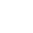
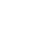

NEST Simulator documentation
============================

Welcome!
--------

.. grid::

  .. grid-item::

    NEST is used in computational neuroscience to model and study behavior of large networks of neurons.

    The models describe single :ref:`neuron` and :ref:`synapse` behavior and their connections.
    Different mechanisms of plasticity can be used to investigate artificial learning
    and help to shed light on the fundamental principles of how the brain works.

    NEST offers convenient and efficient commands to define and connect large networks,
    ranging from algorithmically determined connections to data-driven connectivity.
    Create connections between neurons using numerous synapse models from STDP to gap junctions.

  .. grid-item-card::

      .. carousel::
          :show_controls:
          :data-bs-ride: carousel

            .. figure:: static/img/pong_sim.gif

              PLAY PONG with NEST

            .. figure:: static/img/sudoku_solution.gif

              OR SUDOKU

            .. figure:: static/img/pynest/spatial_test3d.png

              Create 3D spatially structured networks

            .. figure:: static/img/pynest/structuralplasticity.png

              Showcase cool examples

----

Conceptual approach
-------------------

.. grid::
   :outline:

   .. grid-item::
      :columns: 8

      .. raw:: html
         :file: static/img/network-brain_1.1comp.svg

   .. grid-item::
      :columns: 4
      :child-align: center

      .. raw:: html

         

         
         

         

         
         

         

         
         

.. toctree::
   :caption: USAGE
   :hidden:
   :glob:

   Install <installation/index>
   Tutorials and Guides <get-started_index>
   Examples <examples/index>
   PyNEST API <ref_material/pynest_api/index>
   Available models <models/index>
   ref_material/glossary

   Model implementations <model_details/index>
   Technical docs <developer_space/index>

.. toctree::
   :caption: COMMUNITY
   :hidden:
   :glob:

   Cite NEST <citing-nest>
   Contact us <community>
   Contribute <contribute>
   What's new? <whats_new/index>
   NEST Homepage <https://nest-simulator.org>

.. toctree::
   :caption: RELATED PROJECTS
   :hidden:

   NEST Desktop <https://nest-desktop.readthedocs.io/en/latest/>
   NESTML <https://nestml.readthedocs.io/en/latest/>
   NESTGPU <https://nestgpu.readthedocs.io/en/latest/>

.. toctree::
   :maxdepth: 1
   :caption: LICENSE
   :hidden:

   license

.. |user| image:: static/img/020-user.svg
.. |teacher| image:: static/img/014-teacher.svg
.. |admin| image:: static/img/001-shuttle.svg
.. |dev| image:: static/img/dev_orange.svg
.. |nestml| image:: static/img/nestml-logo.png
      :scale: 15%

.. |glossary|  image:: static/img/glossary_white.svg
.. |git|  image:: static/img/git_white.svg
.. |refresh|  image:: static/img/refresh_white.svg
.. |hpc|  image:: static/img/hpc_white.svg
.. |random|  image:: static/img/random_white.svg
.. |math|  image:: static/img/math_white.svg
.. |network|  image:: static/img/network_brain_white.svg
.. |device|  image:: static/img/device_white.svg
.. |connect|  image:: static/img/connect_white.svg
.. |sonata|  image:: static/img/sonata_white.svg
