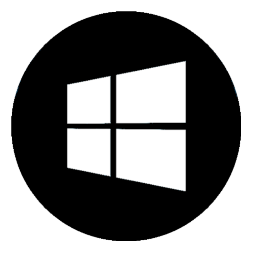

.. _docker:

|macos| |linux| |windows| Docker
--------------------------------

Docker provides an isolated container to run applications.

1. If you do not have Docker installed, follow the Docker
   installation instructions for your system here:
   https://docs.docker.com/install/.

   If you are using **Linux**, we **strongly recommend** you
   also create a Docker group to manage Docker as a non-root
   user. See instructions on the Docker website:
   https://docs.docker.com/install/linux/linux-postinstall/

2. Create a directory or change into a directory that you want
   to use for your project.

.. code-block:: bash

    mkdir my_nest_scripts
    cd my_nest_scripts

Usage

You can use the docker images directly out of docker-registry.ebrains.eu like this:

.. code-block:: bash

    docker pull docker-registry.ebrains.eu/nest/nest-simulator:TAG

``TAG`` can be a version of NEST ``2.20.2`` or later. Alternatively, you can use ``dev`` for the
development branch (master).

NEST 3.2 and later
^^^^^^^^^^^^^^^^^^

As of NEST 3.2, you can use the docker-compose feature.

To use 'docker-compose' you need the definition file from the git repository. Download it:

.. code-block:: bash

    wget https://raw.githubusercontent.com/steffengraber/nest-docker/master/docker-compose.yml

You can then run ``docker-compose up`` with one of the following options:

- NEST server

.. code-block:: bash

      docker-compose up nest-server

or

.. code-block:: bash

      docker run -it --rm -e NEST_CONTAINER_MODE=nest-server -p 52425:52425 /
           docker-registry.ebrains.eu/nest/nest-simulator:<version>

Starts the NEST API server container and opens the corresponding port 52425. Test it with `curl localhost:52425/api`.
See the :ref:`nest_server` documentation for more details.

- NEST desktop

.. code-block:: bash

      docker-compose up nest-desktop

or

.. code-block:: bash

      docker run -it --rm -e NEST_CONTAINER_MODE=nest-server -p 52425:52425 /
          docker-registry.ebrains.eu/nest/nest-simulator:<version>
      docker run -it --rm -e LOCAL_USER_ID=`id -u $USER` -p 8000:8000  /
          -e NEST_CONTAINER_MODE=nest-desktop docker-registry.ebrains.eu/nest/nest-simulator:<version>

Starts the NEST server and the NEST desktop web interface. Port 8000 is also made available.
Open NEST Desktop in the web browser using the following http link: `http://localhost:8000`

Visit the :doc:`NEST Desktop <desktop:index>` documentation to learn more.

- Jupyter notebook with NEST

.. code-block:: bash

      docker-compose up nest-notebook

or

.. code-block:: bash

      docker run -it --rm -e LOCAL_USER_ID=`id -u $USER` -v $(pwd):/opt/data -e NEST_CONTAINER_MODE=notebook /
          -p 8080:8080 docker-registry.ebrains.eu/nest/nest-simulator:<version>

Starts a notebook server with pre-installed NEST. The corresponding URL is displayed in the console. You can copy an
d paste into your browser.

- Jupyter lab with NEST

.. code-block:: bash

      docker-compose up nest-jupyterlab

or

.. code-block:: bash

      docker run -it --rm -e LOCAL_USER_ID=`id -u $USER` -v $(pwd):/opt/data -e NEST_CONTAINER_MODE=jupyterlab /
          -p 8080:8080 docker-registry.ebrains.eu/nest/nest-simulator:<version>)

Starts a Jupyter lab server with pre-installed NEST. The corresponding URL is displayed in the console.
Copy and paste the URL into your browser.

To stop and delete running containers use `docker-compose down`.

To run NEST 2.20.2
^^^^^^^^^^^^^^^^^^

Jupyter notebook with NEST 2.20.2:

.. code-block:: bash

    docker run -it --rm -e LOCAL_USER_ID=`id -u $USER` -v $(pwd):/opt/data -e NEST_CONTAINER_MODE=notebook /
               -p 8080:8080 docker-registry.ebrains.eu/nest/nest-simulator:2.20.2

Jupyter lab with NEST 2.20.2

.. code-block:: bash

    docker run -it --rm -e LOCAL_USER_ID=`id -u $USER` -v $(pwd):/opt/data -e NEST_CONTAINER_MODE=jupyterlab /
               -p 8080:8080 docker-registry.ebrains.eu/nest/nest-simulator:2.20.2

NEST dev
^^^^^^^^

If you want to use the compose configuration for the ``dev`` NEST version, you can use the following file option:

.. code-block:: bash

    wget https://raw.githubusercontent.com/steffengraber/nest-docker/master/docker-compose.yml
    docker-compose -f docker-compose-dev.yml up nest-notebook

On Windows
^^^^^^^^^^

.. note::

    The following commands should work on Windows. Please note that NEST does not officially
    support Windows!

.. code-block:: bash

    docker run -it --rm -v %cd%:/opt/data -p 8080:8080 -e NEST_CONTAINER_MODE=<args> /
        docker-registry.ebrains.eu/nest/nest-simulator:<version>

In Powershell, '%cd%' might not work for the current directory. Then
you should explicitly specify a folder with existing write permissions.

In any case, this will download the docker image with the pre-installed
NEST master from docker-registry.ebrains.eu and start it. After booting an URL is presented.
Click on it or copy it to your browser. Voilá Jupyter notebook starts from
the docker image.

You can update the image with:

.. code-block:: bash

    docker pull docker-registry.ebrains.eu/nest/nest-simulator:<version>

For more information, you can checkout the `nest-docker repository <https://github.com/nest/nest-docker>`_

.. |linux| image:: ../static/img/linux.png
   :scale: 15%

.. |macos| image:: ../static/img/macos.png
   :scale: 15%

