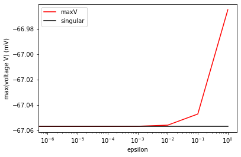

IAF neurons singularity
=======================

This notebook describes how NEST handles the singularities appearing in
the ODE’s of integrate-and-fire model neurons with alpha- or
exponentially-shaped current, when the membrane and the synaptic
time-constants are identical.

.. grid:: 1 1 2 2

   .. grid-item-card:: |nblogo| Jupyter notebook
       :class-title: sd-d-flex-row sd-align-minor-center

       :download:`Download notebook <IAF_neurons_singularity.zip>`

.. |nblogo| image:: ../static/img/nb-logo.svg

.. code:: ipython3

    import sympy as sp
    sp.init_printing(use_latex=True)
    from sympy.matrices import zeros
    tau_m, tau_s, C, h = sp.symbols('tau_m, tau_s, C, h')

For alpha-shaped currents we have:

.. code:: ipython3

    A = sp.Matrix([[-1/tau_s,0,0],[1,-1/tau_s,0],[0,1/C,-1/tau_m]])

Non-singular case (:math:`\tau_m\neq \tau_s`)
---------------------------------------------

The propagator is:

.. code:: ipython3

    PA = sp.simplify(sp.exp(A*h))
    PA

.. math::

    \left[\begin{matrix}e^{- \frac{h}{\tau_{s}}} & 0 & 0\\h e^{- \frac{h}{\tau_{s}}} & e^{- \frac{h}{\tau_{s}}} & 0\\\frac{\tau_{m} \tau_{s} \left(- h \left(\tau_{m} - \tau_{s}\right) e^{\frac{h \left(\tau_{m} + \tau_{s}\right)}{\tau_{m} \tau_{s}}} + \tau_{m} \tau_{s} e^{\frac{2 h}{\tau_{s}}} - \tau_{m} \tau_{s} e^{\frac{h \left(\tau_{m} + \tau_{s}\right)}{\tau_{m} \tau_{s}}}\right) e^{- \frac{h \left(2 \tau_{m} + \tau_{s}\right)}{\tau_{m} \tau_{s}}}}{C \left(\tau_{m} - \tau_{s}\right)^{2}} & \frac{\tau_{m} \tau_{s} \left(- e^{\frac{h}{\tau_{m}}} + e^{\frac{h}{\tau_{s}}}\right) e^{- \frac{h \left(\tau_{m} + \tau_{s}\right)}{\tau_{m} \tau_{s}}}}{C \left(\tau_{m} - \tau_{s}\right)} & e^{- \frac{h}{\tau_{m}}}\end{matrix}\right]

Note that the entry in the third line and the second column
:math:`A_{32}` would also appear in the propagator matrix in case of an
exponentially shaped current

Singular case (:math:`\tau_m = \tau_s`)
---------------------------------------

We have

.. code:: ipython3

    As = sp.Matrix([[-1/tau_m,0,0],[1,-1/tau_m,0],[0,1/C,-1/tau_m]])
    As

.. math::

    \displaystyle \left[\begin{matrix}- \frac{1}{\tau_{m}} & 0 & 0\\1 & - \frac{1}{\tau_{m}} & 0\\0 & \frac{1}{C} & - \frac{1}{\tau_{m}}\end{matrix}\right]

The propagator is

.. code:: ipython3

    PAs = sp.simplify(sp.exp(As*h))
    PAs

.. math::

    \displaystyle \left[\begin{matrix}e^{- \frac{h}{\tau_{m}}} & 0 & 0\\h e^{- \frac{h}{\tau_{m}}} & e^{- \frac{h}{\tau_{m}}} & 0\\\frac{h^{2} e^{- \frac{h}{\tau_{m}}}}{2 C} & \frac{h e^{- \frac{h}{\tau_{m}}}}{C} & e^{- \frac{h}{\tau_{m}}}\end{matrix}\right]

Numeric stability of propagator elements
----------------------------------------

For the lines :math:`\tau_s\rightarrow\tau_m` the entry :math:`PA_{32}`
becomes numerically unstable, since denominator and enumerator go to
zero.

**1.** We show that :math:`PAs_{32}` is the limit of
:math:`PA_{32}(\tau_s)` for :math:`\tau_s\rightarrow\tau_m`.:

.. code:: ipython3

    PA_32 = PA.row(2).col(1)[0]
    sp.limit(PA_32, tau_s, tau_m)

.. math::

    \displaystyle \frac{h e^{- \frac{h}{\tau_{m}}}}{C}

**2.** The Taylor-series up to the second order of the function
:math:`PA_{32}(\tau_s)` is:

.. code:: ipython3

    PA_32_series = PA_32.series(x=tau_s,x0=tau_m,n=2)
    PA_32_series 

.. math::

    \displaystyle \frac{h e^{- \frac{h}{\tau_{m}}}}{C} + \frac{h^{2} \left(- \tau_{m} + \tau_{s}\right) e^{- \frac{h}{\tau_{m}}}}{2 C \tau_{m}^{2}} + O\left(\left(- \tau_{m} + \tau_{s}\right)^{2}; \tau_{s}\rightarrow \tau_{m}\right)

Therefore we have

:math:`T(PA_{32}(\tau_s,\tau_m))=PAs_{32}+PA_{32}^{lin}+O(2)` where
:math:`PA_{32}^{lin}=h^2(-\tau_m + \tau_s)*exp(-h/\tau_m)/(2C\tau_m^2)`

**3.** We define

:math:`dev:=|PA_{32}-PAs_{32}|`

We also define :math:`PA_{32}^{real}` which is the correct value of P32
without misscalculation (instability).

In the following we assume :math:`0<|\tau_s-\tau_m|<0.1`. We consider
two different cases

**a)** When :math:`dev \geq 2|PA_{32}^{lin}|` we do not trust the
numeric evaluation of :math:`PA_{32}`, since it strongly deviates from
the first order correction. In this case the error we make is

:math:`|PAs_{32}-PA_{32}^{real}|\approx |P_{32}^{lin}|`

**b)** When :math:`dev \le |2PA_{32}^{lin}|` we trust the numeric
evaluation of :math:`PA_{32}`. In this case the maximal error occurs
when :math:`dev\approx 2 PA_{32}^{lin}` due to numeric instabilities.
The order of the error is again

:math:`|PAs_{32}-PA_{32}^{real}|\approx |P_{32}^{lin}|`

The entry :math:`A_{31}` is numerically unstable, too and we treat it
analogously.

Tests and examples
------------------

We will now show that the stability criterion explained above leads to a
reasonable behavior for :math:`\tau_s\rightarrow\tau_m`

.. code:: ipython3

    import nest
    import numpy as np
    import pylab as pl

Neuron, simulation and plotting parameters

.. code:: ipython3

    taum = 10.
    C_m = 250.
    # array of distances between tau_m and tau_ex
    epsilon_array = np.hstack(([0.],10.**(np.arange(-6.,1.,1.))))[::-1]
    dt = 0.1
    fig = pl.figure(1)
    NUM_COLORS = len(epsilon_array)
    cmap = pl.get_cmap('gist_ncar')
    maxVs = []

.. parsed-literal::

    <Figure size 432x288 with 0 Axes>

Loop through epsilon array

.. code:: ipython3

    for i,epsilon in enumerate(epsilon_array):
        nest.ResetKernel() # reset simulation kernel 
        nest.resolution = dt
    
        # Current based alpha neuron 
        neuron = nest.Create('iaf_psc_alpha') 
        neuron.set(C_m=C_m, tau_m=taum, t_ref=0., V_reset=-70., V_th=1e32,
                   tau_syn_ex=taum+epsilon, tau_syn_in=taum+epsilon, I_e=0.)
       
        # create a spike generator
        spikegenerator_ex = nest.Create('spike_generator')
        spikegenerator_ex.spike_times = [50.]
        
        # create a voltmeter
        vm = nest.Create('voltmeter', params={'interval':dt})
    
        ## connect spike generator and voltmeter to the neuron
        nest.Connect(spikegenerator_ex, neuron, 'all_to_all', {'weight':100.})
        nest.Connect(vm, neuron)
    
        # run simulation for 200ms
        nest.Simulate(200.) 
    
        # read out recording time and voltage from voltmeter
        times = vm.get('events','times')
        voltage = vm.get('events', 'V_m')
        
        # store maximum value of voltage trace in array
        maxVs.append(np.max(voltage))
    
        # plot voltage trace
        if epsilon == 0.:
            pl.plot(times,voltage,'--',color='black',label='singular')
        else:
            pl.plot(times,voltage,color = cmap(1.*i/NUM_COLORS),label=str(epsilon))
    
    pl.legend()
    pl.xlabel('time t (ms)')
    pl.ylabel('voltage V (mV)')

.. parsed-literal::

    Text(0, 0.5, 'voltage V (mV)')

.. image:: output_22_1.png

Show maximum values of voltage traces

.. code:: ipython3

    fig = pl.figure(2)
    pl.semilogx(epsilon_array,maxVs,color='red',label='maxV')
    #show singular solution as horizontal line
    pl.semilogx(epsilon_array,np.ones(len(epsilon_array))*maxVs[-1],color='black',label='singular')
    pl.xlabel('epsilon')
    pl.ylabel('max(voltage V) (mV)')
    pl.legend()

.. parsed-literal::

    <matplotlib.legend.Legend at 0x7f68764a5750>

.. code:: ipython3

    pl.show()

The maximum of the voltage traces show that the non-singular case nicely
converges to the singular one and no numeric instabilities occur.

--------------

License
~~~~~~~

This file is part of NEST. Copyright (C) 2004 The NEST Initiative

NEST is free software: you can redistribute it and/or modify it under
the terms of the GNU General Public License as published by the Free
Software Foundation, either version 2 of the License, or (at your
option) any later version.

NEST is distributed in the hope that it will be useful, but WITHOUT ANY
WARRANTY; without even the implied warranty of MERCHANTABILITY or
FITNESS FOR A PARTICULAR PURPOSE. See the GNU General Public License for
more details.
