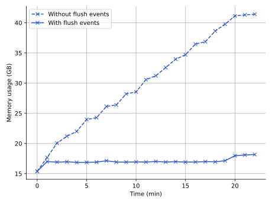

.. _flush_event_mechanism:

Flush event mechanism for triggering synaptic plasticity computations to reduce memory usage
============================================================================================

To compute an e-prop weight update, the gradients at each time step over a given interval are summed. Each gradient is computed by multiplying the instantaneous values of several dynamic variables. In a time-driven implementation, this multiplication occurs instantaneously. In an event-driven implementation, weight updates and gradients are computed only when an incoming spike activates the synapse. This requires storing the histories of the dynamic e-prop variables until a spike activates all incoming synapses that require this history.

Neurons may not emit spikes for extended periods, especially in biologically realistic sparse spiking scenarios. As a result, all outgoing synapses of a silent neuron require the corresponding postsynaptic neurons to store the relevant history until it emits a spike. In the original e-prop with fixed-length update intervals, if no presynaptic spike occurs during an interval, the weight update is zero. Thus, the synapse does not require that portion of the postsynaptic history and it can be discarded. However, if even a single presynaptic spike occurs within an interval, the history of that interval must be retained until the next spike arrives. In the e-prop model with additional biological features, weights are updated at every spike and no update intervals exist, so intermediate parts of the history cannot be discarded. Consequently, in both e-prop models, and especially in the latter, a single neuron can cause history to accumulate across many others, increasing memory usage. The buildup may also slow down operations on the history vector, as the algorithm frequently searches for specific entries. Experiments show continuous buildup that exceeds available memory even on supercomputing systems (see the curve labeled "Without flush events" in the figure).

   **Figure**: Memory usage for the N-MNIST task with 100 training and 10 test samples using e-prop with additional biological features. In contrast to the curve without flush events, which increases up to 41 GB, the curve with flush events remains nearly constant, with a maximum of 18 GB.

Therefore, we introduce a dynamic flushing mechanism which alleviates this memory build-up (see the curve labeled "With flush events" in the figure). Each neuron tracks the time of its last spike. If the time since the last spike exceeds a user-defined threshold, the neuron emits a flush event. In each outgoing synapse, a flush event triggers gradient computation and retrieval of the dynamic variable histories from the corresponding postsynaptic neurons required for the weight update. The new weight is computed but not applied. The retrieved portion of the history can then be deleted. The flush event is not sent to the postsynaptic neuron and does not affect the postsynaptic membrane voltage, unlike a spike event. It does not alter the mathematical formulation of the gradient computation, but only evaluates an intermediate gradient value, and therefore does not interfere with the plasticity algorithm.

The details of the flush event mechanism differ between the two e-prop models, and the computations depend on whether the previous and current events are spikes or flush events. For the original e-prop model, this mechanism is implemented entirely in the e-prop synapse's send function. Different event transitions requires different actions:

- Flush - flush: No action is required.
- Spike - flush: Histories are retrieved from the postsynaptic neuron and the gradient is computed.
- Flush - spike: The weight update is computed and applied, the spike is sent to the postsynaptic neuron, and it is recorded in the update history.
- Spike - spike: The standard mechanism is applied.

For e-prop with additional biological features, the mechanism is implemented primarily in the gradient computation function and the cutoff in the e-prop gradient computation requires tracking the remaining steps until cutoff:

- Spike - spike / flush: The remaining steps until cutoff are initialized to the cutoff value. The gradient is reset to 0 and the spike state buffer is set to 1.
- Spike / flush - spike / flush: The gradient is evaluated (and, if per-step optimization is used, the update weight is calculated) for each time step since the previous event, and the remaining steps until cutoff are decremented accordingly. The computation stops once either all steps up to the current event are processed or the cutoff is reached. If per-step optimization is used, the updated weight is calculated.
- Spike / flush - spike: If there are remaining steps until the current event, the signal is decayed over those steps. If per-step optimization is not used, the weight is computed from the gradient and applied in the send function of the eprop synapse.

The figure shows that the mechanism introduces no significant computational overhead. It enables stable scaling of event-driven algorithms that track histories of dynamic variables, even over long simulation times. This approach is not restricted to e-prop plasticity and can be applied to other models.
