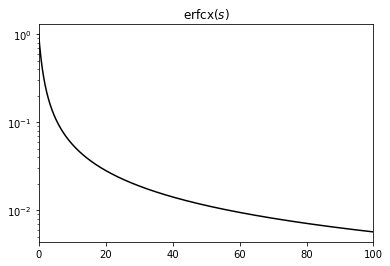
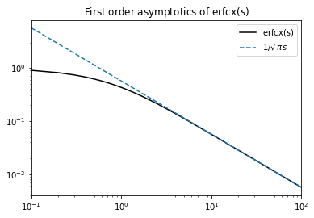
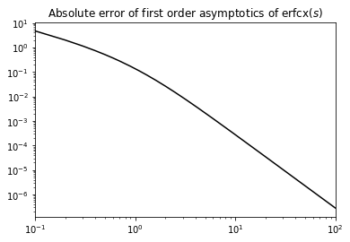

Siegert neuron integration
==========================

Alexander van Meegen, 2020-12-03
^^^^^^^^^^^^^^^^^^^^^^^^^^^^^^^^

This notebook describes how NEST handles the numerical integration of
the ‘Siegert’ function.

.. grid:: 1 1 2 2

   .. grid-item-card:: |nblogo| Jupyter notebook
       :class-title: sd-d-flex-row sd-align-minor-center

       :download:`Download notebook <siegert_neuron_integration.zip>`

.. |nblogo| image:: ../static/img/nb-logo.svg

For an alternative approach, which was implemented in NEST before, see
Appendix A.1 in (`Hahne et al.,
2017 <https://www.frontiersin.org/articles/10.3389/fninf.2017.00034/full#h10>`__).
The current approach seems to be faster and more stable, in particular
in the noise-free limit.

Let’s start with some imports:

.. code:: ipython3

    import numpy as np
    from scipy.special import erf, erfcx
    import matplotlib.pyplot as plt

Introduction
------------

We want to determine the firing rate of an integrate-and-fire neuron
with exponentially decaying post–synaptic currents driven by a mean
input :math:`\mu` and white noise of strength :math:`\sigma`. For small
synaptic time constant :math:`\tau_{\mathrm{s}}` compared to the
membrane time constant :math:`\tau_{\mathrm{m}}`, the firing rate is
given by the ‘Siegert’ (`Fourcaud and Brunel,
2002 <https://doi.org/10.1162/089976602320264015>`__)

.. math::  \phi(\mu,\sigma) =   \left(\tau_{\mathrm{ref}}+\tau_{\mathrm{m}}\sqrt{\pi}I(\tilde{V}_{\mathrm{th}},\tilde{V}_{\mathrm{r}})\right)^{-1} 

with the refractory period :math:`\tau_{\mathrm{ref}}` and the integral

.. math::  I(\tilde{V}_{\mathrm{th}},\tilde{V}_{\mathrm{r}})    =   \int_{\tilde{V}_{\mathrm{r}}}^{\tilde{V}_{\mathrm{th}}}e^{s^{2}}(1+\mathrm{erf}(s))ds 

involving the shifted and scaled threshold voltage
:math:`\tilde{V}_{\mathrm{th}}=\frac{V_{\mathrm{th}}-\mu}{\sigma}+\frac{\alpha}{2}\sqrt{\frac{\tau_{\mathrm{s}}}{\tau_{\mathrm{m}}}}`,
the shifted and scaled reset voltage
:math:`\tilde{V}_{\mathrm{r}}=\frac{V_{\mathrm{r}}-\mu}{\sigma}+\frac{\alpha}{2}\sqrt{\frac{\tau_{\mathrm{s}}}{\tau_{\mathrm{m}}}}`,
and the constant :math:`\alpha=\sqrt{2}\left|\zeta(1/2)\right|` where
:math:`\zeta(x)` denotes the Riemann zeta function.

Numerically, the integral in
:math:`I(\tilde{V}_{\mathrm{th}},\tilde{V}_{\mathrm{r}})` is problematic
due to the interplay of :math:`e^{s^{2}}` and :math:`\mathrm{erf}(s)` in
the integrand. Already for moderate values of :math:`s`, it causes
numerical problems (note the order of magnitude):

.. code:: ipython3

    s = np.linspace(-10, 10, 1001)
    plt.plot(s, np.exp(s**2) * (1 + erf(s)), c='black')
    plt.xlim(s[0], s[-1])
    plt.yscale('log')
    plt.title(r'$e^{s^{2}}(1+\mathrm{erf}(s))$')
    plt.show()

.. image:: siegert-output_3_0.png

The main trick here is to use the `scaled complementary error
function <https://en.wikipedia.org/wiki/Error_function#Complementary_error_function>`__

.. math:: \mathrm{erf}(s)=1-e^{-s^{2}}\mathrm{erfcx}(s)

to extract the leading exponential contribution. For positive :math:`s`,
we have :math:`0\le\mathrm{erfcx}(s)\le1`, i.e. the exponential
contribution is in the prefactor :math:`e^{-s^{2}}` which nicely cancels
with the :math:`e^{s^{2}}` in the integrand. In the following, we
separate three cases according to the sign of
:math:`\tilde{V}_{\mathrm{th}}` and :math:`\tilde{V}_{\mathrm{r}}`
because for a negative arguments, the integrand simplifies to
:math:`e^{s^{2}}(1+\mathrm{erf}(-s))=\mathrm{erfcx}(s)`. Eventually,
only integrals of :math:`\mathrm{erfcx}(s)` for positive :math:`s\ge0`
need to be solved numerically which are certainly better behaved:

.. code:: ipython3

    s = np.linspace(0, 100, 1001)
    plt.plot(s, erfcx(s), c='black')
    plt.xlim(s[0], s[-1])
    plt.yscale('log')
    plt.title(r'$\mathrm{erfcx}(s)$')
    plt.show()

Mathematical Reformulation
--------------------------

Strong Inhibition
~~~~~~~~~~~~~~~~~

We have to consider three different cases; let us start with strong
inhibitory input such that
:math:`0<\tilde{V}_{\mathrm{r}}<\tilde{V}_{\mathrm{th}}` or equivalently
:math:`\mu<V_{\mathrm{r}}+\frac{\alpha}{2}\sigma\sqrt{\frac{\tau_{\mathrm{s}}}{\tau_{\mathrm{m}}}}`.
In this regime, the error function in the integrand is positive.
Expressing it in terms of :math:`\mathrm{erfcx}(s)`, we get

.. math:: I(\tilde{V}_{\mathrm{th}},\tilde{V}_{\mathrm{r}})=2\int_{\tilde{V}_{\mathrm{r}}}^{\tilde{V}_{\mathrm{th}}}e^{s^{2}}ds-\int_{\tilde{V}_{\mathrm{r}}}^{\tilde{V}_{\mathrm{th}}}\mathrm{erfcx}(s)ds. 

The first integral can be solved in terms of the Dawson function
:math:`D(s)`, which is bound between :math:`\pm1` and conveniently
implemented in GSL; the second integral gives a small correction which
has to be evaluated numerically. We get

.. math:: I(\tilde{V}_{\mathrm{th}},\tilde{V}_{\mathrm{r}})=2e^{\tilde{V}_{\mathrm{th}}^{2}}D(\tilde{V}_{\mathrm{th}})-2e^{\tilde{V}_{\mathrm{r}}^{2}}D(\tilde{V}_{\mathrm{r}})-\int_{\tilde{V}_{\mathrm{r}}}^{\tilde{V}_{\mathrm{th}}}\mathrm{erfcx}(s)ds.

We extract the leading contribution
:math:`e^{\tilde{V}_{\mathrm{th}}^{2}}` from the denominator and arrive
at

.. math:: \phi(\mu,\sigma)=\frac{e^{-\tilde{V}_{\mathrm{th}}^{2}}}{e^{-\tilde{V}_{\mathrm{th}}^{2}}\tau_{\mathrm{ref}}+\tau_{\mathrm{m}}\sqrt{\pi}\left(2D(\tilde{V}_{\mathrm{th}})-2e^{-\tilde{V}_{\mathrm{th}}^{2}+\tilde{V}_{\mathrm{r}}^{2}}D(\tilde{V}_{\mathrm{r}})-e^{-\tilde{V}_{\mathrm{th}}^{2}}\int_{\tilde{V}_{\mathrm{r}}}^{\tilde{V}_{\mathrm{th}}}\mathrm{erfcx}(s)ds\right)}

as a numerically safe expression for
:math:`0<\tilde{V}_{\mathrm{r}}<\tilde{V}_{\mathrm{th}}`. Extracting
:math:`e^{\tilde{V}_{\mathrm{th}}^{2}}` from the denominator reduces the
latter to :math:`2\tau_{\mathrm{m}}\sqrt{\pi}D(\tilde{V}_{\mathrm{th}})`
and exponentially small correction terms because
:math:`\tilde{V}_{\mathrm{r}}<\tilde{V}_{\mathrm{th}}`, thereby
preventing overflow.

Strong Excitation
~~~~~~~~~~~~~~~~~

Now let us consider the case of strong excitatory input such that
:math:`\tilde{V}_{\mathrm{r}}<\tilde{V}_{\mathrm{th}}<0` or
:math:`\mu>V_{\mathrm{th}}+\frac{\alpha}{2}\sigma\sqrt{\frac{\tau_{\mathrm{s}}}{\tau_{\mathrm{m}}}}`.
In this regime, we can change variables :math:`s\to-s` to make the
domain of integration positive again. Using
:math:`\mathrm{erf}(-s)=-\mathrm{erf}(s)` as well as
:math:`\mathrm{erfcx}(s)`, we get

.. math:: I(\tilde{V}_{\mathrm{th}},\tilde{V}_{\mathrm{r}})=\int_{|\tilde{V}_{\mathrm{th}}|}^{|\tilde{V}_{\mathrm{r}}|}\mathrm{erfcx}(s)ds.

In particular, there is no exponential contribution involved in this
regime. Thus, we get

.. math:: \phi(\mu,\sigma)=\frac{1}{\tau_{\mathrm{ref}}+\tau_{\mathrm{m}}\sqrt{\pi}\int_{|\tilde{V}_{\mathrm{th}}|}^{|\tilde{V}_{\mathrm{r}}|}\mathrm{erfcx}(s)ds}

as a numerically safe expression for
:math:`\tilde{V}_{\mathrm{r}}<\tilde{V}_{\mathrm{th}}<0`.

Intermediate Regime
~~~~~~~~~~~~~~~~~~~

In the intermediate regime, we have
:math:`\tilde{V}_{\mathrm{r}}\le0\le\tilde{V}_{\mathrm{th}}` or
:math:`V_{\mathrm{r}}+\frac{\alpha}{2}\sigma\sqrt{\frac{\tau_{\mathrm{s}}}{\tau_{\mathrm{m}}}}\le\mu\le V_{\mathrm{th}}+\frac{\alpha}{2}\sigma\sqrt{\frac{\tau_{\mathrm{s}}}{\tau_{\mathrm{m}}}}`.
Thus, we split the integral at zero and use the previous steps for the
respective parts to get

.. math:: I(\tilde{V}_{\mathrm{th}},\tilde{V}_{\mathrm{r}})=2e^{\tilde{V}_{\mathrm{th}}^{2}}D(\tilde{V}_{\mathrm{th}})+\int_{\tilde{V}_{\mathrm{th}}}^{|\tilde{V}_{\mathrm{r}}|}\mathrm{erfcx}(s)ds.

Note that the sign of the second integral depends on whether
:math:`\left|\tilde{V}_{\mathrm{r}}\right|>\tilde{V}_{\mathrm{th}}` (+)
or not (-). Again, we extract the leading contribution
:math:`e^{\tilde{V}_{\mathrm{th}}^{2}}` from the denominator and arrive
at

.. math:: \phi(\mu,\sigma)  =   \frac{e^{-\tilde{V}_{\mathrm{th}}^{2}}}{e^{-\tilde{V}_{\mathrm{th}}^{2}}\tau_{\mathrm{ref}}+\tau_{\mathrm{m}}\sqrt{\pi}\left(2D(\tilde{V}_{\mathrm{th}})+e^{-\tilde{V}_{\mathrm{th}}^{2}}\int_{\tilde{V}_{\mathrm{th}}}^{|\tilde{V}_{\mathrm{r}}|}\mathrm{erfcx}(s)ds\right)}

as a numerically safe expressions for
:math:`\tilde{V}_{\mathrm{r}}\le0\le\tilde{V}_{\mathrm{th}}`.

Noise-free Limit
----------------

Even the noise-free limit :math:`\sigma\ll\mu`, where the implementation
from (`Hahne et al.,
2017 <https://www.frontiersin.org/articles/10.3389/fninf.2017.00034/full#h10>`__)
eventually breaks, works flawlessly. In this limit,
:math:`\left|\tilde{V}_{\mathrm{th}}\right|\gg1` as long as
:math:`\mu\neq V_{\mathrm{th}}`; thus, we get both in the ‘strong
inhibition’ and in the ‘itermediate’ regime
:math:`\phi(\mu,\sigma)\sim e^{-\tilde{V}_{\mathrm{th}}^{2}}\approx0`
for :math:`\tilde{V}_{\mathrm{th}}\ge0`. Accordingly, the only
interesting case is the ‘strong excitation’ regime
:math:`\tilde{V}_{\mathrm{r}}<\tilde{V}_{\mathrm{th}}<0`. Since also
:math:`\left|\tilde{V}_{\mathrm{r}}\right|\gg1`, the integrand
:math:`\mathrm{erfcx}(s)` is only evaluated at :math:`s\gg1`. Using the
only the first term of the `asymptotic
expansion <https://en.wikipedia.org/wiki/Error_function#Asymptotic_expansion>`__

.. math:: \mathrm{erfcx}(s)=\frac{1}{s\sqrt{\pi}}\sum_{n=0}^{\infty}(-1)^{n}\frac{(2n-1)!!}{(2s^{2})^{n}}

leads to the analytically solvable integral

.. math:: I(\tilde{V}_{\mathrm{th}},\tilde{V}_{\mathrm{r}})=\int_{|\tilde{V}_{\mathrm{th}}|}^{|\tilde{V}_{\mathrm{r}}|}\mathrm{erfcx}(s)ds\approx\frac{1}{\sqrt{\pi}}\int_{|\tilde{V}_{\mathrm{th}}|}^{|\tilde{V}_{\mathrm{r}}|}\frac{1}{s}ds=\frac{1}{\sqrt{\pi}}\log\frac{\left|\tilde{V}_{\mathrm{r}}\right|}{\left|\tilde{V}_{\mathrm{th}}\right|}.

Inserting this into :math:`\phi(\mu,\sigma)` and using
:math:`\tilde{V}_{\mathrm{th}}\approx\frac{V_{\mathrm{th}}-\mu}{\sigma}, \tilde{V}_{\mathrm{r}}\approx\frac{V_{\mathrm{r}}-\mu}{\sigma}`
yields

.. math::

   \phi(\mu,\sigma)\approx\begin{cases}
   0 & \mu\le V_{\mathrm{th}}\\
   \frac{1}{\tau_{\mathrm{ref}}+\tau_{\mathrm{m}}\log\frac{\mu-V_{\mathrm{r}}}{\mu-V_{\mathrm{th}}}} & \mu>V_{\mathrm{th}}\end{cases}

`as it should <https://neuronaldynamics.epfl.ch/online/Ch8.S3.html>`__.
Thus, as long as the numerical solution of the integral
:math:`\frac{1}{\sqrt{\pi}}\int_{|\tilde{V}_{\mathrm{th}}|}^{|\tilde{V}_{\mathrm{r}}|}\frac{1}{s}ds`
is precise, the deterministic limit is also numerically safe.

Relevance of Noise-free Limit
~~~~~~~~~~~~~~~~~~~~~~~~~~~~~

Let us briefly estimate for which values the noise-free limit becomes
relevant. We have
:math:`\left|\tilde{V}_{\mathrm{r}}\right|>\left|\tilde{V}_{\mathrm{th}}\right|\gg1`,
thus the integrand :math:`\mathrm{erfcx}(s)` is only evaluated for
arguments :math:`s>\left|\tilde{V}_{\mathrm{th}}\right|\gg1`. Looking at
the difference between :math:`\mathrm{erfcx}(s)` and the first order
asymptotics shown below, we see that the absolute difference to the
asymptotics is only :math:`O(10^{-7})` for moderate values
:math:`\left|\tilde{V}_{\mathrm{th}}\right|\approx O(100)`. Since we saw
above that the noise free limit is equivalent to the first order
asymptotics, we can conclude that it is certainly relevant for
:math:`\left|\tilde{V}_{\mathrm{th}}\right|\approx\frac{\mu-V_{\mathrm{th}}}{\sigma}\approx O(100)`;
e.g. for :math:`\mu-V_{\mathrm{th}}\approx10`\ mV a noise strength of
:math:`\sigma\approx0.1`\ mV corresponds to the noise-free limit.

.. code:: ipython3

    s = np.linspace(0.1, 100, 1000)
    plt.plot(s, erfcx(s), c='black', label=r'$\mathrm{erfcx}(s)$')
    plt.plot(s, 1/(np.sqrt(np.pi)*s), ls='--', label=r'$1/\sqrt{\pi}s$')
    plt.xlim(s[0], s[-1])
    plt.xscale('log')
    plt.yscale('log')
    plt.legend()
    plt.title(r'First order asymptotics of $\mathrm{erfcx}(s)$')
    plt.show()

.. code:: ipython3

    s = np.linspace(0.1, 100, 1000)
    plt.plot(s, 1/(np.sqrt(np.pi)*s)-erfcx(s), c='black')
    plt.xlim(s[0], s[-1])
    plt.xscale('log')
    plt.yscale('log')
    plt.title(r'Absolute error of first order asymptotics of $\mathrm{erfcx}(s)$')
    plt.show()

--------------

License
~~~~~~~

This file is part of NEST. Copyright (C) 2004 The NEST Initiative

NEST is free software: you can redistribute it and/or modify it under
the terms of the GNU General Public License as published by the Free
Software Foundation, either version 2 of the License, or (at your
option) any later version.

NEST is distributed in the hope that it will be useful, but WITHOUT ANY
WARRANTY; without even the implied warranty of MERCHANTABILITY or
FITNESS FOR A PARTICULAR PURPOSE. See the GNU General Public License for
more details.
