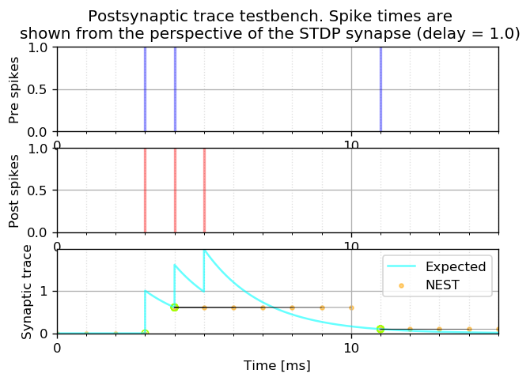
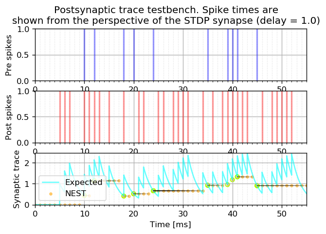
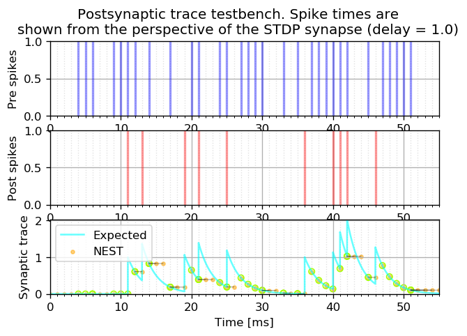
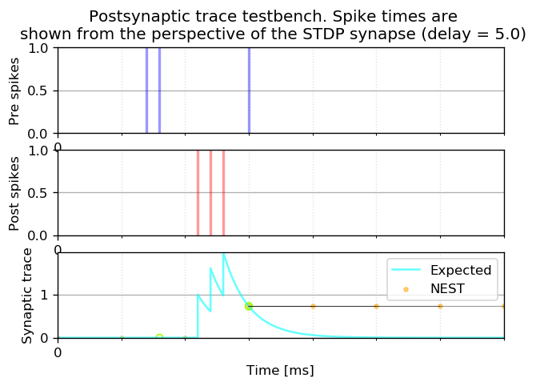
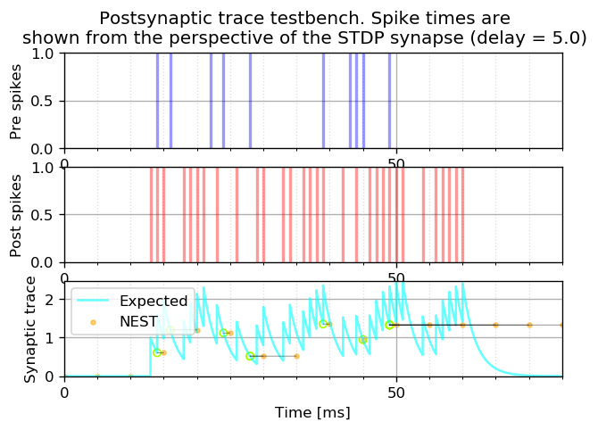
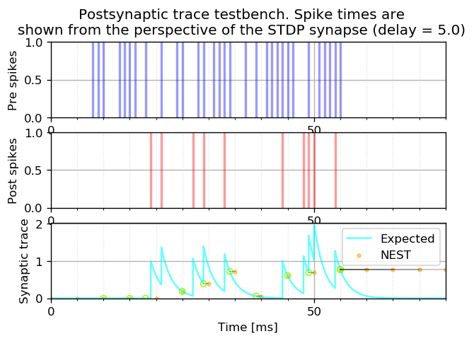

Test postsynaptic trace
=======================

Pre- and postsynaptic traces are used to calculate STDP weight updates,
but are computed differently: postsynaptic traces are stored and
maintained in the NEST C++ ``ArchivingNode`` class. Following
`nest-simulator#1034 <https://github.com/nest/nest-simulator/issues/1034>`__,
this notebook (and corresponding test script in
``testsuite/regressiontests/issue-1034.py``) was created to specifically
test the postsynaptic trace value, by comparing the NEST-obtained
samples to a Python-generated reference timeseries.

.. grid:: 1 1 2 2

   .. grid-item-card:: |nblogo| Jupyter notebook
       :class-title: sd-d-flex-row sd-align-minor-center

       :download:`Download notebook <test_post_trace.zip>`

Construct a network of the form: - pre_spike_gen connects via
static_synapse to pre_parrot - pre_parrot connects via stdp_synapse to
post_parrot - post_spike_gen connects via static_synapse to post_parrot

The spike times of the spike generators are defined in
``pre_spike_times`` and ``post_spike_times``. From the perspective of
the STDP synapse, spikes arrive with the following delays (with respect
to the values in these lists):

-  for the presynaptic neuron: one synaptic delay in the static synapse
-  for the postsynaptic neuron: one synaptic delay in the static synapse
-  for the synapse itself: one dendritic delay between the post_parrot
   node and the synapse itself (see the C++ variable
   ``dendritic_delay``).

.. code:: ipython3

    import matplotlib.pyplot as plt
    import matplotlib.ticker as plticker
    import nest
    import numpy as np
    import os
    import scipy as sp
    import scipy.stats
    import unittest

NEST simulation
---------------

Construct and run the NEST network.

.. code:: ipython3

    def run_post_trace_test_nest_(pre_spike_times, post_spike_times,
                                  resolution, delay, sim_time, tau_minus,
                                  show_all_nest_trace_samples=False,
                                  debug=False):
    
        if debug:
            print("Pre spike times: ["
                  + ", ".join([str(t) for t in pre_spike_times]) + "]")
            print("Post spike times: ["
                  + ", ".join([str(t) for t in post_spike_times]) + "]")
    
        nest.set_verbosity("M_WARNING")
    
        nest.ResetKernel()
        nest.resolution = resolution
    
        wr = nest.Create("weight_recorder")
        nest.CopyModel("stdp_synapse", "stdp_synapse_rec",
                       {"weight_recorder": wr, "weight": 1.})
    
        # create spike_generators with these times
        pre_sg_ps = nest.Create("spike_generator",
                                params={"spike_times": pre_spike_times,
                                        "precise_times": True})
        post_sg_ps = nest.Create("spike_generator",
                                 params={"spike_times": post_spike_times,
                                         "precise_times": True})
    
        # create parrot neurons and connect spike_generators
        pre_parrot_ps = nest.Create("parrot_neuron_ps")
        post_parrot_ps = nest.Create("parrot_neuron_ps",
                                     params={"tau_minus": tau_minus})
    
        nest.Connect(pre_sg_ps, pre_parrot_ps, syn_spec={"delay": delay})
        nest.Connect(post_sg_ps, post_parrot_ps,syn_spec={"delay": delay})
    
        # create spike recorder --- debugging only
        spikes = nest.Create("spike_recorder")
        nest.Connect(pre_parrot_ps + post_parrot_ps, spikes)
    
        # connect both parrot neurons with a stdp synapse onto port 1
        # so spikes transmitted through the stdp connection are
        # not repeated postsynaptically.
        nest.Connect(
            pre_parrot_ps, post_parrot_ps,
            syn_spec={'synapse_model': 'stdp_synapse_rec',
                      'receptor_type': 1,
                      'delay': delay})
    
        if debug:
            print("[py] Total simulation time: " + str(sim_time) + " ms")
    
        n_steps = int(np.ceil(sim_time / delay))
        trace_nest = []
        trace_nest_t = []
    
        t = nest.biological_time
        trace_nest_t.append(t)
    
        post_tr = post_parrot_ps.post_trace
        trace_nest.append(post_tr)
    
        for step in range(n_steps):
            if debug:
                print("\n[py] simulating for " + str(delay) + " ms")
            nest.Simulate(delay)
            t = nest.biological_time
            nearby_pre_spike = np.any(
                np.abs(t - np.array(pre_spike_times) - delay) < resolution/2.)
            if show_all_nest_trace_samples or nearby_pre_spike:
                trace_nest_t.append(t)
                post_tr = post_parrot_ps.post_trace
                trace_nest.append(post_tr)
                if debug:
                    print("[py] Received NEST trace: " +
                          str(post_tr) + " at time t = " + str(t))
    
        return trace_nest_t, trace_nest

Python simulation
-----------------

Generate the Python reference timeseries.

.. code:: ipython3

    def run_post_trace_test_python_reference_(pre_spike_times,
                                              post_spike_times, resolution,
                                              delay, dendritic_delay, sim_time,
                                              tau_minus, debug=False):
        """
        compute Python known-good reference of postsynaptic trace
        """
    
        n_timepoints = 1000 * int(np.ceil(sim_time))
        trace_python_ref = np.zeros(n_timepoints)
    
        n_spikes = len(post_spike_times)
        for sp_idx in range(n_spikes):
            t_sp = post_spike_times[sp_idx] + delay + dendritic_delay
            for i in range(n_timepoints):
                t = (i / float(n_timepoints - 1)) * sim_time
                if t > t_sp:
                    trace_python_ref[i] += np.exp(-(t - t_sp) / tau_minus)
    
        n_spikes = len(pre_spike_times)
        for sp_idx in range(n_spikes):
            t_sp = pre_spike_times[sp_idx] + delay
            i = int(np.round(t_sp / sim_time
                             * float(len(trace_python_ref) - 1)))
            if debug:
                print("* At t_sp = " + str(t_sp)
                  + ", post_trace should be " + str(trace_python_ref[i]))
    
        return trace_python_ref

Run the test
------------

First, define some pre/post spike patterns.

.. code:: ipython3

    # spike test pattern 1: minimal reproducing example of the original bug
    pre_spike_times1 = np.array([2., 3., 10.])
    post_spike_times1 = np.array([1., 2., 3.])
    
    # spike test pattern 2: generate some random integer spike times
    t_sp_min = 1.
    t_sp_max = 50
    n_spikes = 10
    pre_spike_times2 = np.sort(
        np.unique(
            np.ceil(
                sp.stats.uniform.rvs(
                    t_sp_min, t_sp_max - t_sp_min, n_spikes))))
    n_spikes = 50
    post_spike_times2 = np.sort(
        np.unique(
            np.ceil(
                sp.stats.uniform.rvs(
                    t_sp_min, t_sp_max - t_sp_min, n_spikes))))
    tau_minus = 2.  # [ms]
    
    # for each parameter set, run the test
    # spike test pattern 3 is a pre/post-reversed version of test pattern 2
    pre_spike_times = [pre_spike_times1,
                       pre_spike_times2,
                       post_spike_times2]
    post_spike_times = [post_spike_times1,
                        post_spike_times2,
                        pre_spike_times2]

Define a function that will validate equality between the
Python-generated and the NEST-generated timeseries.

.. code:: ipython3

    trace_match_atol = 1E-3
    trace_match_rtol = 1E-3
    
    def nest_trace_matches_ref_trace(trace_nest_t, trace_nest,
                                     trace_python_ref, pre_spike_times,
                                     post_spike_times, resolution, delay,
                                     dendritic_delay, trace_match_atol,
                                     trace_match_rtol, sim_time,
                                     debug=False):
        """
        Trace values are returned from NEST at regular intervals, but only
        updated at presynaptic spike times.
    
        To match the NEST samples with the continuous reference trace, step
        backwards in time from the sampled value, to find the last time at
        which the trace value was updated, namely the time of occurrence of
        the last presynaptic spike.
        """
    
        n_timepoints = len(trace_nest_t)
        for i in range(n_timepoints)[1:]:
            t = trace_nest_t[i]
            if debug:
                print("* Finding ref for NEST timepoint t = " + str(t)
                      + ", NEST trace = " + str(trace_nest[i]))
    
            traces_match = False
            for i_search, t_search in enumerate(
                    reversed(np.array(pre_spike_times) + delay)):
                if t_search <= t:
                    _trace_at_t_search = trace_python_ref[int(np.round(
                        t_search / sim_time
                        * float(len(trace_python_ref) - 1)))]
                    traces_match = np.allclose(
                        _trace_at_t_search,
                        trace_nest[i],
                        atol=trace_match_atol,
                        rtol=trace_match_rtol)
                    post_spike_occurred_at_t_search = np.any(
                        (t_search - (np.array(post_spike_times)
                                     + delay
                                     + dendritic_delay))**2
                        < resolution/2.)
    
                    if debug:
                        print("\t* Testing " + str(t_search) + "...")
                        print("\t   traces_match = " + str(traces_match))
                        print("\t   post_spike_occurred_at_t_search = "
                              + str(post_spike_occurred_at_t_search))
    
                    if (not traces_match) and post_spike_occurred_at_t_search:
                        traces_match = np.allclose(
                            _trace_at_t_search + 1,
                            trace_nest[i],
                            atol=trace_match_atol,
                            rtol=trace_match_rtol)
                        if debug:
                            print("\t   traces_match = " + str(traces_match)
                                  + " (nest trace = " + str(trace_nest[i])
                                  + ", ref trace = "
                                  + str(_trace_at_t_search + 1)
                                  + ")")
                        if traces_match:
                            _trace_at_t_search += 1.
    
                    if (not traces_match) and post_spike_occurred_at_t_search:
                        traces_match = np.allclose(
                            _trace_at_t_search - 1,
                            trace_nest[i],
                            atol=trace_match_atol,
                            rtol=trace_match_rtol)
                        if debug:
                            print("\t   traces_match = " + str(traces_match)
                                  + " (nest trace = " + str(trace_nest[i])
                                  + ", ref trace = "
                                  + str(_trace_at_t_search - 1)
                                  + ")")
                        if traces_match:
                            _trace_at_t_search -= 1.
    
                    break
    
            if (not traces_match) and i_search == len(pre_spike_times) - 1:
                if debug:
                    print("\tthe time before the first pre spike")
                # the time before the first pre spike
                traces_match = trace_nest[i] == 0.
    
            if not traces_match:
                return False
    
        return True

Plotting function:

.. code:: ipython3

    def plot_run(trace_nest_t, trace_nest, trace_python_ref,
                 pre_spike_times, post_spike_times, resolution, delay,
                 dendritic_delay, trace_match_atol, trace_match_rtol,
                 sim_time, title_snip="", debug=False):
    
        fig, ax = plt.subplots(nrows=3, dpi=120)
        ax1, ax2, ax3 = ax
    
        #
        #   pre spikes
        #
    
        ax1.set_ylim([0., 1.])
        ax1.set_ylabel("Pre spikes")
        n_spikes = len(pre_spike_times)
        for i in range(n_spikes):
            ax1.plot(2 * [pre_spike_times[i] + delay],
                     ax1.get_ylim(),
                     linewidth=2, color="blue", alpha=.4)
    
        #
        #   post spikes
        #
    
        ax2.set_ylim([0., 1.])
        ax2.set_ylabel("Post spikes")
        n_spikes = len(post_spike_times)
        for i in range(n_spikes):
            ax2.plot(2 * [post_spike_times[i] + delay + dendritic_delay],
                     [0, 1],
                     linewidth=2, color="red", alpha=.4)
    
        #
        #   traces
        #
    
        ax3.set_ylabel("Synaptic trace")
        ax3.set_ylim([0., np.amax(trace_python_ref)])
        ax3.plot(np.linspace(0., sim_time, len(trace_python_ref)),
                 trace_python_ref,
                 label="Expected", color="cyan", alpha=.6)
        ax3.scatter(trace_nest_t, trace_nest,
                    marker=".", alpha=.5, color="orange", label="NEST")
        ax3.legend()
    
        #
        #   Trace values are returned from NEST at regular intervals, but only
        #   updated at presynaptic spike times.
        #
        #   Step backwards in time from the sampled value, to find the last
        #   time at which the trace value was updated, namely the time of
        #   occurrence of the last presynaptic spike.
        #
    
        pre_spike_times = np.array(pre_spike_times)
        n_timepoints = len(trace_nest_t)
        for i in range(n_timepoints):
            t = trace_nest_t[i]
            if debug:
                print("* Finding ref for NEST timepoint t = "
                      + str(t) + ", trace = " + str(trace_nest[i]))
            for t_search in reversed(pre_spike_times + delay):
                if t_search <= t:
                    if debug:
                        print("\t* Testing " + str(t_search) + "...")
                    _idx = int(np.round(t_search / sim_time
                               * float(len(trace_python_ref) - 1)))
                    _trace_at_t_search = trace_python_ref[_idx]
                    traces_match = np.allclose(_trace_at_t_search,
                                               trace_nest[i],
                                               atol=trace_match_atol,
                                               rtol=trace_match_rtol)
                    if debug:
                        print("\t   traces_match = " + str(traces_match))
                    if not traces_match:
                        post_spike_occurred_at_t_search = np.any(
                            (t_search - (np.array(post_spike_times)
                             + delay + dendritic_delay))**2 < resolution/2.)
                        if debug:
                            print("\t   post_spike_occurred_at_t_search = "
                                  + str(post_spike_occurred_at_t_search))
                        if post_spike_occurred_at_t_search:
                            traces_match = np.allclose(
                                _trace_at_t_search + 1,
                                trace_nest[i],
                                atol=trace_match_atol,
                                rtol=trace_match_rtol)
                            if debug:
                                print("\t   traces_match = " + str(traces_match)
                                      + " (nest trace = " + str(trace_nest[i])
                                      + ", ref trace = "
                                      + str(_trace_at_t_search+1) + ")")
                            
                            if traces_match:
                                _trace_at_t_search += 1.
    
                            if not traces_match:
                                traces_match = np.allclose(
                                    _trace_at_t_search - 1,
                                    trace_nest[i],
                                    atol=trace_match_atol,
                                    rtol=trace_match_rtol)
                                
                                if debug:
                                    print("\t   traces_match = "
                                          + str(traces_match)
                                          + " (nest trace = "
                                          + str(trace_nest[i])
                                          + ", ref trace = "
                                          + str(_trace_at_t_search-1) + ")")
                                
                                if traces_match:
                                    _trace_at_t_search -= 1.
    
                    ax3.scatter(t_search, _trace_at_t_search, 100, marker=".",
                                color="#A7FF00FF", facecolor="none")
                    ax3.plot([trace_nest_t[i], t_search],
                             [trace_nest[i], _trace_at_t_search],
                             linewidth=.5, color="#0000007F")
                    break
    
        for _ax in ax:
            _ax.xaxis.set_major_locator(
                plticker.MultipleLocator(base=10*delay))
            _ax.xaxis.set_minor_locator(
                plticker.MultipleLocator(base=delay))
            _ax.grid(which="major", axis="both")
            _ax.grid(which="minor", axis="x", linestyle=":", alpha=.4)
            _ax.set_xlim(0., sim_time)
    
        ax3.set_xlabel("Time [ms]")
        fig.suptitle("""Postsynaptic trace testbench. Spike times are\n"""
                     """shown from the perspective of the STDP synapse """ + title_snip)

Now, run the test and make the plots while we go.

The plots should be interpreted as follows. Pre- and postsynaptic spikes
are shown in the top two subplots, at the time at which they arrive at
the synapse (i.e. from the perspective of the synapse, taking dendritic
and axonal delays into account).

The bottom subplot shows the reference/known-good timeseries generated
(numerically) in Python (**cyan colour**). The values returned from NEST
are shown using **orange circles**. They are plotted as points rather
than as a continuous line, because we can only retrieve the value at the
resolution of the minimum synaptic delay (i.e. fetch trace value;
simulate for a timestep ``delay``; repeat). Moreover, the postsynaptic
trace value is only updated in NEST during the processing of a
presynaptic spike, so unless a presynaptic spike was processed in the
last delay interval, the value will remain unchanged. To allow
comparison between the Python- and NEST-generated values, we thus search
for the previous time at which NEST would have updated the trace value,
which is the time of arrival of the last presynaptic spike. This value
is marked by an **open green circle**. If all is well, all green circles
should always overlap an orange circle, and all **black lines** (which
simply connect subsequent postsynaptic trace values returned by NEST)
should be perfectly horizontal.

.. code:: ipython3

    resolution = .1     # [ms]
    delays = np.array([1., 5.])  # [ms]
    
    # settings for plotting debug information
    show_all_nest_trace_samples = True
    
    for delay in delays:
        dendritic_delay = delay
        for spike_times_idx in range(len(pre_spike_times)):
            max_t_sp = max(np.amax(pre_spike_times[spike_times_idx]),
                           np.amax(post_spike_times[spike_times_idx]))
            sim_time = max_t_sp + 5 * delay
            trace_nest_t, trace_nest = run_post_trace_test_nest_(
                pre_spike_times[spike_times_idx],
                post_spike_times[spike_times_idx],
                resolution, delay, sim_time, tau_minus,
                show_all_nest_trace_samples)
            trace_python_ref = run_post_trace_test_python_reference_(
                pre_spike_times[spike_times_idx],
                post_spike_times[spike_times_idx],
                resolution, delay, dendritic_delay, sim_time, tau_minus)
    
            title_snip = "(delay = " \
                    + str(delay) \
                    + ")"
            plot_run(
                trace_nest_t, trace_nest, trace_python_ref,
                pre_spike_times[spike_times_idx],
                post_spike_times[spike_times_idx], resolution, delay,
                dendritic_delay, trace_match_atol, trace_match_rtol,
                sim_time, title_snip)
            assert nest_trace_matches_ref_trace(
                trace_nest_t,
                trace_nest,
                trace_python_ref,
                pre_spike_times[spike_times_idx],
                post_spike_times[spike_times_idx],
                resolution, delay, dendritic_delay,
                trace_match_atol,
                trace_match_rtol,
                sim_time,
                debug=False)

--------------

License
~~~~~~~

This file is part of NEST. Copyright (C) 2004 The NEST Initiative

NEST is free software: you can redistribute it and/or modify it under
the terms of the GNU General Public License as published by the Free
Software Foundation, either version 2 of the License, or (at your
option) any later version.

NEST is distributed in the hope that it will be useful, but WITHOUT ANY
WARRANTY; without even the implied warranty of MERCHANTABILITY or
FITNESS FOR A PARTICULAR PURPOSE. See the GNU General Public License for
more details.
