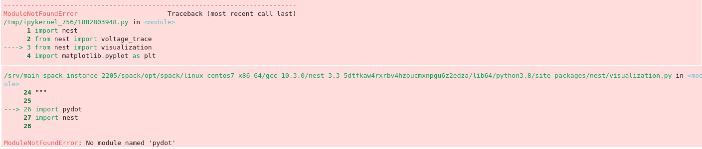
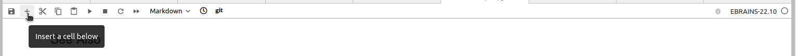
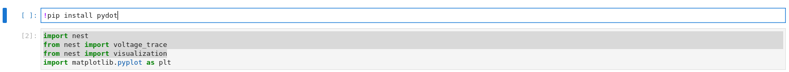

.. _run_jupyter:

How to run Jupyter notebooks
============================

Using EBRAINS JupyterHub
------------------------

Prerequisites

  * an EBRAINS account 

    If you do not have an account yet, you can sign up here: https://ebrains.eu/register.

1. Click on the Try it on EBRAINS button in the desired :ref:`example notebook <pynest_examples>`.

  .. image:: https://nest-simulator.org/TryItOnEBRAINS.png

  You will be redirected to https://lab.ebrains.eu

2. If not signed into EBRAINS already, you will be asked to sign in.

  .. image:: ../static/img/signin-ebrains.png

3. Choose a lab execution site:

  .. image:: ../static/img/lab-execution-site-de.png

4. JupyterHub will then try to clone the NEST repository and open the selected notebook.
   The other notebooks will be available in Jupyter lab in the left column, as well.

Now you can run the notebook and change variables to test how it works!

  .. image:: ../static/img/running-jupyterlab.png

----

Troubleshooting
---------------

Error: Command returned non zero-status 128 
~~~~~~~~~~~~~~~~~~~~~~~~~~~~~~~~~~~~~~~~~~~~

JupyterHub fails to clone the repository.

  .. image:: ../static/img/error-jupyter-ebrains.png

* Select the ``Control Panel`` button on top of page.

* Stop the server - this may take several minutes.

  .. warning::

    If you stop the server, you will lose any changes you made during your session that
    have not been stored on your computer or in the shared folder.
    Download or move any files you wish to keep before restarting the server!

    You can return to JupyterHub by clicking on JupyterHub icon on the Control Panel.

* Once the server stops, you can retry running the notebook again.

 Alternatively, You can also try another execution site.

When trying to run the notebook:
~~~~~~~~~~~~~~~~~~~~~~~~~~~~~~~~

``ModuleNotFoundError``:  ``no module named nest``
^^^^^^^^^^^^^^^^^^^^^^^^^^^^^^^^^^^^^^^^^^^^^^^^^^

* Check that the kernel version is correct (EBRAINS-22.10 and later should be compatible with NEST notebooks)

  .. image:: ../static/img/kernel-version-jupyter.png

``ModuleNotFoundError``: any other module besides ``nest``
^^^^^^^^^^^^^^^^^^^^^^^^^^^^^^^^^^^^^^^^^^^^^^^^^^^^^^^^^^

* Check that the kernel version is correct (EBRAINS-22.10 and later should be compatible with NEST notebooks)

* Before the import line add a new line ``!pip install module-name``

If the module is installed successfully, you can try to rerun the notebook.

----

Still not working?
~~~~~~~~~~~~~~~~~~

`Create an issue on GitHub <https://github.com/nest/nest-simulator/issues/new/choose>`_. 

The developer team will look into issues as quickly as possible.
