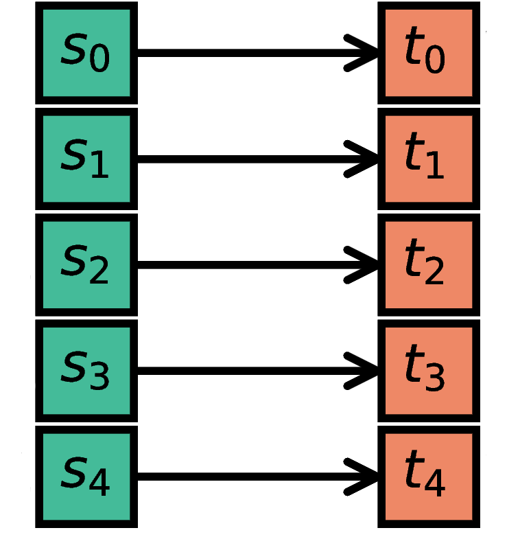
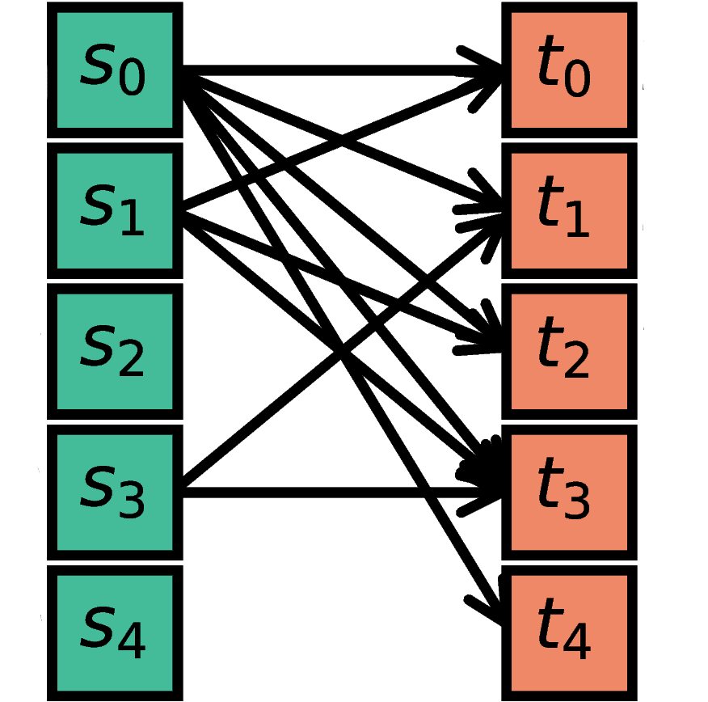
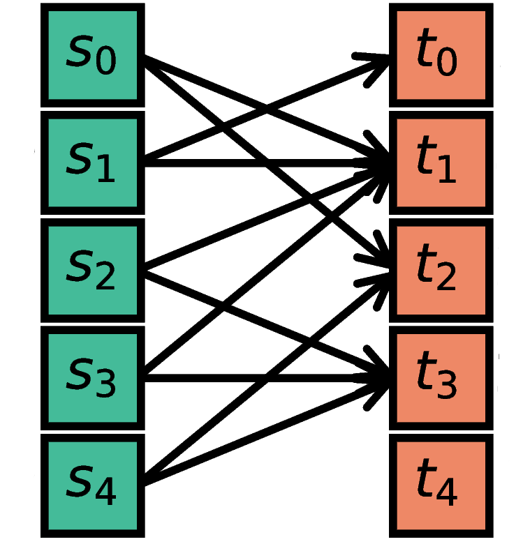

.. _connection_management:

Connection Management
=====================

.. grid:: 4
    :gutter: 1

    .. card::
		:link: one_to_one
		:link-type: ref

		.. image:: ../static/img/One_to_one_H.png

    .. card::
		:link: all_to_all
		:link-type: ref

		.. image:: ../static/img/All_to_all_H.png

    .. card::
		:link: fixed_indegree
		:link-type: ref

		.. image:: ../static/img/Fixed_indegree_H.png

    .. card::
		:link: fixed_outdegree
		:link-type: ref

		.. image:: ../static/img/Fixed_outdegree_H.png

.. grid:: 4
    :gutter: 1

    .. card::
		:link: fixed_total_number
		:link-type: ref

		.. image:: ../static/img/Fixed_total_number_H.png

    .. card::
		:link: pairwise_bernoulli
		:link-type: ref

		.. image:: ../static/img/Pairwise_bernoulli_H.png

    .. card::
		:link: multapse_autapse
		:link-type: ref

		.. image:: ../static/img/Autapse_H.png

    .. card::
		:link: multapse_autapse
		:link-type: ref

		.. image:: ../static/img/Multapse_H.png

We use the term `connection` to mean a single, atomic edge between network nodes (i.e., neurons or devices).
A `projection` is a group of edges that connects groups of nodes with similar properties (i.e., populations).
We specify network connectivity by providing, for each projection between any pair of populations, a *connection rule* which defines how to create atomic edges (connections) between individual nodes.
A projection is thus defined by a triplet of source population, target population and `connection rule` and represents a collection of atomic connections.

This documentation not only describes how to define projections in NEST, but also represents a living reference for the connection rules defined in the article "Connectivity concepts in neuronal network modeling" [1]_.
The same article also introduces a graphical notation for neuronal network diagrams which are curated in the documentation of NEST Desktop. TODO ADD LINK

Projections are created with the :py:func:`.Connect` function:

.. code-block:: python

    nest.Connect(pre, post)
    nest.Connect(pre, post, conn_spec)
    nest.Connect(pre, post, conn_spec, syn_spec)

In the simplest case, the function just takes the ``NodeCollections`` ``pre`` and ``post``, defining the nodes of
origin (`sources`) and termination (`targets`) for the connections to be established with the default rule ``all-to-all`` and the synapse model :hxt_ref:`static_synapse`.

Other connectivity patterns can be achieved by passing a connectivity specification dictionary ``conn_spec`` specifying a ``rule`` alongside additional rule-specific parameters.
Rules that do not require parameters can be directly provided as string instead of the dictionary (for example, ``nest.Connect(pre, post, 'one_to_one')``).
Examples of parameters might be in- and out-degrees, or the probability for establishing a connection.
All available rules are described in the section :ref:`Connection Rules <conn_rules>` below.

Properties of individual connections (i.e., synapses) can be set via the synapse specification dictionary ``syn_spec``.
Parameters like the synaptic weight or delay can be either set values or drawn and combined flexibly from random distributions.
It is also possible to define multiple projections with different synapse properties in the same :py:func:`.Connect` call (see :ref:`collocated synapses <collocated_synapses>`).
For details on synapse models and their parameters refer to :ref:`Synapse Specification <synapse_spec>`.

By using the keyword variant (``nest.Connect(pre, post, syn_spec=syn_spec_dict)``), ``conn_spec`` can be omitted in the call to :py:func:`.Connect` and will just take on the default value.

After your connections are established, a quick sanity check is to
look up the number of connections in the network, which can be easily
done using the corresponding kernel attribute:

.. code-block:: python

    print(nest.num_connections)

Have a look at the section :ref:`inspecting_connections` to get more tips on how to examine the connections in greater detail.

.. _conn_rules:

Connection Rules
----------------

We here provide formal definitions of connectivity concepts for neuronal network models. These concepts encompass the basic connectivity rules illustrated above which are already commonly used by the computational neuroscience community. Beyond that, we discuss concepts to reflect some of the richness of anatomical brain connectivity and complement in particular non-spatial connectivity rules with rules for spatially organized connectivity. Much of the information on this page is based on the paper "Connectivity concepts in neuronal network modeling" [1]_.

For each high-level connectivity rule, we give both an algorithmic construction rule and the resulting connectivity distribution. Modelers can use these definitions to succinctly specify connection rules in their studies. However, if details differ from our standard definitions, these details should still be specified. Furthermore, we suggest symbols that can be used to indicate the corresponding connectivity types in network diagrams and add the corresponding CSA expressions from [2]_.

In the specification of connectivity concepts we use the following notations and definitions. Let :math:`\mathcal{S}=\{s_1,\ldots, s_{N_s}\}` be the ordered set of sources of cardinality :math:`N_s` and :math:`\mathcal{T}=\{t_1,\ldots, t_{N_t}\}` the set of targets of cardinality :math:`N_t`. Then the set of all possible directed edges between members of :math:`\mathcal{S}` and :math:`\mathcal{T}` is given by the Cartesian product :math:`\mathcal{E}_{ST}=\mathcal{S \times T}` of cardinality :math:`N_s\cdot N_t`.

If the source and target populations are identical (:math:`\mathcal{S= T}`) a source can be its own target. We call such a self-connection an :ref:`autapse <multapse_autapse>`.
If autapses are not allowed, the target set for any node :math:`i \in \mathcal{S}` is :math:`\mathcal{T=S} \setminus i`, with cardinality :math:`N_t=N_s-1`.
If there is more than one edge between a source and target (or from a node to itself), we call this a :ref:`multapse <multapse_autapse>`.

The :math:`{degree\ distribution}\ P(k)` is the distribution across nodes of the number of edges per node. In a directed network, the distribution of the number of edges going out of (into) a node is called the :math:`{out\!-\!degree} (in\!-\!degree)` distribution. The distributions given below describe the effect of applying a connection rule once to a given :math:`\mathcal{S}-\mathcal{T}` pair.

TODO EXPLAIN DEVIATIONS FROM CC

.. _multapse_autapse:

Autapses and multapses
----------------------------------------------

.. image:: ../static/img/Autapse_multapse.png
     :width: 450px
     :align: center

In the connection specification dictionary (containing the rule name and rule-
specific parameters), the additional switch ``allow_autapses`` (default:
``True``) can be set to allow or disallow self-connections.

Likewise, ``allow_multapses`` (default: ``True``) can be used to specify if
multiple connections between the same pair of neurons are allowed or not.

These switches are only effective during each single call to
:py:func:`.Connect`. Calling the function multiple times with the same set of
neurons might still lead to violations of these constraints, even though the
switches were set to `False` in each individual call.

Deterministic connectivity rules
-------------------------------------------------
Deterministic connectivity rules establish precisely defined sets of connections without any variability across network realizations.

.. _one_to_one:

One-to-one
~~~~~~~~~~

The `i`\-th node in ``S`` (source) is connected to the `i`\-th node in ``T`` (target). The
NodeCollections of ``S`` and ``T`` have to contain the same number of
nodes.

.. code-block:: python

    n = 5
    S = nest.Create('iaf_psc_alpha', n)
    T = nest.Create('spike_recorder', n)
    nest.Connect(S, T, 'one_to_one')

.. dropdown:: Mathematical details: One-to-one

	|		**Symbol:** :math:`\delta`
	|		**CSA:** :math:`\delta`
	|		**Definition:** Each node in :math:`\mathcal{S}` is uniquely connected to one node in :math:`\mathcal{T}`. 
	|		:math:`\mathcal{S}` and :math:`\mathcal{T}` must have identical cardinality :math:`N_s=N_t`, see :ref:`one to one <one_to_one>`. Both sources and targets can be permuted independently even if :math:`\mathcal{S}=\mathcal{T}`. The in- and out-degree distributions are given by :math:`P(K)=\delta_{K,1}`, with Kronecker delta :math:`\delta_{i,j}=1` if :math:`i=j`, and zero otherwise.

.. _all_to_all:

All-to-all
~~~~~~~~~~

.. image:: ../static/img/All_to_all.png
     :width: 200px
     :align: center

Each node in ``S`` is connected to every node in ``T``. Since
``all_to_all`` is the default, the rule doesn't actually have to be
specified.

.. code-block:: python

    n, m = 5, 5
    S = nest.Create('iaf_psc_alpha', n)
    T = nest.Create('iaf_psc_alpha', m)
    nest.Connect(S, T, 'all_to_all')
    nest.Connect(S, T)  # equivalent

.. dropdown:: Mathematical details: All-to-all

	|		**Symbol:** :math:`\Omega`
	|		**CSA:** :math:`\Omega`
	|		**Definition:** Each node in :math:`\mathcal{S}` is  connected to all nodes in :math:`\mathcal{T}`. 
	|		The resulting edge set is the full edge set :math:`\mathcal{E}_\mathcal{ST}`. The in- and out-degree distributions are :math:`P_\text{in}(K)=\delta_{K,N_s}` for :math:`\mathcal{T}`, and :math:`P_\text{out}(K)=\delta_{K,N_t}` for :math:`\mathcal{S}`, respectively. An example is shown in :ref:`all to all <all_to_all>`.

.. dropdown:: Mathematical details: Explicit connections

	|		**Symbol:** X
	|		**CSA:** Not applicable
	|		**Definition:** Connections are established according to an explicit list of source-target pairs. 
	|		Connectivity is defined by an explicit list of sources and targets, also known as *adjacency list*, as for instance derived from anatomical measurements. It is, hence, not the result of any specific algorithm. An alternative way of representing a fixed connectivity is by means of the *adjacency matrix A*, such that :math:`A_{ij}=1` if :math:`j` is connected to :math:`i`, and zero otherwise. We here adopt the common computational neuroscience practice to have the first index :math:`i` denote the target and the second index :math:`j` denote the source node.

Probabilistic connectivity rules
------------------------------------------------
Probabilistic connectivity rules establish edges according to a probabilistic rule. Consequently, the exact connectivity varies with realizations. Still, such connectivity leads to specific expectation values of network characteristics, such as degree distributions or correlation structure.

.. _pairwise_bernoulli:

Pairwise bernoulli
~~~~~~~~~~~~~~~~~~

.. image:: ../static/img/Pairwise_bernoulli.png
     :width: 200px
     :align: center

For each possible pair of nodes from ``S`` and ``T``, a connection is
created with probability ``p``.

.. code-block:: python

    n, m, p = 5, 5, 0.5
    S= nest.Create('iaf_psc_alpha', n)
    T = nest.Create('iaf_psc_alpha', m)
    conn_spec_dict = {'rule': 'pairwise_bernoulli', 'p': p}
    nest.Connect(S, T, conn_spec_dict)
	
.. dropdown:: Mathematical details: Pairwise bernoulli

	|		**Symbol:** :math:`p`
	|		**CSA:** :math:`\rho(p)`
	|		**Definition:** Each pair of nodes, with source in :math:`\mathcal{S}` and target in :math:`\mathcal{T}`, is connected with probability :math:`p`.
	|		In its standard form this rule cannot produce multapses since each possible edge is visited only once. If :math:`\mathcal{S=T}`, this concept is similar to Erdős-Rényi-graphs of the *constant probability* :math:`p-ensemble\ G(N,p)`---also called *binomial ensemble* [3]_; the only difference being that we here consider directed graphs, whereas the Erdős-Rényi model is undirected. The distribution of both in- and out-degrees is binomial,

	.. math::
		P(K_\text{in}=K)=\mathcal{B}(K|N_s,p):=\begin{pmatrix}N_s\\K\end{pmatrix}p^{K}(1-p)^{N_s-K}

	and

	.. math::
		P(K_\text{out}=K)=\mathcal{B}(K|N_t,p)\,,
	 
	respectively.
	The expected total number of edges equals :math:`\text{E}[N_\text{syn}]=pN_tN_s`.

Symmetric pairwise bernoulli
~~~~~~~~~~~~~~~~~~~~~~~~~~~~

For each possible pair of nodes from ``S`` and ``T``, a connection is
created with probability ``p`` from ``S`` to ``T``, as well as a
connection from ``T`` to ``S`` (two connections in total). To use
this rule, ``allow_autapses`` must be ``False``, and ``make_symmetric``
must be ``True``.

.. code-block:: python

    n, m, p = 10, 12, 0.2
    S = nest.Create('iaf_psc_alpha', n)
    T = nest.Create('iaf_psc_alpha', m)
    conn_spec_dict = {'rule': 'symmetric_pairwise_bernoulli', 'p': p,
                      'allow_autapses': False, 'make_symmetric': True}
    nest.Connect(S, T, conn_spec_dict)

.. _fixed_total_number:

Random, fixed total number
~~~~~~~~~~~~~~~~~~~~~~~~~~~~

The nodes in ``S`` are randomly connected with the nodes in ``T``
such that the total number of connections equals ``N``.

.. code-block:: python

    n, m, N = 5, 5, 10
    S = nest.Create('iaf_psc_alpha', n)
    T = nest.Create('iaf_psc_alpha', m)
    conn_spec_dict = {'rule': 'fixed_total_number', 'N': N}
    # By default multapses are allowed, 
    # optionally if multapses are not allowed the following parameter must be set
    # conn_spec_dict = {'rule': 'fixed_total_number', 'N': N, 'allow_autapses': False}
    nest.Connect(S, T, conn_spec_dict)

.. dropdown:: Mathematical details: Random, fixed total number without multapses

	|		**Symbol:** :math:`N_\text{syn} \cancel{M}`
	|		**CSA:** :math:`\mathbf{\rho_{N}}(N_\text{syn})(\mathbb{N}_S \times \mathbb{N}_T)`
	|		**Definition:** :math:`N_\text{syn}\in\{0,\ldots,N_sN_t\}` edges are randomly drawn from the edge set :math:`\mathcal{E}_\mathcal{ST}` without replacement. 
	|		For :math:`\mathcal{S}=\mathcal{T}` this is a directed graph generalization of Erdős-Rényi graphs of the *constant number of edges* :math:`N_\text{syn}`-ensemble :math:`G(N,N_\text{syn})` [4]_. There are :math:`\begin{pmatrix}N_s N_t\\N_\text{syn}\end{pmatrix}` possible networks for any given number :math:`N_\text{syn}\leq N_sN_t`, which all have the same probability. The resulting in- and out-degree distributions are multivariate hypergeometric distributions.

	.. math::
		\begin{split}
		&P(K_{\text{in},1}=K_1,\ldots,K_{\text{in},N_t}=K_{N_t})\\
		& \quad \quad \quad = \begin{cases}
		\prod_{j=1}^{N_t} \begin{pmatrix} N_s\\K_j\end{pmatrix}\Bigg/\begin{pmatrix} N_sN_t\\N_\text{syn}\end{pmatrix}
		&  \text{if}\,\,\sum_{j=1}^{N_t} K_j = N_\text{syn}\\
		 \phantom{bl}0  & \text{otherwise}\end{cases}\,,
		 \end{split}

	and analogously :math:`P(K_{\text{out},1}=K_1,\ldots,K_{\text{out},N_s}=K_{N_s})`
	with :math:`K_\text{out}` instead of :math:`K_\text{in}` and source and target indices switched.

	The marginal distributions, i.e., the probability distribution for any specific node :math:`j` to have in-degree :math:`K_j`, are hypergeometric distributions

	.. math::
		P(K_{\text{in},j}=K_j)=
		\begin{pmatrix} N_s\\K_j \end{pmatrix} \begin{pmatrix}N_sN_t-1 \\
		  N_\text{syn}-K_j \end{pmatrix}\Bigg/\begin{pmatrix}N_sN_t
			\\ N_\text{syn}\end{pmatrix} \,,

	with sources and targets switched for :math:`P(K_{\text{out},j}=K_j)`.

.. dropdown:: Mathematical details: Random, fixed total number with multapses

	|		**Symbol:** :math:`\mathbf{\rho_N}(N_\text{syn})\mathbf{M}(\mathbb{N}_S \times \mathbb{N}_T)`
	|		**CSA:** :math:`\mathbf{\rho_N}(N_\text{syn})\mathbf{M}(\mathbb{N}_S \times \mathbb{N}_T)`
	|		**Definition:** :math:`N_\text{syn}\in\{0,\ldots,N_sN_t\}` edges are randomly drawn from the edge set :math:`\mathcal{E}_\mathcal{ST}` with replacement.
	|		If multapses are allowed, there are :math:`\begin{pmatrix}N_sN_t+N_\text{syn}-1\\N_\text{syn}\end{pmatrix}` possible networks for any given number :math:`N_\text{syn}\leq N_sN_t`.
	|		Because exactly :math:`N_\text{syn}` connections are distributed across :math:`N_t` targets with replacement, the joint in-degree distribution is multinomial, 

	.. math::
		\begin{equation}\label{eq:randfixKm}
		\begin{split}
		&P(K_{\text{in},1}=K_1,\ldots,K_{\text{in},N_t}=K_{N_t})\\
		& \quad \quad \quad=\begin{cases}
		\frac{N_\text{syn}!}{K_1!...K_{N_t}!} \,p^{N_\text{syn}}  &  \text{if}\,\,\sum_{j=1}^{N_t} K_j = N_\text{syn}\\
		 \quad\quad 0  & \text{otherwise}\end{cases}\,
		\end{split}
		\end{equation}
		
	with :math:`p=1/N_t`.

	The out-degrees have an analogous multinomial distribution :math:`P(K_{\text{out},1}=K_1,\ldots,K_{\text{out},N_s}=K_{N_s})`, with :math:`p=1/N_s` and sources and targets switched. The marginal distributions are binomial distributions :math:`P(K_{\text{in},j}=K)= \mathcal{B}(K|N_\text{syn},1/N_t)` and :math:`P(K_{\text{out},j}=K)= \mathcal{B}(K|N_\text{syn},1/N_s)`, respectively.

	The :math:`\mathbf{M}`-operator of CSA should not be confused with the ":math:`M`" indicating that multapses are allowed in our symbolic notation.

.. _fixed_indegree:

Random, fixed indegree
~~~~~~~~~~~~~~~~~~~~~~~~~~~~

.. image:: ../static/img/Fixed_indegree.png
     :width: 200px
     :align: center

The nodes in ``S`` are randomly connected with the nodes in ``T`` such
that each node in ``T`` has a fixed :hxt_ref:`indegree` of ``N``.

.. code-block:: python

    n, m, N = 5, 5, 2
    S = nest.Create('iaf_psc_alpha', n)
    T = nest.Create('iaf_psc_alpha', m)
    conn_spec_dict = {'rule': 'fixed_indegree', 'indegree': N}
    # By default multapses are allowed, 
    # optionally if multapses are not allowed the following parameter must be set
    # conn_spec_dict = {rule': 'fixed_indegree', 'indegree': N, 'allow_autapses': False}
    nest.Connect(S, T, conn_spec_dict)
	
.. dropdown:: Mathematical details: Random, fixed in-degree without multapses

	| 		**Symbol:** :math:`K_{in}, \cancel{M}`
	|		**CSA:** :math:`{\rho_1}(K)(\mathbb{N}_S \times \mathbb{N}_T)`
	|		**Definition:** Each target node in :math:`\mathcal{T}` is connected to :math:`K_\text{in}` nodes in :math:`\mathcal{S}` randomly chosen without replacement. 
	|		The in-degree distribution is by definition :math:`P(K)=\delta_{K,K_\text{in}}`. To obtain the out-degree distribution, observe that after one target node has drawn its :math:`K_\text{out}` sources the joint probability distribution of out-degrees :math:`K_{\text{out},j}` is multivariate-hypergeometric such that

	.. math::
		\begin{equation}\label{eq:hypmult}
		\begin{split}
		&P(K_{\text{out},1}=K_1, \ldots,K_{\text{out},N_s}=K_{N_s})\\
		& \quad \quad \quad= \begin{cases}
		\prod_{j=1}^{N_s} \begin{pmatrix} 1\\K_j\end{pmatrix}\Bigg/\begin{pmatrix} N_s\\K_\text{in}\end{pmatrix}
		&  \text{if}\,\,\sum_{j=1}^{N_s} K_j = K_\text{in}\\
		 \phantom{bl}0  & \text{otherwise}\end{cases}\,, \qquad (1) 
		\end{split}
		\end{equation}

	where :math:`\forall_j\,K_j\in\{0,1\}`.
	The marginal distributions are hypergeometric distributions

	.. math::
		\begin{eqnarray}\label{eq:hypmarg}
		P(K_{\text{out},j}=K)=
		\begin{pmatrix} 1\\K \end{pmatrix} \begin{pmatrix}N_s-1 \\
		  K_\text{in}-K \end{pmatrix}\Bigg/\begin{pmatrix}N_s
			\\ K_\text{in}\end{pmatrix} = \text{Ber}(K_\text{in}/N_s)\,, \qquad (2) 
		\end{eqnarray}

	with :math:`\text{Ber}(p)` denoting the Bernoulli distribution with parameter :math:`p`, because :math:`K\in\{0,1\}`.
	The full joint distribution is the sum of :math:`N_t` independent instances of equation (1).

.. dropdown:: Mathematical details: Random, fixed in-degree with multapses

	| 		**Symbol:** :math:`K_{in}, M`
	| 		**CSA:** :math:`\mathbf{\rho_1}(K)\mathbf{M}(\mathbb{N}_S \times \mathbb{N}_T)`
	| 		**Definition:** Each target node in :math:`\mathcal{T}` is connected to :math:`K_\text{in}` nodes in :math:`\mathcal{S}` randomly chosen with replacement.
	|		:math:`N_s` is the number of source nodes from which exactly :math:`K_\text{in}` connections are drawn with equal probability :math:`p=1/N_s` for each of the :math:`N_t` target nodes :math:`t_i\in\mathcal{T}`. The in-degree distribution is by definition :math:`P(K)=\delta_{K,K_\text{in}}`. To obtain the out-degree distribution, we observe that because multapses are allowed, drawing :math:`N_t` times :math:`K_{\text{in},i}=K_\text{in}` from :math:`\mathcal{S}` is equivalent to drawing :math:`N_t K_\text{in}` times with replacement from :math:`\mathcal{S}`. This procedure yields a multinomial distribution of the out-degrees :math:`K_{\text{out},j}` of source nodes :math:`s_j\in\mathcal{S}` [5]_, i.e.,

	.. math::
		\begin{equation}\label{eq:rfin}
		\begin{split}
		&P(K_{\text{out},1}=K_1,\ldots,K_{\text{out},N_s}=K_{N_s})\\
		& \quad \quad \quad =\begin{cases}
		\frac{(N_tK_\text{in})!}{K_1!...K_{N_s}!} p^{N_tK_\text{in}}  &  \text{if}\,\,\sum_{j=1}^{N_s} K_j = N_tK_\text{in}\\
		 \quad\quad 0  & \text{otherwise}\end{cases}
		\end{split}
		\end{equation}

	The marginal distributions are binomial distributions 

	.. math::
		\begin{equation}\label{eq:rfinmarg}
		P(K_{\text{out},j}=K)= \mathcal{B}(K|N_tK_\text{in},1/N_s)\,.
		\end{equation}

.. _fixed_outdegree:

Random, fixed outdegree
~~~~~~~~~~~~~~~~~~~~~~~~~~~~

The nodes in ``S`` are randomly connected with the nodes in ``T`` such
that each node in ``S`` has a fixed :hxt_ref:`outdegree` of ``N``.

.. code-block:: python

    n, m, N = 5, 5, 2
    S = nest.Create('iaf_psc_alpha', n)
    T = nest.Create('iaf_psc_alpha', m)
    conn_spec_dict = {'rule': 'fixed_outdegree', 'outdegree': N}
		
    # By default multapses are allowed, 
    # optionally if multapses are not allowed the following parameter must be set
    # conn_spec_dict = {'rule': 'fixed_outdegree', 'outdegree': N, 'allow_autapses': False}
    nest.Connect(S, T, conn_spec_dict)

.. dropdown:: Mathematical details: Random, fixed out-degree without multapses

	| 		**Symbol:** :math:`K_{out},\cancel{M}`
	| 		**CSA:** :math:`\mathbf{\rho_0}(K)(\mathbb{N}_S \times \mathbb{N}_T)`
	| 		**Definition:**  Each source node in :math:`S` is connected to :math:`K_\text{out}` nodes in :math:`\mathcal{T}` randomly chosen without replacement. 
	|		The out-degree distribution is by definition :math:`P(K)=\delta_{K,K_\text{out}}`, while the in-degree distribution is obtained by switching source and target indices, and replacing :math:`K_\text{out}` with :math:`K_\text{in}` in equation (2) from :ref:`Random, fixed in-degree without multapses <fixed_indegree>`.

	
.. dropdown:: Mathematical details: Random, fixed out-degree with multapses

	| 		**Symbol:** :math:`K_{out}, M`
	| 		**CSA:** :math:`\mathbf{\rho_0}(K)\mathbf{M}(\mathbb{N}_S \times \mathbb{N}_T)`
	| 		**Definition:** Each source node in :math:`\mathcal{S}` is connected to :math:`K_\text{out}` nodes in :math:`\mathcal{T}` randomly chosen with replacement. 
	|		By definition, the out-degree distribution is a :math:`P(K)=\delta_{K,K_\text{out}}`. The respective in-degree distribution and marginal distributions are obtained by switching source and target indices, and replacing :math:`K_\text{out}` with :math:`K_\text{in}` in equation from :ref:`Random, fixed in-degree with multapses <fixed_indegree>` [5]_.

.. _conn_builder_conngen:

Conngen
~~~~~~~

.. admonition:: Availability

   This connection rule is only available if NEST was compiled with
   :ref:`support for libneurosim <compile_with_libneurosim>`.

To allow the generation of connectivity by means of an external
library, NEST supports the Connection Generator Interface [6]_. For
more details on this interface, see the Git repository of `libneurosim
<https://github.com/INCF/libneurosim>`_.

In contrast to the other rules for creating connections, this rule
relies on a Connection Generator object to describe the connectivity
pattern in a library-specific way. The Connection Generator is handed
to :py:func:`.Connect` under the key ``cg`` of the connection specification
dictionary and evaluated internally. If the Connection Generator
provides values for connection weights and delays, their respective
indices can be specified under the key ``params_map``. Alternatively,
all synapse parameters can be specified using the synapse
specification argument to ``Connect()``.

The following listing shows an example for using the `Connection-Set
Algebra <https://github.com/INCF/csa>`_ in NEST via the Connection
Generator Interface and randomly connects 10% of the neurons from
``A`` to the neurons in ``B``, each connection having a weight of
10000.0 pA and a delay of 1.0 ms:

.. code-block:: python

   A = nest.Create('iaf_psc_alpha', 100)
   B = nest.Create('iaf_psc_alpha', 100)

   # Create the Connection Generator object
   import csa
   cg = csa.cset(csa.random(0.1), 10000.0, 1.0)

   # Map weight and delay indices to values from cg
   params_map = {'weight': 0, 'delay': 1}

   conn_spec_dict = {'rule': 'conngen', 'cg': cg, 'params_map': params_map}
   nest.Connect(A, B, conn_spec_dict)

References
----------
.. [1] Senk J, Kriener B, Djurfeldt M, Voges N, Jiang HJ, et al. (2022) Connectivity concepts in neuronal network modeling. PLOS Computational Biology 18(9): e1010086. https://doi.org/10.1371/journal.pcbi.1010086
.. [2] Djurfeldt M. The Connection-set Algebra—A Novel Formalism for the Representation of Connectivity Structure in Neuronal Network Models. Neuroinformatics. 2012; 10: 287–304. https://doi.org/10.1007/s12021-012-9146-1
.. [3] Albert R, Barabási AL. Statistical mechanics of complex networks. Rev Mod Phys. 2002; 74: 47–97. https://doi.org/10.1103/RevModPhys.74.47
.. [4] Erdős P, Rényi A. On random graphs. Publications Mathematicae. 1959; 6: 290–297.
.. [5] Hjertholm D. Statistical tests for connection algorithms for structured neural networks [master’s thesis]. Norwegian University of Life Sciences. Ås, Norway; 2013. Available from: http://hdl.handle.net/11250/189117
.. [6] Djurfeldt M, Davison AP and Eppler JM (2014). Efficient generation of
       connectivity in neuronal networks from simulator-independent
       descriptions. Front. Neuroinform.
       https://doi.org/10.3389/fninf.2014.00043

