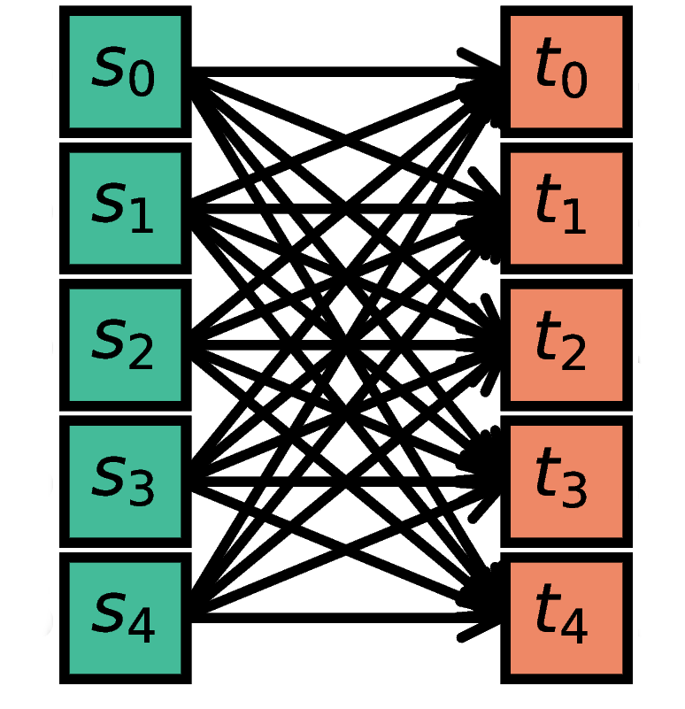
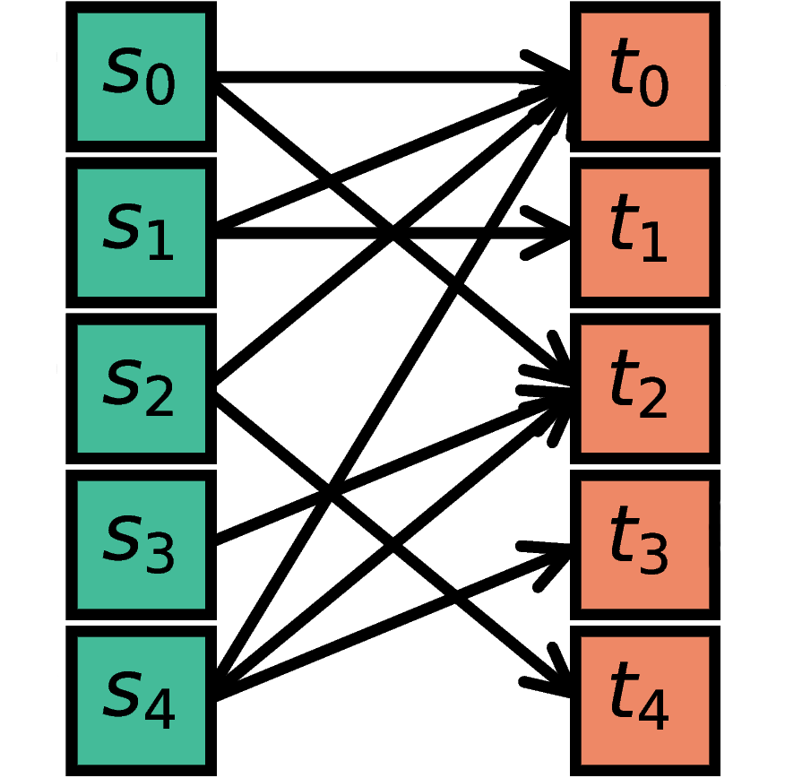
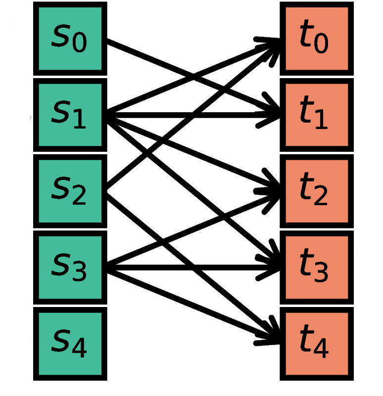
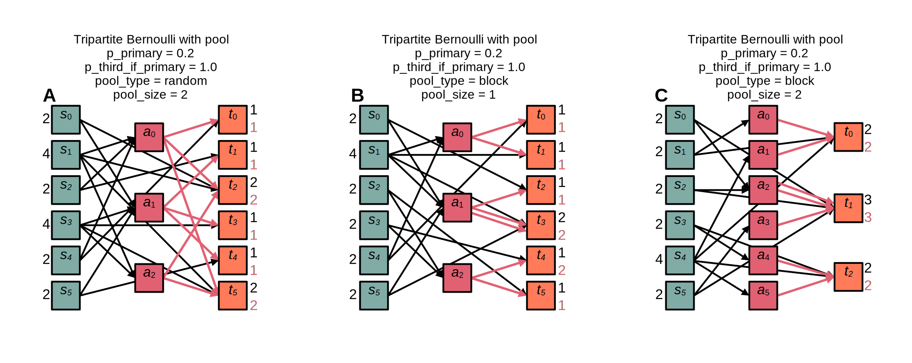

.. _connectivity_concepts:

Connectivity concepts
=====================

.. grid:: 2 2 7 7
    :gutter: 0

    .. grid-item-card:: Autapse and multapse
		  :link: autapse_multapse
		  :link-type: ref
		  :img-top: ../static/img/Autapse_multapse_v.png

    .. grid-item-card:: One to one
		  :link: one_to_one
		  :link-type: ref
		  :img-top: ../static/img/One_to_one.png

    .. grid-item-card:: All to all
		  :link: all_to_all
		  :link-type: ref
		  :img-top: ../static/img/All_to_all.png

    .. grid-item-card:: Pairwise Bernoulli
		  :link: pairwise_bernoulli
		  :link-type: ref
		  :img-top: ../static/img/Pairwise_bernoulli.png

    .. grid-item-card:: Fixed total number
		  :link: fixed_total_number
		  :link-type: ref
		  :img-top: ../static/img/Fixed_total_number.png

    .. grid-item-card:: Fixed in-degree
		  :link: fixed_indegree
		  :link-type: ref
		  :img-top: ../static/img/Fixed_indegree.png

    .. grid-item-card:: Fixed out-degree
		  :link: fixed_outdegree
		  :link-type: ref
		  :img-top: ../static/img/Fixed_outdegree.png

.. rst-class:: center

    Basic connection rules commonly used in the computational neuroscience community. For more details, go to the section :ref:`conn_rules` or just click on one of the illustrations.

This documentation not only describes how to define network connectivity in NEST, but also provides details on connectivity concepts.
The article "Connectivity concepts in neuronal network modeling" [1]_ serves as a permanent reference for a number of connection rules and we suggest to cite it if rules defined there are used.
This documentation instead represents a living reference for these rules, and deviations from and extensions to what is described in the article will be highlighted.

The same article also introduces a graphical notation for neuronal network diagrams which is curated in the documentation of :doc:`NEST Desktop <desktop:user/usage-advanced/network-graph>`.

:ref:`spatial_networks` are described on a separate page.

We use the term `connection` to mean a single, atomic edge between network nodes (i.e., neurons or devices).
A `projection` is a group of edges that connects groups of nodes with similar properties (i.e., populations).
To specify network connectivity, each projection is specified by a triplet of source population, target population, and a `connection rule` which defines how to connect the individual nodes.

Projections are created in NEST with the :py:func:`.Connect` function:

.. code-block:: python

    nest.Connect(pre, post)
    nest.Connect(pre, post, conn_spec)
    nest.Connect(pre, post, conn_spec, syn_spec)

In the simplest case, the function just takes the ``NodeCollections`` ``pre`` and ``post``, defining the nodes of
origin (`sources`) and termination (`targets`) for the connections to be established with the default rule ``all-to-all`` and the synapse model :ref:`static_synapse`.

Other connectivity patterns can be achieved by explicitly specifying the connection rule with the connectivity specification dictionary ``conn_spec`` which expects a ``rule`` alongside additional rule-specific parameters.
Rules that do not require parameters can be directly provided as string instead of the dictionary; for example, ``nest.Connect(pre, post, 'one_to_one')``.
Examples of parameters might be in- and out-degrees, or the probability for establishing a connection.
All available rules are described in the section :ref:`conn_rules` below.

Properties of individual connections (i.e., synapses) can be set via the synapse specification dictionary ``syn_spec``.
Parameters like the synaptic weight or delay can be either set values or drawn and combined flexibly from random distributions.
For details on synapse models and their parameters refer to :ref:`synapse_spec`. Note that is also possible to define multiple projections with different synapse properties in the same :py:func:`.Connect` call (see :ref:`collocated_synapses`).

By using the keyword variant ``nest.Connect(pre, post, syn_spec=syn_spec)``, the `conn_spec` can be omitted in the call to :py:func:`.Connect` and will just take on the default value ``all-to-all``.

After your connections are established, a quick sanity check is to
look up the number of connections in the network, which can be easily
done using the corresponding kernel attribute:

.. code-block:: python

    print(nest.num_connections)

Have a look at the section :ref:`handling_connections` to get more tips on how to examine the connections in greater detail.

.. _conn_rules:

Connection rules
----------------

Here we elaborate on the connectivity concepts with details on :ref:`autapse_multapse`, :ref:`deterministic_rules`, :ref:`probabilistic_rules`, and the :ref:`connection_generator` (a method to create connections via CSA, the Connection Set Algebra [2]_).
Finally, we introduce the rule :ref:`tripartite_connectivity` for third-party connections in addition to primary connections between ``pre`` and ``post``.
Each primary rule is described with an illustration, a NEST code example, and mathematical details.
The mathematical details are extracted from the study on connectivity concepts [1]_ and contain a symbol which we recommend to use for describing this type of connectivity, the corresponding expression from CSA, and a formal definition with an algorithmic construction rule and the resulting connectivity distribution.

.. dropdown:: Mathematical details: General notations and definitions

	|		Let :math:`\mathcal{S}=\{s_1,\ldots, s_{N_s}\}` be the ordered set of sources of cardinality :math:`N_s` and :math:`\mathcal{T}=\{t_1,\ldots, t_{N_t}\}` the set of targets of cardinality :math:`N_t`. Then the set of all possible directed edges between members of :math:`\mathcal{S}` and :math:`\mathcal{T}` is given by the Cartesian product :math:`\mathcal{E}_{ST}=\mathcal{S \times T}` of cardinality :math:`N_s\cdot N_t`.
	|
	|		If the source and target populations are identical (:math:`\mathcal{S=T}`) a source can be its own target. We call such a self-connection an :ref:`autapse <autapse_multapse>`. If autapses are not allowed, the target set for any node :math:`i \in \mathcal{S}` is :math:`\mathcal{T=S} \setminus i`, with cardinality :math:`N_t=N_s-1`. If there is more than one edge between a source and target (or from a node to itself), we call this a :ref:`multapse <autapse_multapse>`.
	|
	|		The `degree distribution` :math:`P(k)` is the distribution across nodes of the number of edges per node. In a directed network, the distribution of the number of edges going out of (into) a node is called the `out-degree (in-degree)` distribution. The distributions given below describe the effect of applying a connection rule once to a given :math:`\mathcal{S}-\mathcal{T}` pair.

.. _autapse_multapse:

Autapses and multapses
----------------------

.. image:: ../static/img/Autapse_multapse.png
     :width: 450px
     :align: center

Autapses are self-connections of a node and multapses are multiple connections betweeen the same pair of nodes.

In the connection specification dictionary ``conn_spec``, the additional switches ``allow_autapses`` (default:
``True``) and ``allow_multapses`` (default: ``True``) can be set to allow or disallow autapses and multapses.

These switches are only effective during each single call to
:py:func:`.Connect`. Calling the function multiple times with the same set of
neurons might still lead to violations of these constraints, even though the
switches were set to ``False`` in each individual call.

.. _deterministic_rules:

Deterministic connection rules
------------------------------

Deterministic connection rules establish precisely defined sets of connections without any variability across network realizations.

.. _one_to_one:

One-to-one
~~~~~~~~~~

.. image:: ../static/img/One_to_one.png
     :width: 200px
     :align: center

The `i`\-th node in ``S`` (source) is connected to the `i`\-th node in ``T`` (target). The
``NodeCollections`` of ``S`` and ``T`` have to contain the same number of
nodes.

.. code-block:: python

    n = 5
    S = nest.Create('iaf_psc_alpha', n)
    T = nest.Create('spike_recorder', n)
    nest.Connect(S, T, 'one_to_one')

.. dropdown:: Mathematical details: One-to-one

	|		**Symbol:** :math:`\delta`
	|		**CSA:** :math:`\delta`
	|		**Definition:** Each node in :math:`\mathcal{S}` is uniquely connected to one node in :math:`\mathcal{T}`.
	|		:math:`\mathcal{S}` and :math:`\mathcal{T}` must have identical cardinality :math:`N_s=N_t`. Both sources and targets can be permuted independently even if :math:`\mathcal{S}=\mathcal{T}`. The in- and out-degree distributions are given by :math:`P(K)=\delta_{K,1}`, with Kronecker delta :math:`\delta_{i,j}=1` if :math:`i=j`, and zero otherwise.

.. _all_to_all:

All-to-all
~~~~~~~~~~

Each node in ``S`` is connected to every node in ``T``. Since
``all_to_all`` is the default, the rule doesn't actually have to be
specified.

.. code-block:: python

    n, m = 5, 5
    S = nest.Create('iaf_psc_alpha', n)
    T = nest.Create('iaf_psc_alpha', m)
    nest.Connect(S, T, 'all_to_all')
    nest.Connect(S, T)  # equivalent

.. dropdown:: Mathematical details: All-to-all

	|		**Symbol:** :math:`\Omega`
	|		**CSA:** :math:`\Omega`
	|		**Definition:** Each node in :math:`\mathcal{S}` is  connected to all nodes in :math:`\mathcal{T}`.
	|		The resulting edge set is the full edge set :math:`\mathcal{E}_\mathcal{ST}`. The in- and out-degree distributions are :math:`P_\text{in}(K)=\delta_{K,N_s}` for :math:`\mathcal{T}`, and :math:`P_\text{out}(K)=\delta_{K,N_t}` for :math:`\mathcal{S}`, respectively.

Explicit connections
~~~~~~~~~~~~~~~~~~~~

Connections between explicit lists of source-target pairs can be realized in NEST by extracting the respective node ids from the ``NodeCollections`` and using the :ref:`one_to_one` rule.

.. code-block:: python

    n, m = 5, 5
    S = nest.Create('iaf_psc_alpha', n) # node ids: 1..5
    T = nest.Create('iaf_psc_alpha', m) # node ids: 6..10
    # source-target pairs: (3,8), (4,1), (1,9)
    nest.Connect([3,4,1], [8,6,9], 'one_to_one')

.. dropdown:: Mathematical details: Explicit connections

	|		**Symbol:** X
	|		**CSA:** Not applicable
	|		**Definition:** Connections are established according to an explicit list of source-target pairs.
	|		Connectivity is defined by an explicit list of sources and targets, also known as `adjacency list`, as for instance derived from anatomical measurements. It is, hence, not the result of any specific algorithm. An alternative way of representing a fixed connectivity is by means of the `adjacency matrix` :math:`A`, such that :math:`A_{ij}=1` if :math:`j` is connected to :math:`i`, and zero otherwise. We here adopt the common computational neuroscience practice to have the first index :math:`i` denote the target and the second index :math:`j` denote the source node.

.. _probabilistic_rules:

Probabilistic connection rules
------------------------------

Probabilistic connection rules establish edges according to a probabilistic rule. Consequently, the exact connectivity varies with realizations. Still, such connectivity leads to specific expectation values of network characteristics, such as degree distributions or correlation structure.

.. _pairwise_bernoulli:

Pairwise Bernoulli
~~~~~~~~~~~~~~~~~~

For each possible pair of nodes from ``S`` and ``T``, a connection is
created with probability ``p``.
Note that multapses cannot be produced with this rule because each possible edge is visited only once, independent of how ``allow_multapses`` is set.

.. code-block:: python

    n, m, p = 5, 5, 0.5
    S = nest.Create('iaf_psc_alpha', n)
    T = nest.Create('iaf_psc_alpha', m)
    conn_spec = {'rule': 'pairwise_bernoulli', 'p': p}
    nest.Connect(S, T, conn_spec)

.. dropdown:: Mathematical details: Pairwise Bernoulli

	|		**Symbol:** :math:`p`
	|		**CSA:** :math:`\rho(p)`
	|		**Definition:** Each pair of nodes, with source in :math:`\mathcal{S}` and target in :math:`\mathcal{T}`, is connected with probability :math:`p`.
	|		In its standard form this rule cannot produce multapses since each possible edge is visited only once. If :math:`\mathcal{S=T}`, this concept is similar to Erdős-Rényi-graphs of the `constant probability` `p-ensemble` :math:`G(N,p)`---also called `binomial ensemble` [3]_; the only difference being that we here consider directed graphs, whereas the Erdős-Rényi model is undirected. The distribution of both in- and out-degrees is binomial,

	.. math::
		P(K_\text{in}=K)=\mathcal{B}(K|N_s,p):=\begin{pmatrix}N_s\\K\end{pmatrix}p^{K}(1-p)^{N_s-K}

	and

	.. math::
		P(K_\text{out}=K)=\mathcal{B}(K|N_t,p)\,,

	respectively.
	The expected total number of edges equals :math:`\text{E}[N_\text{syn}]=pN_tN_s`.

Symmetric pairwise Bernoulli
~~~~~~~~~~~~~~~~~~~~~~~~~~~~

For each possible pair of nodes from ``S`` and ``T``, a connection is
created with probability ``p`` from ``S`` to ``T``, as well as a
connection from ``T`` to ``S`` (two connections in total). To use
this rule, ``allow_autapses`` must be ``False``, and ``make_symmetric``
must be ``True``.

.. code-block:: python

    n, m, p = 10, 12, 0.2
    S = nest.Create('iaf_psc_alpha', n)
    T = nest.Create('iaf_psc_alpha', m)
    conn_spec = {'rule': 'symmetric_pairwise_bernoulli', 'p': p,
                 'allow_autapses': False, 'make_symmetric': True}
    nest.Connect(S, T, conn_spec)

.. _pairwise_poisson:

Pairwise Poisson
~~~~~~~~~~~~~~~~

For each possible pair of nodes from ``S`` and ``T``, a number of
connections is created following a Poisson distribution with mean
``pairwise_avg_num_conns``. This means that even for a small
average number of connections between single neurons in ``S`` and
``T`` multiple connections are possible. Thus, for this rule
``allow_multapses`` cannot be ``False``.
The ``pairwise_avg_num_conns`` can be greater than one.

.. code-block:: python

    n, m, p_avg_num_conns = 10, 12, 0.2
    S = nest.Create('iaf_psc_alpha', n)
    T = nest.Create('iaf_psc_alpha', m)
    conn_spec = {'rule': 'pairwise_poisson',
                 'pairwise_avg_num_conns': p_avg_num_conns}
    nest.Connect(S, T, conn_spec)

.. _fixed_total_number:

Random, fixed total number
~~~~~~~~~~~~~~~~~~~~~~~~~~

.. image:: ../static/img/Fixed_total_number.png
     :width: 200px
     :align: center

The nodes in ``S`` are randomly connected with the nodes in ``T``
such that the total number of connections equals ``N``.

As multapses are per default allowed and possible with this rule, you can disallow them by adding ``'allow_multapses': False`` to the ``conn_dict``.

.. code-block:: python

    n, m, N = 5, 5, 10
    S = nest.Create('iaf_psc_alpha', n)
    T = nest.Create('iaf_psc_alpha', m)
    conn_spec = {'rule': 'fixed_total_number', 'N': N}
    nest.Connect(S, T, conn_spec)

.. dropdown:: Mathematical details: Random, fixed total number with multapses

	|		**Symbol:** :math:`\mathbf{\rho_N}(N_\text{syn})\mathbf{M}(\mathbb{N}_S \times \mathbb{N}_T)`
	|		**CSA:** :math:`\mathbf{\rho_N}(N_\text{syn})\mathbf{M}(\mathbb{N}_S \times \mathbb{N}_T)`
	|		**Definition:** :math:`N_\text{syn}\in\{0,\ldots,N_sN_t\}` edges are randomly drawn from the edge set :math:`\mathcal{E}_\mathcal{ST}` with replacement.
	|		If multapses are allowed, there are :math:`\begin{pmatrix}N_sN_t+N_\text{syn}-1\\N_\text{syn}\end{pmatrix}` possible networks for any given number :math:`N_\text{syn}\leq N_sN_t`.
	|		Because exactly :math:`N_\text{syn}` connections are distributed across :math:`N_t` targets with replacement, the joint in-degree distribution is multinomial,

	.. math::
		\begin{equation}\label{eq:randfixKm}
		\begin{split}
		&P(K_{\text{in},1}=K_1,\ldots,K_{\text{in},N_t}=K_{N_t})\\
		& \quad \quad \quad=\begin{cases}
		\frac{N_\text{syn}!}{K_1!...K_{N_t}!} \,p^{N_\text{syn}}  &  \text{if}\,\,\sum_{j=1}^{N_t} K_j = N_\text{syn}\\
		 \quad\quad 0  & \text{otherwise}\end{cases}\,
		\end{split}
		\end{equation}

	with :math:`p=1/N_t`.

	The out-degrees have an analogous multinomial distribution :math:`P(K_{\text{out},1}=K_1,\ldots,K_{\text{out},N_s}=K_{N_s})`, with :math:`p=1/N_s` and sources and targets switched. The marginal distributions are binomial distributions :math:`P(K_{\text{in},j}=K)= \mathcal{B}(K|N_\text{syn},1/N_t)` and :math:`P(K_{\text{out},j}=K)= \mathcal{B}(K|N_\text{syn},1/N_s)`, respectively.

	The :math:`\mathbf{M}`-operator of CSA should not be confused with the ":math:`M`" indicating that multapses are allowed in our symbolic notation.

.. dropdown:: Mathematical details: Random, fixed total number without multapses

	|		**Symbol:** :math:`N_\text{syn} \cancel{M}`
	|		**CSA:** :math:`\mathbf{\rho_{N}}(N_\text{syn})(\mathbb{N}_S \times \mathbb{N}_T)`
	|		**Definition:** :math:`N_\text{syn}\in\{0,\ldots,N_sN_t\}` edges are randomly drawn from the edge set :math:`\mathcal{E}_\mathcal{ST}` without replacement.
	|		For :math:`\mathcal{S}=\mathcal{T}` this is a directed graph generalization of Erdős-Rényi graphs of the `constant number of edges` :math:`N_\text{syn}`-ensemble :math:`G(N,N_\text{syn})` [4]_. There are :math:`\begin{pmatrix}N_s N_t\\N_\text{syn}\end{pmatrix}` possible networks for any given number :math:`N_\text{syn}\leq N_sN_t`, which all have the same probability. The resulting in- and out-degree distributions are multivariate hypergeometric distributions.

	.. math::
		\begin{split}
		&P(K_{\text{in},1}=K_1,\ldots,K_{\text{in},N_t}=K_{N_t})\\
		& \quad \quad \quad = \begin{cases}
		\prod_{j=1}^{N_t} \begin{pmatrix} N_s\\K_j\end{pmatrix}\Bigg/\begin{pmatrix} N_sN_t\\N_\text{syn}\end{pmatrix}
		&  \text{if}\,\,\sum_{j=1}^{N_t} K_j = N_\text{syn}\\
		 \phantom{bl}0  & \text{otherwise}\end{cases}\,,
		 \end{split}

	and analogously :math:`P(K_{\text{out},1}=K_1,\ldots,K_{\text{out},N_s}=K_{N_s})`
	with :math:`K_\text{out}` instead of :math:`K_\text{in}` and source and target indices switched.

	The marginal distributions, i.e., the probability distribution for any specific node :math:`j` to have in-degree :math:`K_j`, are hypergeometric distributions

	.. math::
		P(K_{\text{in},j}=K_j)=
		\begin{pmatrix} N_s\\K_j \end{pmatrix} \begin{pmatrix}N_sN_t-1 \\
		  N_\text{syn}-K_j \end{pmatrix}\Bigg/\begin{pmatrix}N_sN_t
			\\ N_\text{syn}\end{pmatrix} \,,

	with sources and targets switched for :math:`P(K_{\text{out},j}=K_j)`.

.. _fixed_indegree:

Random, fixed in-degree
~~~~~~~~~~~~~~~~~~~~~~~~~~~~

The nodes in ``S`` are randomly connected with the nodes in ``T`` such
that each node in ``T`` has a fixed ``indegree`` of ``N``.

As multapses are per default allowed and possible with this rule, you can disallow them by adding ``'allow_multapses': False`` to the ``conn_dict``.

.. code-block:: python

    n, m, N = 5, 5, 2
    S = nest.Create('iaf_psc_alpha', n)
    T = nest.Create('iaf_psc_alpha', m)
    conn_spec = {'rule': 'fixed_indegree', 'indegree': N}
    nest.Connect(S, T, conn_spec)

.. dropdown:: Mathematical details: Random, fixed in-degree with multapses

	| 		**Symbol:** :math:`K_\text{in}, M`
	| 		**CSA:** :math:`\mathbf{\rho_1}(K)\mathbf{M}(\mathbb{N}_S \times \mathbb{N}_T)`
	| 		**Definition:** Each target node in :math:`\mathcal{T}` is connected to :math:`K_\text{in}` nodes in :math:`\mathcal{S}` randomly chosen with replacement.
	|		:math:`N_s` is the number of source nodes from which exactly :math:`K_\text{in}` connections are drawn with equal probability :math:`p=1/N_s` for each of the :math:`N_t` target nodes :math:`t_i\in\mathcal{T}`. The in-degree distribution is by definition :math:`P(K)=\delta_{K,K_\text{in}}`. To obtain the out-degree distribution, we observe that because multapses are allowed, drawing :math:`N_t` times :math:`K_{\text{in},i}=K_\text{in}` from :math:`\mathcal{S}` is equivalent to drawing :math:`N_t K_\text{in}` times with replacement from :math:`\mathcal{S}`. This procedure yields a multinomial distribution of the out-degrees :math:`K_{\text{out},j}` of source nodes :math:`s_j\in\mathcal{S}` [5]_, i.e.,

	.. math::
		\begin{equation}\label{eq:rfin}
		\begin{split}
		&P(K_{\text{out},1}=K_1,\ldots,K_{\text{out},N_s}=K_{N_s})\\
		& \quad \quad \quad =\begin{cases}
		\frac{(N_tK_\text{in})!}{K_1!...K_{N_s}!} p^{N_tK_\text{in}}  &  \text{if}\,\,\sum_{j=1}^{N_s} K_j = N_tK_\text{in}\\
		 \quad\quad 0  & \text{otherwise}\end{cases}
		\end{split}
		\end{equation}

	The marginal distributions are binomial distributions

	.. math::
		\begin{equation}\label{eq:rfinmarg}
		P(K_{\text{out},j}=K)= \mathcal{B}(K|N_tK_\text{in},1/N_s)\,.
		\end{equation}

.. dropdown:: Mathematical details: Random, fixed in-degree without multapses

	| 		**Symbol:** :math:`K_\text{in}, \cancel{M}`
	|		**CSA:** :math:`{\rho_1}(K)(\mathbb{N}_S \times \mathbb{N}_T)`
	|		**Definition:** Each target node in :math:`\mathcal{T}` is connected to :math:`K_\text{in}` nodes in :math:`\mathcal{S}` randomly chosen without replacement.
	|		The in-degree distribution is by definition :math:`P(K)=\delta_{K,K_\text{in}}`. To obtain the out-degree distribution, observe that after one target node has drawn its :math:`K_\text{out}` sources the joint probability distribution of out-degrees :math:`K_{\text{out},j}` is multivariate-hypergeometric such that

	.. math::
		\begin{equation}\label{eq:hypmult}
		\begin{split}
		&P(K_{\text{out},1}=K_1, \ldots,K_{\text{out},N_s}=K_{N_s})\\
		& \quad \quad \quad= \begin{cases}
		\prod_{j=1}^{N_s} \begin{pmatrix} 1\\K_j\end{pmatrix}\Bigg/\begin{pmatrix} N_s\\K_\text{in}\end{pmatrix}
		&  \text{if}\,\,\sum_{j=1}^{N_s} K_j = K_\text{in}\\
		 \phantom{bl}0  & \text{otherwise}\end{cases}\,, \qquad (1)
		\end{split}
		\end{equation}

	where :math:`\forall_j\,K_j\in\{0,1\}`.
	The marginal distributions are hypergeometric distributions

	.. math::
		\begin{eqnarray}\label{eq:hypmarg}
		P(K_{\text{out},j}=K)=
		\begin{pmatrix} 1\\K \end{pmatrix} \begin{pmatrix}N_s-1 \\
		  K_\text{in}-K \end{pmatrix}\Bigg/\begin{pmatrix}N_s
			\\ K_\text{in}\end{pmatrix} = \text{Ber}(K_\text{in}/N_s)\,, \qquad (2)
		\end{eqnarray}

	with :math:`\text{Ber}(p)` denoting the Bernoulli distribution with parameter :math:`p`, because :math:`K\in\{0,1\}`.
	The full joint distribution is the sum of :math:`N_t` independent instances of equation (1).

.. _fixed_outdegree:

Random, fixed out-degree
~~~~~~~~~~~~~~~~~~~~~~~~

.. image:: ../static/img/Fixed_outdegree.png
     :width: 200px
     :align: center

The nodes in ``S`` are randomly connected with the nodes in ``T`` such
that each node in ``S`` has a fixed ``outdegree`` of ``N``.

As multapses are per default allowed and possible with this rule, you can disallow them by adding ``'allow_multapses': False`` to the ``conn_dict``.

.. code-block:: python

    n, m, N = 5, 5, 2
    S = nest.Create('iaf_psc_alpha', n)
    T = nest.Create('iaf_psc_alpha', m)
    conn_spec = {'rule': 'fixed_outdegree', 'outdegree': N}
    nest.Connect(S, T, conn_spec)

.. dropdown:: Mathematical details: Random, fixed out-degree with multapses

	| 		**Symbol:** :math:`K_\text{out}, M`
	| 		**CSA:** :math:`\mathbf{\rho_0}(K)\mathbf{M}(\mathbb{N}_S \times \mathbb{N}_T)`
	| 		**Definition:** Each source node in :math:`\mathcal{S}` is connected to :math:`K_\text{out}` nodes in :math:`\mathcal{T}` randomly chosen with replacement.
	|		By definition, the out-degree distribution is a :math:`P(K)=\delta_{K,K_\text{out}}`. The respective in-degree distribution and marginal distributions are obtained by switching source and target indices, and replacing :math:`K_\text{out}` with :math:`K_\text{in}` in equation from :ref:`fixed_indegree` [5]_.

.. dropdown:: Mathematical details: Random, fixed out-degree without multapses

	| 		**Symbol:** :math:`K_\text{out},\cancel{M}`
	| 		**CSA:** :math:`\mathbf{\rho_0}(K)(\mathbb{N}_S \times \mathbb{N}_T)`
	| 		**Definition:**  Each source node in :math:`S` is connected to :math:`K_\text{out}` nodes in :math:`\mathcal{T}` randomly chosen without replacement.
	|		The out-degree distribution is by definition :math:`P(K)=\delta_{K,K_\text{out}}`, while the in-degree distribution is obtained by switching source and target indices, and replacing :math:`K_\text{out}` with :math:`K_\text{in}` in equation (2) from :ref:`fixed_indegree`.

.. _tripartite_connectivity:

Tripartite Bernoulli with pool
------------------------------

For each possible pair of nodes from a source ``NodeCollection`` (e.g., a neuron population ``S``)
and a target ``NodeCollection`` (e.g., a neuron population ``T``), a connection is
created with probability ``p_primary``, and these connections are
called 'primary' connections. For each primary connection, a
third-party connection pair involving a node from a third ``NodeCollection``
(e.g., an astrocyte population ``A``) is created with the conditional probability
``p_third_if_primary``. This connection pair includes a connection
from the ``S`` node to the ``A`` node, and a connection from the ``A`` node to the
``T`` node. The ``A`` node to connect to is chosen
at random from a pool, a subset of the nodes in ``A``. By default,
this pool is all of ``A``.

Pool formation is controlled by parameters ``pool_type``, which can be ``'random'``
(default) or ``'block'``, and ``pool_size``, which must be between 1
and the size of ``A`` (default). For random pools, for each node from
``T``, ``pool_size`` nodes from ``A`` are chosen randomly without
replacement.

For block pools, two variants exist. Let ``N_T`` and ``N_A`` be the number of
nodes in ``T`` and ``A``, respectively. If ``pool_size == 1``, the
first ``N_T/N_A`` nodes in ``T`` are assigned the first node in
``A`` as their pool, the second ``N_T/N_A`` nodes in ``T`` the
second node in ``A`` and so forth. In this case, ``N_T`` must be a
multiple of ``N_A``. If ``pool_size > 1``, the first ``pool_size``
elements of ``A`` are the pool for the first node in ``T``, the
second ``pool_size`` elements of ``A`` are the pool for the second
node in ``T`` and so forth. In this case, ``N_T * pool_size == N_A``
is required.

The following figure and code demonstrate three use case examples with
``pool_type`` being ``'random'`` or ``'block'``:

(A) In the example of ``'random'`` pool type, each node in ``T`` can be connected with
up to two randomly selected nodes in ``A`` (given ``pool_size == 2``).

.. code-block:: python

    N_S, N_T, N_A, p_primary, p_third_if_primary = 6, 6, 3, 0.2, 1.0
    pool_type, pool_size = 'random', 2
    S = nest.Create('aeif_cond_alpha_astro', N_S)
    T = nest.Create('aeif_cond_alpha_astro', N_T)
    A = nest.Create('astrocyte_lr_1994', N_A)
    conn_spec = {'rule': 'tripartite_bernoulli_with_pool',
                      'p_primary': p_primary,
		      'p_third_if_primary': p_third_if_primary,
                      'pool_type': pool_type,
		      'pool_size': pool_size}
    syn_specs = {'third_out': 'sic_connection'}
    nest.TripartiteConnect(S, T, A, conn_spec, syn_specs)

(B) In
the first example of ``'block'`` pool type, let ``N_T/N_A`` = 2,
then each node in ``T`` can be connected with one node in ``A``
(``pool_size == 1`` is required because ``N_A < N_T``), and each node in
``A`` can be connected with up to two nodes in ``T``.

.. code-block:: python

    N_S, N_T, N_A, p_primary, p_third_if_primary = 6, 6, 3, 0.2, 1.0
    pool_type, pool_size = 'block', 1
    S = nest.Create('aeif_cond_alpha_astro', N_S)
    T = nest.Create('aeif_cond_alpha_astro', N_T)
    A = nest.Create('astrocyte_lr_1994', N_A)
    conn_spec = {'rule': 'tripartite_bernoulli_with_pool',
                 'p_primary': p_primary,
                 'p_third_if_primary': p_third_if_primary,
                 'pool_type': pool_type,
                 'pool_size': pool_size}
    syn_specs = {'third_out': 'sic_connection'}
    nest.TripartiteConnect(S, T, A, conn_spec, syn_specs)

(C) In the second example
of ``'block'`` pool type, let ``N_A/N_T`` = 2, then each node in
``T`` can be connected with up to two nodes in ``A`` (``pool_size == 2`` is
required because ``N_A/N_T`` = 2), and each node in ``A`` can be
connected to one node in ``T``.

.. code-block:: python

    N_S, N_T, N_A, p_primary, p_third_if_primary = 6, 3, 6, 0.2, 1.0
    pool_type, pool_size = 'block', 2
    S = nest.Create('aeif_cond_alpha_astro', N_S)
    T = nest.Create('aeif_cond_alpha_astro', N_T)
    A = nest.Create('astrocyte_lr_1994', N_A)
    conn_spec = {'rule': 'tripartite_bernoulli_with_pool',
                 'p_primary': p_primary,
                 'p_third_if_primary': p_third_if_primary,
                 'pool_type': pool_type,
                 'pool_size': pool_size}
    syn_specs = {'third_out': 'sic_connection'}
    nest.TripartiteConnect(S, T, A, conn_spec, syn_specs)

References
----------

.. [1] Senk J, Kriener B, Djurfeldt M, Voges N, Jiang HJ, et al. (2022) Connectivity concepts in neuronal network modeling. PLOS Computational Biology 18(9): e1010086. https://doi.org/10.1371/journal.pcbi.1010086
.. [2] Djurfeldt M. The Connection-set Algebra—A Novel Formalism for the Representation of Connectivity Structure in Neuronal Network Models. Neuroinformatics. 2012; 10: 287–304. https://doi.org/10.1007/s12021-012-9146-1
.. [3] Albert R, Barabási AL. Statistical mechanics of complex networks. Rev Mod Phys. 2002; 74: 47–97. https://doi.org/10.1103/RevModPhys.74.47
.. [4] Erdős P, Rényi A. On random graphs. Publications Mathematicae. 1959; 6: 290–297.
.. [5] Hjertholm D. Statistical tests for connection algorithms for structured neural networks [master’s thesis]. Norwegian University of Life Sciences. Ås, Norway; 2013. Available from: http://hdl.handle.net/11250/189117
