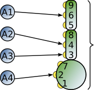

.. _synapse_spec:

Synapse specification
=====================

This page is about parameterizing synapses. See :ref:`connectivity_concepts` for specifying connections (for using an external library see :ref:`connection_generator`) and :ref:`handling_connections` for inspecting and modifying ``SynapseCollections``.

The synapse properties can be given as just the name of the desired
synapse model as a string, as a dictionary specifying synapse model
and parameters, or as a ``CollocatedSynapse`` object creating
multiple synapses for each source-target pair as detailed in
the section on :ref:`collocated synapses <collocated_synapses>`.

.. code-block:: python

    n = 10
    A = nest.Create('iaf_psc_alpha', n)
    B = nest.Create('iaf_psc_alpha', n)
    nest.Connect(A, B, syn_spec='static_synapse')

    syn_spec_dict = {'synapse_model': 'stdp_synapse',
                     'weight': 2.5, 'delay': 0.5}
    nest.Connect(A, B, syn_spec=syn_spec_dict)

If synapse properties are given as a dictionary, it may include the keys
``synapse_model`` (default `static_synapse`), ``weight`` (default 1.0),
``delay`` (default 1.0), and ``receptor_type`` (default 0, see :ref:`receptor-types` for details),
as well as parameters specific to the chosen synapse model. The specification of
all parameters is optional, and unspecified parameters will take on the
default values of the chosen synapse model that can be inspected using
``nest.GetDefaults(synapse_model)``.

Parameters can be either :ref:`fixed scalar values <scalar_params>`,
:ref:`arrays of values <array_params>`, or :ref:`expressions <dist_params>`.

One synapse dictionary can contain an arbitrary combination of parameter types,
as long as they are supported by the chosen connection rule.

.. _scalar_params:

Scalar parameters
-----------------

Scalar parameters must be given with the correct type. The ``weight``
for instance must be a float, while the ``receptor_type`` has to be of
type integer. When a synapse parameter is given as a scalar, the value
will be applied to all connections created in the current
:py:func:`.Connect` call.

.. code-block:: python

    n = 10
    neuron_dict = {'tau_syn': [0.3, 1.5]}
    A = nest.Create('iaf_psc_exp_multisynapse', n, neuron_dict)
    B = nest.Create('iaf_psc_exp_multisynapse', n, neuron_dict)
    syn_spec_dict ={'synapse_model': 'static_synapse', 'weight': 2.5, 'delay': 0.5, 'receptor_type': 1}
    nest.Connect(A, B, syn_spec=syn_spec_dict)

.. _array_params:

Array parameters
----------------

Array parameters can be used with the rules ``one_to_one``, ``all_to_all``,
``fixed_total_number``, ``fixed_indegree``, and ``fixed_outdegree``.
For details on connection rules, see :ref:`connectivity_concepts`.
The arrays can be specified as NumPy arrays or Python
lists. As with the scalar parameters, all parameters have to be
specified as arrays of the correct type.

One-to-one
~~~~~~~~~~

For rule :ref:`one_to_one` the array must have the same length as there
are nodes in ``A`` and ``B``.

.. code-block:: python

    A = nest.Create('iaf_psc_alpha', 2)
    B = nest.Create('spike_recorder', 2)
    conn_spec_dict = {'rule': 'one_to_one'}
    syn_spec_dict = {'weight': [1.2, -3.5]}
    nest.Connect(A, B, conn_spec_dict, syn_spec_dict)

All-to-all
~~~~~~~~~~

When connecting with rule :ref:`all_to_all`, the array parameter must
have dimension `len(B) x len(A)`.

.. code-block:: python

    A = nest.Create('iaf_psc_alpha', 3)
    B = nest.Create('iaf_psc_alpha', 2)
    syn_spec_dict = {'weight': [[1.2, -3.5, 2.5], [0.4, -0.2, 0.7]]}
    nest.Connect(A, B, syn_spec=syn_spec_dict)

Random, fixed total number
~~~~~~~~~~~~~~~~~~~~~~~~~~

For rule :ref:`fixed_total_number`, the array has to be same the length as the
number of connections ``N``.

.. code-block:: python

    A = nest.Create('iaf_psc_alpha', 3)
    B = nest.Create('iaf_psc_alpha', 4)
    conn_spec_dict = {'rule': 'fixed_total_number', 'N': 4}
    syn_spec_dict = {'weight': [1.2, -3.5, 0.4, -0.2]}
    nest.Connect(A, B, conn_spec_dict, syn_spec_dict)

Random, fixed in-degree
~~~~~~~~~~~~~~~~~~~~~~~

For rule :ref:`fixed_indegree` the array has to be a two-dimensional
NumPy array or Python list with shape ``(len(B), indegree)``, where
:hxt_ref:`indegree` is the number of incoming connections per target neuron.
This means that the rows describe the target, while the columns
represent the connections converging on the target neuron, regardless
of the identity of the source neurons.

.. code-block:: python

    A = nest.Create('iaf_psc_alpha', 5)
    B = nest.Create('iaf_psc_alpha', 3)
    conn_spec_dict = {'rule': 'fixed_indegree', 'indegree': 2}
    syn_spec_dict = {'weight': [[1.2, -3.5],[0.4, -0.2],[0.6, 2.2]]}
    nest.Connect(A, B, conn_spec_dict, syn_spec_dict)

Random, fixed out-degree
~~~~~~~~~~~~~~~~~~~~~~~~

For rule :ref:`fixed_outdegree` the array has to be a two-dimensional
NumPy array or Python list with shape ``(len(A), outdegree)``, where
:hxt_ref:`outdegree` is the number of outgoing connections per source
neuron. This means that the rows describe the source, while the
columns represent the connections starting from the source neuron
regardless of the identity of the target neuron.

.. code-block:: python

    A = nest.Create('iaf_psc_alpha', 2)
    B = nest.Create('iaf_psc_alpha', 5)
    conn_spec_dict = {'rule': 'fixed_outdegree', 'outdegree': 3}
    syn_spec_dict = {'weight': [[1.2, -3.5, 0.4], [-0.2, 0.6, 2.2]]}
    nest.Connect(A, B, conn_spec_dict, syn_spec_dict)

.. _dist_params:

Expressions as parameters
-------------------------

``nest.Parameter`` objects support a flexible specification of synapse
parameters through expressions.  This includes parameters drawn from random
distributions and
depending on spatial properties of source and target neurons. Parameters
can be combined through mathematical expressions including conditionals,
providing for a high degree of flexibility.

The following parameters and functionalities are provided:

- Random parameters
- Spatial parameters
- Spatially distributed parameters
- Mathematical functions
- Clipping, redrawing, and conditional parameters

For more information, check out the guide on
:ref:`parametrization <param_ex>` or the documentation on the
different :ref:`PyNEST APIs <pynest_api>`.

.. code-block:: python

    n = 10
    A = nest.Create('iaf_psc_alpha', n)
    B = nest.Create('iaf_psc_alpha', n)
    syn_spec_dict = {
        'synapse_model': 'stdp_synapse',
        'weight': 2.5,
        'delay': nest.random.uniform(min=0.8, max=2.5),
        'alpha': nest.math.redraw(nest.random.normal(mean=5.0, std=1.0), min=0.5, max=10000.)
    }
    nest.Connect(A, B, syn_spec=syn_spec_dict)

In this example, the default connection rule ``all_to_all`` is used
and connections will be using synapse model :hxt_ref:`stdp_synapse`. All synapses
are created with a static weight of 2.5 and a delay that is uniformly
distributed in [0.8, 2.5]. The parameter ``alpha`` is drawn from a
normal distribution with mean 5.0 and standard deviation 1.0;
values below 0.5 and above 10000 are excluded by re-drawing if they should occur.
Thus, the actual distribution is a slightly distorted Gaussian.

If the synapse type is supposed to have a unique name and still use
distributed parameters, it needs to be defined in two steps:

.. code-block:: python

    n = 10
    A = nest.Create('iaf_psc_alpha', n)
    B = nest.Create('iaf_psc_alpha', n)
    nest.CopyModel('stdp_synapse', 'excitatory', {'weight':2.5})
    syn_dict = {
        'synapse_model': 'excitatory',
        'weight': 2.5,
        'delay': nest.random.uniform(min=0.8, max=2.5),
        'alpha': nest.math.redraw(nest.random.normal(mean=5.0, std=1.0), min=0.5, max=10000.)
    }
    nest.Connect(A, B, syn_spec=syn_dict)

For further information on the available distributions see
:ref:`Random numbers in NEST <random_numbers>`.

.. _collocated_synapses:

Collocated synapses
-------------------

Some modeling applications require multiple connections between the
same pairs of nodes. An example of this could be a network, where each
pre-synaptic neuron connects with a static synapse to a modulatory
receptor on the post-synaptic neuron and with a plastic synapse to a
normal NMDA-type receptor.

This type of connectivity is especially hard to realize when using
randomized connection rules, as the chosen pairs that are actually
connected are only known internally, and have to be retrieved manually
after the call to :py:func:`.Connect` returns.

To ease the setup of such connectivity patterns, NEST supports a
concept called `collocated synapses`. This allows the creation of several
connections between chosen pairs of neurons (possibly with different
synapse types or parameters) in a single call to ``nest.Connect()``.

To create collocated synapses, the synapse specification consists of
an object of type ``CollocatedSynapses``, whose constructor takes
synapse specification dictionaries as arguments and applies the given
dictionaries to each source-target pair internally.

.. code-block:: python

    nodes = nest.Create('iaf_psc_alpha', 3)
    syn_spec = nest.CollocatedSynapses({'weight': 4.0, 'delay': 1.5},
                                       {'synapse_model': 'stdp_synapse'},
                                       {'synapse_model': 'stdp_synapse', 'alpha': 3.0})
    nest.Connect(nodes, nodes, conn_spec='one_to_one', syn_spec=syn_spec)
    print(nest.GetConnections().alpha)

The example above will create 9 connections in total because there are
3 neurons times 3 synapse specifications in the :py:func:`.CollocatedSynapses`
object, and the connection rule ``one_to_one`` is used.

.. code-block:: python

    >>> print(nest.num_connections)
    9

In more detail, the connections have the following properties:

* 3 are of type :hxt_ref:`static_synapse` with `weight` 4.0 and `delay` 1.5
* 3 are of type :hxt_ref:`stdp_synapse` with the default value for `alpha`
* 3 are of type :hxt_ref:`stdp_synapse` with an `alpha` of 3.0.

If you want to connect with different :ref:`receptor types
<receptor-types>`, you can do the following:

.. code-block:: python

    A = nest.Create('iaf_psc_exp_multisynapse', 7)
    B = nest.Create('iaf_psc_exp_multisynapse', 7, {'tau_syn': [0.1 + i for i in range(7)]})
    syn_spec_dict = nest.CollocatedSynapses({'weight': 5.0, 'receptor_type': 2},
                                            {'weight': 1.5, 'receptor_type': 7})
    nest.Connect(A, B, 'one_to_one', syn_spec_dict)

.. code-block:: python

    >>> print(nest.GetConnections().get())

You can see how many synapse parameters you have by calling ``len()`` on
your ``CollocatedSynapses`` object:

.. code-block:: python

    >>> len(syn_spec_dict)
    2

Spatially-structured networks
---------------------------------

Nodes in NEST can be created so that they have a position in two- or
three-dimensional space. To take full advantage of the arrangement of
nodes, connection parameters can be based on the nodes' positions or
their spatial relation to each other. See :ref:`Spatially-structured
networks <spatial_networks>` for the full information about how to create
and connect such networks.

Connecting sparse matrices with array indexing
--------------------------------------------------

Oftentimes, you will find yourself in a situation, where you want to
base your connectivity on actual data instead of rules. A common
scenario is that you have a (sometimes sparse) connection matrix
coming from an experiment or from a graph algorithm. Let's assume you
have a weight matrix of the form:

.. math::

    W = \begin{bmatrix}
    w_{11} & w_{21} & \cdots & w_{n1} \\
    w_{12} & w_{22} & \cdots & w_{n2} \\
    \vdots & \vdots & \ddots & \vdots \\
    w_{1m} & w_{2m} & \cdots & w_{nm} \\
    \end{bmatrix}

where :math:`w_{ij}` is the weight of the connection with pre-synaptic
node :math:`i` and post-synaptic node :math:`j`. In all generality, we
can assume that some weights are zero, indicating that there is no
connection at all.

As there is no support for creating connections from the whole matrix
directly, we will instead just iterate the pre-synaptic neurons and
connect one column at a time. We assume that there are :math:`n`
pre-synaptic nodes in the NodeCollection ``A`` and :math:`m`
post-synaptic nodes in ``B``. We also assume that we have our weight
matrix given as a two-dimensional NumPy array `W`, with :math:`n`
columns and :math:`m` rows.

.. code-block:: python

    W = numpy.array([[0.5,  0.0, 1.5],
                     [1.3,  0.2, 0.0],
                     [0.0, 1.25, 1.3]])

    A = nest.Create('iaf_psc_alpha', 3)
    B = nest.Create('iaf_psc_alpha', 3)

    for i, pre in enumerate(A):
        # Extract the weights column.
        weights = W[:, i]

        # To only connect pairs with a nonzero weight, we use array indexing
        # to extract the weights and post-synaptic neurons.
        nonzero_indices = numpy.where(weights != 0)[0]
        weights = weights[nonzero_indices]
        post = B[nonzero_indices]

        # Generate an array of node IDs for the column of the weight
        # matrix, with length based on the number of nonzero
        # elements. The array's dtype must be an integer.
        pre_array = numpy.ones(len(nonzero_indices), dtype=int) * pre.get('global_id')

        # nest.Connect() automatically converts post to a NumPy array
        # because pre_array contains multiple identical node IDs. When
        # also specifying a one_to_one connection rule, the arrays of
        # node IDs can then be connected.
        nest.Connect(pre_array, post, conn_spec='one_to_one', syn_spec={'weight': weights})

.. _receptor-types:

Receptor Types
-------------------

Conceptually, each connection in NEST terminates at a `receptor` on
the target node. The exact meaning of such a receptor depends on the
concrete type of that node. In a multi-compartment neuron, for
instance, the different compartments could be addressed as different
receptors, while another neuron model might make sets of different
synaptic parameters available for each receptor. Please refer to the
:doc:`neuron models documentation <../neurons/index>` for details.

In order to connect a pre-synaptic node to a certain receptor on a
post-synaptic node, the integer ID of the target receptor can be
supplied under the key ``receptor_type`` in the ``syn_spec``
dictionary during the call to :py:func:`.Connect`. If unspecified, the
receptor will take on its default value of 0. If you request a
receptor that is not available in the target node, this will result in
a runtime error.

To illustrate the concept of receptors in more detail, the following
example shows how to connect several ``iaf_psc_alpha`` neurons to the
different compartments of a multi-compartment integrate-and-fire
neuron (``iaf_cond_alpha_mc``) that are represented by different
receptors.

.. code-block:: python

    A1 = nest.Create('iaf_psc_alpha')
    A2 = nest.Create('iaf_psc_alpha')
    A3 = nest.Create('iaf_psc_alpha')
    A4 = nest.Create('iaf_psc_alpha')
    B = nest.Create('iaf_cond_alpha_mc')

    receptors = nest.GetDefaults('iaf_cond_alpha_mc')['receptor_types']

.. code-block:: python

    >>> print(receptors)
    {'soma_exc': 1,
     'soma_inh': 2,
     'soma_curr': 7,
     'proximal_exc': 3
     'proximal_inh': 4,
     'proximal_curr': 8,
     'distal_exc': 5,
     'distal_inh': 6,
     'distal_curr': 9,}

.. code-block:: python

    nest.Connect(A1, B, syn_spec={'receptor_type': receptors['distal_inh']})
    nest.Connect(A2, B, syn_spec={'receptor_type': receptors['proximal_inh']})
    nest.Connect(A3, B, syn_spec={'receptor_type': receptors['proximal_exc']})
    nest.Connect(A4, B, syn_spec={'receptor_type': receptors['soma_inh']})

In the example above, we retrieve a map of available receptors and
their IDs by extracting the `receptor_types` property from the model
defaults. This functionality is, however, only available for models
with a predefined number of receptors, while models with a variable
number of receptors usually don't provide such an enumeration.

An example for the latter are the `*_multisynapse` neuron models that
support multiple individual synaptic time constants for the different
receptors. In these models, the number of available receptors is not
predefined, but determined only by the length of the ``tau_syn``
vector that is supplied to the model instance. The following example
shows the setup and connection of such a model in more detail:

.. code-block:: python

    A = nest.Create('iaf_psc_alpha')
    B = nest.Create('iaf_psc_exp_multisynapse', params={'tau_syn': [0.1, 0.2, 0.3]})

    print(B.n_synapses)   # This will print 3, as we set 3 different tau_syns

    nest.Connect(A, B, syn_spec={'receptor_type': 2})

.. _synapse-types:

Synapse Types
-------------

NEST provides a number of built-in synapse models that can be used
during connection setup. The default model is the :hxt_ref:`static_synapse`,
whose only parameters ``weight`` and ``delay`` do not change over
time. Other synapse models implement learning and adaptation in the
form of long-term or short-term plasticity. A list of available
synapse models is accessible via the command ``nest.synapse_models``.
More detailed information about each of them can be found in the
:doc:`synapse model page <../synapses/index>`.

.. note::
   Not all nodes can be connected via all available synapse types. The
   events a synapse type is able to transmit is documented in the
   ``Transmits`` section of the model documentation.

All synapses store their parameters on a per-connection basis.
However, each of the built-in models is registered with the simulation
kernel in a number of different ways that slightly modify the
available properties of the connections instantiated from the model.
The different variants are indicated by specific suffixes:

.. glossary::

 ``_lbl``
   denotes `labeled synapses` that have an additional parameter
   `synapse_label` (type: int), which can be set to a user-defined
   value. In a common application this label is used to store an
   additional projection identifier. Please note that using this
   synapse variant may drive up the memory requirements of your
   simulations significantly, as the label is stored on a
   `per-synapse` basis.

 ``_hpc``
   denotes `synapses for high-performance computing scenarios`, which
   have minimal memory requirements by using thread-local target node
   indices internally. Use this version if you are running very large
   simulations.

 ``_hom``
   denotes `homogeneous synapses` that store certain parameters like
   `weight` and `delay` only once for all synapses of the same type
   and can thus be used to save memory.

The default parameter values of a synapse model can be inspected using
the command :py:func:`.GetDefaults`, which only takes the name of the
synapse model as an argument and returns a dictionary. Likewise, the
function :py:func:`.SetDefaults` takes the name of a synapse type and a
parameter dictionary as arguments and will modify the defaults of the
given model.

.. code-block:: python

    >>> print(nest.GetDefaults('static_synapse'))
    {'delay': 1.0,
     'has_delay': True,
     'num_connections': 0,
     'receptor_type': 0,
     'requires_symmetric': False,
     'sizeof': 32,
     'synapse_model': 'static_synapse',
     'weight': 1.0,
     'weight_recorder': ()}
    >>> nest.SetDefaults('static_synapse', {'weight': 2.5})

To further customize the process of creating synapses, it is often
useful to have the same basic synapse model available with different
parametrizations. To this end, :py:func:`.CopyModel` can be used to
create custom synapse types from already existing synapse types. In
the simplest case, it takes the names of the existing model and the
copied type to be created. The optional argument ``params`` allows to
directly customize the new type during the copy operation. If omitted,
the defaults of the copied model are taken.

.. code-block:: python

    nest.CopyModel('static_synapse', 'inhibitory', {'weight': -2.5})
    nest.Connect(A, B, syn_spec='inhibitory')

.. _inspecting_connections:

Inspecting Connections
----------------------

In order to assert that the instantiated network model actually looks
like what was intended, it is oftentimes useful to inspect the
connections in the network. For this, NEST provides the function

.. code-block:: python

    nest.GetConnections(source=None, target=None, synapse_model=None, synapse_label=None)

This function returns a ``SynapseCollection`` object that contains the
identifiers for connections that match the given filters.  ``source``
and ``target`` are given as NodeCollections, ``synapse_model`` is the
name of the model as a string and ``synapse_label`` is an integer
identifier. Any combination of these parameters is permitted. If
``nest.GetConnections()`` is called without parameters it returns all
connections in the network.

Internally, each connection in the SynapseCollection is represented by
the following five entries: source node ID, target node ID, thread ID
of the target, numeric synapse ID, and port.

The result of :py:func:`.GetConnections` can be further processed by
giving it as an argument to :py:func:`GetStatus`, or, better yet, by
using the :py:meth:`~.SynapseCollection.get` function on the SynapseCollection directly. Both
ways will yield a dictionary with the parameters of the connections
that match the filter criterions given to ``nest.GetConnections()``:

.. code-block:: python

    A = nest.Create('iaf_psc_alpha', 2)
    B = nest.Create('iaf_psc_alpha')
    nest.Connect(A, B)
    conn = nest.GetConnections()

.. code-block:: python

    >>> conn.get()
    {'delay': [1.0, 1.0],
     'port': [0, 1],
     'receptor': [0, 0],
     'sizeof': [32, 32],
     'source': [1, 2],
     'synapse_id': [18, 18],
     'synapse_model': ['static_synapse', 'static_synapse'],
     'target': [3, 3],
     'target_thread': [0, 0],
     'weight': [1.0, 1.0]}

The ``get()`` function of a SynapseCollection can optionally also take
a string or list of strings to only retrieve specific parameters. This
is useful if you do not want to inspect the entire synapse dictionary:

.. code-block:: python

    >>> conn.get('weight')
    [1.0, 1.0]

.. code-block:: python

    >>> conn.get(['source', 'target'])
    {'source': [1, 2], 'target': [3, 3]}

Another way of retrieving specific parameters is by getting them
directly from the SynapseCollection using the dot-notation:

.. code-block:: python

    >>> conn.delay
    [1.0, 1.0]

For :ref:`spatially distributed networks <spatial_networks>`, you can
access the distance between the source-target pairs by querying
`distance` on your SynapseCollection.

.. code-block:: python

    >>> spatial_conn.distance
        (0.47140452079103173,
         0.33333333333333337,
         0.4714045207910317,
         0.33333333333333337,
         3.925231146709438e-17,
         0.33333333333333326,
         0.4714045207910317,
         0.33333333333333326,
         0.47140452079103157)

You can further examine the SynapseCollection by checking the length
of it or by printing it to the terminal. The printout will be in the
form of a table that lists source and target node IDs, synapse model,
weight and delay:

.. code-block:: python

    >>> len(conn)
    2
    >>>  print(conn)
     source   target   synapse model   weight   delay
    -------- -------- --------------- -------- -------
          1        3  static_synapse    1.000   1.000
          2        3  static_synapse    1.000   1.000

A SynapseCollection can be indexed or sliced, if you only want to
inspect a subset of the connections contained in it:

.. code-block:: python

    >>> print(conn[0:2:2])
     source   target   synapse model   weight   delay
    -------- -------- --------------- -------- -------
         1        3  static_synapse    1.000   1.000

Last, but not least, SynapseCollection can be iterated, to retrieve
one connection at a time:

.. code-block:: python

    >>>  for c in conn:
    ...      print(c.source)
    1
    2

Modifying Existing Connections
------------------------------

To modify the parameters of an existing connection, you first have to
obtain handles to them using :py:func:`.GetConnections`. These handles
can then be given as arguments to the :py:func:`.SetStatus` function,
or by using the :py:meth:`~.SynapseCollection.set` function on the SynapseCollection directly:

.. code-block:: python

    n1 = nest.Create('iaf_psc_alpha', 2)
    n2 = nest.Create('iaf_psc_alpha', 2)
    nest.Connect(n1, n2)
    conn = nest.GetConnections()
    conn.set(weight=2.0)

.. code-block:: python

    >>> conn.get()
    {'delay': [1.0, 1.0, 1.0, 1.0],
     'port': [0, 1, 2, 3],
     'receptor': [0, 0, 0, 0],
     'sizeof': [32, 32, 32, 32],
     'source': [1, 1, 2, 2],
     'synapse_id': [18, 18, 18, 18],
     'synapse_model': ['static_synapse', 'static_synapse', 'static_synapse', static_synapse'],
     'target': [3, 4, 3, 4],
     'target_thread': [0, 0, 0, 0],
     'weight': [2.0, 2.0, 2.0, 2.0]}

To update a single parameter of a connection or a set of connections,
you can call the ``set()`` function of the SynapseCollection with the
keyword argument ``parameter_name``. The value for this argument can
be a single value, a list, or a ``nest.Parameter``. If a single value
is given, the value is set on all connections. If you use a list to
set the parameter, the list needs to be the same length as there are
connections in the SynapseCollection.

.. code-block:: python

    conn.set(weight=[4.0, 4.5, 5.0, 5.5])

Similar to how you retrieve several parameters at once with the
:py:meth:`~.SynapseCollection.get` function explained above, you can also set multiple
parameters at once using ``set(parameter_dictionary)``. Again, the
values of the dictionary can be a single value, a list, or a
``nest.Parameter``.

.. code-block:: python

    conn.set({'weight': [1.5, 2.0, 2.5, 3.0], 'delay': 2.0})

Finally, you can also directly set parameters on a SynapseCollection
using the dot-notation:

.. code-block:: python

    >>> conn.weight = 5.
    >>> conn.weight
    [5.0, 5.0, 5.0, 5.0]
    >>> conn.delay = [5.1, 5.2, 5.3, 5.4]
    >>> conn.delay
    [5.1, 5.2, 5.3, 5.4]

Note that some parameters like ``source`` and ``target`` are read-only and
cannot be set. The documentation of a specific synapse model will
point out which parameters can be set and which are read-only.
