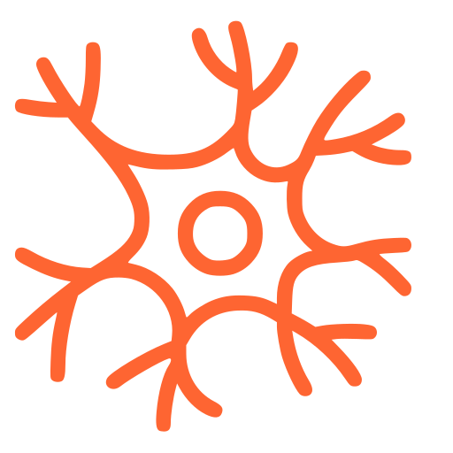
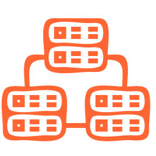
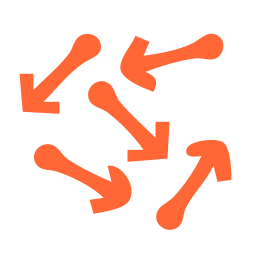
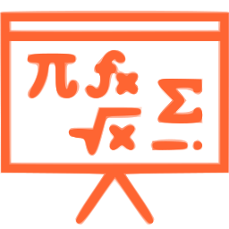
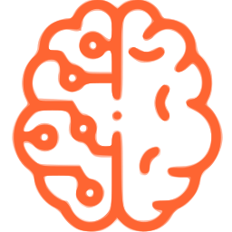

Understand how NEST works
=========================

Here you can dive into various topics about NEST.

.. grid:: 1 1 2 3

   .. grid-item-card:: |neuron| All about neurons
       :class-title: sd-d-flex-row sd-align-minor-center

       * :ref:`node_handles`

       * :ref:`param_ex`

       * :ref:`sim_precise_spike_times`

       * :ref:`exact_integration`

   .. grid-item-card:: |synapse|  All about synapses and connections
       :class-title: sd-d-flex-row sd-align-minor-center

       * :ref:`connection_management`

       * :ref:`handling_connections`

       * :ref:`sim_gap_junctions`

       * :ref:`weight_normalization`

   .. grid-item-card:: |device| All about devices
       :class-title: sd-d-flex-row sd-align-minor-center

       * :ref:`record_simulations`

       * :ref:`stimulate_network`

.. grid:: 1 1 2 3

   .. grid-item-card:: |network| Spatially-structured networks
       :class-title: sd-d-flex-row sd-align-minor-center
       :link: spatial_networks
       :link-type: ref

   .. grid-item-card:: |math| Models in NEST
       :class-title: sd-d-flex-row sd-align-minor-center
       :link:  models_contents
       :link-type: ref

.. grid:: 1 1 2 3

   .. grid-item-card::  |random| NEST behavior
       :class-title: sd-d-flex-row sd-align-minor-center

       * :ref:`built_in_timers`

       * :ref:`random_numbers`

       * :ref:`run_simulations`

   .. grid-item-card:: |connect| Connect to other tools
       :class-title: sd-d-flex-row sd-align-minor-center

       * :ref:`nest_server`

       * :ref:`nest_music`

   .. grid-item-card:: |hpc| High performance computers (HPC)
       :class-title: sd-d-flex-row sd-align-minor-center
       :link: parallel_computing
       :link-type: ref

.. grid:: 1 1 2 3

   .. grid-item-card:: |refresh| Convert NEST 2.X scripts to 3.X
       :class-title: sd-d-flex-row sd-align-minor-center
       :link: refguide_2_3
       :link-type: ref

   .. grid-item-card:: |git| What's new?
       :class-title: sd-d-flex-row sd-align-minor-center
       :link: whats_new
       :link-type: ref

   .. grid-item-card::  |glossary| Glossary
       :class-title: sd-d-flex-row sd-align-minor-center
       :link: glossary
       :link-type: ref

.. toctree::
   :maxdepth: 1
   :hidden:

   What's new? <whats_new/index>
   Neurons <neurons/index>
   Synapses and connections <synapses/index>
   Devices  <devices/index>
   Spatially-structured networks <networks/spatially_structured_networks>
   NEST models <models/index>
   Simulation behavior <nest_behavior/running_simulations>
   Randomness in NEST <nest_behavior/random_numbers>
   Built-in timers <nest_behavior/built-in_timers>
   Connect NEST with other tools <connect_nest/index>
   Parallel computing <hpc/parallel_computing>
   Benchmarking <hpc/benchmarking>
   From NEST 2.x to 3.x <whats_new/v3.0/refguide_nest2_nest3>
   Glossary <ref_material/glossary>

