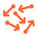

Understand how NEST works
=========================

Here you can dive into various topics about NEST.

    .. :ref:`Neurons <neurons_index>`
       :ref:`Synapses and connections <synapse_index>`
       :ref:`Devices <device_index>`
       :ref:`Spatially-structured networks <spatial_networks>`

.. grid:: 3
   :gutter: 1

   .. grid-item-card:: |neuronicon| All about neurons

       * :ref:`node_handles`

       * :ref:`param_ex`

       * :ref:`sim_precise_spike_times`

       * :ref:`exact_integration`

   .. grid-item-card:: |synapseicon| All about synapses and connections

       * :ref:`connection_management`

       * :ref:`handling_connections`

       * :ref:`sim_gap_junctions`

       * :ref:`weight_normalization`

   .. grid-item-card:: |deviceicon| All about devices

       * :ref:`record_simulations`

       * :ref:`stimulate_network`

.. grid:: 2

   .. grid-item-card::
      :columns: 4
      :img-background: static/img/brainnetwork_orange128.png
      :link: spatial_networks 
      :link-type: ref

      Spatially-strucutred networks
      ^^^^^^^^^^^^^^^^^^^^^^^^^^^^^

   .. grid-item-card::
      :columns: 4 
      :img-background: static/img/math_orange128.png
      :link:  models_contents
      :link-type: ref

      Models in NEST
      ^^^^^^^^^^^^^^^

.. grid::  3
   :gutter: 1

   .. grid-item-card:: |randomicon| NEST behavior

       * :ref:`built_in_timers`

       * :ref:`random_numbers`

       * :ref:`run_simulations`

   .. grid-item-card:: |connecticon| Connect to other tools

       * :ref:`nest_server`

       * :ref:`nest_music`

   .. grid-item-card:: High performance computers (HPC) 
      :img-background: static/img/hpc_orange64.png
      :link: parallel_computing
      :link-type: ref

.. grid::  3
   :gutter: 1

   .. grid-item-card:: Convert NEST 2.X scripts to 3.X

        :ref:`refguide_2_3`

   .. grid-item-card:: Release notes

       :ref:`release_3.3`

       :ref:`release_3.2`

       :ref:`release_3.1`

       :ref:`release_3.0`

   .. grid-item-card:: 
      :img-background: static/img/glossary_transparent128.png
      :link: glossary
      :link-type: ref

      Glossary
      ^^^^^^^^

    
.. toctree::
   :maxdepth: 1
   :hidden:

   From NEST 2.x to 3.x <release_notes/v3.0/refguide_nest2_nest3>
   NEST models <models/models-main>
   Neurons <neurons/index>
   Synapses and connections <synapses/index>
   Devices  <devices/index>
   Spatially-structured networks <networks/spatially_structured_networks>
   Simulation behavior <nest_behavior/running_simulations>
   Randomness in NEST <nest_behavior/random_numbers>
   Built-in timers <nest_behavior/built-in_timers>
   Connect NEST with other tools <connect_nest/index>
   Parallel computing <hpc/parallel_computing>
   Benchmarking <hpc/benchmarking>
   Release notes <release_notes/index>
   Glossary <ref_material/glossary>

.. |networkicon| image:: static/img/brainnetwork_orange64.png

.. |deviceicon| image:: static/img/device_orange64.png

