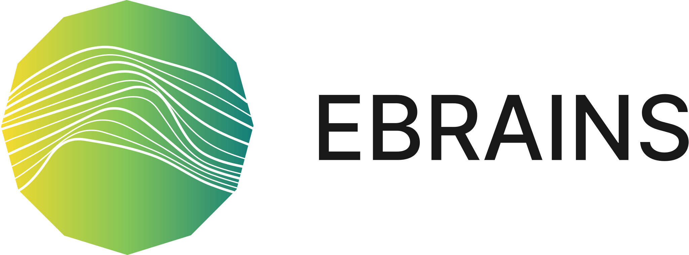

********************************************
Welcome to the NEST simulator documentation!
********************************************

+------------------------------------+---------------------------------------+
|                                    |                                       |
|    :doc:`Download <download>`      |  :doc:`Install <installation/index>`  |
|                                    |                                       |
+------------------------------------+---------------------------------------+

NEST is a simulator for **spiking neural network models**, ideal for networks of any size, for example:

1.  Models of information processing e.g. in the visual or auditory cortex of
    mammals,

2.  Models of network activity dynamics, e.g. laminar cortical networks or
    balanced random networks,

3.  Models of learning and plasticity.

**New to NEST?**
    Start here at our :doc:`Getting Started <getting_started>` page

**Have an idea of the type of model you need?**
    Click on one of the images to access our :doc:`model directory <models/index>`:

.. raw:: html

 <embed>

 
  
  
  </embed>

**Create complex networks using the Topology Module or the Microcircuit Model:**

.. raw:: html

  <embed>
  
  

  </embed>

**Need a different model?**
    Check out how you can :doc:`create you own model <models/create_model>` here.

**Have a question or issue with NEST?**
    See our :doc:`Getting Help <getting_help>` page.

How the documentation is organized
##################################

* :doc:`Tutorials <tutorials/index>` show you step by step instructions using NEST. If you haven't used NEST before, the PyNEST tutorial is a good place to start.

* :doc:`Example Networks <examples/index>`  demonstrate the use of dozens of the neural network models implemented in NEST.

* :doc:`Topical Guides <guides/index>` provide deeper insight into several topics and concepts from :doc:`Parallel Computing <guides/parallel_computing>` to handling :doc:`Gap Junction Simulations <guides/simulations_with_gap_junctions>` and :doc:`setting up a topological network <topology/index>`.

* :doc:`Reference Material <ref_material/index>` provides a quick look up of definitions, functions and terms.

Contribute
##########

* Have you used NEST in an article or presentation? :doc:`Let us know <community>` and we will add it to our list of `publications <https://www.nest-simulator.org/publications/>`_.
  Find out how to :doc:`cite NEST <citing-nest>` in your work.

* If you have any comments or suggestions, please share them on our :doc:`Mailing List <community>`.

* Want to contribute code? Check out our `Developer Space <https://nest.github.io/nest-simulator/>`_ to get started!

* For more info about our larger community and the history of NEST check out the `NEST Initiative <https://www.nest-initiative.org>`_ website

Links to other projects
-----------------------

The  `NeuralEnsemble <http://neuralensemble.org/>`_ is a community-based initiative to promote and co-ordinate open-source software development in neuroscience.
They host numerous software including `PyNN <http://neuralensemble.org/PyNN/>`_, a simulator-independent language for building neuronal network models and `Elephant (Electrophysiology Analysis Toolkit) <http://neuralensemble.org/elephant/>`_, a package for the analysis of neurophysiology data, using Neo data structures.

Acknowledgements
################

This project has received funding from the European Union’s Horizon 2020 Framework Programme for Research and
Innovation under Specific Grant Agreement No. 945539 (Human Brain Project SGA3), No. 720270 (Human Brain Project
SGA1), No. 785907 (Human Brain Project SGA2), No. 754304 (DEEP-EST) and No. 800858 (ICEI).

The authors gratefully acknowledge the received support and funding from the European Union 6th and 7th Framework
Program under grant agreement no. 15879 (FACETS), the European Union 7th Framework Program under grant agreement no.
269921 (BrainScaleS), the European Union 7th Framework Programme ([FP7/2007-2013]) under grant agreement no. 604102
(Human Brain Project, HBP), the computing time granted by the JARA-HPC Vergabegremium and provided on the JARA-HPC
Partition part of the supercomputers JUQUEEN and JURECA at Forschungszentrum Jülich (VSR computation time grant
JINB33), the Jülich Aachen Research Alliance (JARA), the Next-Generation Supercomputer Project of MEXT, Japan, the
eScience program of the Research Council of Norway under grant 178892/V30 (eNeuro), the Helmholtz Association through
the Helmholtz Portfolio Theme "Supercomputing and Modeling for the Human Brain", the Excellence Initiative of the
German federal and state governments, the Priority Program (SPP 2041 "Computational Connectomics") of the Deutsche
Forschungsgemeinschaft [S.J. van Albada: AL 2041/1-1], the Helmholtz young investigator's group VH-NG-1028 "Theory of
multi-scale neuronal networks", and compute time provided by UNINETT Sigma2 - the National Infrastructure for High
Performance Computing and Data Storage in Norway and its predecessors.

