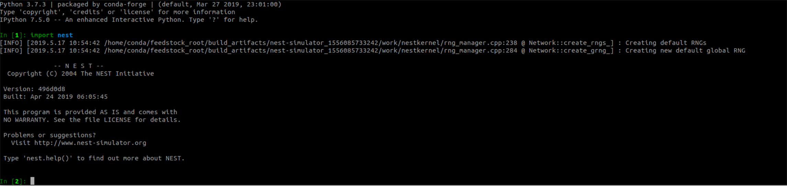

Install NEST with Conda (Linux and macOS) - BETA
============================================================

The NEST simulator is now available as a package on conda-forge.
If you don't have Conda installed, we recommend you follow the instructions on `Miniconda <https://conda.io/miniconda.html>`__.

If you need to install NEST with additional configuration options,
please see our :doc:`install guide for Linux <linux_install>` or :doc:`install guide for macOS <mac_install>`

.. note::

   The conda-forge package of `nest-simulator` is still being tested, let us know if you come across
   any problems by `submitting an issue on GitHub <https://github.com/nest/nest-simulator/issues>`_.

Install the latest conda-forge package for NEST
-----------------------------------------------------

1. Create your conda environment and install NEST. We recommend that you create a dedicated
   environment for NEST, which should ensure there are no conflicts with previously
   installed packages.

.. admonition:: IMPORTANT!

   We strongly recommend that you install all programs you'll need,
   (such as ipython or jupyter-lab) in the environment (ENVNAME) at the same time, by appending them to the following command.
   Installing packages later may override previously installed dependencies and potentially break packages!
   See `managing environments in the Conda documentation <https://docs.conda.io/projects/conda/en/latest/user-guide/tasks/manage-environments.html#creating-an-environment-with-commands>`_ for more information.

WITHOUT openmpi:

.. code-block:: sh

  conda create --name ENVNAME -c conda-forge nest-simulator python

WITH openmpi:

.. code-block:: sh

   conda create --name ENVNAME -c conda-forge nest-simulator=*=mpi_openmpi*  python

Where the syntax for this install follows the pattern: ``nest-simulator=<version>=<build_string>``

2. Activate your environment:

.. code-block:: sh

  conda activate ENVNAME

.. note::

  The conda-forge package is available from NEST 2.16.0 onward

3. Once installation is complete, you can open up Python or IPython
   in the terminal and import nest:

.. code-block:: python
  :linenos:

  python
  import nest

If installation was successful, you should see the NEST splash screen:

**The installation is now complete!**

Next Steps
-----------

Once you have completed installation, take a look at our :doc:`PyNEST tutorials <../tutorials/index>` page
find out how to create your first simulation or checkout some of our :doc:`example networks <../examples/index>`!

----

Source Code:
https://github.com/conda-forge/nest-simulator-feedstock/

Anaconda cloud package:
https://anaconda.org/conda-forge/nest-simulator

The conda-forge package was tested on macOS 10.14 (Mojave) and Ubuntu 18.04 (Bionic Beaver)
