.. _sec:intro:

=====================
Topology User Manual
=====================

.. TODO: Should it still be called "Topology User Manual",
..       now that the PyNEST Topology Module is gone?

The Topology Module provides the NEST simulator [1]_
with a convenient interface for creating layers of neurons placed in
space and connecting neurons in such layers with probabilities and
properties depending on the relative placement of neurons. This permits
the creation of complex networks with spatial structure.

This user manual provides an introduction to the functionality provided
by the Topology Module. It is based exclusively on the PyNEST, the
Python interface to NEST. NEST users using the SLI
interface should be able to map instructions to corresponding SLI code.
This manual is not meant as a comprehensive reference manual. Please
consult the online documentation in PyNEST for details; where
appropriate, that documentation also points to relevant SLI
documentation.

This manual describes the Topology Module included with NEST 3.0.

.. TODO: Chapter 5 about parameters?

In the next chapter of this manual, we introduce Topology layers, which
place neurons in space. In Chapter \ :ref:`3 <sec:connections>` we then
describe how to connect layers with each other, before discussing in
Chapter \ :ref:`4 <sec:inspection>` how you can inspect and visualize
Topology networks. Chapter \ :ref:`5 <ch:extending>` deals with the more
advanced topic of extending the Topology module with custom masks provided
by C++ classes in an extension module.

You will find the Python scripts used in the examples in this manual in
the NEST source code directory under
``doc/topology/user_manual_scripts``.

.. _sec:limitations:

Limitations and Disclaimer
--------------------------

Undocumented features
   The Topology Module provides a number of undocumented features, which
   you may discover by browsing the code. These features are highly
   experimental and should *not be used for simulations*, as they have
   not been validated.

.. _sec:layers:

Layers
======

.. TODO: Not called Module anymore?

The Topology Module (just Topology for short in the remainder of this
document) organizes neuronal networks in *layers*. Layers in NEST 3
are GIDCollections with spatial metadata. We will first
illustrate how Topology places elements in simple layers, where each
element is a single model neuron.

We will illustrate the definition and use of layers using examples.

Topology distinguishes between two classes of layers:

grid-based layers
   in which each element is placed at a location in a regular grid;

free layers
   in which elements can be placed arbitrarily in the plane.

Grid-based layers allow for more efficient connection-generation under
certain circumstances.

.. _sec:gridbased:

Grid-based Layers
-----------------

.. _sec:verysimple:

A very simple layer
~~~~~~~~~~~~~~~~~~~

We create a first, grid-based simple layer with the following command:

.. literalinclude:: user_manual_scripts/layers.py
    :start-after: #{ layer1 #}
    :end-before: #{ end #}

.. _fig_layer1:

.. figure:: user_manual_figures/layer1.png
   :name: fig:layer1

   Simple grid-based layer centered about the origin. Blue circles mark
   layer elements, the thin square the extent of the layer. Row and
   column indices are shown in the right and top margins, respectively.

The layer is shown in :numref:`fig_layer1`. Note the following properties:

- We are using the standard ``Create`` function, but in addition to model
  type, we are also passing a ``nest.spatial.grid`` object as the
  ``positions`` argument.

-  The layer has five *rows* and five *columns*.

-  The *center* of the layer is at the origin of the coordinate system,
   :math:`(0,0)`.

-  The *extent* or size of the layer is :math:`1\times  1`. This is the
   default size for grid-based layers. The extent is marked by the thin
   square in :numref:`fig_layer1`.

-  The *grid spacing* of the layer is

.. _dx_dy_extent:

.. math::

      \begin{split}
      dx &= \frac{\text{x-extent}}{\text{number of columns}} \\
      dy &= \frac{\text{y-extent}}{\text{number of rows}}
      \end{split}

In the layer shown, we have :math:`dx=dy=0.2`,
but the grid spacing may differ in x- and y-direction.

-  Layer elements are spaced by the grid spacing and are arranged
   symmetrically about the center.

-  The outermost layer elements are placed :math:`dx/2` and :math:`dy/2`
   from the borders of the extent.

-  Element *positions* in the coordinate system are given by
   :math:`(x,y)` pairs. The *coordinate system* follows that standard
   mathematical convention that the :math:`x`-axis runs from left to
   right and the :math:`y`-axis from bottom to top.

-  Each element of a grid-based layer has a *row- and column-index* in
   addition to its :math:`(x,y)`-coordinates. Indices are shown in the
   top and right margin of  :numref:`fig_layer1`. Note that row-indices
   follow matrix convention, i.e., run from top to bottom. Following
   pythonic conventions, indices run from 0.

.. _sec:setextent:

Setting the extent
~~~~~~~~~~~~~~~~~~

Grid-based layers have a default extent of :math:`1\times 1`. You can specify a
different extent of a layer, i.e., its size in :math:`x`- and
:math:`y`-direction by passing the ``extent`` argument to ``nest.spatial.grid()``:

.. literalinclude:: user_manual_scripts/layers.py
    :start-after: #{ layer2 #}
    :end-before: #{ end #}

.. _fig_layer2:

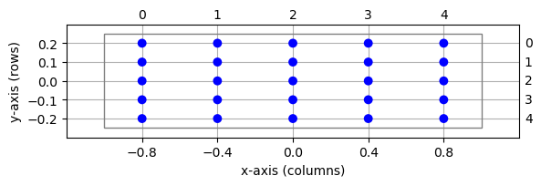

   Same layer as in :numref:`fig_layer1`, but with different extent.

The resulting layer is shown in :numref:`fig_layer2`. The extent is always
a two-element tuple of floats. In this example, we have grid spacings
:math:`dx=0.4` and :math:`dy=0.1`. Changing the extent does not affect
grid indices.

The size of ``extent`` in :math:`x`- and :math:`y`-directions should
be numbers that can be expressed exactly as binary fractions. This is
automatically ensured for integer values. Otherwise, under rare
circumstances, subtle rounding errors may occur and trigger an
assertion, thus stopping NEST.

.. _sec:setcenter:

Setting the center
~~~~~~~~~~~~~~~~~~

Layers are centered about the origin :math:`(0,0)` by default. This can
be changed by passing the ``center`` argument to ``nest.spatial.grid()``.
The following code creates layers centered about :math:`(0,0)`,
:math:`(-1,1)`, and :math:`(1.5,0.5)`, respectively:

.. literalinclude:: user_manual_scripts/layers.py
    :start-after: #{ layer3 #}
    :end-before: #{ end #}

.. _fig_layer3:

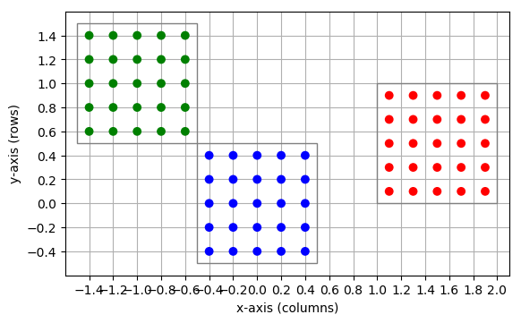

   Three layers centered, respectively, about :math:`(0,0)` (blue),
   :math:`(-1,-1)` (green), and :math:`(1.5,0.5)` (red).

The center is given as a two-element tuple of floats. Changing the
center does not affect grid indices: For each of the three layers in
 :numref:`fig_layer3`, grid indices run from 0 to 4 through columns and
rows, respectively, even though elements in these three layers have
different positions in the global coordinate system.

The ``center`` coordinates should be numbers that can be expressed
exactly as binary fractions. For more information, see
Sec. \ :ref:`2.1.2 <sec:setextent>`.

.. _sec:fixedlayerexample:

Constructing a layer: an example
~~~~~~~~~~~~~~~~~~~~~~~~~~~~~~~~

To see how to construct a layer, consider the following example:

-  a layer with :math:`n_r` rows and :math:`n_c` columns;

-  spacing between nodes is :math:`d` in :math:`x`- and
   :math:`y`-directions;

-  the left edge of the extent shall be at :math:`x=0`;

-  the extent shall be centered about :math:`y=0`.

From Eq. :numref:`dx_dy_extent`, we see that the extent of the layer must be
:math:`(n_c d, n_r d)`. We now need to find the coordinates
:math:`(c_x, c_y)` of the center of the layer. To place the left edge of
the extent at :math:`x=0`, we must place the center of the layer at
:math:`c_x=n_c d / 2` along the :math:`x`-axis, i.e., half the extent
width to the right of :math:`x=0`. Since the layer is to be centered
about :math:`y=0`, we have :math:`c_y=0`. Thus, the center coordinates
are :math:`(n_c d/2, 0)`. The layer is created with the following code
and shown in :numref:`fig_layer3a`:

.. literalinclude:: user_manual_scripts/layers.py
    :start-after: #{ layer3a #}
    :end-before: #{ end #}

.. _fig_layer3a:

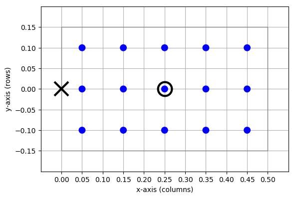

   Layer with :math:`n_c=5` rows and :math:`n_r=3` columns, spacing
   :math:`d=0.1` and the left edge of the extent at :math:`x=0`,
   centered about the :math:`y`-axis. The cross marks the point on the
   extent placed at the origin :math:`(0,0)`, the circle the center of
   the layer.

.. _sec:freelayer:

Free layers
-----------

*Free layers* do not restrict node positions to a grid, but allow free
placement within the extent. To this end, the user can specify the
positions of all nodes explicitly, or pass a random distribution
parameter to ``nest.spatial.free()``. The following code creates a layer of
50 ``iaf_psc_alpha`` neurons uniformly distributed in a layer with
extent :math:`1\times 1`, i.e., spanning the square
:math:`[-0.5,0.5]\times[-0.5,0.5]`:

.. literalinclude:: user_manual_scripts/layers.py
    :start-after: #{ layer4 #}
    :end-before: #{ end #}

.. _fig_layer4:

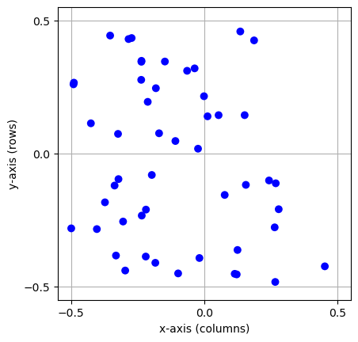

   A free layer with 50 elements uniformly distributed in an extent of
   size :math:`1\times 1`.

Note the following points:

-  For free layers, element *positions* are specified by the
   ``nest.spatial.free`` object.

-  The ``'positions'`` entry must either be a Python ``list`` (or ``tuple``) of
   element coordinates, i.e., of two-element tuples of floats giving the
   (:math:`x`, :math:`y`)-coordinates of the elements, or a parameter object.

-  All layer element positions must be *within* the layer’s extent.
   Elements may be placed on the perimeter of the extent as long as no
   periodic boundary conditions are used; see
   Sec. \ :ref:`2.4 <sec:periodic>`.

.. _sec:3dlayer:

3D layers
---------

Although the term “layer” suggests a 2-dimensional structure, the layers
in NEST may in fact be 3-dimensional. The example from the previous
section may be easily extended with another component in the coordinates
for the positions:

.. literalinclude:: user_manual_scripts/layers.py
    :start-after: #{ layer4_3d #}
    :end-before: #{ end #}

.. _fig_layer4_3d:

.. figure:: user_manual_figures/layer4_3d.png
   :name: fig:layer4_3d

   A free 3D layer with 200 elements uniformly distributed in an extent
   of size :math:`1\times 1\times 1`.

.. _sec:periodic:

Periodic boundary conditions
----------------------------

Simulations usually model systems much smaller than the biological
networks we want to study. One problem this entails is that a
significant proportion of neurons in a model network is close to the
edges of the network with fewer neighbors than nodes properly inside the
network. In the :math:`5\times 5`-layer in :numref:`fig_layer1`, e.g., 16
out of 25 nodes form the border of the layer.

One common approach to reducing the effect of boundaries on simulations
is to introduce *periodic boundary conditions*, so that the rightmost
elements on a grid are considered nearest neighbors to the leftmost
elements, and the topmost to the bottommost. The flat layer becomes the
surface of a torus.  :numref:`fig_player` illustrates this for a
one-dimensional layer, which turns from a line to a ring upon
introduction of periodic boundary conditions.

You specify periodic boundary conditions for a layer using the
dictionary entry ``edge_wrap``:

.. literalinclude:: user_manual_scripts/layers.py
    :start-after: #{ player #}
    :end-before: #{ end #}

.. _fig_player:

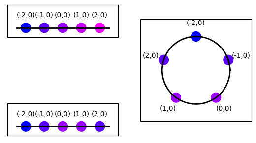

   Top left: Layer with single row and five columns without periodic
   boundary conditions. Numbers above elements show element coordinates.
   Colors shifting from blue to magenta mark increasing distance from
   the element at :math:`(-2,0)`. Bottom left: Same layer, but with
   periodic boundary conditions. Note that the element at :math:`(2,0)`
   now is a nearest neighbor to the element at :math:`(-2,0)`. Right:
   Layer with periodic boundary condition arranged on a circle to
   illustrate neighborhood relationships.

Note that the longest possible distance between two elements in a layer
without periodic boundary conditions is

.. math:: \sqrt{x_{\text{ext}}^2 + y_{\text{ext}}^2}

\ but only

.. math:: \left.\sqrt{x_{\text{ext}}^2 + y_{\text{ext}}^2}\right/ 2

for a layer with periodic boundary conditions; :math:`x_{\text{ext}}`
and :math:`y_{\text{ext}}` are the components of the extent size.

We will discuss the consequences of periodic boundary conditions more in
Chapter \ :ref:`3 <sec:connections>`.

.. _sec:subnet:

Topology layer as NEST GIDCollection
~~~~~~~~~~~~~~~~~~~~~~~~~~~~~~~~~~~~

From the perspective of NEST, a Topology layer is a special type of
*GIDCollection*. From the user perspective, the following points may
be of interest:

-  The GICCollection has a ``spatial`` property describing the layer
   properties (``l`` is the layer created above):

.. literalinclude:: user_manual_scripts/layers.py
    :start-after: #{ layer1s #}
    :end-before: #{ end #}

.. literalinclude:: user_manual_scripts/layers.log
    :start-after: #{ layer1s.log #}
    :end-before: #{ end.log #}

The ``spatial`` propery is read-only; changing any values will
not change properties of the layer.

-  NEST sees the elements of the layer in the same way as the
   elements of any GIDCollection. GIDCollections created as layers can
   therefore be used in the same ways as any standard GIDCollection.
   However, operations requiring a GIDCollection with spatial data (e.g.
   ``Connect`` with spatial dependence, or visualization of layers) can
   only be used on GIDCollections created as layers.

.. literalinclude:: user_manual_scripts/layers.py
    :start-after: #{ layer1p #}
    :end-before: #{ end #}

.. literalinclude:: user_manual_scripts/layers.log
    :start-after: #{ layer1p.log #}
    :end-before: #{ end.log #}

.. _sec:layerdesign:

.. TODO: Rewrite this section and code example

Designing layers
~~~~~~~~~~~~~~~~

A paper on a neural network model might describe the network as
follows [2]_:

   The network consists of :math:`20x20` microcolumns placed on a
   regular grid spanning :math:`0.5^\circ\times 0.5^\circ` of visual
   space. Neurons within each microcolumn are organized into L2/3, L4,
   and L56 subpopulations. Each subpopulation consists of three
   pyramidal cells and one interneuron. All pyramidal cells are modeled
   as NEST ``iaf_psc_alpha`` neurons with default parameter values,
   while interneurons are ``iaf_psc_alpha`` neurons with threshold
   voltage :math:`V_{\text{th}}=-52`\ mV.

How should you implement such a network in NEST? The recommended approach
is to ... :

.. literalinclude:: user_manual_scripts/layers.py
    :start-after: #{ layer10 #}
    :end-before: #{ end #}

We will discuss in Chapter \ :ref:`3.1 <sec:conn_basics>` how to connect
selectively to different neuron models.

.. _sec:connections:

Connections
===========

The most important feature of the Topology module is the ability to
create connections between layers with quite some flexibility. In this
chapter, we will illustrate how to specify and create connections. All
connections are created using the ``Connect`` function.

.. _sec:conn_basics:

Basic principles
----------------

.. _sec:terminology:

Terminology
~~~~~~~~~~~

We begin by introducing important terminology:

Connection
   In the context of connections between the elements of Topology
   layers, we often call the set of all connections between pairs of
   network nodes created by a single call to ``Connect`` a
   *connection*.

Connection dictionary
   A dictionary specifying the properties of a connection between two
   layers in a call to ``Create``.

Source
   The *source* of a single connection is the node sending signals
   (usually spikes). In a projection, the source layer is the layer from
   which source nodes are chosen.

Target
   The *target* of a single connection is the node receiving signals
   (usually spikes). In a projection, the target layer is the layer from
   which target nodes are chosen.

.. TODO: Can we remove connection type definition? How about convergent and divergent?

.. Connection type
..    The *connection type* determines how nodes are selected when
..    ``Connect`` creates connections between layers. It is either
..    ``'convergent'`` or ``'divergent'``.

.. Convergent connection
..    When creating a *convergent connection* between layers, Topology visits
..    each node in the target layer in turn and selects sources for it in the
..    source layer. Masks and connection probabilities are applied to the
..    source layer, and periodic boundary conditions are applied in the
..    source layer, provided that the source layer has periodic boundary
..    conditions.

.. Divergent connection
..    When creating a *divergent connection*, Topology visits each node in
..    the source layer and selects target nodes from the target layer. Masks,
..    connection probabilities, and boundary conditions are applied in the
..    target layer.

Driver
   When connecting two layers, the *driver* layer is the one in which
   each node is considered in turn.

Pool
   | When connecting two layers, the *pool* layer is the one from which
     nodes are chosen for each node in the driver layer. I.e., we have

   +--------------------------------+--------------+--------------+
   | Connection parameters          | Driver       | Pool         |
   +================================+==============+==============+
   | ``rule='pairwise_bernoulli'``  | source layer | target layer |
   +--------------------------------+--------------+--------------+
   | ``rule='fixed_outdegree'``     | source layer | target layer |
   +--------------------------------+--------------+--------------+
   | ``rule='pairwise_bernoulli'``  | target layer | source layer |
   | and ``use_on_source=True``     |              |              |
   +--------------------------------+--------------+--------------+
   | ``rule='fixed_indegree'``      | target layer | source layer |
   +--------------------------------+--------------+--------------+

Displacement
   The *displacement* between a driver and a pool node is the shortest
   vector connecting the driver to the pool node, taking boundary
   conditions into account.

Distance
   The *distance* between a driver and a pool node is the length of
   their displacement.

Mask
   The *mask* defines which pool nodes are at all considered as
   potential targets for each driver node. See
   Sec. \ :ref:`3.3 <sec:conn_masks>` for details.

Connection probability or ``p``
   The *connection probability*, specified as ``p`` in the connection
   specifications, is either a value, or a Parameter which specifies the
   probability for creating a connection between a driver and a pool node.
   The default probability is :math:`1`, i.e., connections are created with
   certainty. See Sec. \ :ref:`3.4 <sec:conn_kernels>` for details.

Autapse
   An *autapse* is a synapse (connection) from a node onto itself.
   Autapses are permitted by default, but can be disabled by adding
   ``'allow_autapses': False`` to the connection dictionary.

Multapse
   Node A is connected to node B by a *multapse* if there are synapses
   (connections) from A to B. Multapses are permitted by default, but
   can be disabled by adding ``'allow_multapses': False`` to the
   connection dictionary.

.. _sec:minimalcall:

Connecting Topology layers
~~~~~~~~~~~~~~~~~~~~~~~~~~

Connections between Topology layers are created by calling ``Connect``, as
with normal GIDCollections. But in addition to the usual ways one could
connect GIDCollections, having spatial information about the nodes makes
position-based options available. In many cases when connecting layers, a
mask will be specified. Mask specifications are described in
Sec. \ :ref:`3.3 <sec:conn_masks>`.

Only neurons within the mask are considered as potential sources or
targets. If no mask is given, all neurons in the respective layer are
considered sources or targets.

Here is a simple example, cf. :numref:`fig_conn1`

.. literalinclude:: user_manual_scripts/connections.py
    :start-after: #{ conn1 #}
    :end-before: #{ end #}

.. _fig_conn1:

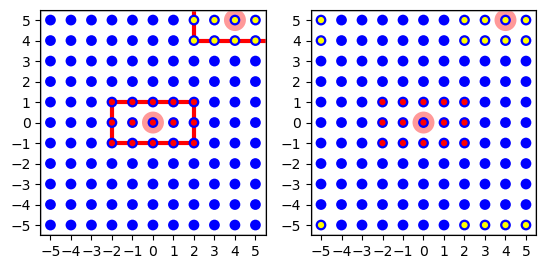

   Left: Minimal connection example from a layer onto itself using a
   rectangular mask shown as red line for the node at :math:`(0,0)`
   (marked light red). The targets of this node are marked with red
   dots. The targets for the node at :math:`(4,5)` are marked with
   yellow dots. This node has fewer targets since it is at the corner
   and many potential targets are beyond the layer. Right: The effect of
   periodic boundary conditions is seen here. Source and target layer
   and connection dictionary were identical, except that periodic
   boundary conditions were used. The node at :math:`(4,5)` now has 15
   targets, too, but they are spread across the corners of the layer. If
   we wrapped the layer to a torus, they would form a :math:`5\times 3`
   rectangle centered on the node at :math:`(4,5)`.

In this example, layer ``l`` is both source and target layer. For each
node in the layer we choose targets according to the rectangular mask
centered about each source node. Since the connection probability is 1.0,
we connect to all nodes within the mask. Note the effect of normal and
periodic boundary conditions on the connections created for different
nodes in the layer, as illustrated in :numref:`fig_conn1`.

.. _sec:mapping:

Mapping source and target layers
--------------------------------

The application of masks and other functions depending on the distance
or even the displacement between nodes in the source and target layers
requires a mapping of coordinate systems between source and target
layers. Topology applies the following *coordinate mapping rules*:

1. All layers have two-dimensional Euclidean coordinate systems.

2. No scaling or coordinate transformation can be applied between
   layers.

3. The displacement :math:`d(D,P)` from node :math:`D` in the driver
   layer to node :math:`P` in the pool layer is measured by first
   mapping the position of :math:`D` in the driver layer to the
   identical position in the pool layer and then computing the
   displacement from that position to :math:`P`. If the pool layer has
   periodic boundary conditions, they are taken into account. It does
   not matter for displacement computations whether the driver layer has
   periodic boundary conditions.

.. _sec:conn_masks:

Masks
-----

A mask describes which area of the pool layer shall be searched for
nodes to connect for any given node in the driver layer. We will first
describe geometrical masks defined for all layer types and then consider
grid-based masks for grid-based layers. If no mask is specified, all
nodes in the pool layer will be searched.

Note that the mask size should not exceed the size of the layer when
using periodic boundary conditions, since the mask would “wrap around”
in that case and pool nodes would be considered multiple times as
targets.

If none of the mask types provided in the topology library meet your
need, you may add more mask types in a NEST extension module. This is
covered in Chapter \ `5 <#ch:extending>`__.

.. _sec:free_masks:

Masks for 2D layers
~~~~~~~~~~~~~~~~~~~

Topology currently provides four types of masks usable for 2-dimensional
free and grid-based layers. They are illustrated in  :numref:`fig_conn2_a`.
The masks are

Rectangular
   All nodes within a rectangular area are connected. The area is
   specified by its lower left and upper right corners, measured in the
   same unit as element coordinates. Example:

.. literalinclude:: user_manual_scripts/connections.py
    :start-after: #{ conn2r #}
    :end-before: #{ end #}

Circular
   All nodes within a circle are connected. The area is specified by its
   radius.

.. literalinclude:: user_manual_scripts/connections.py
    :start-after: #{ conn2c #}
    :end-before: #{ end #}

Doughnut
   All nodes between an inner and outer circle are connected. Note that
   nodes *on* the inner circle are not connected. The area is specified
   by the radii of the inner and outer circles.

.. literalinclude:: user_manual_scripts/connections.py
    :start-after: #{ conn2d #}
    :end-before: #{ end #}

Elliptical
   All nodes within an ellipsis are connected. The area is specified by
   its major and minor axis.

.. literalinclude:: user_manual_scripts/connections.py
    :start-after: #{ conn2e #}
    :end-before: #{ end #}

.. _fig_conn2_a:

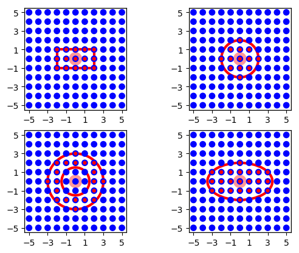

   Masks for 2D layers. For all mask types, the driver node is marked by
   a wide light-red circle, the selected pool nodes by red dots and the
   masks by red lines. From left to right, top to bottom: rectangular,
   circular, doughnut and elliptical masks centered about the driver
   node.

By default, the masks are centered about the position of the driver
node, mapped into the pool layer. You can change the location of the
mask relative to the driver node by specifying an ``'anchor'`` entry in
the mask dictionary. The anchor is a 2D vector specifying the location
of the mask center relative to the driver node, as in the following
examples (cf.  :numref:`fig_conn2_b`).

.. literalinclude:: user_manual_scripts/connections.py
    :start-after: #{ conn2ro #}
    :end-before: #{ end #}

.. literalinclude:: user_manual_scripts/connections.py
    :start-after: #{ conn2co #}
    :end-before: #{ end #}

.. literalinclude:: user_manual_scripts/connections.py
    :start-after: #{ conn2do #}
    :end-before: #{ end #}

.. literalinclude:: user_manual_scripts/connections.py
    :start-after: #{ conn2eo #}
    :end-before: #{ end #}

.. _fig_conn2_b:

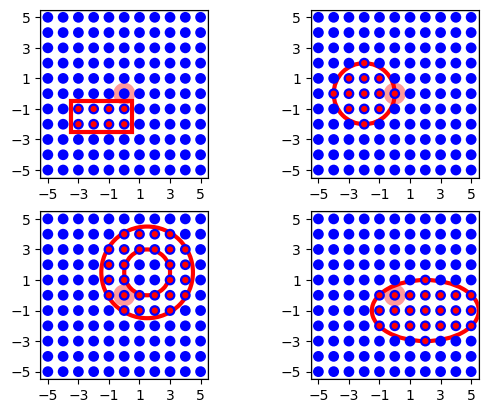

   The same masks as in :numref:`fig_conn2_a`, but centered about
   :math:`(-1.5,-1.5)`, :math:`(-2,0)`, :math:`(1.5,1.5)` and
   :math:`(2, -1)`, respectively, using the ``'anchor'`` parameter.

.. TODO: missing first part of the sentence?

and :math:`\textbf{elliptical}` masks, see Fig :numref:`fig_conn2_b`. To do so,
add an ``'azimuth_angle'`` entry in the specific mask dictionary. The
``azimuth_angle`` is measured in degrees and is the rotational angle
from the x-axis to the y-axis.

.. literalinclude:: user_manual_scripts/connections.py
    :start-after: #{ conn2rr #}
    :end-before: #{ end #}

.. literalinclude:: user_manual_scripts/connections.py
    :start-after: #{ conn2er #}
    :end-before: #{ end #}

.. _fig_conn2_c:

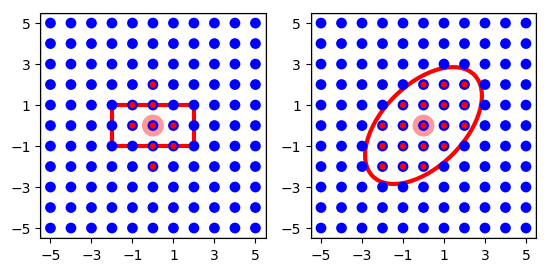

   Rotated rectangle and elliptical mask from  :numref:`fig_conn2_a` and
    :numref:`fig_conn2_b`, where the rectangle mask is rotated
   :math:`120^\circ` and the elliptical mask is rotated
   :math:`45^\circ`.

.. _sec:3d_masks:

Masks for 3D layers
~~~~~~~~~~~~~~~~~~~

Similarly, there are three mask types that can be used for 3D layers,

Box
   All nodes within a cuboid volume are connected. The area is specified
   by its lower left and upper right corners, measured in the same unit
   as element coordinates. Example:

.. literalinclude:: user_manual_scripts/connections.py
    :start-after: #{ conn_3d_a #}
    :end-before: #{ end #}

Spherical
   All nodes within a sphere are connected. The area is specified by its
   radius.

.. literalinclude:: user_manual_scripts/connections.py
    :start-after: #{ conn_3d_b #}
    :end-before: #{ end #}

Ellipsoidal
   All nodes within an ellipsoid are connected. The area is specified by
   its major, minor, and polar axis.

.. literalinclude:: user_manual_scripts/connections.py
    :start-after: #{ conn_3d_c #}
    :end-before: #{ end #}

As in the 2D case, you can change the location of the mask relative to
the driver node by specifying a 3D vector in the ``'anchor'`` entry in
the mask dictionary. If you want to rotate the box or ellipsoidal masks,
you can add an ``'azimuth_angle'`` entry in the specific mask dictionary
for rotation from the x-axis towards the y-axis about the z-axis, or an
``'polar_angle'`` entry, specifying the rotation angle in degrees from
the z-axis about the (possibly rotated) x axis, from the (possibly
rotated) y-axis. You can specify both at once of course. If both are
specified, we first rotate about the z-axis and then about the new
x-axis. NEST currently do not support rotation in all three directions,
the rotation from the y-axis about the (possibly rotated) z-axis, from
the (possibly rotated) x-axis is missing.

.. _fig_conn_3d:

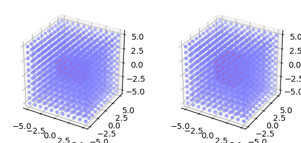

   Masks for 3D layers. For all mask types, the driver node is marked by
   a wide light-red circle, the selected pool nodes by red dots and the
   masks by red lines. From left to right: box and spherical masks
   centered about the driver node.

.. _sec:grid_masks:

Masks for grid-based layers
~~~~~~~~~~~~~~~~~~~~~~~~~~~

Grid-based layers can be connected using rectangular *grid masks*. For
these, you specify the size of the mask not by lower left and upper
right corner coordinates, but give their size in rows and columns, as in
this example:

.. literalinclude:: user_manual_scripts/connections.py
    :start-after: #{ conn3 #}
    :end-before: #{ end #}

The resulting connections are shown in  :numref:`fig_conn3`. By default the
top-left corner of a grid mask, i.e., the grid mask element with grid
index :math:`[0,0]`\  [3]_, is aligned with the driver node. You can
change this alignment by specifying an *anchor* for the mask:

.. literalinclude:: user_manual_scripts/connections.py
    :start-after: #{ conn3c #}
    :end-before: #{ end #}

You can even place the anchor outside the mask:

.. literalinclude:: user_manual_scripts/connections.py
    :start-after: #{ conn3x #}
    :end-before: #{ end #}

The resulting connection patterns are shown in  :numref:`fig_conn3`.

.. _fig_conn3:

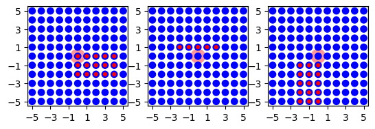

   Grid masks for connections between grid-based layers. Left:
   :math:`5\times 3` mask with default alignment at upper left corner.
   Center: Same mask, but anchored to center node at grid index
   :math:`[1,2]`. Right: Same mask, but anchor to the upper left of the
   mask at grid index :math:`[-1,2]`.

Connections specified using grid masks are generated more efficiently
than connections specified using other mask types.

Note the following:

-  Grid-based masks are applied by considering grid indices. The
   position of nodes in physical coordinates is ignored.

-  In consequence, grid-based masks should only be used between layers
   with identical grid spacings.

-  The semantics of the ``'anchor'`` property for grid-based masks
   differ significantly for general masks described in
   Sec. \ :ref:`3.3.1 <sec:free_masks>`. For general masks, the anchor is
   the center of the mask relative to the driver node. For grid-based
   nodes, the anchor determines which mask element is aligned with the
   driver element.

.. _sec:conn_kernels:

Probabilistic connection rules
------------------------------

Many neuronal network models employ probabilistic connection rules.
Topology supports probabilistic connections through the
``pairwise_bernoulli`` rule. The probability can then be a constant,
depend on the position of the source or the target neuron, or on the
distance between a driver and a pool node to a connection probability. To
create dependencies on neuron positions, NEST Parameters objects are used.
Topology then generates a connection according to this probability.

Probabilistic connections between layers can be generated in two different
ways:

Free probabilistic connections using pairwise_bernoulli
   In this case, ``Connect`` considers each driver node :math:`D` in turn.
   For each :math:`D`, it evaluates the parameter value for each pool node
   :math:`P` within the mask and creates a connection according to the
   resulting probability. This means in particular that *each possible
   driver-pool pair is inspected exactly once* and that there will be *at
   most one connection between each driver-pool pair*.

Prescribed number of connections
   can be obtained by using ``fixed_indegree`` or ``fixed_outdegree``, and
   specifying the number of connections to create per driver node. See
   Sec. \ :ref:`3.7 <sec:prescribed_numbers>` for details.

A selection of topology-specific NEST Parameters are shown in Table
:ref:`tbl_parameters`.

.. _tbl_parameters:

Topology-specific NEST Parameters
~~~~~~~~~~~~~~~~~~~~~~~~~~~~~~~~~

The Parameters in the table below represent positions of neurons or
distances between two neurons. To set node parameters, only the node
position can be used. The others can only be used when connecting.

  +-----------------------------------------+-------------------------------------------------------------------------+
  | Parameter                               | Description                                                             |
  +=========================================+=========================================================================+
  | | ``nest.spatial.pos.x``                | | Position of a neuron, on the x, y, and z axis.                        |
  | | ``nest.spatial.pos.y``                | | Can be used to set node properties, but not for connecting.           |
  | | ``nest.spatial.pos.z``                |                                                                         |
  +-----------------------------------------+-------------------------------------------------------------------------+
  | | ``nest.spatial.source_pos.x``         | | Position of the source neuron, on the x, y, and z axis.               |
  | | ``nest.spatial.source_pos.y``         | | Can only be used when connecting.                                     |
  | | ``nest.spatial.source_pos.z``         |                                                                         |
  +-----------------------------------------+-------------------------------------------------------------------------+
  | | ``nest.spatial.target_pos.x``         |                                                                         |
  | | ``nest.spatial.target_pos.y``         | | Position of the target neuron, on the x, y, and z axis.               |
  | | ``nest.spatial.target_pos.z``         | | Can only be used when connecting.                                     |
  +-----------------------------------------+-------------------------------------------------------------------------+
  | | ``nest.spatial.distance``             | | Distance between two nodes. Can only be used when connecting.         |
  +-----------------------------------------+-------------------------------------------------------------------------+
  | | ``nest.spatial.distance.x``           |                                                                         |
  | | ``nest.spatial.distance.y``           | | Distance on the x, y and z axis between the source and target neuron. |
  | | ``nest.spatial.distance.z``           | | Can only be used when connecting.                                     |
  +-----------------------------------------+-------------------------------------------------------------------------+

NEST provides some functions to help create distributions based on for
example the distance between two neurons, shown in the table below. There
are also Parameters drawing values from random distributions.

  +----------------------------------------------+--------------------+------------------------------------------------------+
  | Distribution function                        | Arguments          | Function                                             |
  +==============================================+====================+======================================================+
  |                                              |                    | .. math:: p(x) = a e^{-\frac{x}{\tau}}               |
  | ``nest.spatial_distributions.exponential()`` | | x,               |                                                      |
  |                                              | | a,               |                                                      |
  |                                              | | tau              |                                                      |
  +----------------------------------------------+--------------------+------------------------------------------------------+
  |                                              | | x,               | .. math::                                            |
  | ``nest.spatial_distributions.gaussian()``    | | p_center,        |     p(x) = p_{\text{center}}  e^{-\frac              |
  |                                              | | mean,            |     {(x-\text{mean})^2}{2\text{std_deviation}^2}}    |
  |                                              | | std_deviation    |                                                      |
  +----------------------------------------------+--------------------+------------------------------------------------------+
  |                                              |                    | .. math::                                            |
  |                                              | | x,               |                                                      |
  |                                              | | y,               |    p(x) = p_{\text{center}}                          |
  |                                              | | p_center,        |    e^{-\frac{\frac{(x-\text{mean_x})^2}              |
  | ``nest.spatial_distributions.gaussian2D()``  | | mean_x,          |    {\text{std_deviation_x}^2}-\frac{                 |
  |                                              | | mean_y,          |    (y-\text{mean_y})^2}{\text{std_deviation_y}^2}+2  |
  |                                              | | std_deviation_x, |    \rho\frac{(x-\text{mean_x})(y-\text{mean_y})}     |
  |                                              | | std_deviation_y, |    {\text{std_deviation_x}\text{std_deviation_y}}}   |
  |                                              | | rho              |    {2(1-\rho^2)}}                                    |
  +----------------------------------------------+--------------------+------------------------------------------------------+
  |                                              |                    | .. math:: p(x) = \frac{x^{\alpha-1}e^{-\frac{x}      |
  | ``nest.spatial_distributions.gamma()``       | | x,               |     {\theta}}}{\theta^\alpha\Gamma(\alpha)}          |
  |                                              | | alpha,           |                                                      |
  |                                              | | theta            |                                                      |
  +----------------------------------------------+--------------------+------------------------------------------------------+
  |                                              |                    | :math:`p\in [\text{min},\text{max})` uniformly       |
  | ``nest.random.uniform()``                    | | min,             |                                                      |
  |                                              | | max              |                                                      |
  +----------------------------------------------+--------------------+------------------------------------------------------+
  |                                              |                    | normal with given mean and :math:`\sigma`            |
  | ``nest.random.normal()``                     | | mean,            |                                                      |
  |                                              | | std,             |                                                      |
  +----------------------------------------------+--------------------+------------------------------------------------------+
  |                                              |                    |                                                      |
  | ``nest.random.exponential()``                | | beta             | exponential with a given scale, :math:`\beta`        |
  |                                              |                    |                                                      |
  +----------------------------------------------+--------------------+------------------------------------------------------+
  |                                              |                    | :math:`p \in [\text{min},\text{max})` lognormal      |
  |                                              | | mean,            | with given :math:`\mu` and :math:`\sigma`            |
  | ``nest.random.lognormal()``                  | | sigma,           |                                                      |
  |                                              | | min,             |                                                      |
  |                                              | | max,             |                                                      |
  |                                              | | dimension        |                                                      |
  +----------------------------------------------+--------------------+------------------------------------------------------+

.. _fig_conn4:

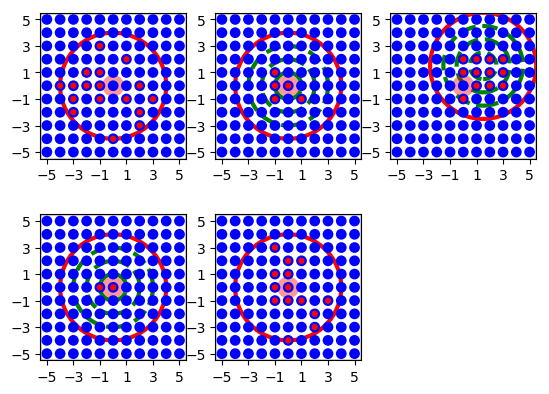

   Illustration of various connection probabilities. Top left: constant probability,
   :math:`p=0.5`. Top right: Distance dependent Gaussian probability, green dashed lines show
   :math:`\sigma`, :math:`2\sigma`, :math:`3\sigma`. Bottom left: Same distance dependent
   Gaussian probability, but all :math:`p<0.5` treated as :math:`p=0`. Bottom
   right: 2D-Gaussian.

Several examples follow. They are illustrated in  :numref:`fig_conn4`.

Constant
   Fixed connection probability:

.. literalinclude:: user_manual_scripts/connections.py
    :start-after: #{ conn4cp #}
    :end-before: #{ end #}

Gaussian
   The distance between neurons is used in a Gaussian distribution. In the example, connection
   probability is 1 for :math:`d=0` and falls off with a “standard
   deviation” of :math:`\sigma=1`:

.. literalinclude:: user_manual_scripts/connections.py
    :start-after: #{ conn4g #}
    :end-before: #{ end #}

Cut-off Gaussian
   In this example we have a distance-dependent Gaussian distributon,
   where all probabilities less than :math:`0.5` are set to zero:

.. TODO: Reference to full Parameter table with nest.logic.conditional().

.. literalinclude:: user_manual_scripts/connections.py
    :start-after: #{ conn4cut #}
    :end-before: #{ end #}

2D Gaussian
   We conclude with an example using a two-dimensional Gaussian
   distribution, i.e., a Gaussian with different widths in :math:`x`- and
   :math:`y-` directions. This probability depends on displacement, not
   only on distance:

.. literalinclude:: user_manual_scripts/connections.py
    :start-after: #{ conn42d #}
    :end-before: #{ end #}

Note that for pool layers with periodic boundary conditions, Topology
always uses the shortest possible displacement vector from driver to
pool neuron as ``nest.spatial.distance``.

.. _sec:conn_wd:

Weights and delays
------------------

Parameters, such as those presented in Table :ref:`tbl_parameters`, can
also be used to specify distance-dependent or randomized weights and
delays for the connections created by ``Connect``.

Figure :numref:`fig_conn5` illustrates weights and delays generated using these
functions with the following code examples. All examples use a “layer”
of 51 nodes placed on a line; the line is centered about :math:`(25,0)`,
so that the leftmost node has coordinates :math:`(0,0)`. The distance
between neighboring elements is 1. The mask is rectangular, spans the
entire layer and is centered about the driver node.

Linear example

.. literalinclude:: user_manual_scripts/connections.py
    :start-after: #{ conn5lin #}
    :end-before: #{ end #}

Results are shown in the top panel of  :numref:`fig_conn5`. Connection
weights and delays are shown for the leftmost neuron as driver. Weights
drop linearly from :math:`1`. From the node at :math:`(20,0)` on, the
cutoff sets weights to 0. There are no connections to nodes beyond
:math:`(25,0)`, since the mask extends only 25 units to the right of the
driver. Delays increase in a stepwise linear fashion, as NEST requires
delays to be multiples of the simulation resolution.

Linear example with periodic boundary conditions

.. literalinclude:: user_manual_scripts/connections.py
    :start-after: #{ conn5linpbc #}
    :end-before: #{ end #}

Results are shown in the middle panel of  :numref:`fig_conn5`. This example
is identical to the previous, except that the (pool) layer has periodic
boundary conditions. Therefore, the left half of the mask about the node
at :math:`(0,0)` wraps back to the right half of the layer and that node
connects to all nodes in the layer.

Various functions

.. literalinclude:: user_manual_scripts/connections.py
    :start-after: #{ conn5exp #}
    :end-before: #{ end #}

.. literalinclude:: user_manual_scripts/connections.py
    :start-after: #{ conn5gauss #}
    :end-before: #{ end #}

Results are shown in the bottom panel of :numref:`fig_conn5`. It shows
linear, exponential and Gaussian distributions of the distance between
connected nodes, used with weight functions for the node at
:math:`(25,0)`.

Randomized weights and delays

.. literalinclude:: user_manual_scripts/connections.py
    :start-after: #{ conn5uniform #}
    :end-before: #{ end #}

By using the ``nest.random.uniform()`` Parameter for weights or delays, one can
obtain randomized values for weights and delays, as shown by the red
circles in the bottom panel of :numref:`fig_conn5`.

.. _fig_conn5:

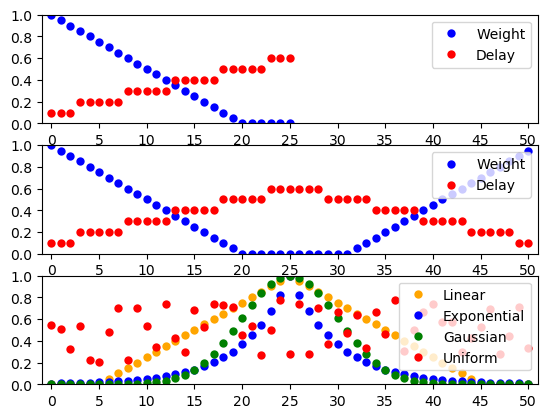

   Distance-dependent and randomized weights and delays. See text for
   details.

Designing distance-dependent Parameters
---------------------------------------

Although NEST comes with some pre-defined functions that can be used to
create distributions of distance-dependent Parameters, this is not a limit
to how Parameters can be combined.

.. TODO: reference to Parameter documentation

As an example, we will combine Parameters to create a Parameter that is
linear (actually affine) in the displacement of the nodes, on the form

.. math:: p = 0.5 + d_x + 2 d_y.

\ where :math:`d_x` and :math:`d_y` are the displacements between the source and
target neuron on the x and y axis, respectively. The Parameter is then simply:

.. literalinclude:: user_manual_scripts/connections.py
    :start-after: #{ conn_param_design #}
    :end-before: #{ end #}

And can be directly plugged into the ``Connect`` function:

.. literalinclude:: user_manual_scripts/connections.py
    :start-after: #{ conn_param_design_ex #}
    :end-before: #{ end #}

.. _sec:conn_pbc:

Periodic boundary conditions
----------------------------

Connections between layers with periodic boundary conditions are based
on the following principles:

-  Periodic boundary conditions are always applied in the pool layer. It
   is irrelevant whether the driver layer has periodic boundary
   conditions or not.

-  By default, Topology does not accept masks that are wider than the
   pool layer when using periodic boundary conditions. Otherwise, one
   pool node could appear as multiple targets to the same driver node as
   the masks wraps several times around the layer. For layers with
   different extents in :math:`x`- and :math:`y`-directions this means
   that the maximum layer size is determined by the smaller extension.

-  ``nest.spatial.distance`` and its single dimension variants
   always consider the shortest distance (displacement) between driver and
   pool node.

In most physical systems simulated using periodic boundary conditions,
interactions between entities are short-range. Periodic boundary
conditions are well-defined in such cases. In neuronal network models
with long-range interactions, periodic boundary conditions may not make
sense. In general, we recommend to use periodic boundary conditions only
when connection masks are significantly smaller than the layers they are
applied to.

.. _sec:prescribed_numbers:

Prescribed number of connections
--------------------------------

We have so far described how to connect layers by either connecting to all
nodes inside the mask or by considering each pool node in turn and
connecting it according to a given probability function. In both cases,
the number of connections generated depends on mask and connection
probability.

Many neuron models in the literature, in contrast, prescribe a certain
*fan in* (number of incoming connections) or *fan out* (number of outgoing
connections) for each node. You can achieve this in Topology by
prescribing the number of connections for each driver node by using
``fixed_indegree`` or ``fixed_outdegree``.

Connection generation now proceeds in a different way than before:

1. For each driver node, ``Connect`` randomly selects a node from
   the mask region in the pool layer, and creates a connection with the
   probability prescribed. This is repeated until the
   requested number of connections has been created.

2. Thus, if all nodes in the mask shall be connected with equal
   probability, you should not specify a connection probability.

3. If you specify a probability with a distance-dependent distribution
   (e.g., Gaussian, linear, exponential), the connections will be
   distributed within the mask with the spatial profile given by the
   probability.

4. If you prohibit multapses (cf Sec. \ :ref:`3.1.1 <sec:terminology>`)
   and prescribe a number of connections greater than the number of pool
   nodes in the mask, ``Connect`` may get stuck in an infinite
   loop and NEST will hang. Keep in mind that the number of nodes within
   the mask may vary considerably for free layers with randomly placed
   nodes.

The following code generates a network of 1000 randomly placed nodes and
connects them with a fixed fan out, of 50 outgoing connections per node
distributed with a profile linearly decaying from unit probability to
zero probability at distance :math:`0.5`. Multiple connections
(multapses) between pairs of nodes are allowed, self-connections
(autapses) prohibited. The probability of finding a connection at a
certain distance is then given by the product of the probabilities for
finding nodes at a certain distance with the probability value for this
distance. For the connection probability and parameter values below we have

.. _eq_ptheo:

.. math::

   p_{\text{conn}}(d) = \frac{12}{\pi} \times 2\pi r \times (1-2r)
    = 24 r (1-2r) \qquad \text{for} \quad 0\le r < \frac{1}{2}\;.\qquad

The resulting distribution of distances between connected nodes is shown in
 :numref:`fig_conn6`.

.. literalinclude:: user_manual_scripts/connections.py
    :start-after: #{ conn6 #}
    :end-before: #{ end #}

.. _fig_conn6:

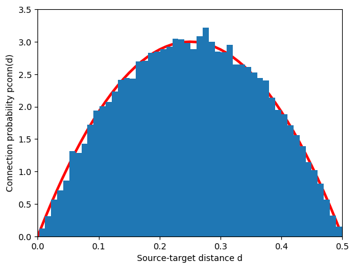

   Distribution of distances between source and target for a network of
   1000 randomly placed nodes, a fixed fan out of 50 connections and a
   connection probability decaying linearly from 1 to 0 at
   :math:`d=0.5`. The red line is the expected distribution from
   Eq. :numref:`eq_ptheo`.

Functions determining weight and delay as function of
distance/displacement work in just the same way as before when the
number of connections is prescribed.

.. TODO: Remove this section?

.. _sec:conn_composite:

.. Connecting composite layers
.. ---------------------------

.. Connections between layers with composite elements are based on the
.. following principles:

.. -  All nodes within a composite element have the same coordinates, the
..    coordinates of the element.

.. -  All nodes within a composite element are treated equally. If, e.g.,
..    an element of the pool layer contains three nodes and connection
..    probability is 1, then connections with all three nodes will be
..    created. For probabilistic connection schemes, each of the three
..    nodes will be considered individually.

.. -  If only nodes of a given model within each element shall be
..    considered as sources or targets then this can be achieved by adding
..    a ``'sources'`` or ``'targets'`` entry to the connection dictionary,
..    which specifies the model to connect.

.. This is exemplified by the following code, which connects pyramidal
.. cells (``pyr``) to interneurons (``in``) with a circular mask and
.. uniform probability and interneurons to pyramidal cells with a
.. rectangular mask unit probability.

.. .. literalinclude:: user_manual_scripts/connections.py
..     :start-after: #{ conn7 #}
..     :end-before: #{ end #}

.. _sec:conn_synapse:

Synapse models and properties
-----------------------------

By default, ``Connect`` creates connections using the default synapse
model in NEST, ``static_synapse``. You can specify a different model by
adding a ``'synapse_model'`` entry to the synapse specification
dictionary, as in this example:

.. literalinclude:: user_manual_scripts/connections.py
    :start-after: #{ conn8 #}
    :end-before: #{ end #}

You have to use synapse models if you want to set, e.g., the receptor
type of connections or parameters for plastic synapse models. These can
not be set in distance-dependent ways at present.

.. _sec:dev_subregions:

Connecting devices to subregions of layers
------------------------------------------

It is possible to connect stimulation and recording devices only to
specific subregions of layers. A simple way to achieve this is to create
a layer which contains only the device placed typically in its center.
For connecting the device layer to a neuron layer, an appropriate mask
needs to be specified and optionally also an anchor for shifting the
center of the mask. As demonstrated in the following example,
stimulation devices have to be connected as the source layer

.. literalinclude:: user_manual_scripts/connections.py
    :start-after: #{ conn9 #}
    :end-before: #{ end #}

while recording devices have to be connected as the target layer(see also
Sec. \ :ref:`3.11 <sec:rec_dev>`):

.. literalinclude:: user_manual_scripts/connections.py
    :start-after: #{ conn10 #}
    :end-before: #{ end #}

.. _sec:rec_dev:

Layers and recording devices
----------------------------

Generally, one should not create a layer of recording devices,
especially spike detectors, to record from a topology layer. Instead,
create a single spike detector, and connect all neurons in the layer to
that spike detector:

.. literalinclude:: user_manual_scripts/connections.py
    :start-after: #{ conn11 #}
    :end-before: #{ end #}

Connecting a layer of neurons to a layer of recording devices as described
in Sec. \ :ref:`3.10 <sec:dev_subregions>`, such as spike detectors, is
only possible using the ``pairwise_bernoulli`` rule. Note that voltmeter
and multimeter are not suffering from this restriction, since they are
connected as sources, not as targets.

.. _sec:inspection:

Inspecting Layers
=================

We strongly recommend that you inspect the layers created to be sure that
node placement and connectivity indeed turned out as expected. In this
chapter, we describe some functions that NEST provide to query and
visualize networks, layers, and connectivity.

.. _sec:queries:

Query functions
---------------

The following table presents some query functions provided by NEST. For
detailed information about these functions, please see the online Python
and SLI documentation.

+---------------------------------+---------------------------------------------+
| ``nest.PrintNodes()``           | Print the GID ranges and model names of the |
|                                 | nodes in the network.                       |
+---------------------------------+---------------------------------------------+
| ``nest.GetConnections()``       | Retrieve connections (all or for a given    |
|                                 | source or target); see also                 |
|                                 | http://www.nest-simulator.org/connection_ma |
|                                 | nagement.                                   |
+---------------------------------+---------------------------------------------+
| ``nest.GetNodes()``             | Returns a GIDCollection of the layer        |
|                                 | elements.                                   |
|                                 |                                             |
|                                 |                                             |
+---------------------------------+---------------------------------------------+
| ``nest.GetPosition()``          | Return the spatial locations of nodes.      |
+---------------------------------+---------------------------------------------+
| ``nest.GetTargetNodes()``       | Obtain targets of a list of sources in a    |
|                                 | given target layer.                         |
+---------------------------------+---------------------------------------------+
| ``nest.GetTargetPositions()``   | Obtain positions of targets of a list of    |
|                                 | sources in a given target layer.            |
+---------------------------------+---------------------------------------------+
| ``nest.FindNearestElement()``   | Return the node(s) closest to the           |
|                                 | location(s) in the given layer(s).          |
+---------------------------------+---------------------------------------------+
| ``nest.FindCenterElement()``    | Return GID(s) of node closest to center of  |
|                                 | layer(s).                                   |
+---------------------------------+---------------------------------------------+
| ``nest.Displacement()``         | Obtain vector of lateral displacement       |
|                                 | between nodes, taking periodic boundary     |
|                                 | conditions into account.                    |
+---------------------------------+---------------------------------------------+
| ``nest.Distance()``             | Obtain vector of lateral distances between  |
|                                 | nodes, taking periodic boundary conditions  |
|                                 | into account.                               |
+---------------------------------+---------------------------------------------+
| ``nest.DumpLayerNodes()``       | Write layer element positions to file.      |
|                                 |                                             |
+---------------------------------+---------------------------------------------+
| ``nest.DumpLayerConnections()`` | Write connectivity information to file.     |
|                                 | This function may be very useful to check   |
|                                 | that Topology created the correct           |
|                                 | connection structure.                       |
+---------------------------------+---------------------------------------------+
| ``nest.SelectNodesByMask()``    | Obtain GIDs of nodes/elements inside a      |
|                                 | masked area of a layer.                     |
|                                 |                                             |
+---------------------------------+---------------------------------------------+

.. _sec:visualize:

Visualization functions
-----------------------

NEST provides three functions to visualize networks:

.. TODO: Remove PlotKernel?

+-------------------+------------------------------------------+
| ``PlotLayer()``   | Plot nodes in a layer.                   |
+-------------------+------------------------------------------+
| ``PlotTargets()`` | Plot all targets of a node in a given    |
|                   | layer.                                   |
+-------------------+------------------------------------------+
| ``PlotKernel()``  | Add indication of mask and kernel to     |
|                   | plot of layer. It does *not* wrap masks  |
|                   | and kernels with respect to periodic     |
|                   | boundary conditions. This function is    |
|                   | usually called by ``PlotTargets``.       |
+-------------------+------------------------------------------+

.. _fig_vislayer:

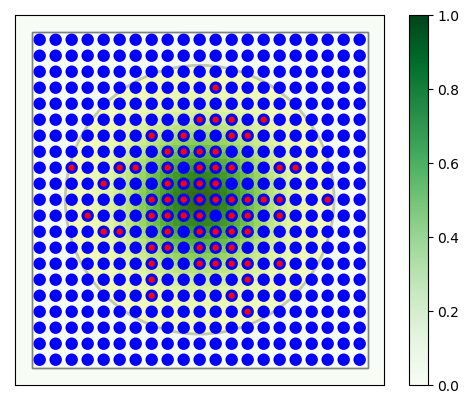

   :math:`21\times 21` grid with divergent Gaussian projections onto
   itself. Blue circles mark layer elements, red circles connection
   targets of the center neuron (marked by large light-red circle). The
   large red circle is the mask, the dashed green lines mark
   :math:`\sigma`, :math:`2\sigma` and :math:`3\sigma` of the Gaussian
   probability distribution.

The following code shows a practical example: A :math:`21\times21` network
which connects to itself with Gaussian connections. The resulting graphics
is shown in :numref:`fig_vislayer`. All elements and the targets of the
center neuron are shown, as well as mask and connection probability.

.. literalinclude:: user_manual_scripts/layers.py
    :start-after: #{ vislayer #}
    :end-before: #{ end #}

.. _ch:extending:

Adding masks
============

This chapter will show examples of how to extend NEST by adding custom
masks. Some knowledge of the C++ programming language is needed for this.
The functions will be added as a part of an extension module which is
dynamically loaded into NEST. For more information on writing an extension
module, see the section titled `“Writing an Extension Module”
<http://nest.github.io/nest-simulator/extension_modules>`__ in the NEST
Developer Manual. The basic steps required to get started are:

1. From the NEST source directory, copy directory examples/MyModule to
   somewhere outside the NEST source, build or install directories.

2. Change to the new location of MyModule and prepare by issuing
   ``./bootstrap.sh``

3. Leave MyModule and create a build directory for it, e.g., mmb next to
   it

   .. code:: bash

      cd ..
      mkdir mmb
      cd mmb

4. Configure. The configure process uses the script ``nest-config`` to
   find out where NEST is installed, where the source code resides, and
   which compiler options were used for compiling NEST. If
   ``nest-config`` is not in your path, you need to provided it
   explicitly like this

   .. code:: bash

      cmake -Dwith-nest=${NEST_INSTALL_DIR}/bin/nest-config ../MyModule

5. MyModule will then be installed to ``\${NEST_INSTALL_DIR}``. This
   ensures that NEST will be able to find initializing SLI files for the
   module. You should not use the ``--prefix`` to select a different
   installation destination. If you do, you must make sure to use
   addpath in SLI before loading the module to ensure that NEST will
   find the SLI initialization file for your module.

6. Compile.

   .. code:: bash

      make
      make install

   The previous command installed MyModule to the NEST installation
   directory, including help files generated from the source code.

To add a mask, a subclass of ``nest::Mask<D>`` must be defined, where ``D``
is the dimension (2 or 3). In this case we will define a 2-dimensional
elliptic mask by creating a class called ``EllipticMask``. Note that
elliptical masks are already part of NEST see
Sec. \ :ref:`3.3 <sec:conn_masks>`. That elliptical mask is defined in a
different way than what we will do here though, so this can still be
used as an introductory example. First, we must include another header
file:

.. code:: c

   #include "mask.h"

The ``Mask`` class has a few methods that must be overridden:

.. code:: c

     class EllipticMask : public nest::Mask<2>
     {
     public:
       EllipticMask(const DictionaryDatum& d):
         rx_(1.0), ry_(1.0)
         {
           updateValue<double>(d, "r_x", rx_);
           updateValue<double>(d, "r_y", ry_);
         }

       using Mask<2>::inside;

       // returns true if point is inside the ellipse
       bool inside(const nest::Position<2> &p) const
         { return p[0]*p[0]/rx_/rx_ + p[1]*p[1]/ry_/ry_ <= 1.0; }

       // returns true if the whole box is inside the ellipse
       bool inside(const nest::Box<2> &b) const
         {
           nest::Position<2> p = b.lower_left;

           // Test if all corners are inside mask
           if (not inside(p)) return false;       // (0,0)
           p[0] = b.upper_right[0];
           if (not inside(p)) return false;       // (0,1)
           p[1] = b.upper_right[1];
           if (not inside(p)) return false;       // (1,1)
           p[0] = b.lower_left[0];
           if (not inside(p)) return false;       // (1,0)

           return true;
         }

       // returns bounding box of ellipse
       nest::Box<2> get_bbox() const
         {
           nest::Position<2> ll(-rx_,-ry_);
           nest::Position<2> ur(rx_,ry_);
           return nest::Box<2>(ll,ur);
         }

       nest::Mask<2> * clone() const
         { return new EllipticMask(*this); }

     protected:
       double rx_, ry_;
     };

The overridden methods include a test if a point is inside the mask, and
for efficiency reasons also a test if a box is fully inside the mask. We
implement the latter by testing if all the corners are inside, since our
elliptic mask is convex. We must also define a function which returns a
bounding box for the mask, i.e. a box completely surrounding the mask.

The mask class must then be registered with the topology module, and this
is done by adding a line to the function ``MyModule::init()`` in the file
``mymodule.cpp``:

.. code:: c

       nest::TopologyModule::register_mask<EllipticMask>("elliptic");

After compiling and installing the module, the mask is available to be
used in connections, e.g.

::

   nest.Install('mymodule')
   l = nest.Create('iaf_psc_alpha', positions=nest.spatial.grid(rows=11, columns=11, extent=[1., 1.]))
   nest.Connect(l, l, {'rule': 'pairwise_bernoulli',
                       'p': 1.0,
                       'mask': {'elliptic': {'r_x': 0.5, 'r_y': 0.25}}})

.. TODO: remove changes?

.. _sec:changes:

Changes between versions
========================

In this chapter we give summaries of the most important changes in the
Topology Module between different NEST versions, starting with the most
recent ones.

Changes from Topology 2.14 to 2.16
----------------------------------

The one important change in the Topology module from NEST version 2.14
to 2.16 was the inclusion of rotated masks:

-  Rotation of ``rectangular/box`` and ``elliptical/ellipsoidal`` masks
   is now possible. NEST offers rotation in two directions, from the
   x-axis towards the y-axis, and from the z-axis away from the y-axis.
   To specify the former use the variable ``azimuth_angle`` and for the
   latter, use ``polar_angle``.

Changes from Topology 2.12 to 2.14
----------------------------------

This is a short summary of the most important changes in the Topology
Module from NEST version 2.12 to 2.14.

-  Elliptical and ellipsoidal masks have been added to NEST with
   NEST 2.14. To specify the mask, the ``major_axis``, ``minor_axis``
   and (for ellipsoidal masks) ``polar_axis`` must be specified.

-  It is now possible to obtain the GIDs inside a masked area with the
   function SelectNodesByMask.

Changes from Topology 2.0 to 2.2
--------------------------------

This is a short summary of the most important changes in the Topology
Module from NEST version 2.0 to 2.2.

-  Nested layers are no longer supported.

-  Subnets are no longer used inside composite layers. A call to
   GetElement for a composite layer will now return a list of GIDs for
   the nodes at the position rather than a single subnet GID.

-  Positions in layers may now be 3-dimensional.

-  The functions GetPosition, Displacement and Distance now only works
   for nodes local to the current MPI process, if used in a MPI-parallel
   simulation.

-  It is now possible to add kernel functions and masks to the Topology
   module through an extension module. Please see
   Chapter \ `5 <#ch:extending>`__ for examples.

Changes from Topology 1.9 to 2.0
--------------------------------

This is a short summary of the most important changes in the NEST
Topology Module from the 1.9-xxxx to the 2.0 version.

-  ConnectLayer is now called ConnectLayers

-  Several other functions changed names, and there are many new
   functions. Please see Ch. \ :ref:`4 <sec:inspection>` for an overview.

-  All nest.topology functions now require lists of GIDs as input, not
   "naked" GIDs

-  There are a number of new functions in nest.topology, I tried to
   write good doc strings for them

-  For grid based layers (ie those with /rows and /columns), we have
   changed the definition of "extent": Previously, nodes were placed on
   the edges of the extent, so if you had an extend of 2 (in
   x-direction) and 3 nodes, these had x-coordinates -1, 0, 1. The grid
   constant was extent/(num_nodes - 1).

   Now, we define the grid constant as extent/num_nodes, center the
   nodes about 0 and thus add a space of half a grid constant between
   the outermost nodes and the boundary of the extent. If you want three
   nodes at -1,0,1 you thus have to set the extent to 3, i.e.,
   stretching from -1.5 to 1.5.

   The main reason for this change was that topology always added this
   padding silently when you used periodic boundary conditions
   (otherwise, neurons are the left and right edge would have been in
   identical locations, not what one wants).

-  The semantics of the ``anchor`` entry for kernel functions has
   changed: the anchor now specifies the center of the probability
   distribution relative to the driver node. This is consistent with the
   semantics for free masks, see Sec. \ :ref:`3.3 <sec:conn_masks>` and
   :ref:`3.4 <sec:conn_kernels>`.

-  Functions computing connection probabilities, weights and delays as
   functions of distance between source and target nodes now handle
   periodic boundary conditions correctly.

-  Masks with a diameter larger than the diameter of the layer they are
   applied to are now prohibited by default. This avoids multiple
   connections when masks overwrap.

References
==========

.. [1]
   NEST is available under an open source license at
   `www.nest-simulator.org <www.nest-simulator.org>`__.

.. [2]
   See Nord (2009) for suggestions on how to describe network
   models.

.. [3]
   See Sec. :ref:`2.1.1 <sec:verysimple>` for the distinction between
   layer coordinates and grid indices
