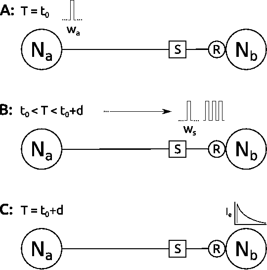
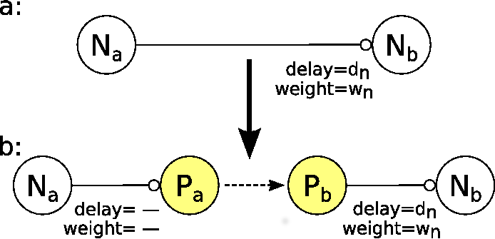
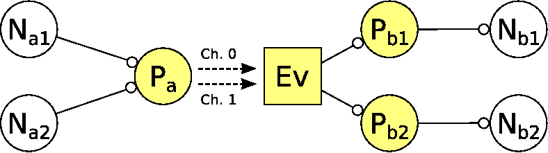

Introduction to the MUSIC Interface
=====================================

The `MUSIC interface <http://software.incf.org/software/music>`_, a
standard by the INCF, allows the transmission of data between applications
at runtime. It can be used to couple NEST with other simulators, with
applications for stimulus generation and data analysis and visualization and
with custom applications that also use the MUSIC interface.

Setup of System
-----------------
To use MUSIC with NEST, we first need to ensure MUSIC is installed on our system
and NEST is configured properly.

Please install MUSIC using the instructions on `the MUSIC website <https://github.com/INCF/MUSIC>`_.

In the install of NEST, you need to add the following configuration option to
your cmake.

.. code-block:: sh

    cmake -Dwith-music=[ON </path/to/music>]
    make
    make install

A Quick Introduction to NEST and MUSIC
---------------------------------------

In this tutorial, we will show you how to use the MUSIC library together
with NEST. We will cover how to use the library from PyNEST and from the
SLI language interface. In addition, we’ll introduce the use of MUSIC in
a C++ application and how to connect such an application to a NEST
simulation.

Our aim is to show practical examples of how to use MUSIC, and
highlight common pitfalls that can trip the unwary. Also, we assume only
a minimal knowledge of Python, C++ and (especially) SLI, so the examples
will favour clarity and simplicity over elegance and idiomatic
constructs.

.. sidebar:: Jump to

    :doc:`Part 1 - Connect 2 NEST simulations <music_tutorial_2>`

While the focus here is on MUSIC, we need to know a few things about how
NEST works in order to understand how MUSIC interacts with it.

Go straight to part 1 of tutorial - connect 2 simulations using PyNEST

The Basics of NEST
~~~~~~~~~~~~~~~~~~~~

A NEST network consists of three types of elements: neurons, devices,
and connections between them.

Neurons are the basic building blocks, and in NEST they are generally
spiking point neuron models. Devices are supporting units that for
instance generate inputs to neurons or record data from them. The
Poisson spike generator, the spike detector recording device and the
MUSIC input and output proxies are all devices. Neurons and devices are
collectively called nodes, and are connected using connections.

Connections are unidirectional and carry events between nodes. Each
neuron can get multiple input connections from any number of other
neurons. Neuron connections typically carry spike events, but other
kinds of events, such as voltages and currents, are also available for
recording devices. Synapses are not independent nodes, but are part of
the connection. Synapse models will typically modify the weight or
timing of the spike sent on to the neuron. All connections have a
synapse, by default the ``static_synapse``.

.. _neuronpic:

   A: Two connected neurons :math:`N_a` and :math:`N_b`, with a
   synapse :math:`S` and a receptor :math:`R`. A spike with weight
   :math:`W_a` is generated at :math:`t_0`. B: The spike traverses the
   synapse and is added to the queue in the receptor. C: The receptor
   processes the spike at time :math:`t_0 + d`.

Connections have a delay and a weight. All connections are implemented
on the receiving side, and the interpretation of the parameters is
ultimately up to the receiving node. In :numref:`neuronpic` A, neuron
:math:`N_a` has sent a spike to :math:`N_b` at time :math:`t`, over a
connection with weight :math:`w_a` and delay :math:`d`. The spike is
sent through the synapse, then buffered on the receiving side until
:math:`t+d` (:numref:`neuronpic` B). At that time it’s handed over to the
neuron model receptor that converts the spike event to a current and
applies it to the neuron model (:numref:`neuronpic` C).

Adding MUSIC connections
------------------------

In NEST you use MUSIC with a pair of extra devices called *proxies* that
create a MUSIC connection between them across simulations. The pair
effectively works just like a regular connection within a single
simulation. Each connection between MUSIC proxies is called a *port*,
and connected by name in the MUSIC configuration file.

Each MUSIC port can carry multiple numbered *channels*. The channel is
the smallest unit of transmission, in that you can distinguish data
flowing in different channels, but not within a single channel.
Depending on the application a port may have one or many channels, and a
single channel can carry the events from one single neuron model or the
aggregate output of many neurons.

.. _neuronmusic1:

   A: Two connected neurons :math:`N_a` and :math:`N_b`, with delay
   :math:`d_n` and weight :math:`w_n`. B: We’ve added a MUSIC connection
   with an output proxy :math:`P_a` on one end, and an input proxy
   :math:`P_b` on the other.

In :numref:`neuronmusic1` A we see a regular NEST connection between
two neurons :math:`N_a` and :math:`N_b`. The connection carries a weight
:math:`w_n` and a delay :math:`d_n`. In :numref:`neuronmusic1` B we
have inserted a pair of MUSIC proxies into the connection, with an
output proxy :math:`P_a` on one end, and input proxy :math:`P_b` on the
other.

As we mentioned above, MUSIC proxies are devices, not regular neuron
models. Like most devices, proxies ignore weight and delay parameters on
incoming connections. Any delay applied to the connection from
:math:`N_a` to the output proxy :math:`P_a` is thus silently ignored.
MUSIC makes the inter-simulation transmission delays invisible to the
models themselves, so the connection from :math:`P_a` to :math:`P_b` is
effectively zero. The total delay and weight of the connection from
:math:`N_a` to :math:`N_b` is thus that set on the :math:`P_b` to
:math:`N_b` connection.

.. _neuronmusic3:

   A MUSIC connection with two outputs and two inputs. A single output
   proxy sends two channels of data to an input event handler that
   divides the channels to the two input proxies. They connect the
   recipient neuron models.

When we have multiple channels, the structure looks something like in
:numref:`neuronmusic3`. Now we have two neurons :math:`N_{a1}` and
:math:`N_{a2}` that we want to connect to :math:`N_{b1}` and
:math:`N_{b2}` respectively. As we mentioned above, NEST devices can
accept connections from multiple separate devices, so we only need one
output proxy :math:`P_a`. We connect each input to a different channel.

Nodes can only output one connection stream, so on the receiving side we
need one input proxy :math:`P_b` per input. Internally, there is a
single MUSIC event handler device :math:`Ev` that accepts all inputs
from a port, then sends the appropriate channel inputs to each input
proxy. These proxies each connect to the recipient neurons as above.

Publication
-------------

Djurfeldt M. et al. 2010. Run-time interoperability between neuronal
network simulators based on the music framework. Neuroinformatics.
8(1):43–60. `DOI: 10.1007/s12021-010-9064-z <https://link.springer.com/article/10.1007/s12021-010-9064-z>`_.
