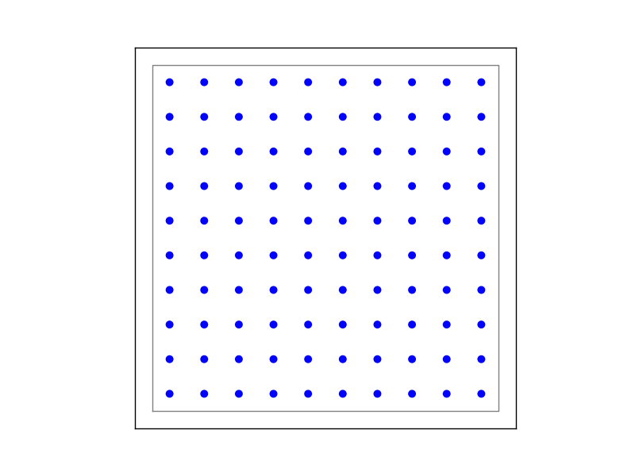
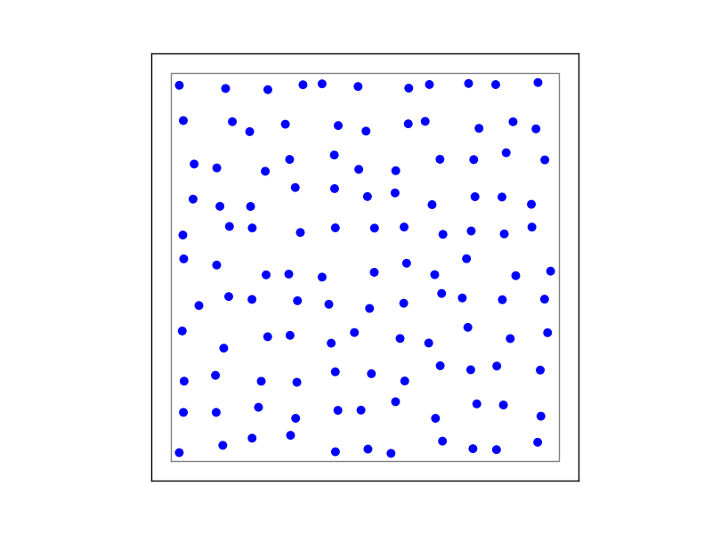
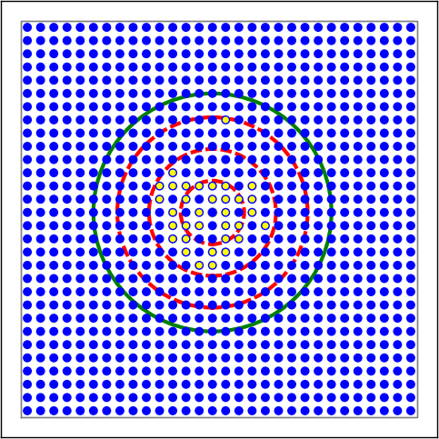
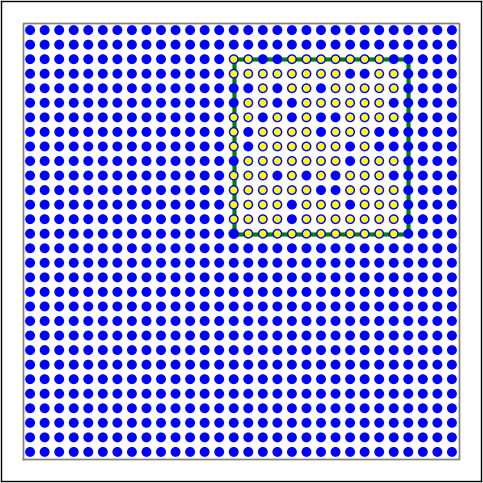
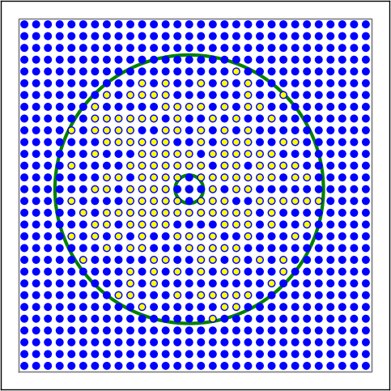
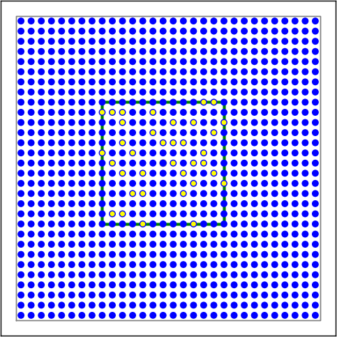

Part 4: Topologically structured networks
=========================================

Introduction
------------

This handout covers the use of spatial information in NEST to construct
structured networks. When you have worked through this material you will
be able to:

-  Create populations of neurons with specific spatial locations
-  Define connectivity profiles between populations
-  Connect populations using profiles
-  Visualise the connectivity

For more information on the usage of PyNEST, please see the other
sections of this primer:

- :doc:`Part 1: Neurons and simple neural networks <part_1_neurons_and_simple_neural_networks>`
- :doc:`Part 2: Populations of neurons <part_2_populations_of_neurons>`
- :doc:`Part 3: Connecting networks with synapses <part_3_connecting_networks_with_synapses>`

More advanced examples can be found at :doc:`Example
Networks <../../examples/index>`, or
have a look at at the source directory of your NEST installation in the
subdirectory: ``pynest/examples/``.

Incorporating structure in networks of point neurons
----------------------------------------------------

If we use biologically detailed models of a neuron, then it’s easy to
understand and implement the concepts of topology, as we already have
dendritic arbors, axons, etc. which are the physical prerequisites for
connectivity within the nervous system. However, we can still get a
level of specificity using networks of point neurons.

Structure, both in the topological and everyday sense, can be thought of
as a set of rules governing the location of objects and the connections
between them. Within networks of point neurons, we can distinguish
between three types of specificity:

-  Cell-type specificity – what sorts of cells are there?
-  Location specificity – where are the cells?
-  Projection specificity – which cells do they project to, and how?

In the previous handouts, we saw that we can create deterministic or
randomly selected connections between networks using ``Connect()``. It is
possible to also use ``Create()`` and ``Connect()`` to to create network
models that incorporate the spatial location and spatial connectivity
profiles. **NOTE:** Full documentation for usage of the spatial functions
is present in NEST Topology Users Manual (NTUM) [1]_, which in the
following pages is referenced as a full-source.

Adding spatial information to populations
-----------------------------------------

NEST allows us to create populations of nodes with a given spatial
organisation, connection profiles which specify how neurons are to be
connected, and provides a high-level connection routine. We can thus
create structured networks by designing the connection profiles to give
the desired specificity for cell-type, location and projection.

The generation of structured networks is carried out in three steps,
each of which will be explained in the subsequent sections in more
detail:

1. **Defining layers**, in which we assign the layout and types of the
   neurons within a layer of our network.

2. **Defining connection specifications**, where we specify the parameters
   for connecting we wish our connections to have. Each connection
   dictionary specifies the properties for one class of connection, and
   contains parameters that allow us to tune the profile. These are
   related to the location-dependent likelihood of choosing a target
   (``mask`` and ``p``).

3. **Connecting layers**, in which we apply the connection specifications
   between layers, equivalent to population-specificity. A layer can be
   connected to itself.

4. **Auxillary**, in which we visualise the results of the above steps
   either by ``nest.PrintNodes()`` or visualization functions and query
   the connections for further analysis.

Defining layers
---------------

The code for defining a layer follows this template:

::

    import nest
    positions = ...  # See below for how to define positions
    layer = nest.Create(node_model, positions=positions)

where ``positions`` will define the locations of the elements in the
layer.

The ``node_model`` is the model type of the neuron, which can either be an
existing model in the ``NEST`` collection, or one that we’ve previously
defined using ``CopyModel()``.

We next have to decide whether the nodes should be placed in a
**grid-based** or **free** (off-grid) fashion, which is equivalent to
asking \`\`can the elements of our network be regularly and evenly
placed within a 2D network, or do we need to tell them where they should
be located?".

.. _grid:

   are positioned as grid+jitter.

   Example of on-grid, in which the neurons are
   positioned as grid+jitter.

.. _free:

   are positioned as grid+jitter .

   Example of off-grid, in which the neurons are
   positioned as grid+jitter .

1 - On-grid
~~~~~~~~~~~

We have to explicitly specify the size and spacing of the grid, by the
number or rows *m* and columns *n* as well as the extent (layer size).
The grid spacing i then determined from these, and *n*\ x\ *m* elements
are arranged symmetrically. Note that we can also specify a center to
the grid, else the default offset is the origin.

The following snippet produces :numref:`grid`:

::

    positions = nest.spatial.grid(rows=10,  # the number of rows in this layer ...
                                  columns=10,  # ... and the number of column
                                  extent=[2., 2.]  # the size of the layer in mm
                                  )
    nest.Create('iaf_psc_alpha', positions=positions)

2 - Off grid
~~~~~~~~~~~~

For more flexibility in how we distribute neurons, we can use free spatial
placement. Then we need to define a Parameter for the placement of the
neurons, or we can define the positions of the neurons explicitly. Note
that the extent is calculated from the positions of the nodes, but we can
also explicitly specify it. See Section 2.2 in NUTM for more details.

The following snippet produces :numref:`free`:

::

    positions = nest.spatial.free(
        nest.random.uniform(min=-0.3, max=0.3),  # using random positions in a uniform distribution
        num_dimensions=2  # have to specify number of dimensions
    )
    nest.Create('iaf_psc_alpha', 10, positions=positions)

Note that we have to specify the number of dimensions as we are using a
random parameter for the positions. The number of dimensions can be either
2 or 3. If we specify extent or use an explicit array of positions, the
number of dimensions is deduced by NEST. Also note that when creating the
layer, we specify the number of neurons to be created. This is not
necessary when using an array of positions.

See the table :ref:`tbl_parameters` in NUTM for a selection of NEST
Parameters that can be used.

Defining connection profiles
----------------------------

To define the types of connections that we want between populations of
neurons, we specify a *connection dictionary*.

The connection dictionary for connecting populations with spatial
information is the same as when connecting populations without spatial
information, but with a few optional additions. If the connection ``rule``
is one of ``pairwise_bernoulli``, ``fixed_indegree`` or
``fixed_outdegree``, one may specify some additional parameters that
allows us to tune our connectivity profiles by tuning the likelihood of a
connection, the number of connections, or defining a subset of the layer
to connect.

Chapter 3 in NTUM deals comprehensively with all the different
possibilities, and it’s suggested that you look there for learning about
the different constraints, as well as reading through the different
examples listed there. Here are some representative examples for setting
up a connectivity profile, and the following table lists the parameters
that can be used.

.. _cirgauss:

   dictionaries mentioned in the following Python code snippet.

   Examples of connectivity for each of the connectivity dictionaries
   mentioned in the following Python code snippet.

.. _rectanchor:

   dictionaries mentioned in the following Python code snippet.

   Examples of connectivity for each of the connectivity dictionaries
   mentioned in the following Python code snippet.

.. _doughnutlinear:

   dictionaries mentioned in the following Python code snippet.

   Examples of connectivity for each of the connectivity dictionaries
   mentioned in the following Python code snippet.

.. _gaussweights:

   dictionaries mentioned in the following Python code snippet.

   Examples of connectivity for each of the connectivity dictionaries
   mentioned in the following Python code snippet.

::

    # Circular mask, distance-dependent connection probability with gaussian distribution
    conn1 = {'rule': 'pairwise_bernoulli',
             'p': nest.spatial_distributions.gaussian(nest.spatial.distance, std=0.2),
             'mask': {'circular': {'radius': 0.75}},
             'allow_autapses': False
             }

    # Rectangular mask with non-centered anchor, constant connection probability
    conn2 = {'rule': 'pairwise_bernoulli',
             'p': 0.75,
             'mask': {'rectangular': {'lower_left': [-0.5, -0.5], 'upper_right': [0.5, 0.5]},
                     'anchor': [0.5, 0.5]},
             'allow_autapses': False
             }

    # Donut mask, linear distance-dependent connection probability
    conn3 = {'rule': 'pairwise_bernoulli',
             'p': 1.0 - 0.8 * nest.spatial.distance,
             'mask': {'doughnut': {'inner_radius': 0.1, 'outer_radius': 0.95}},
             }

    # Rectangular mask, fixed outdegree, distance-dependent weights from a gaussian distribution,
    # distance-dependent delays
    conn4 = {'rule': 'fixed_outdegree',
             'outdegree': 40,
             'mask': {'rectangular': {'lower_left': [-0.5, -0.5], 'upper_right': [0.5, 0.5]}},
             'weight': nest.spatial_distributions.gaussian(
                 J*nest.spatial.distance, std=0.25),
             'delay': 0.1 + 0.2 * nest.spatial.distance,
             'allow_autapses': False
             }

+-------------------------+--------------------------------------------------+---------------------------------------+
| Parameter               | Description                                      | Possible values                       |
|                         |                                                  |                                       |
+=========================+==================================================+=======================================+
| rule                    | Determines how nodes are selected when           | Can be any connection rule, but for   |
|                         | connections are made.                            | spatial specific parameters has to be |
|                         |                                                  | one of the following:                 |
|                         |                                                  | ``pairwise_bernoulli``,               |
|                         |                                                  | ``fixed_indegree``,                   |
|                         |                                                  | ``fixed_outdegree``                   |
+-------------------------+--------------------------------------------------+---------------------------------------+
| mask                    | Spatially selected subset of neurons considered  | circular,                             |
|                         | as (potential) targets                           | rectangular,                          |
|                         |                                                  | doughnut, grid                        |
+-------------------------+--------------------------------------------------+---------------------------------------+
| p                       | Value or NEST Parameter that determines the      | constant,                             |
|                         | likelihood of a neuron being chosen as a target. | NEST Parameter                        |
|                         | Can be distance-dependent.                       |                                       |
+-------------------------+--------------------------------------------------+---------------------------------------+
| weight                  | Distribution of weight values of connections.    | constant,                             |
|                         | Can be distance-dependent or -independent.       | NEST Parameter                        |
|                         | **NB**: this value overrides any value currently |                                       |
|                         | used by synapse\_model, and therefore unless     |                                       |
|                         | defined will default to 1.!                      |                                       |
+-------------------------+--------------------------------------------------+---------------------------------------+
| delay                   | Distribution of delay values for connections.    | constant,                             |
|                         | Can be distance-dependent or -independent.       | NEST Parameter                        |
|                         | **NB**: like weights, this value overrides any   |                                       |
|                         | value currently used by synapse\_model!          |                                       |
+-------------------------+--------------------------------------------------+---------------------------------------+
| synapse_model           | Define the type of synapse model to be included. | any synapse model included in         |
|                         |                                                  | ``nest.Models()``, or currently       |
|                         |                                                  | user-defined                          |
+-------------------------+--------------------------------------------------+---------------------------------------+
| use_on_target           | Whether we want the mask and connection          | boolean                               |
|                         | probability to be applied to the target neurons  |                                       |
|                         | instead of the source neurons.                   |                                       |
+-------------------------+--------------------------------------------------+---------------------------------------+
| allow\_multapses        | Whether we want to have multiple connections     | boolean                               |
|                         | between the same source-target pair, or ensure   |                                       |
|                         | unique connections.                              |                                       |
+-------------------------+--------------------------------------------------+---------------------------------------+
| allow_autapses          | Whether we want to allow a neuron to connect to  | boolean                               |
|                         | itself                                           |                                       |
+-------------------------+--------------------------------------------------+---------------------------------------+

Connecting layers
-----------------

Connecting layers is the easiest step: having defined a source layer, a
target layer and a connection dictionary, we simply use
``nest.Connect()``:

::

    ex_layer = nest.Create('iaf_psc_alpha', positions=nest.spatial.grid(rows=5, columns=4))
    in_layer = nest.Create('iaf_psc_alpha', positions=nest.spatial.grid(rows=4, columns=5))
    conn_dict_ex = {'rule': 'pairwise_bernoulli',
                    'p': 1.0,
                    'mask': {'circular': {'radius': 0.5}}}
    # And now we connect E->I
    nest.Connect(ex_layer, in_layer, conn_dict_ex)

Note that we can use the same dictionary multiple times and connect to the
same layer:

::

    # Extending the code from above ... we add a conndict for inhibitory neurons
    conn_dict_in = {'rule': 'pairwise_bernoulli',
                    'p': 1.0,
                    'mask': {'circular': {'radius': 0.75}},
                    'weight': -4.}
    # And finish connecting the rest of the layers:
    nest.Connect(ex_layer, ex_layer, conn_dict_ex)
    nest.Connect(in_layer, in_layer, conn_dict_in)
    nest.Connect(in_layer, ex_layer, conn_dict_in)

Visualising and querying the network structure
------------------------------------------------

There are two main methods that we can use for checking that our network
was built correctly:

-  ``nest.PrintNodes()``

   which prints the node ID ranges and model names of the nodes in the
   network.

-  Create plots using the following functions:

   -  ``nest.PlotLayer()``
   -  ``nest.PlotTargets()``
   -  ``nest.PlotKernel()``

   which allow us to generate the plots used with NUTM and this handout.
   See Section 4.2 of NTUM for more details.

It may also be useful to look at the ``spatial`` property of the
NodeCollection, which describes the layer properties. Other useful
functions that may be of help are listed in NTUM Section 4.1.

References
----------

.. [1] Plesser HE and Enger H.  NEST Topology User Manual,
 https://www.nest-simulator.org/wp-content/uploads/2015/04/Topology_UserManual.pdf
