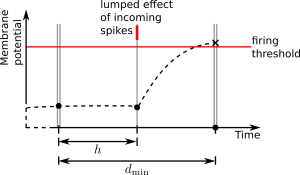

Simulations with precise spike times
====================================

The simulation resolution *h* and the minimum synaptic transmission
delay *dmin* define the two major time intervals of the :doc:`scheduling and
simulation flow of NEST <scheduling_and_simulation_flow>`: neurons
update their state variables in steps of *h*, whereas spikes are
communicated and delivered to their targets in steps of *dmin*, where
*dmin* is a multiple of *h*.

Traditionally, spikes are constrained to the simulation grid such that
neurons can propagate their state variables for an entire *h*-step
without interruption by incoming spikes. This enables faster simulations
of neurons with linear sub-threshold dynamics as a precomputed
propagator matrix for a time step of fixed size *h* can be employed
(`Rotter & Diesmann, 1999 <http://dx.doi.org/10.1007/s004220050570>`__).

Neurons buffer the incoming spikes until they become due, where spikes
can be lumped together provided that the corresponding synapses have the
same postsynaptic dynamics. Within a *dmin*-interval, each neuron
independently proceeds in steps of *h*: it retrieves the inputs that are
due in the current time step from its spike buffers and updates its
state variables such as the membrane potential.

 Propagation of membrane potential in case of grid-constrained spiking.
 Filled dots indicate update of membrane potential; black cross indicates
 detection of threshold crossing. As visual guidance, dashed black curves
 indicate time course of membrane potential. For simplicity, d\_min=2h.

If after an update the membrane potential is above the firing threshold,
the neuron emits a spike and resets its membrane potential. Due to time
discretization both spike and reset happen at the right border of the
*h*-step in which the threshold crossing occurred; the spike is time
stamped accordingly.

NEST enables also simulations with precise spike times, which are
represented by an integer time stamp and a double precision offset. As
the incoming spikes divide the *h*-steps into substeps, a neuron needs
to update its state variables for each substep.

 Propagation of membrane potential in case of off-grid spiking.
 Dashed red line indicates precise time of threshold crossing.

If after an update the membrane potential is above the firing threshold,
the neuron determines the precise offset of the outgoing spike with
respect to the next point on the time grid. This grid point marks the
spike's time stamp. The neuron then emits the spike and resets its
membrane potential.

Models with precise spike times in NEST
---------------------------------------

``poisson_generator_ps`` creates Poissonian spike trains, where spike
times have an integer time stamp and a double precision offset. It is
hence dedicated to simulations with precise spike times. The device can
also be connected to grid-constrained neuron models, which only use the
time stamps of the spikes and ignore their offsets. However, spike
generation with ``poisson_generator_ps`` is less efficient than with its
grid-constrained counterpart ``poisson_generator``.

``parrot_neuron_ps`` repeats the incoming spikes just as its
grid-constrained counterpart ``parrot_neuron``, but it is able to
represent precise spike times.

``iaf_psc_delta_ps`` is an integrate-and-fire neuron model with
delta-shaped postsynaptic currents that employs precise spike times;
its grid-constrained counterpart is ``iaf_psc_delta``. In this model the
precise location of an outgoing spike is determined analytically.

``iaf_psc_alpha_ps`` is an
integrate-and-fire neuron model with alpha-shaped postsynaptic
current that employ precise spike times; The grid-constrained
counterpart is ``iaf_psc_alpha``. The neuron models have been developed
in the context of `Morrison et al.
(2007) <http://dx.doi.org/10.1162/neco.2007.19.1.47>`__. As the model
employ interpolation in order to determine the precise location of an
outgoing spike, the achieved precision depends on the simulation
resolution *h*. The models differ in the way they process incoming
spikes, which also affects the attained precision (see `Morrison et al.
(2007) <http://dx.doi.org/10.1162/neco.2007.19.1.47>`__ for details).

``iaf_psc_exp_ps`` is an integrate-and-fire neuron model with
exponentially shaped postsynaptic currents that employs precise spike
times; its grid-constrained counterpart is ``iaf_psc_exp``. It has been
developed in the context of `Hanuschkin et al.
(2010) <http://dx.doi.org/10.3389/fninf.2010.00113>`__, which is a
continuation of the work presented in `Morrison et al.
(2007) <http://dx.doi.org/10.1162/neco.2007.19.1.47>`__. As the neuron
model employs an iterative search in order to determine the precise
location of an outgoing spike, the achieved precision does not depend on
the simulation resolution h. The model can also be used through the
`PyNN
interface <http://neuralensemble.org/trac/PyNN/wiki/ContinuousTimeSpiking>`__.

Questions and answers about precise neurons
-------------------------------------------

During the review process of the above mentioned papers, we came up with
a list of questions and answers pertaining to the implementation and
usage of precise spiking neurons. This list can be found
:doc:`here <../faqs/qa-precise-spike-times>`.

