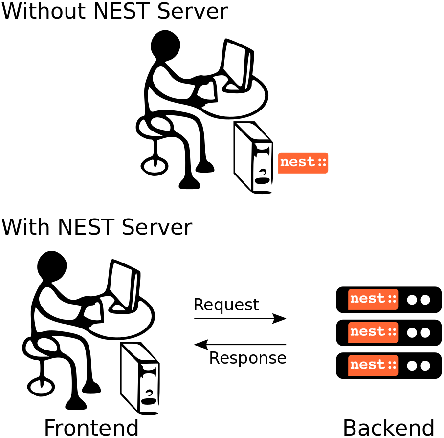

NEST Server
===========

.. contents:: On this page, you'll find
   :local:
   :depth: 1

What is NEST Server?
--------------------

NEST Server enables users to interact with the NEST simulation engine
via a RESTful API. Using this approach, you can perform the same basic
operations as with :doc:`PyNEST <ref_material/pynest_apis>`, but
instead of doing so by directly importing the ``nest`` module, all
commands, including their arguments and result data, are channeled
through HTTP requests and responses over a TCP/IP connection.

The main advantage of using NEST in this way is that it decouples the
*simulation backend* in the form of the NEST simulation kernel from the
*frontend*, i.e., the code that controls the simulation. In such a
scenario, only the backend (the *server*) depends on NEST, while the
frontend could really be anything that can talk HTTP. Under the hood,
NEST Server forwards the commands it receives to PyNEST, and sends
back the result data in response packets.

NEST Server was initially developed as a backend for `NEST Desktop
<https://nest-desktop.readthedocs.io/>`_, a web-based graphical
frontend for NEST. With growing interest in a more general server
backend for NEST, the functionality of the original NEST Server was
extended to accommodate for this broader range of application.
Starting with NEST 3.0, the NEST Server was integrated into the main
source code repository of NEST to make it available to everyone in a
convenient way.

Use cases for NEST Server
-------------------------

NEST Server can be considered a language independent interface to NEST
that can be deployed either locally or on a remote machine. To give
you a better idea of what NEST Server is good for, here are some of
its main use cases.

One scenario in which NEST Server comes in handy, is if you want to
work on your laptop, but run your NEST simulations on a
machine with higher performance or more memory, for instance, a big
workstation or computer cluster at your lab. For this, you would
deploy NEST Server on the remote machine, and use the provided
:ref:`NEST Server Client <nest_server_client>` locally or write your
own client using one of the recipes provided in the :ref:`section on
advanced applications <nest_server_advanced>`.

`NEST Desktop <https://nest-desktop.readthedocs.io/>`_, the web-based
graphical user interface for NEST, uses NEST Server as its simulation
backend. It supports server instances running either locally or
remotely. More details about how to configure and run this setup can
be found in the documentation of NEST Desktop.

Last but not least, the latest version of the `HBP Neurorobotic
Platform <https://neurorobotics.net/>`_ use the NEST Server to run the
neuronal simulation as part of closed-loop robotic experiments. As it
has rather specific requirements on the client side, it uses a custom
client for the NEST Server instead of the generic one shipped with NEST.

If you yourself have an interesting situation in which you use NEST
Server and would like to have it listed here, feel free to `drop us a
line <https://github.com/nest/nest-simulator/issues>`_.

Install and run NEST Server
--------------------------

NEST Server is included in all source code distributions of NEST and
consequently, also available in derived packages, our virtual
machine, and Docker images.

For native installations, the requirements can be simply installed via
``pip``::

  pip3 install RestrictedPython uwsgi flask flask-cors

or by installing the full NEST development environment in case you
prefer using ``conda``::

  conda env create -f extras/conda-nest-simulator-dev.yml
  conda activate nest-simulator

As an alternative to a native installation, NEST Server is available
from the NEST Docker image. Please check out the corresponding
:ref:`installation instructions <docker_vm_install>` for more details.

Run NEST Server
~~~~~~~~~~~~~~~~~~~~~

All NEST Server operations are managed using the ``nest-server``
command that can either be run directly::

  nest-server start

or supplied to the execution command line for running the Docker
container::

  docker run -it --rm -e LOCAL_USER_ID=`id -u $USER` -p 5000:5000 nestsim/nest:latest nest-server start

The generic invocation command line for the ``nest-server`` command
looks as follows::

  nest-server <command> [-d] [-o] [-h <host>] [-p <port>] [-P <plugin>] [-u <user>]

Possible commands are `start`, `stop`, `status`, or `log`. The meaning
of the other arguments is as follows:

-d
    Run nest-server in the background (i.e., daemonize it)
-o
    Print all output to both the console and the logger
-h <host>
    Use hostname/IP address <host> for the server [default: 127.0.0.1]
-p <port>
    Use port <port> for opening the socket [default: 5000]
-P <plugin>
    Use the uWSGI plugin <plugin> when running the server
-u <uid>
    Run the server under the user with ID <user>

Run with MPI
~~~~~~~~~~~~~~~~

If NEST was compiled with support for :ref:`distributed computing via
MPI <distributed_computing>`, it will usually execute the exact same
simulation script on each of the MPI processes. With NEST Server, this
would normally mean that one NEST Server instance would be spawned for
each rank in a multi-process NEST simulation. To prevent this from
happening, we provide a special version of the NEST Server command for
use with MPI. It can be run as follows::

  mpirun -np N nest-server-mpi [--host HOST] [--port PORT]

If run like this, the RESTful API of the NEST Server will only be
served by the MPI process with rank 0 (called the `master`), while all
other N-1 ranks will start the NEST Server in `worker` mode. Upon
receiving a request, the master relays all commands to the workers,
which execute them, collect all result data, and send it back to the
master. The master then receives and combines all worker responses,
and replies to the caller of the NEST Server API.

The response data in such a distributed scenario looks almost
completely the same as one coming from the serial version of the NEST
Server. The only difference may be that information pertaining to
process-local data structures is being replaced by generic values.

.. _nest_server_client:

The NEST Server Client
----------------------

The easiest way to interact with the NEST Server is the `NEST Server
Client` provided in ``examples/NESTServerClient`` in the source
distribution of NEST. It can be used either by directly starting
a Python session in that directory or installing it by running ``python3
setup.py install`` therein. NEST itself does not have to be installed
in order to use the NEST Server Client.

Using a dynamic function mapping mechanism, the NEST Server Client
supports the same functions as PyNEST does. However, instead of
directly executing calls in NEST, it forwards them together with their
arguments to the NEST Server, which in turn executes them. To you as a
user, everything looks much like a typical simulation code for NEST
Simulator.

Basic usage
~~~~~~~~~~~

To give you an idea of the usage, the following table shows a
comparison of a typical simulation once for PyNEST and once using the
NEST Server Client.

.. list-table::

    * - **PyNEST directly**
      - **via NEST Server Client**
    * - .. code-block:: Python

            import nest

            # Reset the kernel
            nest.ResetKernel()

            # Create nodes
            params = {"rate": 6500.}
            pg = nest.Create("poisson_generator", 1, params)
            neurons = nest.Create("iaf_psc_alpha", 1000)
            sr = nest.Create("spike_recorder")

            # Connect nodes
            nest.Connect(pg, neurons, syn_spec={'weight': 10.})
            nest.Connect(neurons[::10], sr)

            # Simulate
            nest.Simulate(1000.0)

            # Get events
            n_events = nest.GetStatus(sr, 'n_events')[0]
            print('Number of events:', n_events)

      - .. code-block:: Python

            from NESTServerClient import NESTServerClient
            nsc = NESTServerClient()

            # Reset the kernel
            nsc.ResetKernel()

            # Create nodes
            params = {"rate": 6500.}
            pg = nsc.Create("poisson_generator", 1, params)
            neurons = nsc.Create("iaf_psc_alpha", 1000)
            sr = nsc.Create("spike_recorder")

            # Connect nodes
            nsc.Connect(pg, neurons, syn_spec={'weight': 10.})
            nsc.Connect(neurons[::10], sr)

            # Simulate
            nsc.Simulate(1000.0)

            # Get events
            n_events = nsc.GetStatus(sr, 'n_events')[0]
            print('Number of events:', n_events)

Run scripts
~~~~~~~~~~~~~~~~~

The NEST Server Client is able to send complete simulation scripts to
the NEST Server using the functions ``exec_script`` and ``from_file``.
The following listing shows a Python snippet using the NEST Server
Client to execute a simple script on the Server using the
``exec_script`` function:

.. code-block:: Python

    from NESTServerClient import NESTServerClient
    nsc = NESTServerClient()

    response = nsc.exec_script("print('Hello world!')")
    print(response['stdout'])                        # 'Hello world!'

    response = nsc.exec_script("models=nest.Models()", 'models')
    models = response['data']

    print(models)                                    # the list of models

In a more realistic scenario, you probably already have your
simulation script stored in a file. Such scripts can be sent to the
NEST Server for execution using the ``from_file`` function provided by
the NEST Server Client.

.. code-block:: Python

    from NESTServerClient import NESTServerClient
    nsc = NESTServerClient()

    response = nsc.from_file('simulation_script.py', 'n_events')
    n_events = response['data']

    print('Number of events:', n_events)

.. note::

    By default, the NEST Server only imports the PyNEST module during
    startup for security reasons. In case you require additional
    Python modules for your simulation script, please see the section
    on :ref:`security and modules <nest_server_security>` below.

NEST Server Client API
~~~~~~~~~~~~~~~~~~~~~~

.. py:class:: NESTServerClient

    The client object to interact with the NEST Server

.. py:method:: NESTServerClient.<call>(*args, **kwargs)

    Execute a PyNEST function `<call>` on the NEST Server; the
    arguments `args` and `kwargs` will be forwarded to the function

.. py:method:: NESTServerClient.exec_script(source, return_vars=None)

    Execute a Python script on the NEST Server; the script has to be
    given as a string in the `source` argument

.. py:method:: NESTServerClient.from_file(filename, return_vars=None)

    Execute a Python script on the NEST Server; the argument
    `filename` is the name of the file in which the script is stored

REST API overview
-----------------

localhost:5000
    Get the version of NEST used by NEST Server

localhost:5000/api
    List all available functions

localhost:5000/api/<call>
    Execute the function `<call>`

localhost:5000/api/<call>?inspect=getdoc
    Get the documentation for the function `<call>`

localhost:5000/api/<call>?inspect=getsource
    Get the source code of the function `<call>`

localhost:5000/exec
    Execute a Python script. This requires JSON data in the form

    .. code-block:: JSON

        {"source": "
            </body>
          </html>

   .. tab:: JavaScript

      .. code-block:: JavaScript

          function getAPI(call, callback=console.log) {
              const xhr = new XMLHttpRequest();
              xhr.addEventListener("readystatechange", () => {
                  if (xhr.readyState === 4) {  // request done
                      callback(xhr.responseText);
                  }
              });
              // send to api route of NEST Server
              xhr.open("GET", "http://localhost:5000/api/" + call);
              xhr.send(null);
          }

Using the above code, we can already send API-requests to NEST Server:

.. code-block:: JavaScript

    getAPI('Models');  // a list of models

Sending API calls with data requires a POST request, which can handle
the data in JSON-format. To allow for this, we can define a function
with a callback for POST requests:

.. code-block:: JavaScript

    function postAPI(call, data, callback=console.log) {
        const xhr = new XMLHttpRequest();
        xhr.addEventListener("readystatechange", () => {
            if (xhr.readyState === 4) {  // request done
                callback(xhr.responseText);
            }
        });
        // send to api route of NEST Server
        xhr.open("POST", "http://localhost:5000/api/" + call);
        xhr.setRequestHeader('Access-Control-Allow-Headers', 'Content-Type');
        xhr.setRequestHeader('Content-Type', 'application/json');
        xhr.send(JSON.stringify(data));  // serialize data
    }

Using this function, sending an API-request to NEST Server becomes easy:

.. code-block:: JavaScript

    // default values of iaf_psc_alpha
    postAPI('GetDefaults', {"model": "iaf_psc_alpha"});

The third type of request we might want to make is sending a custom
Python script to NEST Server. As outlined above, this is supported by
the `exec` route. to make use of that, we define a function with
callback for POST requests to execute a script:

.. code-block:: JavaScript

    function execScript(source, returnData="data", callback=console.log) {
        const data = {"source": source, "return": returnData};
        const xhr = new XMLHttpRequest();
        xhr.addEventListener("readystatechange", () => {
            if (xhr.readyState === 4) {  // request done
                callback(xhr.responseText);
            }
        });
        // send to exec route of NEST Server
        xhr.open("POST", "http://localhost:5000/exec");
        xhr.setRequestHeader('Access-Control-Allow-Headers', 'Content-Type');
        xhr.setRequestHeader('Content-Type', 'application/json');
        xhr.send(JSON.stringify(data));  // serialize data
    }

Now, we can send a custom Python script to NEST Server:

.. code-block:: JavaScript

    // default values of iaf_psc_alpha
    execScript("data = nest.GetDefaults('iaf_psc_alpha')");

.. note::

    A full HTML client for NEST Server based on the ideas outlined
    above is available in the `nest-jsclient repository
    <https://github.com/steffengraber/nest-jsclient>`_ on the GitHub
    account of Steffen Graber.

Control NEST from Bash
~~~~~~~~~~~~~~~~~~~~~~~~~~

For POST requests to the NEST API Server, we recommend to use a Bash function:

.. code-block:: sh

    #!/bin/bash
    NEST_API=localhost:5000/api

    nest-server-api() {
        if [ $# -eq 2 ]
        then
            curl -H "Content-Type: application/json" -d "$2" $NEST_API/$1
        else
            curl $NEST_API/$1
        fi
    }

Now, we can send API requests to NEST Server using the ``nest-server-api`` function:

.. code-block:: sh

    # Reset kernel
    nest-server-api ResetKernel

    # Create nodes
    nest-server-api Create '{"model": "iaf_psc_alpha", "n": 2}'
    nest-server-api Create '{"model": "poisson_generator", "params": {"rate": 6500.0}}'
    nest-server-api Create '{"model": "spike_recorder"}'

    # Connect nodes
    nest-server-api Connect '{"pre": [3], "post": [1,2], "syn_spec": {"weight": 10.0}}'
    nest-server-api Connect '{"pre": [1,2], "post": [4]}'

    # Simulate
    nest-server-api Simulate '{"t": 1000.0}'

    # Get events
    nest-server-api GetStatus '{"nodes": [4], "keys": "n_events"}'
