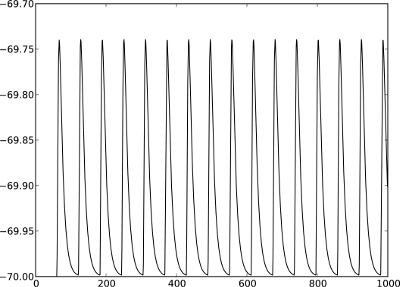

Part 1: Neurons and simple neural networks
==========================================

Introduction
------------

In this section we cover the first steps in using PyNEST to simulate
neuronal networks. When you have worked through this material, you will
know how to:

-  start PyNEST
-  create neurons and stimulating/recording devices
-  query and set their parameters
-  connect them to each other or to devices
-  simulate the network
-  extract the data from recording devices

For more information on the usage of PyNEST, please see the other
sections of this primer:

-  :doc:`Part 2: Populations of neurons <part_2_populations_of_neurons>`
-  :doc:`Part 3: Connecting networks with
   synapses <part_3_connecting_networks_with_synapses>`
-  :doc:`Part 4: Spatially structured
   networks <part_4_spatially_structured_networks>`

More advanced examples can be found at `Example
Networks <https://www.nest-simulator.org/more-example-networks/>`__, or
have a look at at the source directory of your NEST installation in the
subdirectory: ``pynest/examples/``.

PyNEST - an interface to the NEST simulator
-------------------------------------------

.. _Python-Interface:

.. figure:: ../../static/img/python_interface.png
   :alt: Python Interface
   :width: 600px

   Python Interface Figure.
   The Python interpreter imports NEST as a module and
   dynamically loads the NEST simulator kernel (``pynestkernel.so``). The
   core functionality is defined in ``hl_api.py``. A simulation script of
   the user (``mysimulation.py``) uses functions defined in this high-level
   API. These functions generate code in SLI (Simulation Language
   Interpreter), the native language of the interpreter of NEST. This
   interpreter, in turn, controls the NEST simulation kernel.

The NEural Simulation Tool (NEST: www.nest-initiative.org) [1]_
is designed for the simulation of large heterogeneous networks of point
neurons. It is open source software released under the GPL licence. The
simulator comes with an interface to Python [2]_. :numref:`Python-Interface`
illustrates the interaction between the user’s simulation script
(``mysimulation.py``) and the NEST simulator. Eppler et al. [3]_
contains a technically detailed description of the implementation of this
interface and parts of this text are based on this reference. The
simulation kernel is written in C++ to obtain the highest possible performance
for the simulation.

You can use PyNEST interactively from the Python prompt or from within
IPython/Jupyter. This is very helpful when you are exploring PyNEST, trying to
learn a new functionality or debugging a routine. Once out of the
exploratory mode, you will find it saves a lot of time to write your
simulations in text files. These can in turn be run from the command
line or from the Python or ipython prompt.

Whether working interactively, semi-interactively, or purely executing
scripts, the first thing that needs to happen is importing NEST’s
functionality into the Python interpreter.

::

    import nest

In case other Python packages are required, such as `scikit-learn <http://scikit-learn.org/stable/index.html>`_
and `SciPy <https://www.scipy.org/>`_, they need to be imported *before* importing NEST.

::

    import sklearn
    import scipy

    import nest

As with every other module for Python, the available functions can be
prompted for.

::

    dir(nest)

One such command is ``nest.Models()``, which will return a list of all
the available models you can use. If you want to obtain more information
about a particular command, you may use Python’s standard help system.

This will return the help text (docstring) explaining the use of this
particular function. There is a help system within NEST as well. You
can open the help pages in a browser using ``nest.helpdesk()`` and you
can get the help page for a particular NEST object (like a synapse or
neuron model) using ``nest.help(object)``.

Creating Nodes
--------------

A neural network in NEST consists of two basic element types: nodes and
connections. Nodes are either neurons, devices or sub-networks. Devices
are used to stimulate neurons or to record from them. Nodes can be
arranged with spatial structure to build networks distributed in space
- we will get to this later in the course. For now we
will work with the default network structure of NEST.

New nodes are created with the command ``Create``, which takes as arguments the model name of the
desired node type, and optionally the number of nodes to be created and
the initialising parameters. The function returns a ``NodeCollection`` of handles to
the new nodes, which you can assign to a variable for later use. A ``NodeCollection`` is a compact
representation of the node handles, which are integer numbers, called *ids*. Many PyNEST functions expect
or return a ``NodeCollection`` (see `command overview`_). Thus, it is
easy to apply functions to large sets of nodes with a single function
call.

After having imported NEST and Matplotlib [4]_,
which we will use to display the results, we can start creating nodes.
As a first example, we will create a neuron of type
``iaf_psc_alpha``. This neuron is an integrate-and-fire neuron with
alpha-shaped postsynaptic currents. The function returns a NodeCollection of the
ids of all the created neurons, in this case only one, which we store in
a variable called ``neuron``.

::

    import matplotlib.pyplot as plt
    import nest
    neuron = nest.Create("iaf_psc_alpha")

We can now use the NodeCollection to access the properties of this neuron.
Properties of nodes in NEST are generally accessed via Python
dictionaries of key-value pairs of the form ``{key: value}``. In order
to see which properties a neuron has, you may ask it for its status.

::

    neuron.get()

This will print out the corresponding dictionary in the Python console.
Many of these properties are not relevant for the dynamics of the
neuron. To find out what the interesting properties are, look at the
documentation of the model through the helpdesk. If you already know
which properties you are interested in, you can specify a key, or a list
of keys, as an optional argument to ``get``:

::

    neuron.get("I_e")
    neuron.get(["V_reset", "V_th"])

In the first case we query the value of the constant background current
``I_e``; the result is given as a floating point element. In the second
case, we query the values of the reset potential and threshold of the
neuron, and receive the result as a dictionary . If ``get`` is
called on a NodeCollection with more than one element, the returned dictionary
will contain lists with the same number of elements as the number of nodes in
the NodeCollection. If ``get`` is called with a specific key on a NodeCollection
with several elements, a list the size of the NodeCollection will be returned.

To modify the properties in the dictionary, we use ``set``. In the
following example, the background current is set to 375.0pA, a value
causing the neuron to spike periodically.

::

    neuron.set(I_e=375.0)

Note that we can set several properties at the same time by giving
multiple comma separated key:value pairs in a dictionary. Also be
aware that NEST is type sensitive - if a particular property is of type
``double``, then you do need to explicitly write the decimal point:

::

    neuron.set({"I_e": 375})

will result in an error. This conveniently protects us from making
integer division errors, which are hard to catch.

Another way of setting and getting parameters is to ask the NodeCollection
directly

::

    neuron.I_e = 376.0
    neuron.I_e

Next we create a ``multimeter``, a *device* we can use to record the
membrane voltage of a neuron over time. The property ``record_from``
expects a list of the names of the variables we would like to
record. The variables exposed to the multimeter vary from model to
model. For a specific model, you can check the names of the exposed
variables by looking at the neuron’s property ``recordables``.

::

    multimeter = nest.Create("multimeter")
    multimeter.set(record_from=["V_m"])

We now create a ``spike_recorder``, another device that records the
spiking events produced by a neuron.

::

    spikerecorder = nest.Create("spike_recorder")

A short note on naming: here we have called the neuron ``neuron``, the
multimeter ``multimeter`` and so on. Of course, you can assign your
created nodes to any variable names you like, but the script is easier
to read if you choose names that reflect the concepts in your
simulation.

Connecting nodes with default connections
-----------------------------------------

Now we know how to create individual nodes, we can start connecting them
to form a small network.

::

    nest.Connect(multimeter, neuron)
    nest.Connect(neuron, spikerecorder)

.. _VM-neuron:

.. figure:: ../../static/img/vm_one_neuron.pdf.png
   :alt: Membrane potential of integrate-and-fire neuron with constant input current
   :width: 400px

   Membrane potential of integrate-and-fire neuron with constant input
   current.

.. _spikes-one-neuron:

.. figure:: ../../static/img/spikes_one_neuron.pdf.png
   :alt: Spikes of the neuron.
   :width: 400px

   Spikes of the neuron.

The order in which the arguments to ``Connect`` are specified reflects
the flow of events: if the neuron spikes, it sends an event to the spike
recorder. Conversely, the multimeter periodically sends requests to the
neuron to ask for its membrane potential at that point in time. This can
be regarded as a perfect electrode stuck into the neuron.

Now we have connected the network, we can start the simulation. We have
to inform the simulation kernel how long the simulation is to run. Here
we choose 1000ms.

::

    nest.Simulate(1000.0)

Congratulations, you have just simulated your first network in NEST!

Extracting and plotting data from devices
-----------------------------------------

After the simulation has finished, we can obtain the data recorded by
the multimeter.

::

    dmm = multimeter.get()
    Vms = dmm["events"]["V_m"]
    ts = dmm["events"]["times"]

In the first line, we obtain a dictionary with status parameters for the ``multimeter``.
This dictionary contains an entry named ``events`` which holds the
recorded data. It is itself a dictionary with the entries ``V_m`` and
``times``, which we store separately in ``Vms`` and ``ts``, in the
second and third line, respectively. If you are having trouble imagining
dictionaries of dictionaries and what you are extracting from where, try
first just printing ``dmm`` to the screen to give you a better
understanding of its structure, and then in the next step extract the
dictionary ``events``, and so on.

Now we are ready to display the data in a figure. To this end, we make
use of ``matplotlib`` and the ``pyplot`` module.

::

    import matplotlib.pyplot as plt
    plt.figure(1)
    plt.plot(ts, Vms)

The second line opens a figure (with the number 1), and the third line
actually produces the plot. You can’t see it yet because we have not
used ``plt.show()``. Before we do that, we proceed analogously to
obtain and display the spikes from the spike recorder.

::

    dSD = spikerecorder.get("events")
    evs = dSD["senders"]
    ts = dSD["times"]
    plt.figure(2)
    plt.plot(ts, evs, ".")
    plt.show()

Here we extract the events more concisely by sending the parameter name to ``get``.
This extracts the dictionary element
with the key ``events`` rather than the whole status dictionary. The
output should look like :numref:`VM-neuron` and :numref:`spikes-one-neuron`.
If you want to execute this as a script, just paste all lines into a text
file named, say, ``one-neuron.py`` . You can then run it from the command
line by prefixing the file name with ``python``, or from the Python or ipython
prompt, by prefixing it with ``run``.

It is possible to collect information of multiple neurons on a single
multimeter. This does complicate retrieving the information: the data
for each of the n neurons will be stored and returned in an interleaved
fashion. Luckily Python provides us with a handy array operation to
split the data easily: array slicing with a step (sometimes called
stride). To explain this you have to adapt the model created in the
previous part. Save your code under a new name, in the next section you
will also work on this code. Create an extra neuron with the background
current given a different value:

::

    neuron2 = nest.Create("iaf_psc_alpha")
    neuron2.set({"I_e": 370.0})

now connect this newly created neuron to the multimeter:

::

    nest.Connect(multimeter, neuron2)

Run the simulation and plot the results, they will look incorrect. To
fix this you must plot the two neuron traces separately. Replace the
code that extracts the events from the ``multimeter`` with the following
lines.

::

    plt.figure(2)
    Vms1 = dmm["events"]["V_m"][::2] # start at index 0: till the end: each second entry
    ts1 = dmm["events"]["times"][::2]
    plt.plot(ts1, Vms1)
    Vms2 = dmm["events"]["V_m"][1::2] # start at index 1: till the end: each second entry
    ts2 = dmm["events"]["times"][1::2]
    plt.plot(ts2, Vms2)

Additional information can be found at
http://docs.scipy.org/doc/numpy-1.10.0/reference/arrays.indexing.html.

Connecting nodes with specific connections
------------------------------------------

A commonly used model of neural activity is the Poisson process. We now
adapt the previous example so that the neuron receives 2 Poisson spike
trains, one excitatory and the other inhibitory. Hence, we need a new
device, the ``poisson_generator``. After creating the neurons, we create
these two generators and set their rates to 80000Hz and 15000Hz,
respectively.

::

    noise_ex = nest.Create("poisson_generator")
    noise_in = nest.Create("poisson_generator")
    noise_ex.set(rate=80000.0)
    noise_in.set(rate=15000.0)

Additionally, the constant input current should be set to 0:

::

    neuron.set(I_e=0.0)

Each event of the excitatory generator should produce a postsynaptic
current of 1.2pA amplitude, an inhibitory event of -2.0pA. The synaptic
weights can be defined in a dictionary, which is passed to the
``Connect`` function using the keyword ``syn_spec`` (synapse
specifications). In general all parameters determining the synapse can
be specified in the synapse dictionary, such as ``"weight"``,
``"delay"``, the synaptic model (``"synapse_model"``) and parameters specific to
the synaptic model.

::

    syn_dict_ex = {"weight": 1.2}
    syn_dict_in = {"weight": -2.0}
    nest.Connect(noise_ex, neuron, syn_spec=syn_dict_ex)
    nest.Connect(noise_in, neuron, syn_spec=syn_dict_in)

.. _vm_one_neuron_noise:

.. figure:: ../../static/img/vm_one_neuron_noise.pdf.png
   :alt: Membrane potential of integrate-and-fire neuron with Poisson noise as input.
   :width: 400px

   Membrane potential of integrate-and-fire neuron with Poisson noise as
   input.

.. _spikes_one_neuron_noise:

.. figure:: ../../static/img/spikes_one_neuron_noise.pdf.png
   :alt: Spikes of the neuron with noise.
   :width: 400px

   Spikes of the neuron with noise.

The rest of the code remains as before. You should see a membrane
potential as in :numref:`vm_one_neuron_noise` and :numref:`spikes_one_neuron_noise`.

In the next part of the introduction (:doc:`Part 2: Populations of
neurons <part_2_populations_of_neurons>`) we will look at more
methods for connecting many neurons at once.

Two connected neurons
---------------------

.. _vm_psp_two_neurons:

   Postsynaptic potentials in neuron2 evoked by the spikes of neuron1

There is no additional magic involved in connecting neurons. To
demonstrate this, we start from our original example of one neuron with
a constant input current, and add a second neuron.

::

    import nest
    neuron1 = nest.Create("iaf_psc_alpha")
    neuron1.set(I_e=376.0)
    neuron2 = nest.Create("iaf_psc_alpha")
    multimeter = nest.Create("multimeter")
    multimeter.set(record_from=["V_m"])

We now connect ``neuron1`` to ``neuron2``, and record the membrane
potential from ``neuron2`` so we can observe the postsynaptic potentials
caused by the spikes of ``neuron1``.

::

    nest.Connect(neuron1, neuron2, syn_spec = {"weight":20.0})
    nest.Connect(multimeter, neuron2)

Here the default delay of 1ms was used. If the delay is specified in
addition to the weight, the following shortcut is available:

::

    nest.Connect(neuron1, neuron2, syn_spec={"weight":20.0, "delay":1.0})

If you simulate the network and plot the membrane potential as before,
you should then see the postsynaptic potentials of ``neuron2`` evoked by
the spikes of ``neuron1`` as in :numref:`vm_psp_two_neurons`.

Command overview
----------------

These are the functions we introduced for the examples in this handout;
the following sections of this introduction will add more.

Getting information about NEST
~~~~~~~~~~~~~~~~~~~~~~~~~~~~~~

See the :doc:`Getting Help Section <../../getting_help>`

Nodes
~~~~~

-  ``Create(model, n=1, params=None)``
    Create ``n`` instances of type ``model``. Parameters for the new nodes can be given as
    ``params``, which can be any of the following:

      - A dictionary with either single values or lists of size n.
        The single values will be applied to all nodes, while the lists will be distributed across
        the nodes. Both single values and lists can be given at the same time.
      - A list with n dictionaries, one dictionary for each node.
    If omitted, the ``model``\ ’s defaults are used.

-  ``get(*params, **kwargs)``
    Return a dictionary with parameter values for the NodeCollection it is called
    on. If ``params`` is a single string, a list of values is returned
    instead. ``params`` may also be a list of strings, in which case the returned
    dictionary contains lists of requested values.

-  ``set(params=None, **kwargs)``
    Set the parameters on the NodeCollection to ``params``, which may
    be a single dictionary (with lists or single values as parameters), or a list
    of dictionaries of the same size as the NodeCollection. If ``kwargs`` is given,
    it has to be names and values of an attribute as keyword=argument pairs. The values
    can be single values or list of the same size as the NodeCollection.

Connections
~~~~~~~~~~~

This is an abbreviated version of the documentation for the ``Connect``
function, please see NEST’s online help for the full version and
:doc:`Connection Management <../../guides/connection_management>` for an introduction
and examples.

-  ``Connect(pre, post, conn_spec=None, syn_spec=None, return_synapsecollection=False)``
    Connect pre neurons to post neurons. Neurons in pre and post are
    connected using the specified connectivity (``"all_to_all"`` by
    default) and synapse type (``"static_synapse"`` by default). Details
    depend on the connectivity rule. ``pre`` -
    presynaptic neurons, given as a NodeCollection of node IDs ``post`` - presynaptic
    neurons, given as a NodeCollection of node IDs ``conn_spec`` - name or dictionary
    specifying connectivity rule, see below ``syn_spec`` - name or
    dictionary specifying synapses, see below.

Connectivity
^^^^^^^^^^^^

Connectivity is either specified as a string containing the name of a
connectivity rule (default: ``"all_to_all"``) or as a dictionary
specifying the rule and rule-specific parameters (e.g. ``"indegree"``),
which must be given. In addition switches allowing self-connections
(``"allow_autapses"``, default: ``True``) and multiple connections between a
pair of neurons (``"allow_multapses"``, default: ``True``) can be contained in
the dictionary.

Synapse
^^^^^^^

The synapse model and its properties can be inserted either as a string
describing one synapse model (synapse models are listed in the
synapsedict) or as a dictionary. If no synapse model
is specified the default model ``"static_synapse"`` will be used.
Available keys in the synapse dictionary are ``"synapse_model"``, ``"weight"``,
``"delay"``, ``"receptor_type"`` and parameters specific to the chosen
synapse model. All parameters are optional and if not specified will use
the default values determined by the current synapse model. ``"synapse_model"``
determines the synapse type, taken from pre-defined synapse types in
NEST or manually specified synapses created via ``CopyModel()``. All
other parameters can be scalars or distributions. In the case of scalar
parameters, all keys take doubles except for ``"receptor_type"`` which
has to be initialised with an integer. Distributed parameters are
initialised with a Parameter with distribution-specific
arguments (such as ``"mean"`` and ``"std"``).

Simulation control
~~~~~~~~~~~~~~~~~~

- ``Simulate(t)``
   Simulate the network for ``t`` milliseconds.

References
----------

.. [1] Gewaltig MO. and Diesmann M. 2007. NEural Simulation
   Tool. 2(4):1430.

.. [2] Python Software Foundation. The Python programming language,
   2008. http://www.python.org.

.. [3] Eppler JM et al. 2009 PyNEST: A convenient interface to the NEST simulator.
   2:12. 10.3389/neuro.11.012.2008.

.. [4] Hunter JD. 2007 Matplotlib: A 2d graphics environment.
   9(3):90–95.
