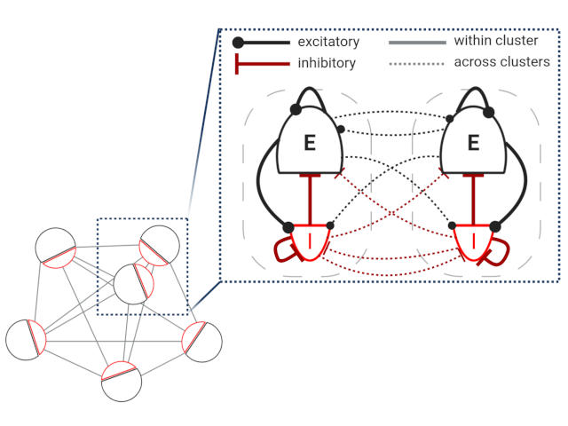

EI-clustered circuit model
==========================

This is PyNEST implementation of the EI-clustered circuit model described by Rostami et al. [1]_.

   Schematic of the EI-clustered circuit model. The network consists of `n_clusters` with one excitatory and one inhibitory population each.

Citing this code
----------------

If you use this code, we ask you to cite the paper by Rostami et al. [1]_ and the NEST release on Zenodo.

File structure
--------------

* :doc:`run_simulation_EI.py <run_simulation_EI>`: an example script to try out the EI-clustered circuit model
* :doc:`network_EI.py <network_EI>`: the main ``Network`` class with functions to build and simulate the network
* :doc:`helper_EI.py <helper_EI>`: helper functions for calculation of synaptic weights and currents and plot function for raster plots
* :doc:`network_params_EI.py <network_params_EI>`: network and neuron parameters
* :doc:`stimulus_params_EI.py <stimulus_params_EI>`: parameters for optional external stimulation
* :doc:`sim_params_EI.py <sim_params_EI>`: simulation parameters

Running the simulation
----------------------

.. code-block:: bash

   python run_simulation_EI.py

A raster plot of the network activity is saved as ``clustered_ei_raster.png``.

The code can be parallelized by using multiple threads during the NEST simulation.
This can be done by setting the parameter ``n_vp`` in the ``run_simulation_EI.py`` script.

Contributions to this PyNEST model implementation
-------------------------------------------------

2023: initial version of code and documentation by Felix J. Schmitt, Vahid Rostami and Martin Nawrot.

Acknowledgments
---------------

Funding for the study by Rostami et al. [1]_: This work was supported by the German Research Foundation (DFG),
in parts through the Collaborative Research Center ’Motor Control in Health and Disease’
(DFG-SFB 1451, Project-ID 431549029) and under the Institutional Strategy of the University of Cologne within the
German Excellence Initiative (DFG-ZUK 81/1) and in parts through the DFG graduate school
’Neural Circuit Analysis’ (DFG-RTG 1960, ID 365082554) and through the European Union’s Horizon 2020 Framework
Programme for Research and Innovation under grant agreement number 945539 (Human Brain Project SGA3).
The figure is created with BioRender.com.

Other implementations of the EI-clustered model
-----------------------------------------------

A `GeNN version <https://github.com/nawrotlab/SNN_GeNN_Nest>`__  by Felix J. Schmitt, Vahid Rostami and Martin Nawrot [2]_.

References
----------

.. [1]  Rostami V, Rost T, Riehle A, van Albada SJ and Nawrot MP. 2020.
        Excitatory and inhibitory motor cortical clusters account for balance, variability, and task performance.
        bioRxiv 2020.02.27.968339. DOI: `10.1101/2020.02.27.968339 <https://doi.org/10.1101/2020.02.27.968339>`__.

.. [2]  Schmitt FJ, Rostami V and Nawrot MP. 2023.
        Efficient parameter calibration and real-time simulation of large-scale spiking neural networks with GeNN
        and NEST. Front. Neuroinform. 17:941696. DOI: `10.3389/fninf.2023.941696 <https://doi.org/10.3389/fninf.2023.941696>`__.
