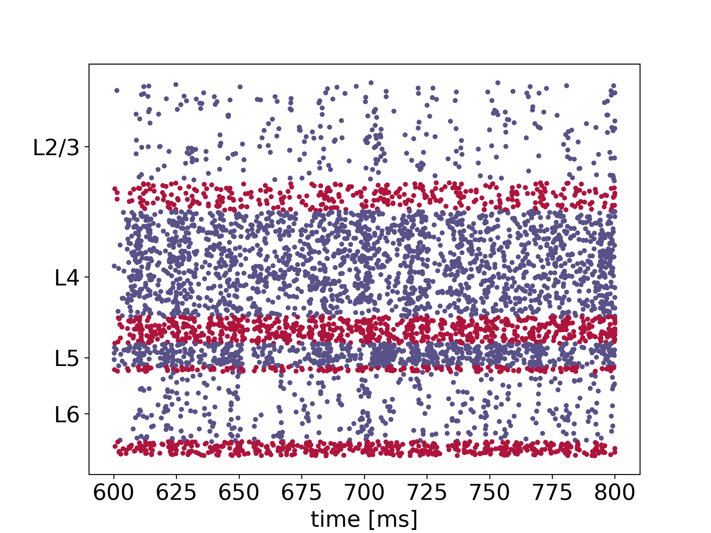
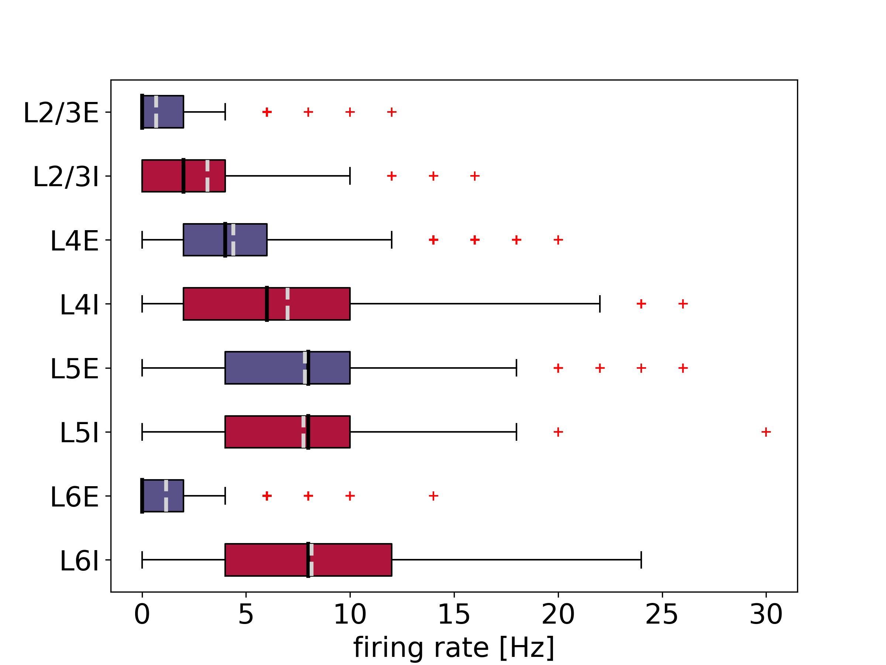

PyNEST Microcircuit
===================

This is a PyNEST implementation of the microcircuit model by Potjans and Diesmann [1]_.
The network model represents 4 layers of cortex, L2/3, L4, L5, and L6, each consisting of 2 populations of excitatory and inhibitory neurons.

.. |img1| image:: microcircuit.png

.. table:: 
   :align: center

   +--------+--------+--------+
   | |img1| | |img2| | |img3| |
   +--------+--------+--------+
   
Left: network sketch from [2]_. Middle: raster plot showing spiking activity. Right: firing rates as box plots.

File Structure
##############

* ``run_microcircuit.py``: an example script to try out the microcircuit
* ``network.py``: the main Network class with functions to build and simulate the network
* ``helpers.py``: helper functions for network construction, simulation and evaluation
* ``network_params.py``: network and neuron parameters
* ``stimulus_params.py``: parameters for optional external stimulation
* ``sim_params.py``: simulation parameters
* ``reference_data``: reference data and figures obtained by executing ``run_microcircuit.py`` with ``N_scaling`` and ``K_scaling`` set to `1`

Running the Simulation
######################

By default, the variables ``N_scaling`` and ``K_scaling`` in ``network_params.py`` are set to
`0.1` which is a good choice for running the microcircuit on a local machine.
``N_scaling`` adjusts the number of neurons and ``K_scaling`` adjusts the number of connections to be simulated.
The full network can be run by adjusting these values to `1`.
If this is done, the option to print the time progress should be switched off: ``'print_time': False`` in ``sim_params.py``.

To run the simulation, simply use:

.. code-block:: bash

   python run_microcircuit.py

The output will be saved in the directory ``data``.

The code can be `parallelized <https://nest-simulator.readthedocs.io/en/latest/guides/parallel_computing.html>`_ using OpenMP and MPI, if NEST has been built with these applications.
The number of threads (per MPI process) can be chosen by adjusting ``local_num_threads`` in ``sim_params.py``.
The number of MPI processes can be set by choosing a reasonable value for ``num_mpi_prc`` and then running the script with the following command:

.. code-block:: bash

   mpirun -n num_mpi_prc python run_microcircuit.py

Note on Parameters
##################

By default, the simulation uses external Poissonian input to excite all neuronal populations of the microcircuit, see ``poisson_input': True`` in ``network_params.py``.
If set to ``False``, the Poissonian input is turned off and compensated approximately by calculated DC input.
In addition to this ongoing external drive, a thalamic stimulation can be switched on in ``stimulus_params.py``; the default is ``'thalamic_input': False``.
Also for the thalamic stimulation, it is possible to replace the default Poissonian input by DC input.

The default random initialization of membrane voltages in this simulation uses population-specific means and standard deviations to reduce an initial activity burst in the network: ``'V_type': 'optimized'`` in ``network_params.py``.
Previous implementations used the same mean and standard deviation for all populations which corresponds to setting ``'V_type': 'original'``.

Contributions to this PyNEST Microcircuit
#########################################

Current communicating author: Johanna Senk

2016: first version implemented by Hendrik Rothe, Hannah Bos and Sacha van Albada

2019: optimized initialization of membrane voltages added by Han-Jia Jiang

2020: revision of code and documentation, and adaptation to NEST3 by Johanna Senk, Sara Konradi and Håkon Mørk.

Citation
########

If you use this code, we ask you to cite the paper by Potjans and Diesmann [1]_ and the NEST release on Zenodo.

Acknowledgments
###############

This project has received funding from the European Union Seventh Framework Programme ([FP7/2007-2013]) under grant agreement n° 604102 (Human Brain Project, HBP), and the European Union’s Horizon 2020 Framework Programme for Research and Innovation under Specific Grant Agreement No. 720270 (Human Brain Project SGA1) and No. 785907 (Human Brain Project SGA2).

Funding for [1]_: This work was supported by the Helmholtz Alliance on Systems Biology; European Union (FACETS, grant 15879 and BrainScaleS, grant 269921); Deutsch-Israelische Projektkooperation (DIP, grant F1.2); Bundesministerium für Bildung und Forschung, Germany (BMBF, grant 01GQ0420 to BCCN Freiburg), and the Next-Generation Supercomputer Project of the Ministry of education, culture, sports, science and technology (MEXT), Japan. Funding to pay the Open Access publication charges for this article was provided by Research Center Juelich a member of the Helmholtz Association.

Other Implementations of the Microcircuit Model
###############################################

The original `SLI version <https://github.com/nest/nest-simulator/tree/master/examples/nest/Potjans_2014>`__ by Tobias Potjans and Markus Diesmann (later revised by David Dahmen and Sacha van Albada) is also part of the NEST code base as an example.

A `PyNN version <https://github.com/NeuralEnsemble/PyNN/tree/master/examples/Potjans2014>`__ is part of the PyNN code base as an example.

References
##########

.. [1]  Potjans TC. and Diesmann M. 2014. The cell-type specific cortical
        microcircuit: relating structure and activity in a full-scale spiking
        network model. Cerebral Cortex. 24(3):785–806. DOI: `10.1093/cercor/bhs358 <https://doi.org/10.1093/cercor/bhs358>`__.
        
.. [2]  van Albada SJ., Rowley AG., Senk J., Hopkins M., Schmidt M., Stokes AB., Lester DR., Diesmann M. and Furber SB. 2018.
        Performance Comparison of the Digital Neuromorphic Hardware SpiNNaker
        and the Neural Network Simulation Software NEST for a Full-Scale Cortical Microcircuit Model.
        Front. Neurosci. 12:291. DOI: `10.3389/fnins.2018.00291 <https://doi.org/10.3389/fnins.2018.00291>`__.
