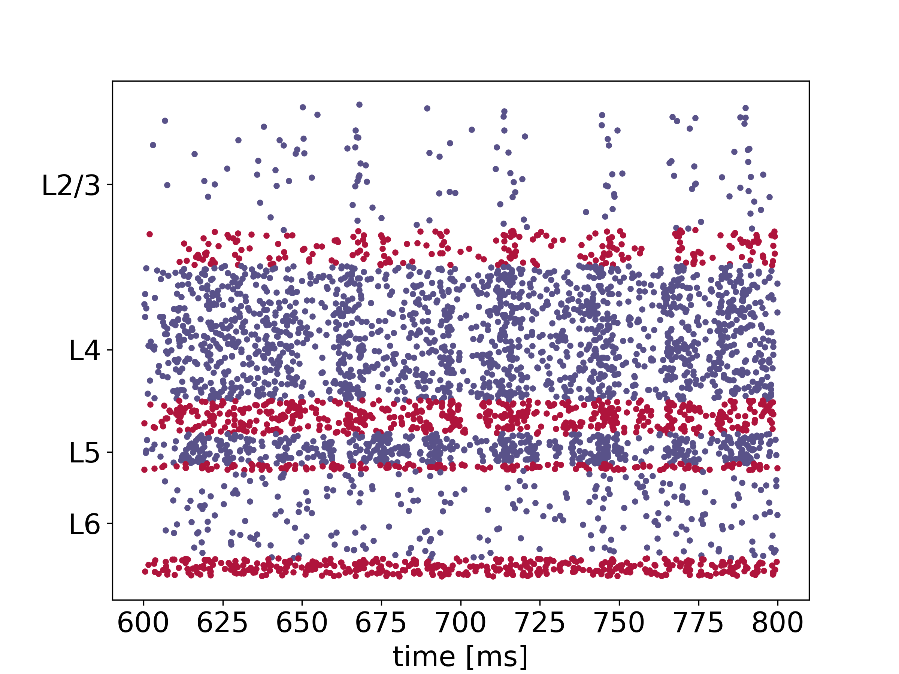

Cortical microcircuit model
===========================

This is a PyNEST implementation of the cortical microcircuit model by Potjans and Diesmann [1]_.
The network model represents four layers of cortex, L2/3, L4, L5, and L6, each consisting of a population of excitatory neurons and a population of inhibitory neurons.

.. |img1| image:: microcircuit.png

.. |img3| image:: box_plot.png

.. table:: 
   :align: center

   +--------+--------+--------+
   | |img1| | |img2| | |img3| |
   +--------+--------+--------+
   
Left: network sketch [2]_. Middle: raster plot showing spiking activity. Right: firing rates as box plots.

Citing this code
################

If you use this code, we ask you to cite the paper by Potjans and Diesmann [1]_ and the NEST release on Zenodo.

File structure
##############

* ``run_microcircuit.py``: an example script to try out the microcircuit
* ``network.py``: the main Network class with functions to build and simulate the network
* ``helpers.py``: helper functions for network construction, simulation and evaluation
* ``network_params.py``: network and neuron parameters
* ``stimulus_params.py``: parameters for optional external stimulation
* ``sim_params.py``: simulation parameters
* ``reference_data``: reference data and figures obtained by executing ``run_microcircuit.py`` with default parameters

Running the simulation
######################

By default, the variables ``N_scaling`` and ``K_scaling`` in ``network_params.py`` are set to
`0.1`, which is a good choice for running the microcircuit on a local machine.
``N_scaling`` adjusts the number of neurons and ``K_scaling`` adjusts the indegrees.
The full network can be run by setting these values to `1`.
If this is done, the option to print the time progress should be switched off: ``'print_time': False`` in ``sim_params.py``.

To run the simulation, simply use:

.. code-block:: bash

   python3 run_microcircuit.py

The output will be saved in the ``data`` directory.

The code can be `parallelized <https://nest-simulator.readthedocs.io/en/latest/guides/parallel_computing.html>`_ using OpenMP and MPI, if NEST has been built with these features.
The number of threads (per MPI process) can be chosen by adjusting ``local_num_threads`` in ``sim_params.py``.
The command for running the script with two MPI processes is:

.. code-block:: bash

   mpirun -n 2 python3 run_microcircuit.py

External drive and initial conditions
#####################################

By default, the simulation uses external Poissonian input to excite all neuronal populations of the microcircuit, i.e., ``poisson_input': True`` in ``network_params.py``.
If set to ``False``, the Poissonian input is turned off and compensated approximately by calculated direct current (DC) input.
In addition to this ongoing external drive, a thalamic stimulation or a stimulation by an external DC input can be switched on in ``stimulus_params.py`` (the default for both types of stimuli is ``False``).

The default random initialization of membrane voltages in this simulation uses population-specific means and standard deviations to reduce an initial activity burst in the network: ``'V_type': 'optimized'`` in ``network_params.py``.
Previous implementations used the same mean and standard deviation for all populations, which is here achieved by setting ``'V_type': 'original'``.

Recommendations for benchmarking
################################

For benchmark simulations assessing network-construction and state-propagation times, the recommended changes to the default parameters are the following:

``sim_params.py``:

* ``'t_sim': 10000.0``: The biological simulation time should be at least `10` s for measuring the state propagation time.
* ``'rec_dev': []``: No recording devices.
* ``'local_num_threads': t``: Adjust the number of threads ``t`` per MPI process as needed for the benchmarks.
* ``'print_time': False'``: No printing of time progress.

``network_params.py``:

* ``'N_scaling': 1.``: Full number of neurons.
* ``'K_scaling': 1.``: Full indegrees.
* ``'poisson_input': False``: DC background input.

Contributions to this PyNEST microcircuit model implementation
##############################################################

Current communicating author: Johanna Senk

2020: revision of code and documentation, and adaptation to NEST 3.0 by Johanna Senk (in collaboration with Sara Konradi, Stine Brekke Vennemo, Håkon Bakke Mørk, Alexander van Meegen, Sacha van Albada and Markus Diesmann)

2019: optimized initialization of membrane voltages added by Han-Jia Jiang

2016: first version implemented by Hendrik Rothe, Hannah Bos and Sacha van Albada

Acknowledgments
###############

Funding for the PyNEST microcircuit: This project has received funding from the European Union Seventh Framework Programme ([FP7/2007-2013]) under grant agreement n° 604102 (Human Brain Project, HBP) and the European Union’s Horizon 2020 Framework Programme for Research and Innovation under Specific Grant Agreement No. 720270 (Human Brain Project SGA1) and No. 785907 (Human Brain Project SGA2).

Funding for the study by Potjans and Diesmann [1]_: This work was supported by the Helmholtz Alliance on Systems Biology; European Union (FACETS, grant 15879 and BrainScaleS, grant 269921); Deutsch-Israelische Projektkooperation (DIP, grant F1.2); Bundesministerium für Bildung und Forschung, Germany (BMBF, grant 01GQ0420 to BCCN Freiburg), and the Next-Generation Supercomputer Project of the Ministry of education, culture, sports, science and technology (MEXT), Japan. Funding to pay the Open Access publication charges for this article was provided by Research Center Juelich, a member of the Helmholtz Association.

Other implementations of the microcircuit model
###############################################
A `SLI version <https://github.com/nest/nest-simulator/tree/master/examples/nest/Potjans_2014>`__  by David Dahmen, Tom Tetzlaff, and Sacha van Albada, based on the original version by Tobias Potjans and Markus Diesmann, is also part of the NEST code base as an example.

A `PyNN version <https://github.com/NeuralEnsemble/PyNN/tree/master/examples/Potjans2014>`__ is part of the PyNN code base as an example.

References
##########

.. [1]  Potjans TC. and Diesmann M. 2014. The cell-type specific cortical
        microcircuit: relating structure and activity in a full-scale spiking
        network model. Cerebral Cortex. 24(3):785–806. DOI: `10.1093/cercor/bhs358 <https://doi.org/10.1093/cercor/bhs358>`__.
        
.. [2]  van Albada SJ., Rowley AG., Senk J., Hopkins M., Schmidt M., Stokes AB., Lester DR., Diesmann M. and Furber SB. 2018.
        Performance Comparison of the Digital Neuromorphic Hardware SpiNNaker
        and the Neural Network Simulation Software NEST for a Full-Scale Cortical Microcircuit Model.
        Front. Neurosci. 12:291. DOI: `10.3389/fnins.2018.00291 <https://doi.org/10.3389/fnins.2018.00291>`__.
