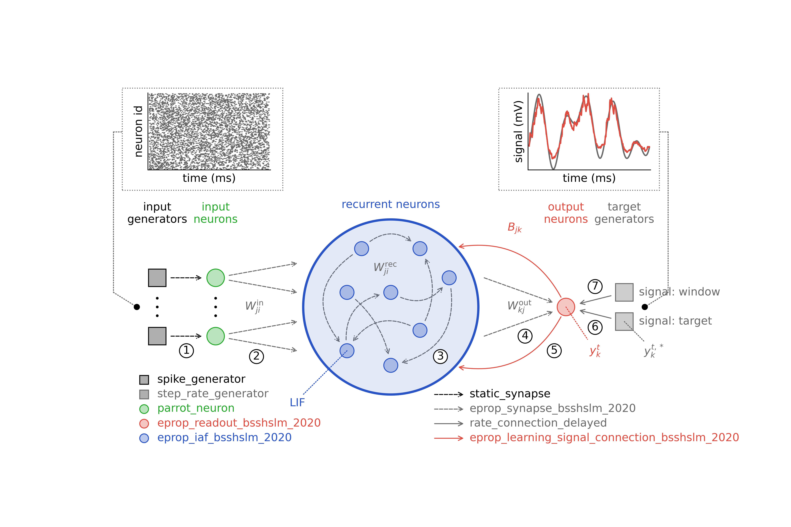

E-prop plasticity examples
==========================

Eligibility propagation (e-prop) [1]_ is a three-factor learning rule for spiking neural networks that
approaches the performance of backpropagation through time (BPTT). The original TensorFlow implementation of
e-prop was demonstrated, among others, on a supervised regression task to generate temporal patterns and a
supervised classification task to accumulate evidence [2]_. Here, you find tutorials on how to reproduce these
two tasks as well as two more advanced regression tasks using the NEST implementation of e-prop [3]_ and how to
visualize the simulation recordings.

The tutorials labeled "after Bellec et al. (2020)" use the original e-prop model [1]_, while the other
tutorials use a version of e-prop that includes additional biological features as described in [3]_.

See below for a diagram that describes the relationships between the different models for e-prop.

Users interested in endowing an existing model with e-prop plasticity, may compare the .cpp and .h files of the
:doc:`iaf_psc_delta</models/iaf_psc_delta>` and :doc:`eprop_iaf_psc_delta</models/eprop_iaf_psc_delta>` model.
Parameters to run the `eprop_iaf_psc_delta` model are provided in
:doc:`eprop_supervised_regression_sine-waves.py <eprop_supervised_regression_sine-waves>`.

e-prop model map
----------------

.. grid::

  .. grid-item-card::
    :columns: 12

    .. image:: /static/img/eprop_model_diagram.svg

References
----------

.. [1] Bellec G, Scherr F, Subramoney F, Hajek E, Salaj D, Legenstein R,
       Maass W (2020). A solution to the learning dilemma for recurrent
       networks of spiking neurons. Nature Communications, 11:3625.
       https://doi.org/10.1038/s41467-020-17236-y

.. [2] https://github.com/IGITUGraz/eligibility_propagation/blob/master/Figure_3_and_S7_e_prop_tutorials/

.. [3] Korcsak-Gorzo A, Stapmanns J, Espinoza Valverde JA, Plesser HE,
       Dahmen D, Bolten M, Van Albada SJ*, Diesmann M*. Event-based
       implementation of eligibility propagation (in preparation)
