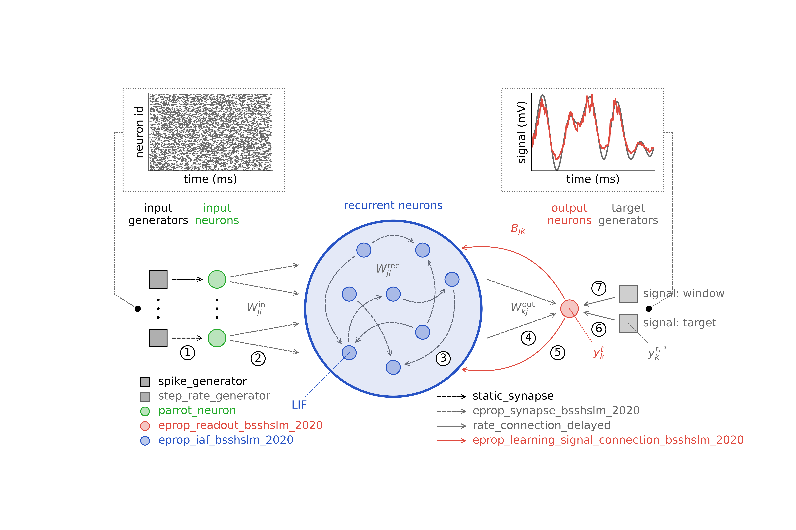
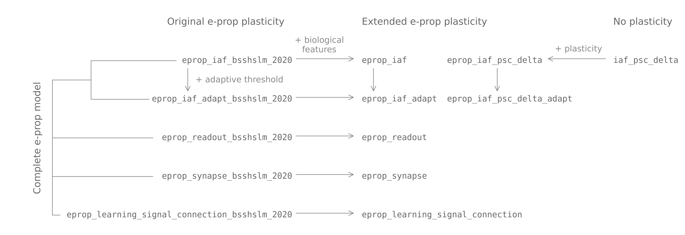

E-prop plasticity examples
==========================

Eligibility propagation (e-prop) [1]_ is a three-factor learning rule for spiking neural networks that approximates the
performance of backpropagation through time (BPTT). A complete e-prop model comprises a recurrent neuron model, a
readout neuron model, a synapse model, and a learning signal connection. Two such models are provided: the original
formulation by Bellec et al. (2020) [1]_ and an extended variant with additional biological features [2]_. The e-prop models are related as follows:

We provide tutorials to reproduce the supervised regression task for generating temporal patterns and the supervised
classification task from the original TensorFlow implementation [3]_. In addition, we provide two tutorials on
supervised regression for generating two-dimensional temporal patterns and on supervised classification of neuromorphic
MNIST [4]_.

References
----------

.. [1] Bellec G, Scherr F, Subramoney F, Hajek E, Salaj D, Legenstein R,
       Maass W (2020). A solution to the learning dilemma for recurrent
       networks of spiking neurons. Nature Communications, 11:3625.
       https://doi.org/10.1038/s41467-020-17236-y

.. [2] Korcsak-Gorzo A, Espinoza Valverde JA, Stapmanns J, Plesser HE, Dahmen D,
       Bolten M, van Albada SJ, Diesmann M (2025). Event-driven eligibility
       propagation in large sparse networks: efficiency shaped by biological
       realism. arXiv:2511.21674. https://doi.org/10.48550/arXiv.2511.21674

.. [3] https://github.com/IGITUGraz/eligibility_propagation/blob/master/Figure_3_and_S7_e_prop_tutorials/

.. [4] Orchard, G., Jayawant, A., Cohen, G. K., & Thakor, N. (2015). Converting static image datasets to
       spiking neuromorphic datasets using saccades. Frontiers in neuroscience, 9, 159859.
