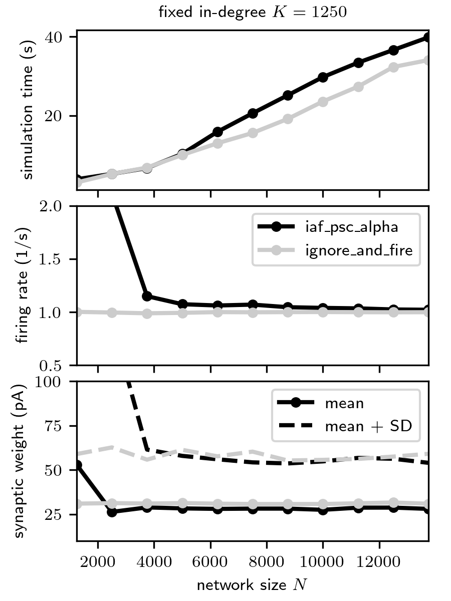

Example applications of the ``ignore_and_fire`` neuron with a two population STDP network model
===============================================================================================

File structure
---------------

- :doc:`/auto_examples/ignore_and_fire/model`: an example script using :doc:`ignore_and_fire </models/ignore_and_fire>`

- :doc:`Parameter dictionary </auto_examples/ignore_and_fire/parameter_dicts>`

- :doc:`Simulation details </auto_examples/ignore_and_fire/simulation_details>`

- :doc:`Detailed network model description and
  parameters </auto_examples/ignore_and_fire/ModelDescription_TwoPopulationNetworkPlastic>`

- :doc:`Run scaling experiments and generate scaling
  figure </auto_examples/ignore_and_fire/scaling>`

- :doc:`Run network simulations to produce spike and synaptic-weight
  data shown in figures below </auto_examples/ignore_and_fire/generate_reference_data>`

- :doc:`Generate figure below showing spiking activity and synaptic weight
  distributions </auto_examples/ignore_and_fire/generate_reference_figures>`

Citing this code
----------------

If you use this code, we ask you to cite the paper by ??? and the NEST release on Zenodo.

(Non-) Scalability of recurrent neuronal networks
-------------------------------------------------

The verification and validation of simulation architectures (soft- and
hardware) is typically based on models describing networks of neurons.
Ideally, such test-case models are *scalable* with respect to the
network size

-  to foster a comparison between different computing architectures with
   different computational resources,
-  to be able to extrapolate (up-scale) to networks at brain scale, even
   if data constrained and well tested network models at this scale are
   not published or existing yet, and
-  to be able to study and compare different plasticity mechanisms with
   slow dynamics (down-scaling).

Biological neuronal networks are characterized by a high degree of
recurrency. As shown by van Albada et al. (2015), scaling the number of
nodes or edges in a recurrent neuronal networks generally alters the
network dynamics such as the structure of pairwise correlations.
Preserving certain dynamical features by adjusting other parameters can
only be achieved in limited ranges or exceptional cases. Recurrent
neuronal networks are hence not truly scalable. In this example, we
demonstrate how the ``ignore_and_fire`` can help to perform
systematic scaling experiments with arbitrary types of networks, without
altering the network dynamics.

Network model
-------------

In this example, we employ a simple network model describing the
dynamics of a local cortical circuit at the spatial scale of ~1mm within
a single cortical layer. It is derived from the model proposed in
(Brunel [1]_), but accounts for the synaptic weight dynamics for
connections between excitatory neurons. The weight dynamics are
described by the spike-timing-dependent plasticity (STDP) model derived
by Morrison et al. ( [7]_). The model provides a mechanism underlying the
formation of broad distributions of synaptic weights in combination with
asynchronous irregular spiking activity (see figure below). A detailed
description of the network model and parameters are provided
`here </ModelDescription_TwoPopulationNetworkPlastic.pdf>`__.
Implementation details can be found
`here <PyNEST/README_TwoPopulationNetworkPlastic_PyNEST.md>`__.

A variant of this model, the
:doc:`hpc_benchmark </auto_examples/hpc_benchmark>`
has been used in a number of benchmarking studies, in particular for
weak-scaling experiments (Helias et al., [2]_; Kunkel et al., [3]_;
Ippen et al., [4]_; Kunkel & Schenk, [5]_; Jordan et al., [6]_). Due to
its random homogeneous connectivity, the model represents a hard
benchmarking scenario: each neuron projects with equal probability to
any other neuron in the network. Implementations of this model can
therefore not exploit any spatial connectivity patterns. In contrast to
the model used here, the plasticity dynamics in the ``hpc_benchmark`` is
parameterized such that it has only a weak effect on the synaptic
weights and, hence, the network dynamics. Here, the effect of the
synaptic plasticity is substantial and leads to a significant broadening
of the weight distribution (see figure below). Synaptic weights thereby
become a sensitive target metric for verification and validation
studies.

Comparison between the networks with ``integrate-and-fire`` and ``ignore-and-fire`` dynamics
--------------------------------------------------------------------------------------------

The model employed here can be configured into a truly scalable mode by
replacing the integrate-and-fire neurons by an ``ignore_and_fire``
dynamics (for details, see
`here <PyNEST/README_TwoPopulationNetworkPlastic_PyNEST.md>`__). By
doing so, the spike generation dynamics is decoupled from the input
integration and the plasticity dynamics; the overall network activity,
and, hence, the communication load, is fully controlled by the user. The
firing rates and phases of the ``ignore-and-fire`` model are randomly
drawn from uniform distributions to guarantee asynchronous spiking
activity. The plasticity dynamics remains intact (see figure below).

================== =====================
``iaf_psc_alpha``   ``ignore_and_fire``
================== =====================
|iaf_spikes|        |ign_spikes|
|iaf_weight|        |ign_weight|
================== =====================

.. |iaf_spikes| image:: TwoPopulationNetworkPlastic_iaf_spikes.png
.. |iaf_weight| image:: TwoPopulationNetworkPlastic_iaf_weight_distributions.png
.. |ign_spikes| image:: TwoPopulationNetworkPlastic_ign_spikes.png
.. |ign_weight| image:: TwoPopulationNetworkPlastic_ign_weight_distributions.png

Spiking activity (top) and synaptic weight distributions (bottom) of
the network with integrate-and-fire (``iaf_psc_alpha_nest``) and
ignore-and-fire dynamics (``ignore_and_fire``). Scaling experiments

-------------------

The ``ignore_and_fire`` variant of the model permits exact scaling
experiments, without the need for any parameter tuning when changing the
network size (see figure below).

   Dependence of the simulation time (top), the time and population
   averaged firing rate (middle) and the synaptic weights (bottom) on the
   network size :math:`N` for the\ ``integrate-and-fire`` (black) and the
   ``ignore-and-fire`` variant of the network model (gray). The in-degree
   :math:`K=1250` is fixed.

References
----------

.. [1] Brunel (2000). Dynamics of networks of randomly connected excitatory
       and inhibitory spiking neurons. Journal of Physiology-Paris
       94(5-6):445-463.
       doi:10.1023/A:1008925309027 <https://doi.org/10.1023/A:1008925309027>

.. [2] Helias M, Kunkel S, Masumoto G, Igarashi J, Eppler JM, Ishii S, Fukai
       T, Morrison A, Diesmann M (2012). Supercomputers ready for use as
       discovery machines for neuroscience. Frontiers in Neuroinformatics
       6:26 <https://doi.org/10.3389/fninf.2012.00026

.. [3] Ippen T, Eppler JM, Plesser HE, Diesmann M (2017). Constructing
       neuronal network models in massively parallel environments. Frontiers in
       Neuroinformatics 11:30 <https://doi.org/10.3389/fninf.2017.00030

.. [4] Jordan J, Ippen T, Helias M, Kitayama I, Sato M, Igarashi J, Diesmann
       M, Kunkel S (2018). Extremely scalable spiking neuronal network
       simulation code: from laptops to exascale computers. Frontiers in
       Neuroinformatics 12:2 <https://doi.org/10.3389/fninf.2018.00002

.. [5] Kunkel S, Potjans TC, Eppler JM, Plesser HE, Morrison A, Diesmann M
       (2012). Meeting the memory challenges of brain-scale simulation.
       Frontiers in Neuroinformatics
       5:35 <https://doi.org/10.3389/fninf.2011.00035

.. [6] Kunkel S, Schenck W (2017). The NEST dry-run mode: Efficient dynamic
       analysis of neuronal network simulation code. Frontiers in
       Neuroinformatics 11:40 <https://doi.org/10.3389/fninf.2017.00040

.. [7] Morrison A, Aertsen A, Diesmann M (2007). Spike-timing-dependent
       plasticity in balanced random networks. Neural Computation
       19(6):1437-1467 <https://doi.org/10.1162/neco.2007.19.6.1437

.. toctree::
  :hidden:
  :glob:

  ModelDescription_TwoPopulationNetworkPlastic
  *
  simulation_details

Indices and tables
==================

* :ref:`genindex`
* :ref:`modindex`
* :ref:`search`
